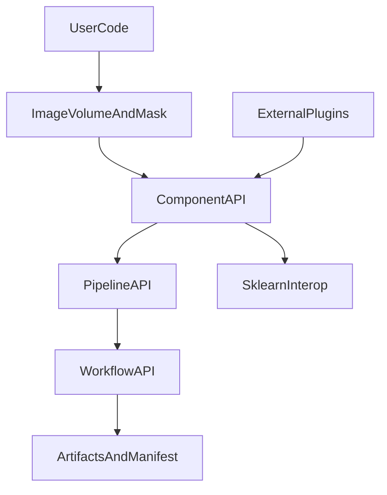

# HABIT API 全面重构与优化方案

## 一、核心判断

HABIT 当前强项是 YAML 工作流、Registry、checkpoint、PyRadiomics/TorchRadiomics 多后端和初步的公开 API；主要问题是公共 API 仍以 workflow 为中心，影像/掩膜的空间语义、radiomics 低级组件、结果类型、失败语义、序列化和 sklearn 互操作尚未形成统一标准。目标不是重写 `habit/core`，而是在其上建立稳定的领域 API、数据契约和验证体系。

对标重点：
- PyRadiomics：低级特征提取入口、provenance、特征定义和 IBSI 差异说明。
- SimpleITK：影像空间几何和 image/mask 对齐语义。
- scikit-learn：Estimator、Pipeline、CV、特征名称和参数契约。
- MONAI：Transform、配置、Bundle、可组合性和实验复现。
- nnU-Net：数据指纹、标准化运行产物、benchmark 和可复现基线。

## 二、目标 API 分层

### L0：稳定导入面

- `habit`：只暴露版本、核心异常、数据对象、结果对象和最常用入口。
- `habit.api`：稳定聚合层。
- `habit.io`、`habit.radiomics`、`habit.habitat`、`habit.preprocessing`、`habit.ml`、`habit.validation`、`habit.plugins`：按领域公开的稳定子模块。
- `habit.core.*`、未列入 `__all__` 的 `habit.utils.*`：内部实现，不作为集成方依赖。
- 保留 lazy import，确保导入基础 API 不加载 PyRadiomics、Torch、SHAP 等可选依赖。

### L1：领域数据对象

引入明确的数据模型，避免跨模块传递裸路径、裸数组或不完整字典：

- `ImageVolume`：数组/`SimpleITK.Image`、spacing、origin、direction、坐标系、模态、时间点和来源信息。
- `MaskVolume`：标签值、标签名称、几何信息、有效 voxel 数量和 ROI 语义。
- `ImageMaskPair`：显式保存 image/mask、对齐策略、几何校验结果。
- `SubjectRecord`：subject ID、模态集合、影像和掩膜配对、元数据。
- `DatasetManifest`：受试者清单、路径、哈希、模态和数据版本。

所有公开函数明确声明输入输出类型，例如 `image: ImageVolume | Path | sitk.Image`，并在边界统一转换。目录扫描必须排序、显式处理多序列，不再默认选取未排序的第一个文件。

### L2：组件 API

#### 影像与几何

建议提供：

- `read_image()`、`read_mask()`、`validate_geometry()`、`align_image_mask()`、`resample_image()`。
- `GeometryPolicy`：`strict`、`resample_mask`、`resample_image`、`warn`，明确 spacing/origin/direction/size 的处理。
- `GeometryReport`：逐项报告 geometry 是否一致、采取的修复、警告和错误。

Traditional radiomics、voxel radiomics、supervoxel radiomics 必须复用同一几何策略，不再分别使用 `Set*`、`CopyInformation` 和仅 warning 的不同语义。

#### Radiomics

提供低级、批量和 workflow 三个层次：

- `extract_features(image, mask, params, label=1, backend="pyradiomics") -> FeatureResult`
- `extract_batch(records, params, ...) -> FeatureTableResult`
- `run_radiomics(config) -> WorkflowResult[FeatureTableResult]`

`FeatureResult` 应包括 `values`、`feature_names`、`image/mask metadata`、`resolved_params`、`backend`、`warnings`、`provenance` 和失败特征；不能让用户必须读取 CSV 才能获得程序化结果。

后端接口统一为 `RadiomicsBackend` Protocol，CPU、Torch、C 扩展都返回同一语义。后端切换不得改变列名、label 语义和几何处理规则；无法保证一致时必须在结果中标记差异。

#### Habitat

拆分当前大 workflow 的领域能力：

- `extract_voxel_features()`
- `cluster_subject()`
- `fit_habitat_model()`
- `predict_habitats()`
- `extract_habitat_features()`
- `HabitatModel` / `HabitatPrediction`
- `HabitatDataset` / `HabitatResult`

保留 `run_habitat_analysis(config)` 作为高级入口，但其内部组合上述组件。`HabitatClusterer` 如果不能满足 sklearn 的样本矩阵语义，应改名为 `HabitatAnalysisEstimator`，或者明确划为 workflow estimator，避免误导 sklearn 工具链。

#### Preprocessing

- 将每个步骤统一抽象为 typed transform：`fit` 可选、`transform` 必须明确输入输出。
- 每一步声明是否改变 geometry、是否可逆、是否需要 mask、是否支持 2D/3D/4D。
- 输出 `PreprocessingTrace`，记录步骤顺序、参数、输入输出 geometry 和失败 subject。
- 预处理失败统一为结构化 `SubjectFailure`，不再混用字符串、Exception 对象、error 字典和静默跳过。

#### Machine Learning

保留 workflow 轨和 estimator 轨，但让它们共享同一 `Pipeline`、结果和持久化契约：

- `HabitClassifier`：完整 sklearn estimator，支持 `get_params`、`set_params`、`clone`、`classes_`、`feature_names_in_`、`get_feature_names_out`。
- `HabitTransformer` / `SubjectFeatureAggregator`：明确输入表结构和 subject 聚合规则。
- `HabitatAnalysisEstimator`：仅在满足 estimator 语义时提供 sklearn mixin。
- `cross_validate(..., groups=...)`：默认支持 subject-level split、`GroupKFold` 和 `StratifiedGroupKFold`。
- 所有 `predict_proba` 统一返回 `(n_samples, n_classes)`；所有 `fit` 返回 `self`。
- 外部 ICC 或先验特征选择必须绑定训练 fold，违规时默认报错而非仅提示。

### L3：Workflow API

所有 workflow 统一接受 `ConfigModel | Mapping`，但内部先转为已解析配置；统一返回：

- `WorkflowResult[T]`
- `RunStatus`
- `ArtifactSet`
- `RunManifest`
- `FailureReport`

`WorkflowResult.metadata` 不再只保存零散字段，应包含 habit 版本、配置 hash、运行 ID、后端、插件、随机种子、输入数据指纹、输出 schema 版本和 manifest 路径。

建议公开的主要入口：

- `run_preprocess`
- `run_dicom_sort`
- `run_habitat_analysis`
- `run_feature_extraction`
- `run_radiomics`
- `run_ml`
- `run_kfold`
- `run_model_comparison`
- `run_icc_analysis`
- `run_test_retest_analysis`

CLI 必须只负责解析参数和调用同一公开 runner；为每个命令增加 CLI/API parity 测试。

### L4：插件 API

在现有 Registry 上增加外部发现和查询能力：

- entry point groups：`habit.preprocessors`、`habit.radiomics_backends`、`habit.feature_extractors`、`habit.habitat_features`、`habit.models`、`habit.metrics`。
- `list_plugins()`、`get_plugin_info()`、`load_plugins()`、`get_param_schema()`。
- 插件元数据包括名称、版本、提供包、输入输出类型、参数模型、可选依赖和兼容的 API 版本。
- 冲突策略明确：显式用户插件、外部 entry point、内置插件分层；同名覆盖必须可诊断。
- 插件契约应基于公开 Protocol/Base class 和 Pydantic 参数模型，不要求第三方导入 `habit.core`。

### L5：Artifact、复现和持久化

统一模型、pipeline、checkpoint 和 workflow 的持久化 envelope：

- `schema_version`
- `habit_version`
- 依赖版本
- `config_hash`
- `data_fingerprint`
- `created_at`
- `random_state`
- backend/plugin 信息
- payload 类型

提供 `save_artifact()`、`load_artifact()`、`inspect_artifact()`。旧 joblib/pickle 只读兼容，写入统一格式；不可信 artifact 加载继续显式警告。

每次运行生成 `habit_run_manifest.json`，记录 resolved config、输入文件哈希、geometry、软件版本、硬件、随机种子、Git commit、插件和输出清单。

## 三、必须修复的科学与行为一致性

1. 统一 image/mask geometry 校验和修复策略。
2. 多模态 concat 前验证 voxel 索引、shape 和 geometry 完全一致。
3. 修正 voxel radiomics 中以 `feature_array > 0` 过滤特征值的潜在数据丢失问题。
4. 统一所有模块的失败语义和部分成功策略。
5. 统一 CPU、Torch 和 C 扩展的特征名、label、NaN、零值和边界行为。
6. 目录和 manifest 发现顺序确定化。
7. predict 时验证训练 pipeline、数据集和运行时配置的 hash/兼容性，阻止 silent mismatch。
8. GPU worker 默认根据 GPU 数量限流，OOM 作为结构化失败处理。
9. 清理 dead configuration，例如未生效的 resampling 参数。
10. 取消统计模块内部硬编码随机种子，所有随机性从顶层传入。

## 四、测试与质量门禁

建立五层测试：

1. API contract：公开符号、签名、异常、lazy import、deprecated path。
2. Data contract：geometry、label、Image/Mask 转换、manifest、确定性路径发现。
3. Scientific golden：IBSI phantom、固定 image/mask、PyRadiomics 对照、CPU/GPU/C 后端容差。
4. Pipeline integration：小型真实数据、CLI/API parity、checkpoint resume、predict compatibility。
5. Ecosystem：sklearn clone/check_estimator、GroupKFold 泄漏测试、插件 dummy package、artifact round-trip。

CI 分层：基础单元测试始终运行；radiomics、Torch、ANTs、真实影像 E2E 用可选矩阵；Windows 和 Linux 都覆盖 spawn、路径、编码和几何行为。测试中使用 HABIT 统一进度条和现有 `py310` 环境约定。

## 五、类型、命名和异常

- 公开函数参数和返回值全部完整类型标注，避免 `Any` 出现在稳定结果字段。
- 为 `ConfigInput`、`FeatureTable`、`RunManifest`、`FittedModel`、插件上下文定义 Protocol/TypedDict/dataclass。
- `HABITError` 作为根异常；配置、数据、geometry、插件、执行、兼容性、取消和未拟合错误分支清晰。
- 统一 `NotFittedError` 来源并在公开文档说明。
- 公开 API 使用领域名词，不暴露 core 路径；`TestRetestConfig`、ICC 等按分析域归位。
- 统一 `DataFrame` 的 index、subject ID、label、feature name 和 dtype 规则。

## 六、现有代码的渐进式迁移顺序

### Phase 0：冻结契约

- 生成当前公开 API、结果类型、artifact 和配置的快照。
- 记录 `habit.api.registry` 当前公开符号及已知深路径兼容面。
- 清理 API 文档与 CLI 命令名不一致问题。

### Phase 1：数据和结果基础

- 先实现 Image/Mask/Geometry/FeatureResult/FailureReport/RunManifest。
- 让现有 `WorkflowResult` 兼容扩展后的 artifact、metadata 和 manifest。
- 统一异常和失败语义。

### Phase 2：Radiomics 与 preprocessing 组件化

- 将 Traditional、voxel、supervoxel 三条路线适配到同一 backend/geometry/provenance 契约。
- 增加低级 `extract_features()`，保证 workflow 入口向后兼容。
- 修复多模态对齐、零值过滤、确定性路径发现和 GPU 限流问题。

### Phase 3：Habitat API

- 将 habitat workflow 内部拆成可组合 component。
- 公开 `HabitatModel`、训练/预测和 habitat feature extraction 结果。
- 训练 pipeline 和 predict 明确使用同一数据/参数兼容检查。

### Phase 4：ML 和 sklearn 互操作

- 统一 `fit`、`predict_proba`、feature names、serialization。
- 增加 subject-level CV 和数据泄漏检查。
- 统一 workflow artifact 与 estimator artifact。

### Phase 5：插件和发布生态

- entry points、插件信息查询、参数 schema 查询和 dummy plugin CI。
- 类型检查、公开 API diff 门禁、跨平台矩阵和 benchmark。

### Phase 6：稳定化

- golden 测试、文档 API reference、迁移别名、弃用周期、性能基线和公开 examples。
- 每次 release 自动生成 API/配置/结果 schema 变化报告。

## 七、方案文件状态

本文件现在作为 `lichao` 分支的常规 Git 跟踪文件保存，用于记录 API 重构目标、当前设计和后续验收标准。许可证不纳入本方案。
