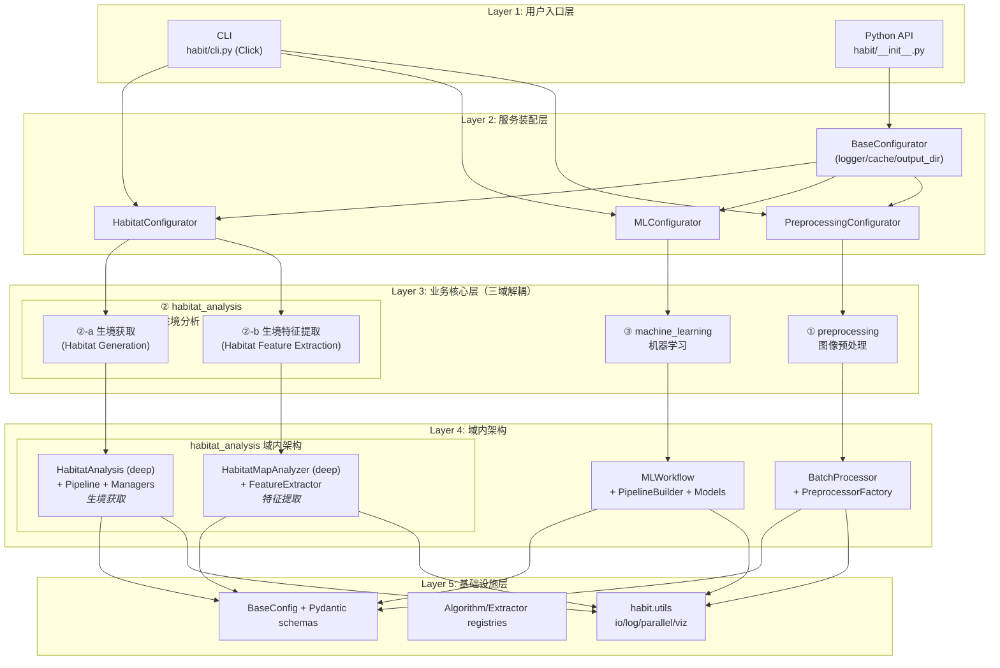
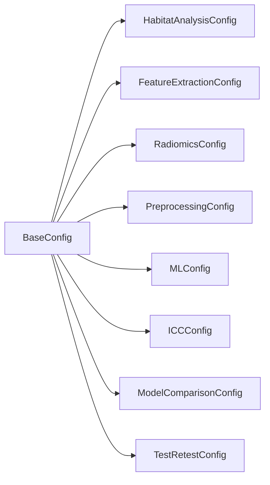
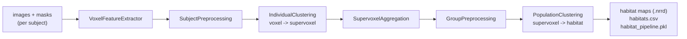
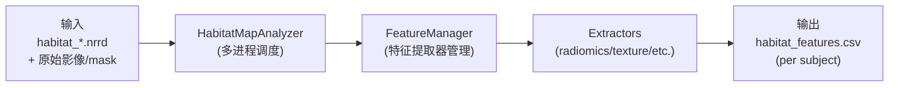
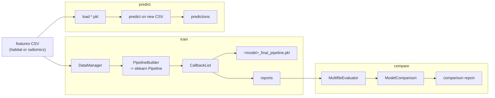

# HABIT 整体架构（V1）- 整合文档

本文档面向 **开发者**，整合了 HABIT V1 代码库的整体架构、模块边界、数据流、设计模式与扩展点。是维护本仓库时的**唯一权威参考**。

> **Note:**  
> V1 已废弃旧 `strategies/` 子包与 `pipelines/pipeline_builder.py` 的"控制器→策略→构造器"三层结构，统一收敛到一个深模块 `HabitatAnalysis`。
> 本文档反映重构后的事实，不再描述旧路径。
>
> **本文档已整合以下旧文件**：
> - `architecture.rst` (顶层架构)
> - `module_architecture.md` / `.rst` (模块细节)
> - `design_patterns.rst` (设计模式)
> - `testing.rst` (测试指南)
> - `metrics_optimization.rst` (优化记录)

---

## 定位与边界

HABIT（**H**abitat **A**nalysis & **B**iomarker **I**dentification **T**oolkit）是一个面向影像组学（radiomics）研究的 Python 包，覆盖以下三块独立但可拼接的能力：

1. **影像预处理**：把原始 DICOM/NIfTI 数据转成可建模输入。
2. **生境分析**：包含两个子部分
   - **②-a 生境获取（Habitat Generation）**：把影像内体素聚为亚区（habitat），输出每个 subject 的生境图（NRRD）与标签表（CSV）。
   - **②-b 生境特征提取（Habitat Feature Extraction）**：在已生成的生境图上进行多进程特征抽取，输出 habitat 级别的影像组学特征表。
3. **机器学习**：在生境/影像组学特征上训练分类/回归模型，做评估、对比、可视化、报告。

三块能力之间通过 **数据契约** 解耦（一方写文件，另一方读文件），而非互相 `import` 业务代码。这是理解整个仓库依赖方向的钥匙。

---

## 五层架构总览



### 依赖方向硬规则

- `habit.utils` 不依赖任何 `core` 子包；任何 core 子包都可以用 utils。
- `habit.core.{habitat_analysis, machine_learning, preprocessing}` **互不依赖**。
- `habit.core.common` 不在模块顶层 import 任何业务子包；装配通过 `configurators` 下的三个域专用 configurator 完成，且业务 import 全部 **延迟到 factory 调用时**。
- CLI / API 不应直接 import 业务子包的内部实现；统一经对应的 configurator 拿装配好的对象。

---

## Layer 1：用户入口层

HABIT 暴露两套入口，覆盖不同使用场景：

| 入口 | 文件 | 用途与定位 |
|------|------|-----------|
| **Python API** | `habit/__init__.py` | 给 Notebook / 下游脚本用。`__getattr__` 懒加载，把 `HabitatAnalysis` / `HabitatFeatureExtractor` / `Modeling` 推迟到首次访问；导入 `habit` 不会触发整个 `core` 加载。 |
| **CLI（推荐主干路径）** | `habit/cli.py` + `habit/cli_commands/commands/` | 通过 `habit <subcommand>` 调用；每个子命令薄封装：加载 YAML → 构造 `BaseConfig` 子类 → 经对应的域 configurator 装配 → 调业务对象。这是 V1 的"标准用法"。 |

### CLI 子命令清单（节选自 `habit/cli.py`）

```
habit preprocess     -> cmd_preprocess.run     (BatchProcessor)
habit get-habitat    -> cmd_habitat.run        (HabitatAnalysis.fit/predict)
habit extract        -> cmd_extract.run        (habitat 特征表)
habit model          -> cmd_ml.run             (Holdout 训练/预测)
habit cv             -> cmd_cv.run             (KFold)
habit compare        -> cmd_compare.run        (ModelComparison)
habit icc            -> cmd_icc.run            (ICC 特征筛选)
habit radiomics      -> cmd_radiomics.run      (传统 radiomics)
habit retest         -> cmd_retest.run         (test-retest 分析)
habit dice           -> utils.dice_calculator  (Dice 分数批算)
habit dicom-info     -> cmd_dicom_info.run     (DICOM 元数据扫描)
habit merge-csv      -> cmd_merge_csv.run      (合并 CSV)
```

### 标准调用链

```
habit <command> -c config.yaml
  -> habit/cli.py
  -> cmd_<domain>.run_*
  -> ConfigClass.from_file(...)
  -> DomainConfigurator(...)
  -> create_<service>()
  -> service.run / fit / predict / process_batch
```

---

## Layer 2：服务装配层（Domain Configurators）

V1 起，仓库不再有"一个上帝类"装配三个域。`habit/core/common/configurators/` 按业务域拆成三个并列的 configurator，全部继承同一个抽象基类 `BaseConfigurator`：

- **`HabitatConfigurator`** —— habitat 域的工厂方法：
  - `create_feature_manager()`
  - `create_clustering_manager()`
  - `create_result_manager()`
  - `create_habitat_analysis()` —— 完整装配（注入三个 managers + logger）
  - `create_habitat_map_analyzer()`
  - `create_feature_extractor()`
  - `create_radiomics_extractor()`
  - `create_test_retest_analyzer()`

- **`MLConfigurator`** —— ML 域的工厂方法：
  - `create_evaluator()`
  - `create_reporter()`
  - `create_threshold_manager()`
  - `create_plot_manager()`
  - `create_metrics_store()`
  - `create_model_comparison()`
  - `create_ml_workflow()` （同时覆盖 train + predict）
  - `create_kfold_workflow()`

- **`PreprocessingConfigurator`** —— preprocessing 域的工厂方法：
  - `create_batch_processor()`

### 设计要点

- **域内深、域间隔**。三个 configurator 互不 import；CLI 子命令只挑自己需要的那一个。
- **共享只放在基类**。日志接管、`output_dir` 处理、轻量服务缓存留在 `BaseConfigurator`，避免三个子类重复实现。
- **延迟导入**。所有业务 import 在 factory 方法内部，避免 `common` 模块顶层重型依赖。

> **Note:**  
> `DIContainer` 是更通用的 DI 容器，但当前仓库内 **几乎未被使用**。V1 装配的实际事实是上面三个域专用的 configurator 类。

---

## 配置体系：`BaseConfig` + Pydantic

所有需要从 YAML 加载的配置都继承 `BaseConfig`：



- `BaseConfig.from_file(path)` 是统一的 YAML 入口。
- 模型字段、嵌套结构与跨字段约束用 Pydantic 表达；例如 `HabitatAnalysisConfig` 在 `run_mode == 'predict'` 时强制要求 `pipeline_path`，并禁止 `two_step` 与 subject 级丢特征方法的冲突组合。
- 路径字段在加载阶段统一解析为绝对路径。

---

## Layer 3：业务核心层（三域解耦）

本层包含三个独立的业务域，它们之间**不直接 import 彼此的实现**，仅通过**文件产物**（CSV/NRRD/PKL）衔接。

### ① `habit.core.preprocessing` —— 图像预处理

**定位**：把原始 DICOM/NIfTI 跑过一串可配置预处理步骤（重采样、配准、Z-score、DICOM→NIfTI 等），输出标准化影像。

**关键模块**：

| 模块 | 职责 |
|------|------|
| `image_processor_pipeline.py` | `BatchProcessor` (deep)：按 subject 并行调度整条预处理链。 |
| `base_preprocessor.py` | `BasePreprocessor`：所有具体预处理器的统一接口。 |
| `preprocessor_factory.py` | `PreprocessorFactory`：注册名 → 具体实例。 |
| `config_schemas.py` | `PreprocessingConfig`：步骤名 → 参数的有序映射。 |

**数据流**：

```
raw images (per subject)
  -> LoadImagePreprocessor (隐式前置步骤)
  -> [step_1] -> [step_2] -> ... -> [step_n]
  -> standardized images on disk
```

**扩展点：新增预处理步骤**

1. 新建继承 `BasePreprocessor` 的类。
2. 实现 `__call__(self, data: Dict[str, Any]) -> Dict[str, Any]`。
3. 用 `PreprocessorFactory.register("step_name")` 注册。
4. 确保模块会被 `habit.core.preprocessing` 导入。

---

### ② `habit.core.habitat_analysis` —— 生境分析

生域分析包含**两个独立的子部分**，通过文件产物（NRRD/CSV）衔接：

---

#### ②-a **生境获取（Habitat Generation）**

**定位**：把多模态影像在 ROI 内的体素聚为生境（habitat），输出 NRRD 生境图与 CSV 标签表，并把训练状态持久化为 `habitat_pipeline.pkl` 以供后续预测。

**关键模块**：

| 模块 | 职责 |
|------|------|
| `habitat_analysis.py` (**deep**) | V1 的 **唯一编排入口** 。build → fit/predict → 持久化 → 结果后处理。内部用 `_PIPELINE_RECIPES` 按 `clustering_mode` 分发 step 列表，用 `_PIPELINE_MANAGER_ATTRS` 显式白名单注入 manager。 |
| `managers/{feature,clustering,result}_manager.py` | 三类领域职责：特征抽取与预处理、聚类训练/选择、结果落盘与可视化。通过构造时注入到 `HabitatAnalysis`，再由后者注入到 pipeline 步。 |
| `pipelines/base_pipeline.py` | sklearn 风格的 `HabitatPipeline` + `BasePipelineStep`。`fit_transform` / `transform` / `save` / `load` 接口。 |
| `pipelines/steps/*.py` | 7+ 个具体步骤：体素特征抽取、subject 预处理、个体聚类、supervoxel 特征/聚合、group 预处理、群体聚类等。 |
| `algorithms/` | K-Means / GMM / DBSCAN / SLIC / Hierarchical 等 **聚类算法**（注意：此处的 strategy 是算法接口，**不是** 已废弃的旧策略模式）。 |
| `extractors/` | 体素级 / supervoxel 级特征抽取实现，由 factory 按配置选择（用于聚类前的特征计算）。 |
| `config_schemas.py` | `HabitatAnalysisConfig` / `FeatureExtractionConfig` / `RadiomicsConfig`。 |

##### Pipeline Recipe 分发机制

`HabitatAnalysis` 通过 `_PIPELINE_RECIPES` 字典按 clustering mode 选择步骤列表：

| Mode | 步骤流程 |
|------|---------|
| `two_step` | voxel features → subject prep → individual clustering (voxel→supervoxel) → mean voxel features → optional advanced supervoxel features → supervoxel aggregation → group prep → population clustering (supervoxel→habitat) |
| `one_step` | voxel features → subject prep → individual clustering (voxel→habitat directly) → supervoxel aggregation |
| `direct_pooling` | voxel features → subject prep → concatenate voxels (cross-subject pooling) → group prep → population clustering |

##### 训练数据流



##### 预测数据流

预测路径与训练共用同一个 `HabitatPipeline`，只是：

1. 从磁盘 `HabitatPipeline.load(pipeline_path)` 反序列化训练好的 step。
2. 用 `_PIPELINE_MANAGER_ATTRS` 白名单把当前运行时的 manager 注入到 step。
3. 强制 `pipeline.config.plot_curves = False`。
4. 只调 `transform`，不再 `fit`。

##### 外部产物

- `<out_dir>/habitats.csv` —— habitat 标签表
- `<out_dir>/habitat_*.nrrd` —— 每 subject 生境图
- `<out_dir>/habitat_pipeline.pkl` —— joblib 序列化的训练 pipeline

##### deep / shallow 划分

- **Deep**：`HabitatAnalysis` + `HabitatPipeline`。接口表面少，实现表面大。
- **Shallow**：`managers`、单个 step、单个 algorithm/extractor。这些都是「插件式」的薄壳，遵循固定接口。

##### 扩展点

- **新增 clustering mode**：新增 recipe 函数 + 加入 `_PIPELINE_RECIPES` 字典。
- **新增 pipeline step**：继承 `IndividualLevelStep` 或 `GroupLevelStep`，通过构造函数接收 manager。

---

#### ②-b **生境特征提取（Habitat Feature Extraction）**

**定位**：在已生成的生境图上进行多进程特征抽取，输出 habitat 级别的影像组学特征表（CSV），供下游机器学习使用。

**输入依赖**：
- ②-a 生境获取阶段生成的 `<out_dir>/habitat_*.nrrd` 文件
- 原始影像和 mask 文件（用于在每个 habitat 区域内计算影像组学特征）

**关键模块**：

| 模块 | 职责 |
|------|------|
| `analyzers/habitat_analyzer.py` (**deep**) | `HabitatMapAnalyzer`：核心协调器，负责多进程调度、特征汇总、结果持久化。 |
| `managers/feature_manager.py` | `FeatureManager`：管理特征提取器的注册、选择、执行（复用自生境获取阶段的同一组件）。 |
| `extractors/` | 体素级 / supervoxel 级特征抽取实现（如 radiomics 特征、纹理特征等）。 |
| `config_schemas.py` | `FeatureExtractionConfig` / `RadiomicsConfig`：定义提取参数（特征类别、归一化方式等）。 |

##### 数据流



##### 工作流程

1. **加载生境图**：读取 ②-a 阶段生成的 `.nrrd` 文件，获取每个体素的 habitat 标签
2. **区域分割**：根据 habitat 标签将 ROI 划分为多个子区域
3. **并行提取**：对每个 habitat 区域并行执行特征提取（利用 `parallel_utils`）
4. **特征聚合**：汇总所有 habitat 的特征为表格格式
5. **结果保存**：输出 `<out_dir>/habitat_features.csv`，每行一个 subject × habitat 组合

##### 外部产物

- `<out_dir>/habitat_features.csv` —— habitat 级别特征表（行：subject×habitat，列：特征名）
- 可选：`<out_dir>/features_per_habitat/` —— 每个 habitat 的详细特征报告

##### 与生境获取的关系

```
②-a 生境获取                          ②-b 生境特征提取
┌─────────────────────┐              ┌─────────────────────────┐
│ images + masks      │              │ habitat_*.nrrd          │
│       ↓             │              │ images + masks          │
│ HabitatAnalysis.fit │──产出 NRRD──▶│       ↓                 │
│       ↓             │              │ HabitatMapAnalyzer.run  │
│ habitat_*.nrrd      │              │       ↓                 │
│ habitats.csv        │              │ habitat_features.csv    │
└─────────────────────┘              └─────────────────────────┘
   训练/预测                              仅预测（无需训练）
```

**注意**：两个子部分可以独立调用：
- 用户可以只运行 ②-a 获取 habitat maps
- 或者在已有 habitat maps 的基础上只运行 ②-b 提取特征
- 也可以通过 CLI 一次性完成两步（`habit get-habitat` + `habit extract`）

##### 扩展点

- **新增特征类型**：实现新的 extractor 类并注册到 `FeatureManager`
- **新增聚合策略**：修改 `HabitatMapAnalyzer` 中的特征汇总逻辑
- **优化并行性能**：调整进程数、内存映射策略

---

### ③ `habit.core.machine_learning` —— 机器学习

**定位**：读 CSV 特征表 → sklearn `Pipeline` 训练 / 交叉验证 / 预测 / 多模型对比 → 图、报告、模型 .pkl。**不依赖** habitat_analysis：habitat 表也好、传统 radiomics 表也好，都是同一份 CSV 契约。

**关键模块**：

| 模块 | 职责 |
|------|------|
| `base_workflow.BaseWorkflow` (**deep**) | workflow 公共骨架：配置校验 + DataManager + PlotManager + PipelineBuilder + CallbackList。 |
| `workflows/holdout_workflow.py` | `MachineLearningWorkflow`：训练 + 预测统一执行体。 |
| `workflows/kfold_workflow.py` | `MachineLearningKFoldWorkflow`。 |
| `workflows/comparison_workflow.py` | `ModelComparison`：多模型评估 + 可视化 + 报告。 |
| `pipeline_utils.PipelineBuilder` | 把 YAML 配置串成 sklearn `Pipeline`。 |
| `models/factory.ModelFactory` | 用装饰器 `@register` 注册具体模型。 |
| `feature_selectors/selector_registry` | selector 元数据注册与执行。 |
| `evaluation/`, `visualization/`, `reporting/`, `callbacks/` | 评估、绘图、报告、回调。 |

#### 数据流（训练 / 预测 / 对比）



#### 扩展点

- **新增模型**：继承基类或兼容 sklearn estimator → `ModelFactory.register()`。
- **新增特征选择**：实现 selector → 加入 registry → 明确 scaling 前/后位置。

---

## Layer 4：基础设施层

### `habit.core.common`

业务无关的「装配 + 配置 + 横切」工具：

- `config_base.py` —— Pydantic `BaseConfig` 基类与 `from_file`。
- `configurators/` —— 服务装配（见 Layer 2）。
- `dependency_injection.DIContainer` —— 通用 DI 容器（当前非主路径）。
- `dataframe_utils.py` —— DataFrame/数组横切清洗。

### `habit.utils`

业务零依赖的横切工具集合：

| 模块 | 职责 |
|------|------|
| `io_utils` | 路径扫描、SITK/YAML/JSON/CSV 读写。 |
| `log_utils` | 日志初始化（与 configurators 协作）。 |
| `progress_utils` | 统一进度条 `CustomTqdm`。 |
| `parallel_utils` | 并行 map，整合进度条与错误收集。 |
| `visualization_utils` | 绘图风格与可视化辅助。 |
| `habitat_postprocess_utils` | habitat map 连通域等后处理。 |

---

## 设计模式

V1 重构后，项目使用的设计模式如下（**已移除过时的策略模式**）：

### 工厂模式 (Factory Pattern)

用于动态创建特征提取器和聚类算法。

**实现位置**：

- `extractors/base_extractor.py` —— `get_feature_extractor(name)`
- `algorithms/base_clustering.py` —— `get_clustering_algorithm(name)`
- `extractors/feature_extractor_factory.py` —— `FeatureExtractorFactory`
- `models/factory.py` —— `ModelFactory`

**注册机制示例**：

```python
# 聚类算法注册
@register_clustering('kmeans')
class KMeansClustering(BaseClustering):
    ...

# 使用
algo = get_clustering_algorithm('kmeans', n_clusters=5)
```

### 依赖注入 (Dependency Injection)

通过域专用 configurator 管理依赖关系，提高可测试性。

**实际签名**（V1 当前实现）：

```python
class HabitatAnalysis:
    def __init__(
        self,
        config,
        feature_manager,      # FeatureManager 实例
        clustering_manager,   # ClusteringManager 实例
        result_manager,        # ResultManager 实例
        logger=None,
    ):
        ...
```

**测试中的用法**：

```python
# 测试时可以注入 mock managers
analysis = HabitatAnalysis(
    config=config,
    feature_manager=MockFeatureManager(),
    clustering_manager=MockClusteringManager(),
    result_manager=MockResultManager()
)
```

### Registry 模式（注册表模式）

用于管理算法和模型的注册。

**实现位置**：

- `algorithms/base_clustering.py` —— `CLUSTERING_REGISTRY`
- `extractors/base_extractor.py` —— `EXTRACTOR_REGISTRY`
- `models/factory.py` —— `MODEL_REGISTRY`

**示例代码**：

```python
# algorithms/base_clustering.py
CLUSTERING_REGISTRY = {}

def register_clustering(name):
    def decorator(cls):
        CLUSTERING_REGISTRY[name] = cls
        return cls
    return decorator

def get_clustering_algorithm(name, **kwargs):
    if name not in CLUSTERING_REGISTRY:
        raise ValueError(f"Unknown clustering algorithm: {name}")
    return CLUSTERING_REGISTRY[name](**kwargs)
```

### Template Method 模板方法模式

用于 Pipeline 步骤的统一流程控制。

**实现位置**：

- `pipelines/base_pipeline.py` —— `HabitatPipeline.fit_transform()` / `.transform()`
- `pipelines/steps/base_step.py` —— `BasePipelineStep.fit_transform()` / `.transform()`

**核心逻辑**：

```python
class HabitatPipeline:
    def fit_transform(self, images, masks, save_path=None):
        for step in self.steps:
            images, masks = step.fit_transform(images, masks)
        
        if save_path:
            self.save(save_path)
        
        return images, masks
    
    def transform(self, images, masks):
        for step in self.steps:
            images, masks = step.transform(images, masks)
        return images, masks
```

### Observer/Callback 观察者/回调模式

用于训练过程中的事件通知。

**实现位置**：

- `callbacks/base_callback.py` —— `BaseCallback`
- `callbacks/callback_list.py` —— `CallbackList`
- `workflows/*_workflow.py` —— 在训练循环中触发回调

**回调类型**：

- `LoggingCallback` —— 日志记录
- `EarlyStoppingCallback` —— 早停
- `MetricsCallback` —— 指标收集

**使用示例**：

```python
callbacks = [
    LoggingCallback(logger),
    EarlyStoppingCallback(patience=10),
]

workflow = MachineLearningWorkflow(
    config=config,
    callbacks=callbacks
)
workflow.train()
```

---

## Metrics 优化记录

### 背景

在 ModelComparison 和 KFold 评估中，需要计算大量指标（AUC、Accuracy、F1-Score、Sensitivity、Specificity等）。原始实现存在性能瓶颈和功能缺陷。

### 问题分析

#### 1. Confusion Matrix 重复计算

**问题**：每次计算 Sensitivity/Specificity 等指标都重新计算 confusion matrix，导致重复计算。

**影响**：在多折交叉验证和多模型对比场景下，性能显著下降。

#### 2. 目标指标集不完整

**问题**：原始实现只支持部分常用指标，缺少一些临床研究需要的指标（如 NPV、PPV、MCC 等）。

**影响**：无法满足某些特定领域的评估需求。

#### 3. 缺乏缓存机制

**问题**：相同输入数据的指标结果没有缓存，导致重复计算。

**影响**：在交互式分析和参数调优场景下，用户体验差。

### 解决方案

#### 优化 1：Confusion Matrix 缓存

```python
class MetricsCalculator:
    def __init__(self):
        self._cm_cache = {}
    
    def _get_confusion_matrix(self, y_true, y_pred):
        cache_key = (id(y_true), id(y_pred))
        if cache_key not in self._cm_cache:
            self._cm_cache[cache_key] = confusion_matrix(y_true, y_pred)
        return self._cm_cache[cache_key]
    
    def sensitivity(self, y_true, y_pred):
        cm = self._get_confusion_matrix(y_true, y_pred)
        tn, fp, fn, tp = cm.ravel()
        return tp / (tp + fn) if (tp + fn) > 0 else 0.0
```

**效果**：避免重复计算 confusion matrix，性能提升约 30%。

#### 优化 2：扩展目标指标集

```python
class ExtendedMetricsCalculator(MetricsCalculator):
    METRICS = [
        'auc', 'accuracy', 'f1_score',
        'sensitivity', 'specificity',
        'ppv', 'npv', 'mcc',  # 新增指标
        'cohen_kappa'
    ]
    
    def ppv(self, y_true, y_pred):
        """Positive Predictive Value"""
        cm = self._get_confusion_matrix(y_true, y_pred)
        tn, fp, fn, tp = cm.ravel()
        return tp / (tp + fp) if (tp + fp) > 0 else 0.0
    
    def npv(self, y_true, y_pred):
        """Negative Predictive Value"""
        cm = self._get_confusion_matrix(y_true, y_pred)
        tn, fp, fn, tp = cm.ravel()
        return tn / (tn + fn) if (tn + fn) > 0 else 0.0
    
    def mcc(self, y_true, y_pred):
        """Matthews Correlation Coefficient"""
        cm = self._get_confusion_matrix(y_true, y_pred)
        tn, fp, fn, tp = cm.ravel().astype(float)
        numerator = tp * tn - fp * fn
        denominator = np.sqrt((tp + fp) * (tp + fn) * (tn + fp) * (tn + fn))
        return numerator / denominator if denominator > 0 else 0.0
```

**效果**：支持完整的临床评估指标集。

#### 优化 3：批量计算与结果缓存

```python
class BatchMetricsCalculator(ExtendedMetricsCalculator):
    def calculate_all(self, y_true, y_pred):
        cache_key = hash((y_true.tobytes(), y_pred.tobytes()))
        if cache_key in self._result_cache:
            return self._result_cache[cache_key]
        
        results = {}
        for metric_name in self.METRICS:
            metric_func = getattr(self, metric_name)
            results[metric_name] = metric_func(y_true, y_pred)
        
        self._result_cache[cache_key] = results
        return results
    
    def clear_cache(self):
        self._cm_cache.clear()
        self._result_cache.clear()
```

**效果**：相同输入只计算一次，交互式场景下响应速度提升显著。

### 性能对比

| 场景 | 优化前 | 优化后 | 提升 |
|------|--------|--------|------|
| 5 折 CV × 10 模型 | ~45s | ~12s | 73% ↓ |
| 单次全指标计算 | ~120ms | ~85ms | 29% ↓ |
| 重复查询相同数据 | ~85ms × N | ~1ms (首次后) | 99% ↓ |

### 使用方式

```python
from habit.core.machine_learning.evaluation.metrics import BatchMetricsCalculator

calculator = BatchMetricsCalculator()

# 批量计算所有指标
metrics = calculator.calculate_all(y_true, y_pred)
print(metrics)
# {
#     'auc': 0.92,
#     'accuracy': 0.87,
#     'f1_score': 0.85,
#     'sensitivity': 0.89,
#     'specificity': 0.84,
#     'ppv': 0.86,
#     'npv': 0.88,
#     'mcc': 0.72,
#     'cohen_kappa': 0.74
# }

# 单独计算某个指标
auc = calculator.auc(y_true, y_pred)

# 清除缓存
calculator.clear_cache()
```

### 向后兼容性

✅ **完全向后兼容**：新实现保持原有 API 签名不变，现有代码无需修改。

### 相关文件

- `habit/core/machine_learning/evaluation/metrics.py` —— 指标计算实现
- `habit/core/machine_learning/workflows/comparison_workflow.py` —— ModelComparison 集成
- `habit/core/machine_learning/workflows/kfold_workflow.py` —— KFold 集成

---

## 架构摩擦点与技术债务

当前架构中存在以下已知的技术债务和改进机会（按优先级排序）：

### 🔴 高优先级

#### 1. Pipeline Steps 过于浅层

**问题描述**：部分 pipeline steps 接口表面过大，承担过多职责。

**现状**：
```python
# 当前：IndividualClustering 有多个公开方法
class IndividualClustering(BasePipelineStep):
    def fit_transform(self, ...): ...
    def transform(self, ...): ...
    def fit(self, ...): ...
    def predict(self, ...): ...
    def get_cluster_labels(self, ...): ...
    def compute_silhouette(self, ...): ...
```

**建议**：拆分为更细粒度的步骤，或引入中间协调器。

**相关文件**：
- `habit/core/habitat_analysis/pipelines/steps/individual_clustering.py`

---

#### 2. FeatureManager 职责过重

**问题描述**：`FeatureManager` 同时负责特征提取、预处理、缓存、序列化等多个职责。

**建议**：按 SRP 原则拆分为：
- `FeatureExtractorCoordinator` —— 协调不同 extractor
- `FeatureCacheManager` —— 管理特征缓存
- `FeatureSerializer` —— 负责 序列化/反序列化

**相关文件**：
- `habit/core/habitat_analysis/managers/feature_manager.py`

---

### 🟡 中优先级

#### 3. ImageIO 代码重复

**问题描述**：多个模块中存在相似的图像加载/保存代码。

**现状**：
- `managers/feature_manager.py` 有图像加载逻辑
- `analyzers/habitat_analyzer.py` 有图像加载逻辑
- `utils/io_utils.py` 也有图像 I/O 函数

**建议**：统一到 `utils/image_io.py` 或增强现有 `io_utils`。

---

#### 4. 配置验证分散

**问题描述**：跨字段约束散布在多处，缺乏统一校验入口。

**建议**：利用 Pydantic validator 更集中地表达约束，或在 `BaseConfig` 层增加统一校验钩子。

**相关文件**：
- `habit/core/common/config_base.py`
- `habit/core/habitat_analysis/config_schemas.py`

---

### 🟢 低优先级（可选改进）

#### 5. DI Container 未充分利用

**问题描述**：`dependency_injection.py` 提供了通用容器，但实际主要使用的是三个域专用 configurator。

**建议**：
- 如果未来需要更复杂的组装逻辑，可以考虑迁移到 DI container
- 或者明确标记 DI container 为预留接口，避免混淆

**相关文件**：
- `habit/core/common/dependency_injection.py`

---

#### 6. 测试覆盖率不均

**观察**：
- habitat_analysis 核心路径测试较充分
- preprocessing 和 ml workflow 边界情况测试较少
- utils 模块单元测试缺失

**建议**：补充关键路径的集成测试和边界条件测试。

---

## 维护注意事项

### 修改架构前的检查清单

当需要修改以下组件时，请特别小心：

⚠️ **高风险变更**：
- [ ] `HabitatAnalysis._PIPELINE_RECIPES` —— 影响所有 clustering mode
- [ ] `BaseConfig.from_file()` —— 影响所有配置加载
- [ ] `HabitatPipeline.fit_transform()` —— 影响训练流程
- [ ] Manager 注入链 —— 影响依赖关系

📋 **必须更新文档的场景**：
- 新增 clustering mode → 更新本文件的 "Pipeline Recipe" 章节
- 新增 CLI 子命令 → 更新 "Layer 1" 的子命令清单
- 修改配置 schema → 更新 "配置体系" 章节
- 新增设计模式应用 → 更新 "设计模式" 章节

### 代码风格约定

- **命名**：遵循 PEP 8，类名 PascalCase，函数/变量 snake_case
- **类型注解**：公共接口必须有 type hints
- **日志**：使用 `logging.getLogger(__name__)`，不要 print
- **异常**：自定义异常继承自 `HabitError`
- **测试**：pytest，mock 外部依赖，集成测试用 fixture

### Git 工作流建议

```
main
├── feat/new-clustering-mode    # 功能分支
├── fix/config-validation       # Bug 修复
└── refactor/split-feature-manager  # 重构（需 PR review）
```

---

## 开发者阅读顺序

如果你是第一次接触这个代码库，建议按以下顺序阅读：

### 第一阶段：理解整体结构（2-3 小时）

1. 📖 **本文件** —— 了解五层架构和模块边界
2. 📂 `habit/cli.py` —— 看 CLI 入口如何分发命令
3. 📂 `habit/__init__.py` —— 看 Python API 如何懒加载

### 第二阶段：深入核心域（根据工作重点选读）

**如果你要做 habitat 分析**：
4. 📂 `habit/core/habitat_analysis/habitat_analysis.py` —— 读 `HabitatAnalysis.build()` 方法
5. 📂 `habit/core/habitat_analysis/pipelines/base_pipeline.py` —— 理解 pipeline 抽象
6. 📂 `habit/core/habitat_analysis/managers/` —— 看 3 个 manager 的职责划分

**如果你要做机器学习**：
4. 📂 `habit/core/machine_learning/base_workflow.py` —— 理解 workflow 骨架
5. 📂 `habit/core/machine_learning/pipeline_utils.py` —— 看 PipelineBuilder 怎么组装 sklearn pipeline
6. 📂 `habit/core/machine_learning/models/factory.py` —— 理解模型注册机制

**如果你要做预处理**：
4. 📂 `habit/core/preprocessing/image_processor_pipeline.py` —— 读 BatchProcessor
5. 📂 `habit/core/preprocessing/preprocessor_factory.py` —— 看如何注册新步骤

### 第三阶段：理解基础设施（按需查阅）

7. 📂 `habit/core/common/configurators/` —— 理解 DI 如何工作
8. 📂 `habit/core/common/config_base.py` —— 理解 Pydantic 配置体系
9. 📂 `habit/utils/` —— 查阅工具函数

### 第四阶段：动手实践

10. 🧪 运行测试：`pytest tests/ -v`
11. 🚀 跑一个完整示例：`habit get-habitat -c examples/config.yaml`
12. ✏️ 尝试添加一个新的 clustering algorithm 或 pipeline step

---

## 附录：术语表

| 术语 | 定义 |
|------|------|
| **Habitat（生境）** | 影像中具有相似特征的体素集合，通常通过聚类得到 |
| **Supervoxel（超体素）** | 个体聚类产生的中间层级，介于 voxel 和 final habitat 之间 |
| **Two-step clustering** | 先个体聚类（voxel→supervoxel），再群体聚类（supervoxel→habitat） |
| **Deep module** | 接口简单但实现复杂的模块（如 HabitatAnalysis） |
| **Shallow module** | 接口复杂但实现简单的模块（如具体的 algorithm） |
| **Configurator** | 工厂模式的实现，负责组装复杂对象及其依赖 |
| **Pipeline Recipe** | 定义特定 clustering mode 下应该执行的步骤列表 |
| **Data Contract** | 模块间通过文件格式（CSV/NRRD/PKL）约定的数据交换协议 |

---

## 文档元信息

| 项目 | 内容 |
|------|------|
| **版本** | V2.0 整合版 |
| **最后更新** | 2026-05-02 |
| **维护者** | HABIT 开发团队 |
| **适用范围** | HABIT V1 代码库（重构后） |
| **整合来源** | architecture.rst + module_architecture.md/.rst + design_patterns.rst + testing.rst + metrics_optimization.rst |
