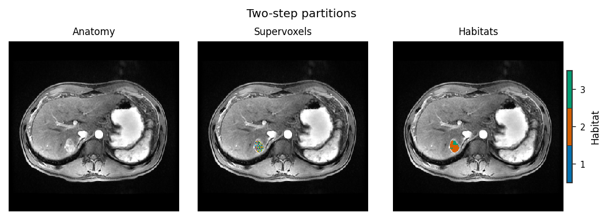
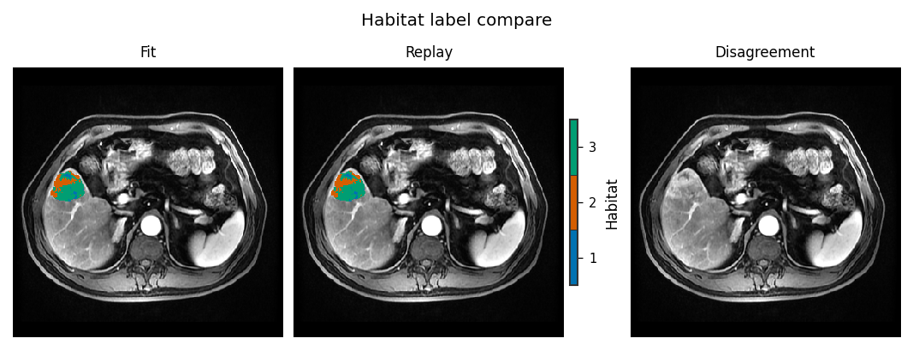
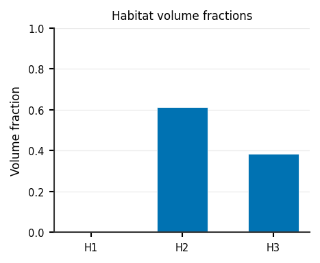
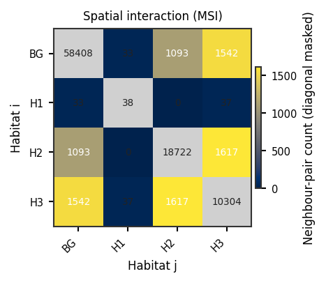

Apply a saved .habitatmodel to new subjects
===========================================

**Level:** recipe · **Data:** ``demo_data/preprocessed`` · **Extras:** optional
``[view]`` · **Time:** ~20–60 s

A fitted :class:`~habit.contracts.HabitatModel` is HABIT's primary
scientific artefact: a self-describing habitat definition that can be
published alongside a paper and applied by other groups to their own
cohorts. This example shows the publish-and-reuse workflow:

1. train a definition on a discovery cohort with
   :meth:`~habit.recipes.Study.fit_predict` (two-step stages),
2. round-trip it through a ``.habitatmodel`` archive
   (:meth:`~habit.contracts.HabitatModel.save` /
   :meth:`~habit.contracts.HabitatModel.load`),
3. project the reloaded definition onto **new, previously unseen subjects**
   with :meth:`~habit.recipes.Study.predict`.

No fitting happens after the reload: the model's stored cohort-level
preprocessing state is replayed, so the new supervoxels are scored in the
training feature space — the guarantee that train and predict stay
consistent.

Script
------

Load the Option B tree with :func:`~habit.cohort_from_directory`
(:doc:`../how_to/prepare_data` Option C). Change ``DATA`` /
``MODALITIES`` / ``ROI`` to your preprocessed layout. The demo pack has
``subj001`` … ``subj005``; this recipe trains on the first three subjects
and applies the saved model to the last two. Keep the same
:class:`~habit.spec.HabitatSpec` for train and apply. The fit stage uses
a fixed ``n_habitats=3`` with ``n_supervoxels=32`` (not auto-K) so the
applied maps keep more than one habitat visible.

.. literalinclude:: scripts/apply_saved_model_demo.py
   :language: python
   :start-after: # BEGIN example
   :end-before: # END example

Draw the figures
----------------

Paste this after the Script block (it uses ``new_cohort``, ``prediction``,
``train_cohort``, ``train_result``, ``model``, and ``spec``). Writes
``out/apply_*.png``.

.. literalinclude:: scripts/apply_saved_model_demo.py
   :language: python
   :start-after: # BEGIN figures
   :end-before: # END figures

Output
------

Illustrative::

   Train: ['subj001', 'subj002', 'subj003']; apply: ['subj004', 'subj005']
   Saved out/habitat_model.habitatmodel
     subj003: {...}
     subj004: {...}

Running the script regenerates gallery PNGs; ``HABIT_NO_VIEW=1`` skips napari.

Figures
-------

.. figure:: ../_static/images/examples/apply_overlay.png
   :alt: Habitats after applying a saved model
   :width: 420

   Habitats on a new subject after ``Study.from_model(...).predict``.

   Apply-time partitions (:func:`~habit.viz.plot_partition_triptych`).

   Train fit vs replay predict on a discovery subject
   (:func:`~habit.viz.plot_habitat_label_compare`).

   Volume fractions on the applied map.

   MSI matrix.

.. figure:: ../_static/images/examples/apply_ith_summary.png
   :alt: ITH summary on an applied subject
   :width: 520

   ITH summary.

What to read next
-----------------

* :doc:`../how_to/prepare_data` — ``DATA`` / ``MODALITIES`` / ``ROI`` and the folder tree
* :doc:`two_step_habitat` — the training half of the workflow
* :class:`~habit.contracts.HabitatModel` — the model contract
* :doc:`run_from_yaml` — the same predict path driven by a YAML document
