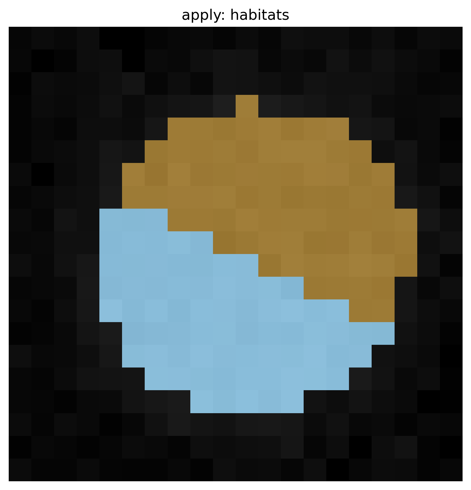

Apply a saved model
===================

Train a definition, write a ``.habitatmodel``, then project it onto new
subjects with :meth:`~habit.recipes.Study.from_model` +
:meth:`~habit.recipes.Study.predict`. No fitting after the reload: the
model's stored cohort preprocessing is replayed in the training feature
space.

.. literalinclude:: scripts/apply_saved_model_demo.py
   :language: python
   :start-after: # BEGIN example
   :end-before: # END example

.. literalinclude:: scripts/apply_saved_model_demo.py
   :language: python
   :start-after: # BEGIN figures
   :end-before: # END figures

   Habitats on a new subject after ``Study.from_model(...).predict``.

Save and load
-------------

:meth:`~habit.contracts.HabitatModel.save` / :meth:`~habit.contracts.HabitatModel.load`
round-trip the definition as a ``.habitatmodel`` archive.
:meth:`~habit.recipes.StudyResult.save` writes maps, tables, and
``run_manifest.json`` after the cohort is in memory.
Reload the model and call ``Study.from_model(model, spec).predict`` —
do not treat a raw pickle as a habitat definition.

Match labels
------------

Applying a saved model with :meth:`~habit.recipes.Study.predict` keeps
the training integer ids. Rematch only when two maps were clustered
independently.

* Same tumour, two observers: :func:`~habit.kernels.habitat_label_match.match_labels_by_overlap`.
* Different patients: unscaled texture means, one cohort z-score, then
  :func:`~habit.kernels.habitat_label_match.match_labels_by_features`.

Runnable numbers: ``docs/source/examples/scripts/habitat_label_match_demo.py``.

Next: :doc:`habitat_recipes` · :doc:`parallel_execution`.
