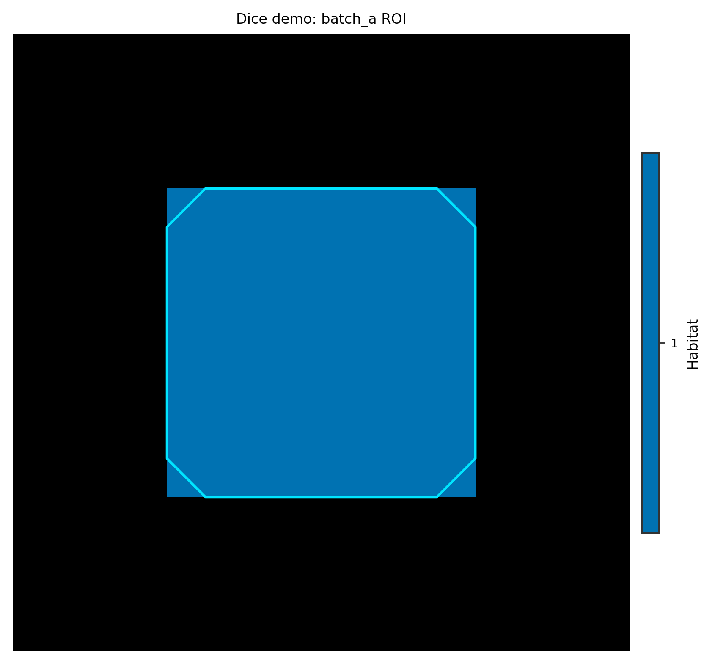

Cohort assembly, plugins, and auxiliary utilities
=================================================

**Level:** shell · **Data:** demo_data (partial) · **Extras:** none · **Time:** varies

API surfaces beyond the core habitat/ML recipes. Each utility below has a
**batch** entry (directory or table) and, where applicable, an **atomic**
counterpart (single subject / single file).

For pure NumPy → ``Subject`` without directories, see :doc:`data_from_arrays`.
For entry-point plugins, see :doc:`plugin_entry_points`.

Cohort and plugins
------------------

* :func:`~habit.contracts.cohort_from_directory` — batch load
  ``images/<subject>/<modality>/`` + ``masks/``; slice with ``cohort[0]`` or
  ``cohort[i:j]`` for atomic subsets.
* :func:`~habit.api.plugins.list_plugins` — enumerate registered components.

Auxiliary recipes
-----------------

* :func:`~habit.recipes.dice` — pairwise mask Dice (two directory batches)
* :func:`~habit.recipes.merge_tables` — join CSV tables on ``subject_id``
* :func:`~habit.recipes.dicom_info` — DICOM header summary (after sort-dicom)
* :func:`~habit.recipes.icc_analysis` — table-format ICC on feature CSVs
* :func:`~habit.recipes.sort_dicom` — reorganise DICOM trees (batch; needs DICOM data)

Config tooling (programmatic twins of CLI)
------------------------------------------

* :func:`~habit.commands.cmd_check_config.run_check_config`
* :func:`~habit.commands.cmd_migrate_config.run_migrate_config`

Script
------

.. literalinclude:: scripts/cohort_plugins_aux_demo.py
   :language: python
   :start-after: # BEGIN example
   :end-before: # END example

Draw the figures
----------------

Paste this after the Script block (it uses ``dice_df`` and ``work_dir``).
Writes ``out/cohort_plugins_*.png``.

.. literalinclude:: scripts/cohort_plugins_aux_demo.py
   :language: python
   :start-after: # BEGIN figures
   :end-before: # END figures

Output (abbreviated)
--------------------

::

   cohort_from_directory (batch): 2 subjects from demo_data
   atomic slice cohort[0]: subj001, modalities=['pre_contrast', 'LAP', 'PVP', 'delay_3min']
   list_plugins('voxel_feature_extractor'): 5 registered — concat, kinetic, ...

   dice(): 2 pairwise rows, mean Dice=0.888
   merge_tables: 3 columns
   icc_analysis: .../icc

   check-config: config_habitat_two_step.yaml
   [OK] Config OK (workflow=habitat)
   migrate-config wrote: habitat_two_step.v1.yaml (1741 bytes)

Figures
-------

Dice is a table; the demo also draws the compared ROI as a label overlay.

.. figure:: ../_static/images/examples/cohort_plugins_dice.png
   :alt: Pairwise mask Dice bar chart
   :width: 420

   Pairwise Dice from :func:`~habit.recipes.dice`.

   Batch-A ROI as labels (:func:`~habit.viz.plot_habitat_overlay`).

What to read next
-----------------

* :doc:`run_from_yaml` — v0 configs migrate transparently at runtime too
* :doc:`../configuration/auxiliary` — CLI reference for dice, icc, sort-dicom
* ``demo_data/results/api/09_extras/`` — API coverage artefacts for icc
