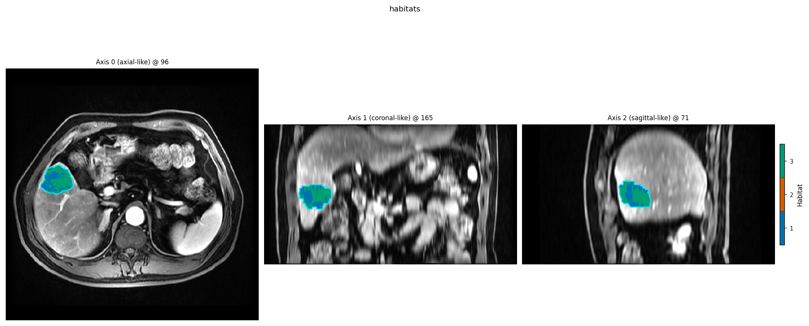

Custom features
===============

When ``raw`` / ``concat`` are not enough — for example
``square(LAP / PVP^3)``, or a neighbourhood / embedding feature — use a
built-in ``expression`` or a registered :class:`~habit._protocols.VoxelFeatureExtractor`.
Both plug into ``HabitatSpec.voxel_feature_extractor`` and the same recipes.

Expression
----------

Restricted arithmetic over modality intensities (ratios, powers,
``square`` / ``log`` / …). Safe AST evaluation; no arbitrary Python.

Plugin
------

Any :class:`~habit._protocols.VoxelFeatureExtractor`. Register in-process
with ``@VoxelFeatureExtractorRegistry.register("name")``. To package an
entry point, see :doc:`../customization/index`.

.. literalinclude:: scripts/custom_voxel_feature_demo.py
   :language: python
   :start-after: # BEGIN example
   :end-before: # END example

.. literalinclude:: scripts/custom_voxel_feature_demo.py
   :language: python
   :start-after: # BEGIN figures
   :end-before: # END figures

   Habitats after ``Study(...).fit_predict`` with a DIY extractor
   (:func:`~habit.viz.plot_habitat_overlay`).

Feature trees
-------------

Leaves and combiners nest: ``parse_feature_expression`` and a structured
``Spec`` produce the same fingerprint. Use this when you want
``concat(raw(...), local_entropy(...))`` rather than a single leaf.

.. literalinclude:: scripts/feature_composition_demo.py
   :language: python
   :start-after: # BEGIN example
   :end-before: # --- 2. Voxel tree, atomic call

**Next:** :doc:`voxel_texture`
