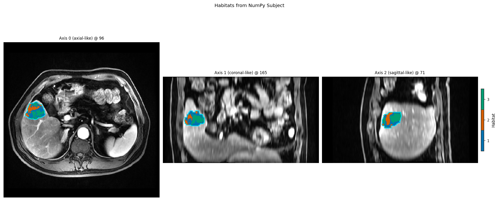

Data from NumPy arrays (Subject / Cohort bridge)
================================================

**Level:** data in · **Data:** in-memory arrays · **Extras:** none · **Time:** <5 s

HABIT does not require its directory layout. If you already hold arrays
(from nibabel, SimpleITK, MONAI, …), wrap them as contracts and call domain
operators or recipes unchanged.

Key types
---------

* :class:`~habit.contracts.Geometry` — ``Geometry.from_array(shape, spacing=...)``
* :class:`~habit.contracts.ArrayImageRef` — lazy ``ImageRef`` over a NumPy array
* :class:`~habit.contracts.ImageVolume` / :class:`~habit.contracts.MaskVolume`
  — eager volumes (``from_geometry``)
* :class:`~habit.contracts.Subject` / :class:`~habit.contracts.Cohort`

Mask arrays must be **integer labels** (``0`` = background). Float masks in
``[0, 1)`` silently become empty ROIs.

Script
------

.. literalinclude:: scripts/data_from_arrays_demo.py
   :language: python
   :start-after: # BEGIN example
   :end-before: # END example

Draw the figures
----------------

Paste this after the Script block (it uses ``cohort``, ``t1``, and
``MODALITIES``). Writes ``out/data_from_arrays_overlay.png``.

.. literalinclude:: scripts/data_from_arrays_demo.py
   :language: python
   :start-after: # BEGIN figures
   :end-before: # END figures

Run::

   python docs/source/examples/scripts/data_from_arrays_demo.py

Output
------

::

   Eager volumes: image.shape=(16, 16, 16), mask.roi=tumor, labels=(1,)
   Cohort: n=3 ids=['P000', 'P001', 'P002']
   RawVoxelFeatures: voxels=1728, names=['T1', 'T2']
   Wrote out/data_from_arrays_overlay.png

Figures
-------

The NumPy ``Subject`` is a normal habitat input. Overlay from
:func:`~habit.one_step_habitat` on that in-memory cohort:

   :func:`~habit.viz.plot_habitat_overlay` after wrapping arrays as
   :class:`~habit.contracts.Subject`.

What to read next
-----------------

* :doc:`habitat_atomic_ops` — run operators on these subjects
* :doc:`two_step_habitat` — or pass the ``Cohort`` to ``Study.fit_predict``
* :doc:`../how_to/prepare_data` — directory layout when you do use files
