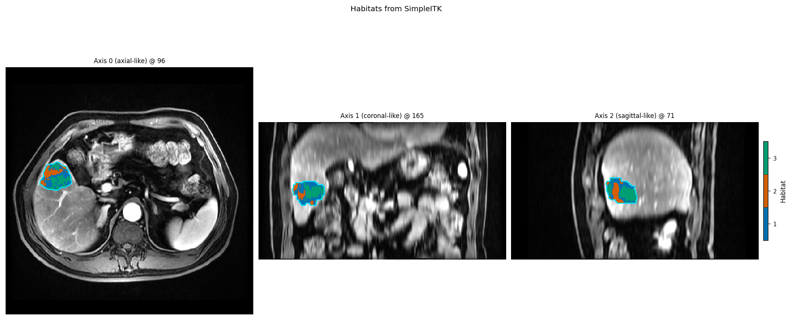

Load data
=========

HABIT operators take a :class:`~habit.contracts.Subject` (or a
:class:`~habit.contracts.Cohort` of them). Build that object from a
directory tree, SimpleITK images, or NumPy arrays. All three blocks call
:func:`~habit.datasets.fetch_demo` (cache or local ``demo_data/preprocessed``).
Swap ``DATA`` to your own tree when you are ready. Mask arrays must be
**integer labels** (``0`` = background).

Directory
---------

``fetch_demo()`` prints the absolute path and an inventory. That printed
tree is what your own ``DATA`` must match.

.. literalinclude:: scripts/data_from_arrays_demo.py
   :language: python
   :start-after: # BEGIN disk
   :end-before: # END disk

Layout (no nested ``processed_images``)::

   DATA/
     images/<subject_id>/<modality>/<one image file>
     masks/<subject_id>/<roi>/<one mask file>

Demo subjects are ``subj001`` … ``subj005``. Series keys in the pack:
``pre_contrast``, ``LAP``, ``PVP``, ``delay_3min``. Backup share:
|download_demo_data| (code |demo_data_code|).

SimpleITK
---------

Read a demo NRRD with SimpleITK, then wrap it. Geometry (spacing / origin /
direction) is kept.

.. literalinclude:: scripts/data_from_arrays_demo.py
   :language: python
   :start-after: # BEGIN sitk
   :end-before: # END sitk

.. literalinclude:: scripts/data_from_arrays_demo.py
   :language: python
   :start-after: # BEGIN sitk_figures
   :end-before: # END sitk_figures

   :func:`~habit.viz.plot_habitat_overlay` after
   :meth:`~habit.api.image.ImageVolume.from_sitk`.

NumPy arrays
------------

Same files, but you already hold arrays (nibabel / MONAI too): put them
into :class:`~habit.contracts.ArrayImageRef`.

.. literalinclude:: scripts/data_from_arrays_demo.py
   :language: python
   :start-after: # BEGIN example
   :end-before: # END example

.. literalinclude:: scripts/data_from_arrays_demo.py
   :language: python
   :start-after: # BEGIN figures
   :end-before: # END figures

**Next:** :doc:`habitat_feature_routes`
