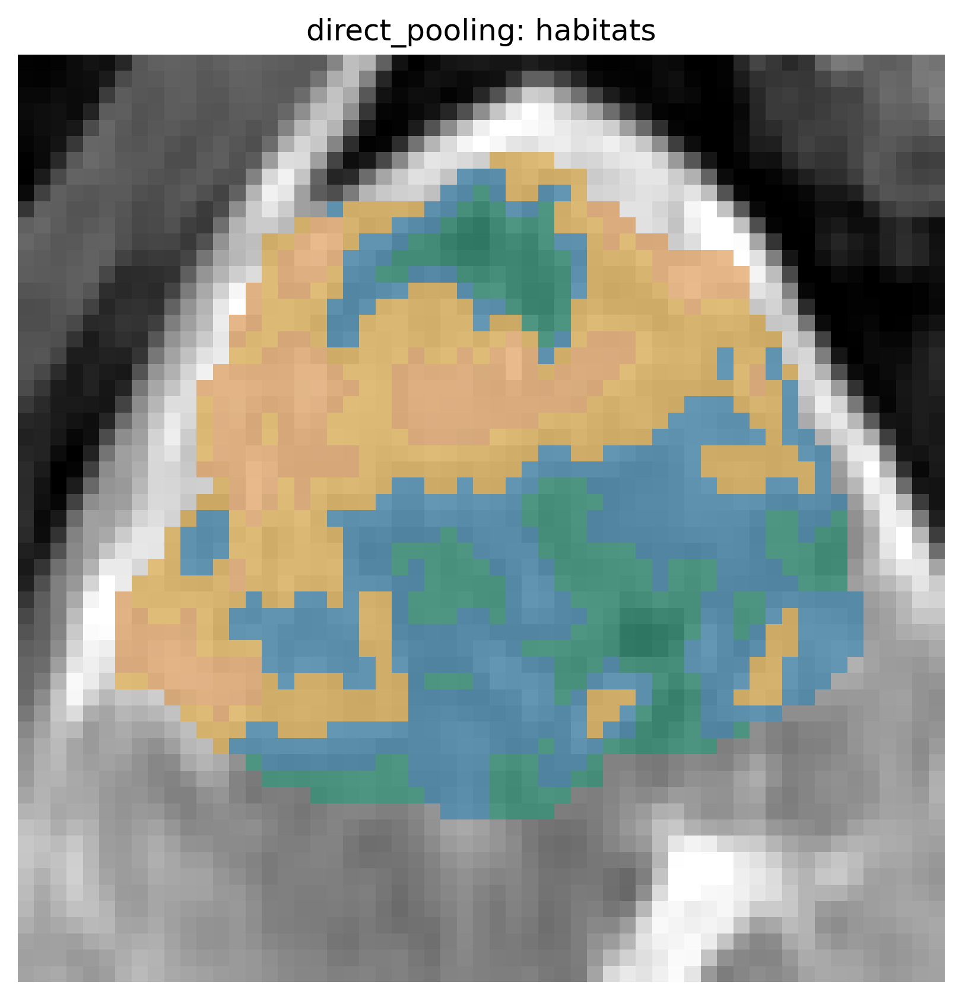
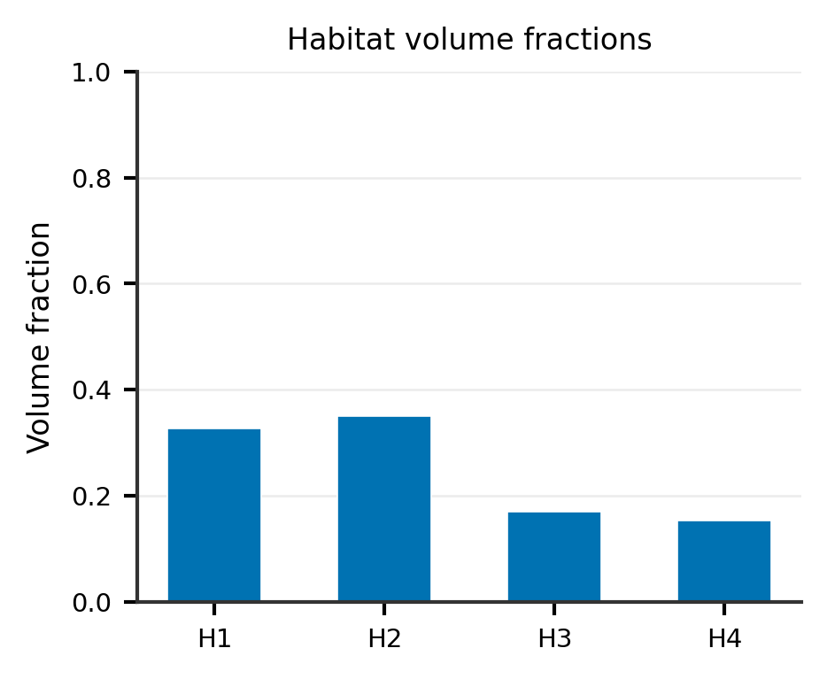
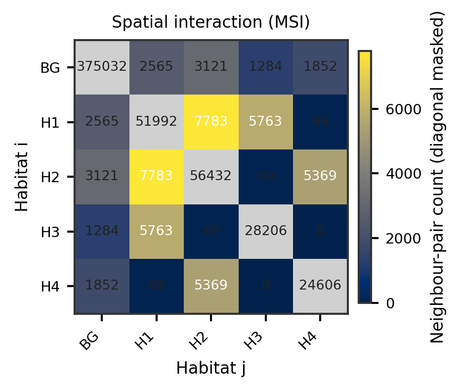
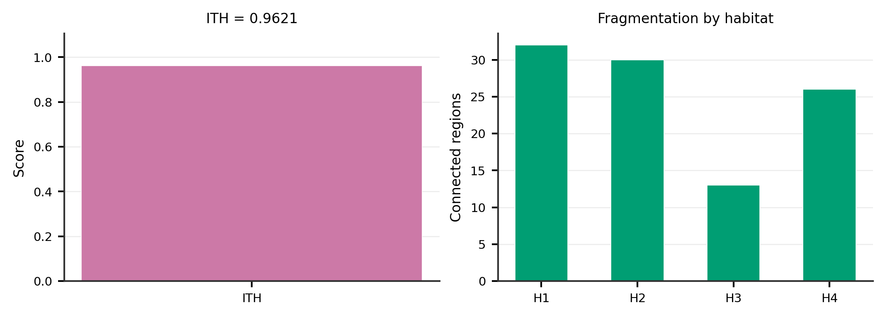
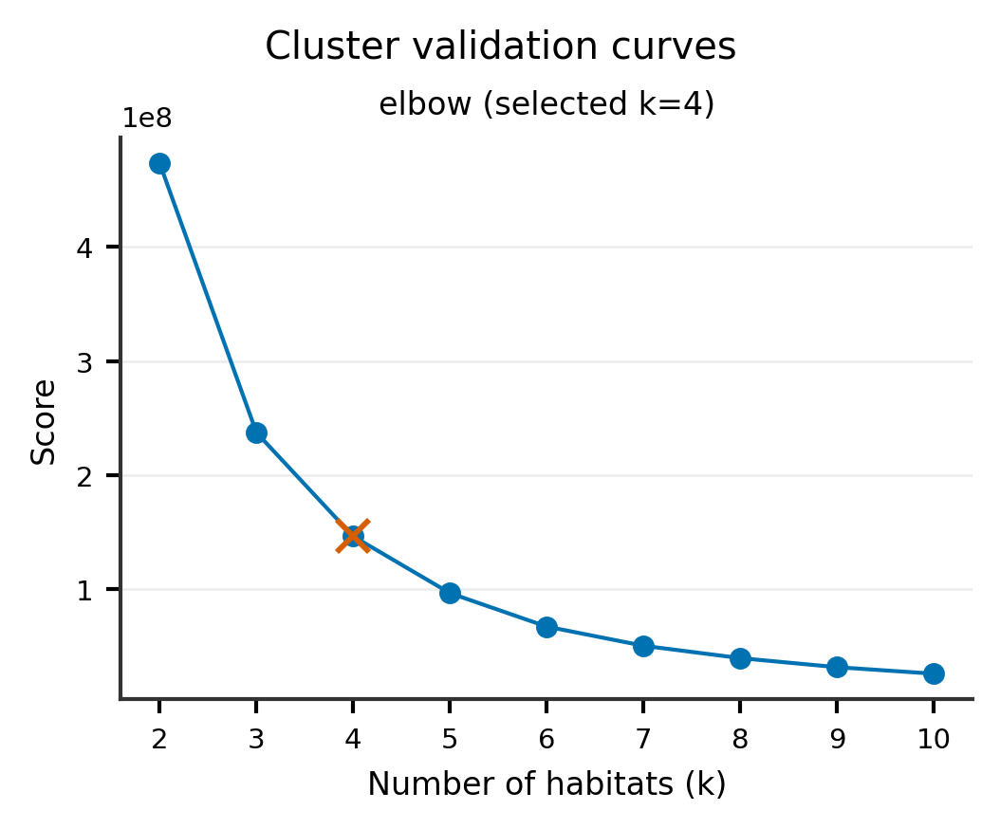

Direct-pooling habitat analysis
===============================

**Level:** recipe · **Data:** ``demo_data/preprocessed`` · **Extras:** optional
``[view]`` · **Time:** ~20–60 s

Direct pooling skips supervoxels and clusters **all ROI voxels pooled across
the cohort**. Declare stages with a ``pool`` marker and **no** ``partition``,
then call :meth:`~habit.recipes.Study.fit_predict`. Preprocess stages may run
before and after ``pool`` (post-pool feature preprocess is first-class),
producing one cohort-level :class:`~habit.contracts.HabitatModel`.

The factory :func:`~habit.recipes.direct_pooling_habitat` remains for convenience.

Script
------

Change ``DATA`` / ``MODALITIES`` / ``ROI`` to your preprocessed tree.

.. literalinclude:: scripts/direct_pooling_habitat_demo.py
   :language: python
   :start-after: # BEGIN example
   :end-before: # END example

Output
------

Illustrative::

   Cohort: 2 subjects
   Habitat maps: 2
   Saved study to out/direct_pooling_demo

Running the script regenerates gallery PNGs; ``HABIT_NO_VIEW=1`` skips napari.

Figures
-------

   Cohort-pooled habitats on anatomy.

   Volume fractions.

   MSI matrix.

   ITH summary.

   Auto-K validation curves when ``selection_report`` is present.

What to read next
-----------------

* :doc:`habitat_analysis_overview` — recipe / atomic / custom map
* :doc:`habitat_custom_pipeline` — customise stages for pooling designs
* :doc:`habitat_preprocessing` — subject vs cohort preprocessing chains
* :doc:`two_step_habitat` — supervoxel intermediate stage
* :doc:`apply_saved_model` — reuse a cohort-level model on new subjects
