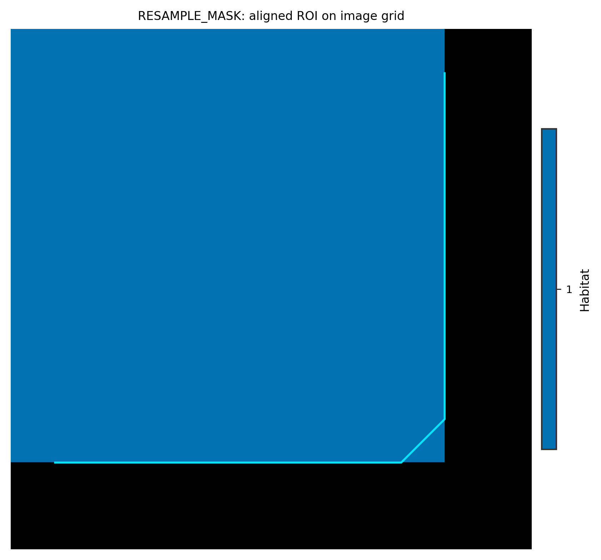

Fault tolerance patterns
========================

Teaching chapter (backends + raise vs continue):
:doc:`../tutorial/execution`.

v1.0 exposes **explicit** resilience knobs — geometry policy, batch
``fail_fast``, plugin ``strict``, execution ``on_subject_failure``, and
format-gated ``HabitatModel.load`` — so third-party pipelines can choose
raise vs continue without relying on HABIT's YAML layout.

This page walks the Python API surface. YAML twins for habitat jobs live in
:doc:`../configuration/habitat` (``on_subject_failure``, retry, timeout,
checkpoint). Older top-level knobs ↔ ``RunPolicy`` rename table:
:doc:`../api/spec`. Backend selection (when timeouts / OOM apply):
:doc:`../api/execution`. CLI exit behaviour is summarised in
:doc:`../reference/cli`.

Script
------

.. literalinclude:: scripts/fault_tolerance_demo.py
   :language: python
   :start-after: # BEGIN example
   :end-before: # END example

Draw the figures
----------------

Paste this after the Script block (it uses ``aligned``). Writes
``out/fault_tolerance_align.png``.

.. literalinclude:: scripts/fault_tolerance_demo.py
   :language: python
   :start-after: # BEGIN figures
   :end-before: # END figures

Output
------

::

   === GeometryPolicy ===
   STRICT: GeometryError - Image and mask geometry are incompatible: shape, spacing.
   RESAMPLE_MASK: action='resample_mask', mask_shape=(6, 6, 6), compatible=True

   === extract_batch fail_fast ===
   extract_batch(fail_fast=True): raised GeometryError
   extract_batch(fail_fast=False): rows=1, failures={'bad': 'incompatible geometry'}

   === PluginLoadReport ===
   load_plugins(strict=False): loaded=0, failures=0

   === Backend continue vs Cohort.map ===
   backend.map(continue): ok='fine', bad_error=RuntimeError
   cohort.map(...): ProcessingError - 1/2 subject(s) failed in Cohort.map: bad: RuntimeError: boom
   cohort.map(raise_on_failure=False): ok='fine', bad_error=RuntimeError

   === HabitatModel CompatibilityError ===
   HabitatModel.load(bad): CompatibilityError - ... has format 'not-a-habitat-model'; expected 'habit.habitatmodel'.

   Done. See docs/source/examples/fault_tolerance.rst

Figures
-------

``RESAMPLE_MASK`` puts the ROI on the image grid. That aligned mask is the
visual product of the geometry policy:

   :func:`~habit.viz.plot_habitat_overlay` on the aligned image/mask pair.

Key contracts
-------------

* **GeometryPolicy** — ``STRICT`` (default for API radiomics) raises
  :class:`~habit.exceptions.GeometryError`; ``WARN`` keeps data and warns;
  ``RESAMPLE_MASK`` / ``RESAMPLE_IMAGE`` correct onto the other grid
  (see :doc:`../api/image_io`).
* **extract_batch(fail_fast=)** — ``True`` (default) raises on first pair
  failure; ``False`` returns successful rows plus
  :attr:`~habit.api.radiomics.FeatureTableResult.failures`.
* **load_plugins(strict=)** — ``False`` (default) fills
  :class:`~habit.api.plugins.PluginLoadReport`; ``True`` raises the first
  entry-point error (see :doc:`../api/plugins`).
* **Backend continue vs Cohort.map** — ``SerialBackend`` /
  ``ProcessPoolBackend`` with ``on_subject_failure="continue"`` isolate
  errors in :class:`~habit.contracts.SubjectResult` slots.
  Default :meth:`~habit.contracts.Cohort.map` still raises
  :class:`~habit.exceptions.ProcessingError`. Pass
  ``raise_on_failure=False`` (or call ``backend.map``) for soft failure;
  habitat recipes / CLI do this so a partial cohort can finish
  (see :doc:`../api/execution`).
* **HabitatModel.load** — bad ZIP / wrong format / newer
  ``format_version`` raise :class:`~habit.exceptions.CompatibilityError`
  (never a silently wrong habitat map).
* **Report + CheckpointStore** — one-step streaming writes each completed
  subject's map / model / figures before the next subject starts. Attach
  a :class:`~habit.execution.CheckpointStore` so a crashed run skips
  finished subjects (:doc:`one_step_habitat`).

What to read next
-----------------

* :doc:`../api/exceptions` — exception matrix
* :doc:`../api/execution` — continue / fail_fast / timeout / checkpoint / Serial vs ProcessPool
* :doc:`../api/spec` — RunPolicy fields + YAML mapping
* :doc:`parallel_execution` — RunPolicy + ProcessPoolBackend
* :doc:`one_step_habitat` — ``Report`` + ``CheckpointStore``: completed
  subjects stay on disk if a later subject fails
* :doc:`../configuration/habitat` — Stage-1 parallel / checkpoint YAML (v1 path notes)
* :doc:`persistence` / :doc:`apply_saved_model` — model I/O
* :doc:`../reference/cli` — CLI exit codes and ``check-config``
