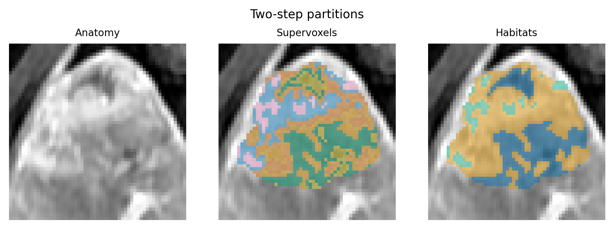
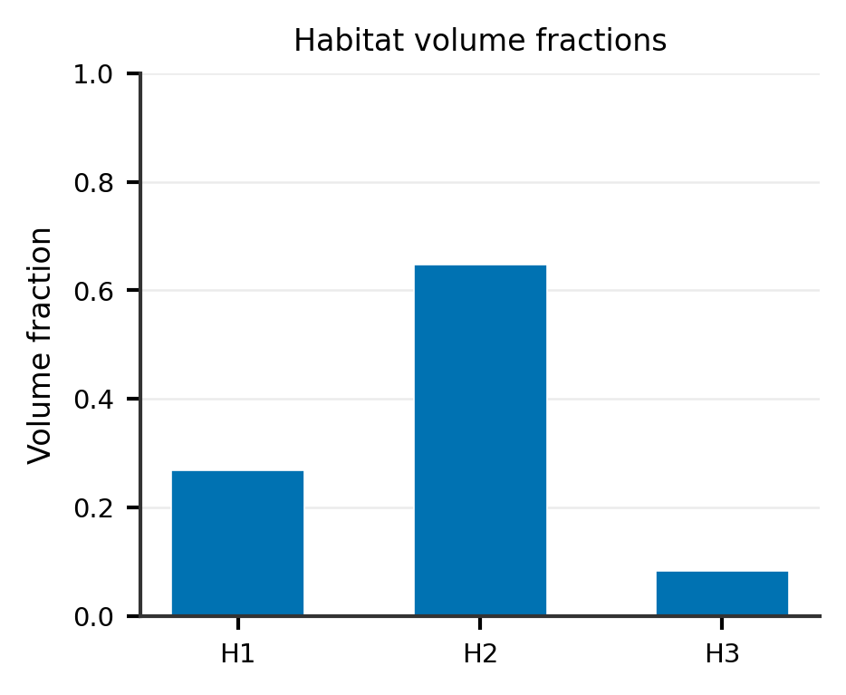
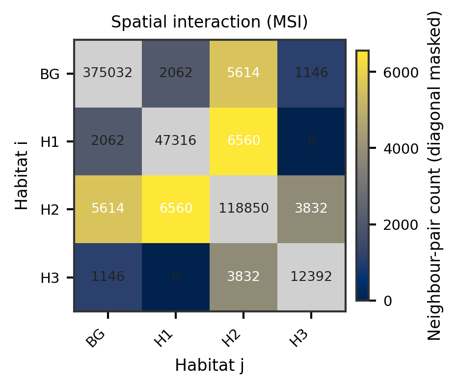
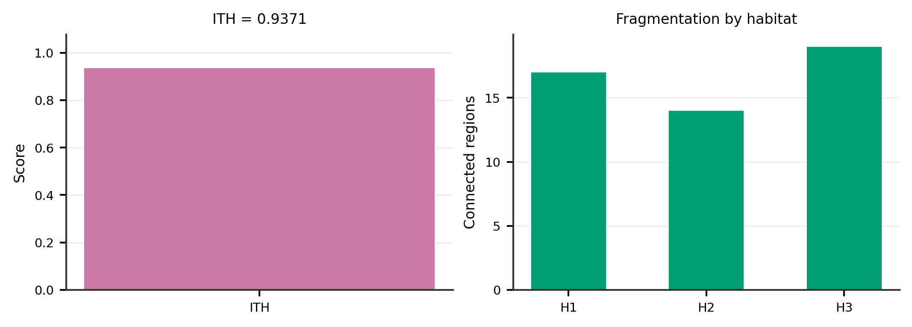
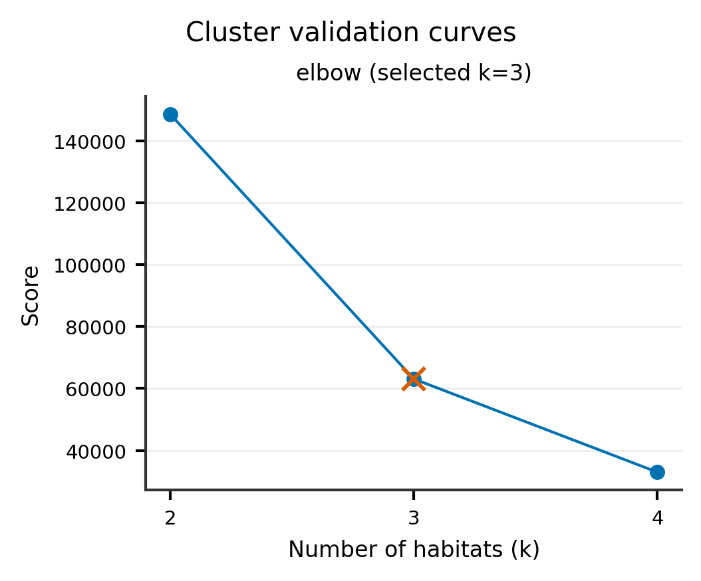

Habitat and radiomics feature extraction
========================================

Two extraction paths:

1. **After habitat maps exist** — :func:`~habit.recipes.extract_habitat_features`
   computes light families (``volume``, ``msi``, ``ith_score``, ``non_radiomics``,
   built-in ``graph``) and optional heavy radiomics (``traditional``,
   ``whole_habitat``, ``each_habitat``) from NRRD maps.
2. **Standalone ROI radiomics** — :func:`~habit.recipes.traditional_radiomics`
   extracts PyRadiomics features without habitat segmentation.

For a short end-to-end ``graph`` walkthrough (one subject → one-step → plot),
see :doc:`graph_features`.

Habitat extraction example
----------------------------

Train on ``demo_data/preprocessed``, save maps under ``out/``, then call
:func:`~habit.recipes.extract_habitat_features`. Change ``DATA`` /
``MODALITIES`` / ``ROI`` (and the ``out/`` paths) for your project.

.. literalinclude:: scripts/feature_extraction_demo.py
   :language: python
   :start-after: # BEGIN example
   :end-before: # END example

Running the script regenerates gallery PNGs; ``HABIT_NO_VIEW=1`` skips napari.

Figures
-------

.. figure:: ../_static/images/examples/feature_extract_overlay.png
   :alt: Habitats used for feature extraction
   :width: 420

   Habitat map used before ``extract_habitat_features``.

   Two-step partitions feeding the extract step.

   Volume fractions (:func:`~habit.viz.plot_habitat_volume_fractions`).

   MSI matrix (:func:`~habit.viz.plot_msi_matrix`); linear colour scale on
   off-diagonal neighbour-pair counts (diagonal / BG–BG masked).

   ITH summary (:func:`~habit.viz.plot_ith_summary`).

   Auto-K curves from the training ``HabitatModel`` when present.

Output (abbreviated)::

   Trained: 3 habitats, 3 maps
   Saved habitat maps to .../habitat_maps

   Extracting feature families: ['non_radiomics', 'whole_habitat', ...]
   Output: .../features
     output_dir: .../features
     run_manifest: .../features/habit_run_manifest.json

Traditional radiomics example
-----------------------------

Requires ``demo_data/preprocessed/`` and PyRadiomics.
Use ``--dry-run`` to validate the config dict without running extraction.

.. include:: ../_includes/windows_multiprocessing.rst

.. literalinclude:: scripts/traditional_radiomics_demo.py
   :language: python

What to read next
-----------------

* :doc:`two_step_habitat` — producing the habitat maps first
* :doc:`../reference/features/index` — features from habitat maps
