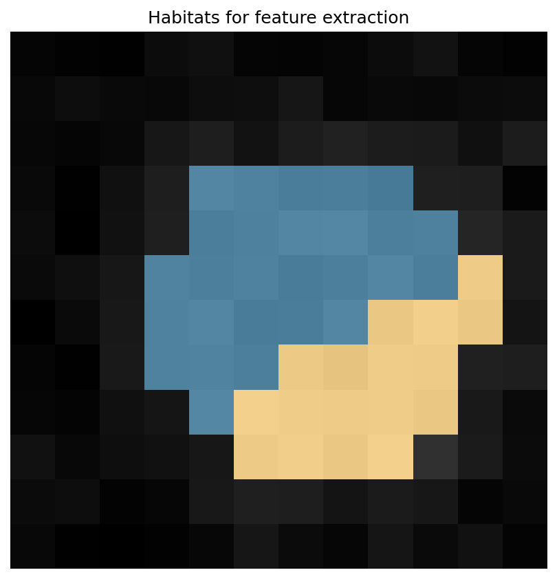

Feature extraction and traditional radiomics API
================================================

* :func:`~habit.recipes.extract_habitat_features` — habitat-wise tables
  (count / basic / MSI / ITH / optional radiomics).
* :func:`~habit.recipes.traditional_radiomics` — whole-ROI PyRadiomics
  without a habitat map.

In-memory habitat studies already return a feature
:class:`~habit.contracts.FeatureTable` from ``two_step`` /
``one_step`` / ``direct_pooling`` when ``habitat_features`` is set on the
spec — no directory layout required. The directory recipes are the CLI twins
for batch extraction over saved NRRD maps.

Script
------

.. literalinclude:: scripts/features_radiomics_api_demo.py
   :language: python
   :start-after: # BEGIN example
   :end-before: # END example

Draw the figures
----------------

Paste this after the Script block (it uses ``cohort`` and ``result``).
Writes ``out/features_radiomics_api_overlay.png``.

.. literalinclude:: scripts/features_radiomics_api_demo.py
   :language: python
   :start-after: # BEGIN figures
   :end-before: # END figures

Output
------

Real output of the in-memory two-step path (column names are stable; counts
depend on ``n_habitats``)::

   === In-memory: habitat_features on two_step ===
     feature columns (47):
       - habitat_1_voxel_count
       - habitat_1_volume_fraction
       - habitat_2_voxel_count
       - habitat_2_volume_fraction
       - habitat_3_voxel_count
       - habitat_3_volume_fraction
       - firstorder_0_and_1
       ...
       - ith_score
       - num_habitats
     wrote out/features_radiomics_api_overlay.png
   === Directory recipes (call pattern; full run in coverage) ===
     imaging present=True, habitat maps present=False
     extract_habitat_features({raw_img_folder, habitats_map_folder, out_dir, ...})
     traditional_radiomics({paths.images_folder, paths.out_dir, ...})

Coverage
--------

``demo_data/results/api/05_extract_features`` and
``06_traditional_radiomics``.

The script writes ``out/features_radiomics_api_overlay.png`` and may open a
**napari eye-check**. ``HABIT_NO_VIEW=1`` skips the viewer.

Figures
-------

Habitat feature tables sit on top of habitat maps from this demo.

   Habitats that feed ``habitat_features``
   (:func:`~habit.viz.plot_habitat_overlay`).

What to read next
-----------------

* :doc:`tabular_ml_api` — model the resulting tables
* :doc:`habitat_fit_modes` — produce habitat maps first
