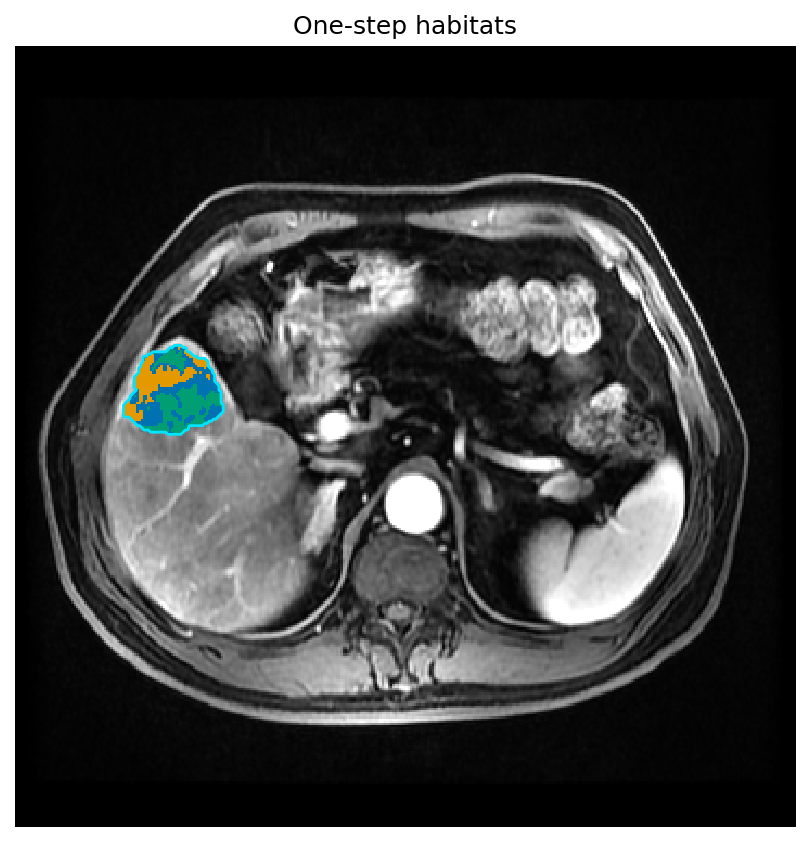
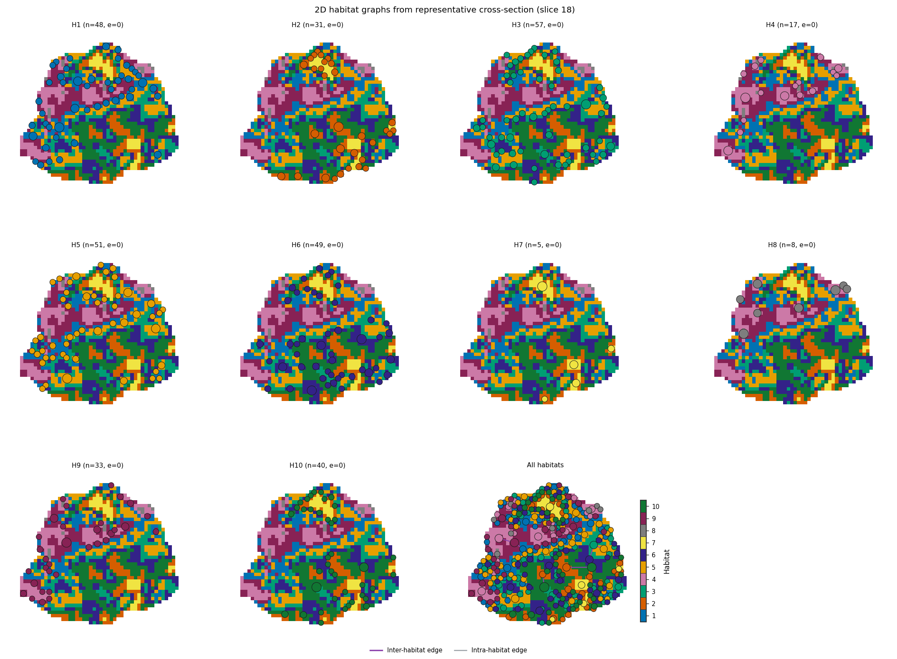
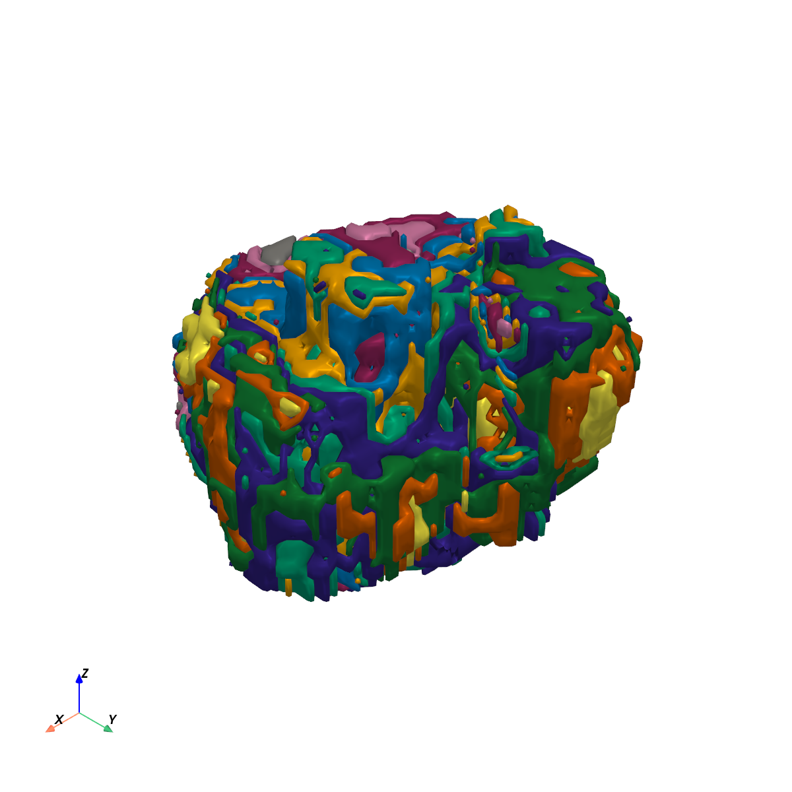
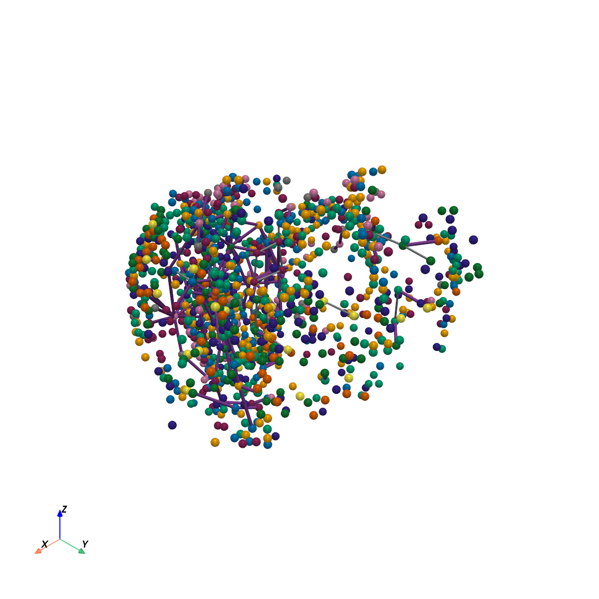

Graph features from habitat maps
================================

**Level:** atomic · **Data:** ``demo_data`` or synthetic · **Extras:** ``[viz]`` /
``[view]`` for figures · **Time:** ~20–90 s

End-to-end: one subject → :func:`~habit.one_step_habitat` with a **fixed**
``n_habitats=10`` (not ``"auto"``) →
:func:`~habit.extract_graph_features` → overlay +
:func:`~habit.viz.plot_habitat_graph_network_2d`. By default there is **no
erosion**; an edge exists when two regions are **adjacent** and the
contact (shared-boundary) voxel count is **>= 10**, measured on the
habitat labels as drawn. Optional ``erosion_radius`` shrinks habitats
before edges. Graph topology is a habitat-map feature family (same
tier as ``volume`` / ``msi``); columns under
:doc:`../reference/features/index`.

Script
------

Change ``DATA`` / ``MODALITIES`` / ``ROI`` to your preprocessed tree
(:doc:`../how_to/prepare_data` Option C). The recipe **fixes K=10**, then
extracts graph topology and draws the overlay plus the 2D network. Figures
land under ``out/`` (swap that path too if you like).

.. literalinclude:: scripts/graph_features_demo.py
   :language: python
   :start-after: # BEGIN example
   :end-before: # END example

Draw the figures
----------------

Paste this after the Script block (it uses ``cohort``, ``result``, and
``labels``). Writes ``out/graph_habitat_slice_2d.png`` (orthogonal overlay)
and ``out/graph_habitat_network_2d.png``.

.. literalinclude:: scripts/graph_features_demo.py
   :language: python
   :start-after: # BEGIN figures
   :end-before: # END figures

Run from the repository root (one line)::

   python docs/source/examples/scripts/graph_features_demo.py

Output
------

Illustrative (fixed ``n_habitats=10``; count depends on the habitat map)::

   2988 graph features

Anatomy with habitats
---------------------

   Habitat labels on the densest axial slice
   (:func:`~habit.viz.plot_habitat_overlay`).

2D region network
-----------------

   Intra-habitat panels plus the combined inter-habitat graph
   (:func:`~habit.viz.plot_habitat_graph_network_2d`).

3D surfaces and network
-----------------------

Optional off-screen PyVista assets (regenerated when ``[view]`` is installed;
see the how-to for the one-line 3D calls).

   Marching-cubes habitat surfaces
   (:func:`~habit.viz.render_habitat_graph_surface_3d`).

   Region-centroid nodes with intra- and inter-habitat adjacency edges
   (contact voxels >= 10;
   :func:`~habit.viz.render_habitat_graph_network_3d`).

What to read next
-----------------

* :doc:`../how_to/graph_features` — YAML / CLI / domain registry
* :doc:`../reference/features/graph` — column definitions
* :doc:`feature_extraction` — other habitat-map feature families
* :doc:`voxel_texture` — voxel-level texture maps (inputs to habitats)
