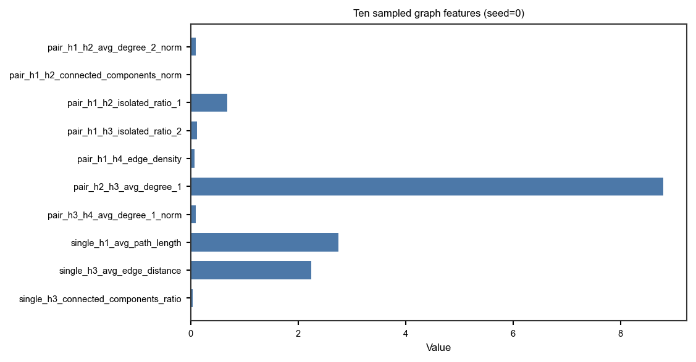

Graph features from habitat maps
================================

**Level:** atomic · **Data:** ``demo_data`` or synthetic · **Extras:** ``[viz]`` /
``[view]`` for figures · **Time:** ~20–90 s

End-to-end: one subject → :func:`~habit.one_step_habitat` with a **fixed**
``n_habitats=4`` (not ``"auto"``) →
:func:`~habit.extract_graph_features` → a reproducible 10-feature
sample (fixed seed) → overlay +
:func:`~habit.viz.plot_habitat_graph_network_2d`. This example uses the
library defaults on :class:`~habit.HabitatGraphFeatureOptions`:
``node_method='uniform_grid'`` (5-voxel cubes, not millimetres; one
node per in-cell subregion centroid) and
``edge_method='min_distance'`` (closest voxels within 5). The 2D network
draws that same lattice as dashed lines. Graph topology is a habitat-map
feature family (same tier as ``volume`` / ``msi``); columns under
:doc:`../reference/features/index`.

Script
------

Change ``DATA`` / ``MODALITIES`` / ``ROI`` to your preprocessed tree
(:doc:`../how_to/prepare_data` Option C). The recipe **fixes K=4** and
uses the library node/edge defaults (uniform 5-voxel cubes, one node
per in-cell subregion centroid + min-distance edges; extended metrics
off so a full 3D mixed lattice stays interactive), then extracts graph
topology, prints ten sampled feature values (``SAMPLE_SEED = 0``),
and draws the overlay plus the 2D network with the dashed
lattice. Figures land under ``out/`` (swap that
path too if you like).

.. literalinclude:: scripts/graph_features_demo.py
   :language: python
   :start-after: # BEGIN example
   :end-before: # END example

Draw the figures
----------------

Paste this after the Script block (it uses ``cohort``, ``result``,
``labels``, ``options``, and ``sample``). Writes
``out/graph_habitat_slice_2d.png`` (orthogonal overlay),
``out/graph_habitat_network_2d.png``, and
``out/graph_feature_sample.png``.

.. literalinclude:: scripts/graph_features_demo.py
   :language: python
   :start-after: # BEGIN figures
   :end-before: # END figures

Run from the repository root (one line)::

   python docs/source/examples/scripts/graph_features_demo.py

Output
------

Illustrative (fixed ``n_habitats=4``, per-cell subregion centroids;
count depends on the habitat map)::

   397 graph features from representative slice 96
   Ten sampled graph features (seed=0):
     pair_h1_h2_avg_degree_2_norm: 0.090625
     pair_h1_h2_connected_components_norm: 0.0153846
     pair_h1_h2_isolated_ratio_1: 0.685714
     pair_h1_h3_isolated_ratio_2: 0.115385
     pair_h1_h4_edge_density: 0.0703297
     pair_h2_h3_avg_degree_1: 8.8
     pair_h3_h4_avg_degree_1_norm: 0.0971485
     single_h1_avg_path_length: 2.75397
     single_h3_avg_edge_distance: 2.24534
     single_h3_connected_components_ratio: 0.0384615

Sampled feature values
----------------------

   Ten features drawn with ``numpy.random.default_rng(0)`` from the
   same ``feats`` dict printed above. Swap ``SAMPLE_SEED`` in the
   Script block to draw a different set.

Anatomy with habitats
---------------------

.. figure:: ../_static/images/examples/graph_habitat_slice_2d.png
   :alt: One-step habitat labels overlaid on anatomy
   :width: 480

   Habitat labels on the densest axial slice
   (:func:`~habit.viz.plot_habitat_overlay`).

2D region network
-----------------

.. figure:: ../_static/images/examples/graph_habitat_network_2d.png
   :alt: Per-habitat intra-graphs and pairwise inter-edge panels on a 2D slice
   :width: 720

   Each H panel fills only that habitat in its palette colour and overlays
   white intra-edges plus white nodes (solid dots, thin dark outline,
   shared size). Other habitats use a mid-dark gray wash for shape
   context so white edges stay visible. Each unordered habitat pair
   (H1-H2, H1-H3, …) has its own panel: those two habitats stay in
   palette colours, other habitats use the same gray wash, and only
   **white inter-edges between that pair** are drawn (no intra-edges,
   no purple). Four habitats yield six pair panels in a 2x3 grid under
   the H1--H4 row. Display knobs ``block_size=5`` /
   ``grid_linestyle='--'`` draw the same 5-voxel cubes
   (:func:`~habit.viz.plot_habitat_graph_network_2d`).

3D surfaces and network
-----------------------

Optional off-screen PyVista assets (regenerated when ``[view]`` is installed;
see the how-to for the one-line 3D calls).

.. figure:: ../_static/images/examples/graph_habitat_surface_3d.png
   :alt: Off-screen PyVista surface render of habitats
   :width: 520

   Marching-cubes habitat surfaces
   (:func:`~habit.viz.render_habitat_graph_surface_3d`).

.. figure:: ../_static/images/examples/graph_habitat_network_3d.png
   :alt: Off-screen PyVista 3D graph with habitat-colored nodes
   :width: 520

   Region-centroid nodes with intra- and inter-habitat min-distance edges
   (library defaults: uniform 5-voxel cubes, closest-voxel threshold 5;
   :func:`~habit.viz.render_habitat_graph_network_3d`).

What to read next
-----------------

* :doc:`../how_to/graph_features` — YAML / CLI / domain registry
* :doc:`../reference/features/graph` — column definitions
* :doc:`feature_extraction` — other habitat-map feature families
* :doc:`voxel_texture` — voxel-level texture maps (inputs to habitats)
