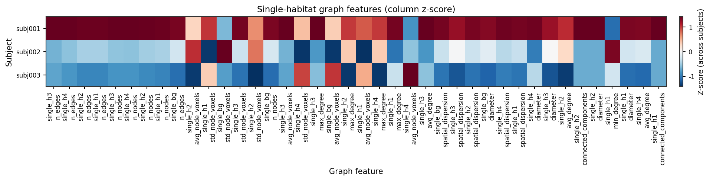
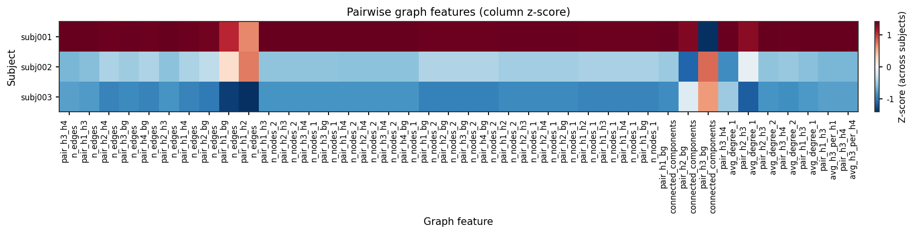
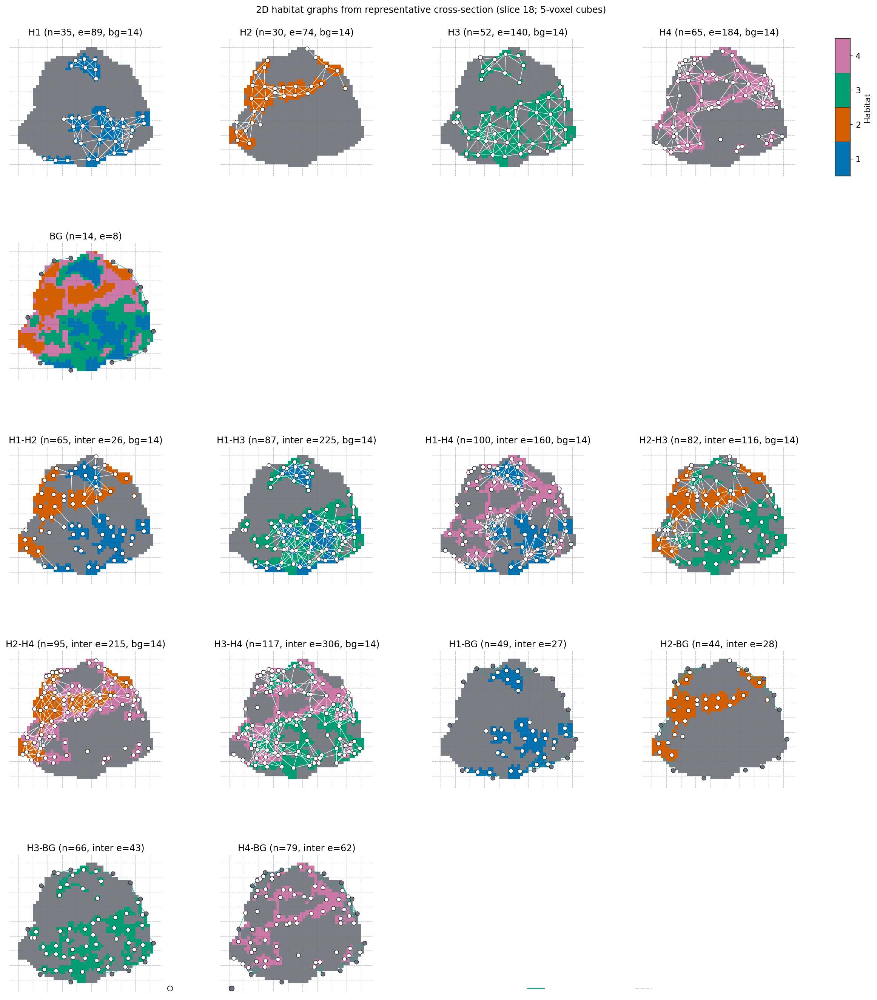
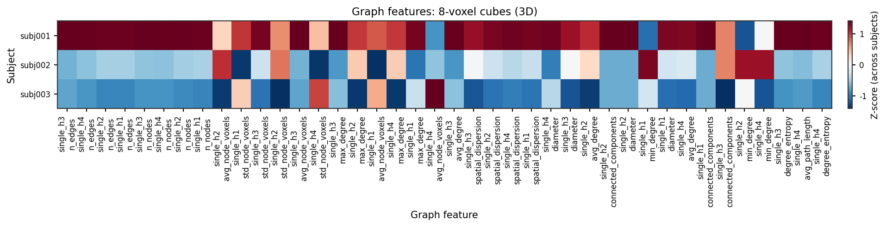
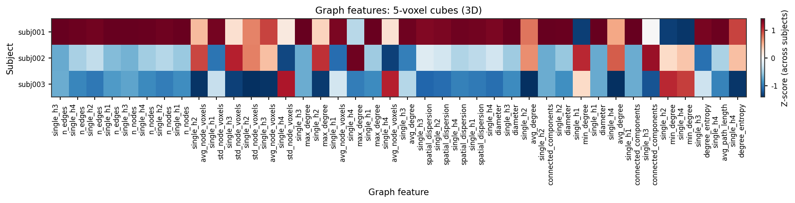
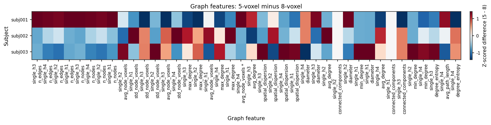

Graph features from habitat maps
================================

**Level:** atomic · **Data:** ``demo_data`` or synthetic · **Extras:** ``[viz]`` /
``[view]`` for figures · **Time:** ~15–30 min

End-to-end: three subjects → :func:`~habit.one_step_habitat` with a **fixed**
``n_habitats=4`` (not ``"auto"``) →
:func:`~habit.extract_graph_features` on the **full 3D**
``HabitatMap.label_array`` (not a 2D slice) →
:func:`~habit.viz.plot_graph_feature_heatmap` (Subject x graph-feature,
column z-score; ``single_h*`` and ``pair_h*`` plus the 8-vs-5 3D
compare) plus overlay +
:func:`~habit.viz.plot_habitat_graph_network_2d`. The 2D network is
**display-only**: it draws a representative axial slice so you can see
the lattice. Heatmaps and stats always use the 3D tables. This example
uses the library defaults on :class:`~habit.HabitatGraphFeatureOptions`:
``node_method='uniform_grid'`` (8-voxel cubes, not millimetres; one
node per in-cell subregion centroid) and
``edge_method='min_distance'`` (closest voxels within 5).
``include_extended_metrics=False`` is required here: extended metrics
on a full 3D map are the main time sink. A later section keeps those
**same habitat labels** and only overrides ``block_size=5`` so the
two 3D lattices can be compared. Graph topology is a
habitat-map feature family (same tier as ``volume`` / ``msi``); columns
under :doc:`../reference/features/index`.

The old ten-bar "Sampled feature values" figure is gone; use the two
heatmaps (and the plot kwargs) to choose people and features. Pass
``subjects=("subj001", "subj002", "subj003", "subj004", "subj005")``
when your table has all five rows (for example a
``habitat_graph_features.csv`` from ``habit extract``).

Script
------

Change ``DATA`` / ``MODALITIES`` / ``ROI`` to your preprocessed tree
(:doc:`../how_to/prepare_data` Option C). The recipe **fixes K=4** and
uses the library node/edge defaults (uniform 8-voxel cubes, one node
per in-cell subregion centroid + min-distance edges; extended metrics
off). One ``fit_predict`` on three subjects feeds the overlay, both 2D
display networks, and both **3D** heatmap tables (library
``block_size=8`` plus a ``block_size=5`` comparison extract on the
same full-volume maps). Figures land under ``out/`` (swap that path
too if you like).

.. literalinclude:: scripts/graph_features_demo.py
   :language: python
   :start-after: # BEGIN example
   :end-before: # END example

Draw the figures
----------------

Paste this after the Script block (it uses ``cohort``, ``result``,
``table``, ``options``, ``SUBJECTS``, and ``MODALITIES``). Writes
``out/graph_habitat_slice_2d.png`` (orthogonal overlay),
``out/graph_habitat_network_2d.png``,
``out/graph_feature_heatmap_single.png``, and
``out/graph_feature_heatmap_pair.png`` from the **3D** 8-voxel table.
The 8-vs-5 comparison block below writes both 2D display networks,
both 3D heatmaps, and the 3D delta heatmap. Heatmap knobs
(``subjects``, ``n_features``, ``feature_group``, ``select``) are
visualization parameters — set who and which columns to show; do not
dump the full bank onto one figure. Raw mixed units are not comparable;
the default is a column-wise z-score across the selected subjects.

.. literalinclude:: scripts/graph_features_demo.py
   :language: python
   :start-after: # BEGIN figures
   :end-before: # END figures

Run from the repository root (one line)::

   python docs/source/examples/scripts/graph_features_demo.py

Output
------

Illustrative (fixed ``n_habitats=4``, per-cell subregion centroids;
count depends on the 3D map and ``include_extended_metrics=False``)::

   3 subjects x 587 graph features from full 3D habitat maps

Cohort heatmaps
---------------

   Up to 40 ``single_h*`` columns (highest cross-subject variance) for
   ``subjects=("subj001", "subj002", "subj003")`` from the **3D**
   8-voxel extract. Color is a column-wise z-score
   (:func:`~habit.viz.plot_graph_feature_heatmap`).

   Same call with ``feature_group='pair'`` on the **3D** 8-voxel
   table (``pair_h*`` only; ``graph_num_*`` stays out unless
   ``feature_group='all'``). Pass ``features=(...)`` for an explicit
   column list.

Anatomy with habitats
---------------------

.. figure:: ../_static/images/examples/graph_habitat_slice_2d.png
   :alt: One-step habitat labels overlaid on anatomy
   :width: 480

   Habitat labels on the densest axial slice of the first subject
   (:func:`~habit.viz.plot_habitat_overlay`).

2D region network
-----------------

.. figure:: ../_static/images/examples/graph_habitat_network_2d.png
   :alt: Per-habitat intra-graphs and pairwise inter-edge panels on a 2D slice
   :width: 720

   Each H panel fills only that habitat in its palette colour and overlays
   white intra-edges plus white nodes (solid dots, thin dark outline,
   shared size). Other habitats use a mid-dark gray wash for shape
   context so white edges stay visible. Each unordered habitat pair
   (H1-H2, H1-H3, …) has its own panel: those two habitats stay in
   palette colours, other habitats use the same gray wash, and only
   **white inter-edges between that pair** are drawn (no intra-edges,
   no purple). Four habitats yield six pair panels in a 2x3 placement
   under the H1--H4 row; every panel uses the same ROI window and the
   same physical size. Display knobs ``block_size=8`` /
   ``grid_linestyle='--'`` draw the same 8-voxel cubes
   (:func:`~habit.viz.plot_habitat_graph_network_2d`). This 2D figure
   is display-only; heatmaps use the full 3D tables.

8-voxel vs 5-voxel lattice
--------------------------

Same habitat labels (one ``fit_predict``, fixed ``K=4``). Only
``block_size`` changes: the library default is 8-voxel cubes; ``5`` is
an explicit comparison override. Edges stay ``min_distance`` /
``distance_threshold=5`` / ``block_min_coverage=0.2``. Feature
tables and heatmaps are **full 3D** extracts. The two 2D networks are
display-only (same representative axial slice as above). The page
shows both 3D tables (8-voxel and 5-voxel, same subjects and columns)
and the 3D delta ``features_5 - features_8`` with ``zscore=True``
(column z-score of that raw delta) and ``star_significant=True``
(paired t-test + Benjamini-Hochberg FDR on the **plotted** features; a
trailing ``*`` on the feature name). Set ``subjects`` / ``features``
the same way as :func:`~habit.viz.plot_graph_feature_heatmap`. This
gallery uses 3 subjects, so few or no stars are expected; the
asterisk is for users with larger n.

.. literalinclude:: scripts/graph_features_demo.py
   :language: python
   :start-after: # BEGIN compare
   :end-before: # END compare

.. figure:: ../_static/images/examples/graph_habitat_network_2d.png
   :alt: 2D habitat graph network on 8-voxel cubes
   :width: 720

   Display-only 2D network, library default (``block_size=8``). Legend
   and title say ``8-voxel cubes``. Each H panel still reports ``n``
   and intra ``e``; each pair panel reports ``n`` and inter ``e``.

   Display-only 2D network with ``options`` set to ``block_size=5``
   (and the display knob ``block_size=5`` so the dashed lattice
   matches the nodes).

   Subject x feature heatmap of the **3D** 8-voxel extract
   (``zscore=True``; title ``Graph features: 8-voxel cubes (3D)``).
   Columns are ranked once on this table and reused below.

   Same subjects and the **same columns** on the **3D** 5-voxel
   extract (``zscore=True``; title ``Graph features: 5-voxel cubes
   (3D)``).

   Subject x feature heatmap of the **3D** ``features_5 - features_8``
   (``zscore=True``; FDR ``*`` on feature names; title
   ``Graph features: 5-voxel minus 8-voxel``).

3D surfaces and network
-----------------------

Optional off-screen PyVista assets (regenerated when ``[view]`` is installed;
see the how-to for the one-line 3D calls).

.. figure:: ../_static/images/examples/graph_habitat_surface_3d.png
   :alt: Off-screen PyVista surface render of habitats
   :width: 520

   Marching-cubes habitat surfaces
   (:func:`~habit.viz.render_habitat_graph_surface_3d`).

.. figure:: ../_static/images/examples/graph_habitat_network_3d.png
   :alt: Off-screen PyVista 3D graph with habitat-colored nodes
   :width: 520

   Region-centroid nodes with intra- and inter-habitat min-distance edges
   (library defaults: uniform 8-voxel cubes, closest-voxel threshold 5;
   :func:`~habit.viz.render_habitat_graph_network_3d`).

What to read next
-----------------

* :doc:`../how_to/graph_features` — YAML / CLI / domain registry
* :doc:`../reference/features/graph` — column definitions
* :doc:`feature_extraction` — other habitat-map feature families
* :doc:`voxel_texture` — voxel-level texture maps (inputs to habitats)
