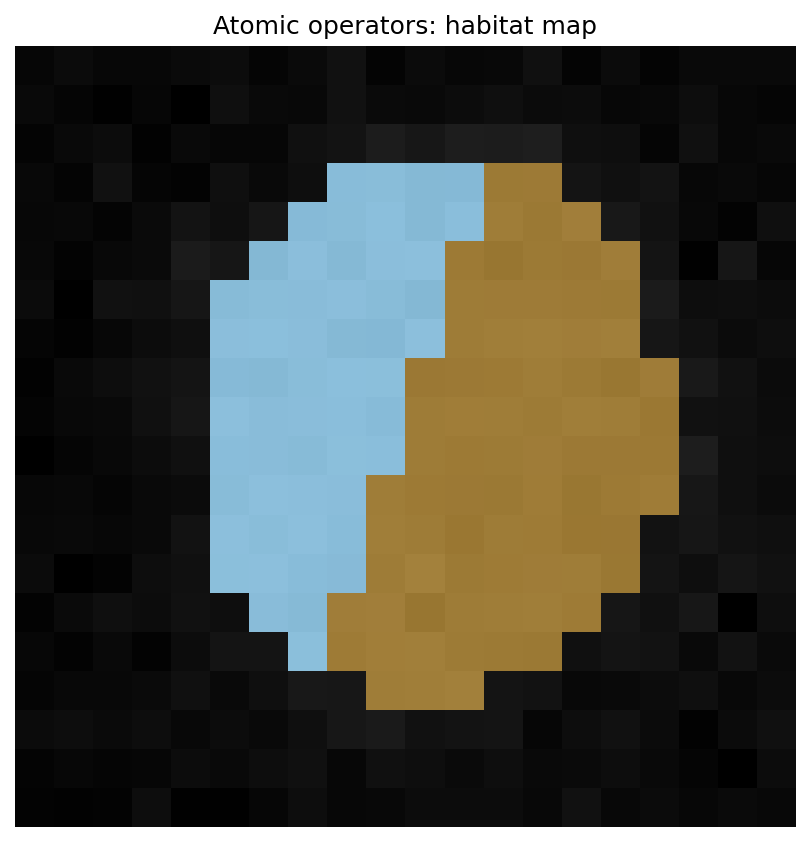

Atomic habitat operators (no YAML, no recipe)
=============================================

**Level:** atomic · **Data:** synthetic · **Extras:** none · **Time:** ~10–30 s

Every subject-level step is a single-argument callable. This is the
**embedding surface**: drop one operator into a notebook, a MONAI
``Dataset``, or another product. You do not need HABIT's directory
layout, YAML, a :class:`~habit.contracts.Cohort`, or
:meth:`~habit.recipes.Study.fit_predict`.

Beginners who just want a first habitat map: copy
:doc:`../tutorial/quickstart_python` first, then come here.

Concept and strategy choice: :doc:`../tutorial/habitat_analysis`.
Your own arrays: :doc:`data_from_arrays`. Parallel / fault tolerance
is an **optional outer layer** (:doc:`../tutorial/execution`).

Operators (call shapes)
-----------------------

Stop after any row and hand the object to your own code.

.. list-table::
   :header-rows: 1
   :widths: 24 28 24 24

   * - Operator
     - Call
     - Input
     - Output
   * - Voxel features
     - ``voxel(subject)``
     - :class:`~habit.contracts.Subject`
     - :class:`~habit.contracts.VoxelFeatureField`
   * - Supervoxels
     - ``svx(field)``
     - ``VoxelFeatureField``
     - :class:`~habit.contracts.Supervoxelization`
   * - Fit (cohort)
     - ``fitter.fit(units, cohort=...)``
     - list of units
     - :class:`~habit.contracts.HabitatModel`
   * - Assign
     - ``model.assigner()(units)``
     - units
     - :class:`~habit.contracts.HabitatMap`
   * - Pipeline
     - ``pipe(subject)``
     - ``Subject``
     - ``HabitatMap``
   * - Quantify
     - ``msi(subject, habitat_map)``
     - subject + map
     - :class:`~habit.contracts.FeatureTable`

Skip ``svx`` for one-step / direct-pooling (cluster voxels, or pool
voxels across the cohort). Skip ``fit`` when you already have a
``.habitatmodel``. Skip HABIT clustering entirely when you only want
MSI / graph / volume on a map you already hold.

Registered names and parameters:
:doc:`../how_to/habitat_components`. Protocol list:
:doc:`../api/domain_habitat`.

Fit-time vs apply-time
----------------------

* **Fit-time** pipeline: ``habitat_assigner=None`` —
  :meth:`~habit.domain.SubjectPipeline.units` works; ``__call__`` does
  not.
* **Apply-time** pipeline: bind ``model.assigner()`` — one callable
  labels any new :class:`~habit.contracts.Subject`.

The published pair is **model + the same extract / partition procedure**.
Changing upstream stages and reusing an old model is how labels look
right but are wrong.

Embed patterns
--------------

**1. One failing subject** (no ``Cohort``)::

   from habit.domain import RawVoxelFeatures, KMeansSupervoxelizer

   voxel = RawVoxelFeatures(modalities=["T1", "T2"])
   svx = KMeansSupervoxelizer(n_supervoxels=8, n_init=3)
   svx.set_random_state(7)
   field = voxel(subject)
   units = svx(field)

**2. Your arrays, no HABIT folders** — wrap NumPy / SimpleITK / MONAI
as :class:`~habit.contracts.Subject`, then call the same operators.
:doc:`data_from_arrays`.

**3. Only HABIT quantify** (you already have a
:class:`~habit.contracts.HabitatMap`)::

   from habit.domain import MsiHabitatFeatures, HabitatVolumeFeatures

   table = MsiHabitatFeatures()(subject, habitat_map)
   volume = HabitatVolumeFeatures()(subject, habitat_map)

Array-only graph topology:
:func:`~habit.extract_graph_features` (same definitions as the
``graph`` family).

**4. Apply a published model** — load the archive, rebuild the **same**
extract / partition operators, bind ``model.assigner()``::

   from habit import HabitatModel
   from habit.domain import SubjectPipeline

   model = HabitatModel.load("out/demo.habitatmodel")
   pipe = SubjectPipeline(voxel, svx, model.assigner())
   habitat_map = pipe(subject)

**5. Swap an algorithm without forking HABIT** —
``Registry.create("slic", n_supervoxels=50)`` or an entry-point plugin.
:doc:`habitat_custom_pipeline` · :doc:`plugin_entry_points`.

A backend is optional. One subject is ``pipe(subject)``. A small
cohort is ``cohort.map(pipe)``. Process pool and checkpoints:
:doc:`../tutorial/execution`.

Script
------

Classical two-step, operator by operator (synthetic cohort).

.. literalinclude:: scripts/habitat_atomic_ops_demo.py
   :language: python
   :start-after: # BEGIN example
   :end-before: # END example

Draw the figures
----------------

Paste this after the Script block (it uses ``subject0`` and
``habitat_map``). Writes ``out/habitat_atomic_overlay.png``.

.. literalinclude:: scripts/habitat_atomic_ops_demo.py
   :language: python
   :start-after: # BEGIN figures
   :end-before: # END figures

Run::

   python docs/source/examples/scripts/habitat_atomic_ops_demo.py

Output
------

Illustrative (synthetic cohort)::

   Cohort: 4 subjects -> ['subj001', 'subj002', 'subj003', 'subj004']
   HabitatMap[subj001]: habitats_present=[1, 2, 3]
   Wrote out/habitat_atomic_overlay.png

Figures
-------

Same scientific product as the two-step recipe, built operator-by-operator.

   ``SubjectPipeline(...)(subject)`` → habitat labels
   (:func:`~habit.viz.plot_habitat_overlay`).

What to read next
-----------------

* :doc:`../tutorial/habitat_analysis` — layers and strategy choice
* :doc:`data_from_arrays` — ``Subject`` from NumPy
* :doc:`habitat_custom_pipeline` — Registry.create / Spec stages
* :doc:`habitat_label_match` — remap ids across observers or patients
* :doc:`../tutorial/execution` — process pool, continue vs fail_fast
* :doc:`two_step_habitat` — same design via ``Study.fit_predict``
* :doc:`../api/domain_habitat` — protocols and registries
