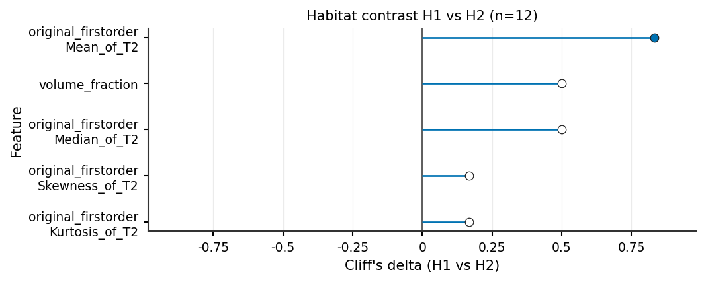

Habitat feature contrast (cohort or one subject)
================================================

**Level:** recipe / atomic · **Data:** synthetic stand-in table (swap
``table``) · **Extras:** ``[tables,viz]`` · **Time:** < 1 min

After an ``each_habitat`` (or any wide ``habitat_{id}_{feature}``) table,
:func:`~habit.compare_habitat_features` melts the wide block so you can
ask: for each feature, do habitats differ, and by how much?

This page builds a **synthetic** stand-in table (three habitats; first-order
Mean / Median / Energy / Kurtosis / Skewness, GLCM Contrast, plus
``volume_fraction``). Swap ``table`` for your ``each_habitat`` /
:func:`~habit.recipes.extract_habitat_features`
:class:`~habit.contracts.FeatureTable`. Then it draws the publication
figures. The default effect figure is the **features x pair** Cliff's
:math:`\delta` heatmap; pass ``pair=(a, b)`` to keep the single-pair
lollipop. When a table has dozens of features the heatmap keeps the
top-k by max :math:`|\delta|`. If that pair x feature heatmap would
still be too tall, compare habitats on a few CVA/PCA component scores
instead (:func:`~habit.viz.plot_habitat_feature_components`) -- the
same contrast, with CV1/PC1 as the "features". Bars are **one panel
per feature** (independent y-axis) so Energy and ``volume_fraction``
are not forced onto one linear scale.

``graph`` columns (``single_h*`` / ``pair_h*_h*``) can live on the same
joined :class:`~habit.contracts.FeatureTable`. They are subject-level
topology metrics and do **not** match ``habitat_{id}_{feature}``, so
:func:`~habit.to_habitat_feature_panel` ignores them. Contrast the wide
radiomics / volume block; inspect graph values as a separate table.

This is a software demo, not a clinical claim.

Script
------

Change the ``table`` construction (or load your extract). Figures land
under ``out/``.

.. literalinclude:: scripts/habitat_feature_compare_demo.py
   :language: python
   :start-after: # BEGIN example
   :end-before: # END example

Draw the figures
----------------

Paste this after the Script block (it uses ``cmp``). Writes
``out/habitat_feature_{heatmap_cohort,heatmap_subject,effect,effect_pair,components,violin,bars}.png``.

.. literalinclude:: scripts/habitat_feature_compare_demo.py
   :language: python
   :start-after: # BEGIN figures
   :end-before: # END figures

Run from the repository root (one line)::

   python docs/source/examples/scripts/habitat_feature_compare_demo.py

Output
------

Illustrative (12 synthetic subjects, three habitats, seven features)::

   12 subjects; 7 features
   Wrote habitat-feature contrast figures under out/

Figures
-------

Cohort / single-subject figures from the taught script (not a clinical
claim).

.. figure:: ../_static/images/examples/habitat_feature_heatmap_cohort.png
   :alt: Cohort mean habitat-by-feature heatmap
   :width: 520

   Cohort mean habitat x feature
   (:func:`~habit.viz.plot_habitat_feature_heatmap`, z-scored).

.. figure:: ../_static/images/examples/habitat_feature_heatmap_subject.png
   :alt: One-subject habitat feature heatmap
   :width: 520

   One-subject profile
   (:func:`~habit.viz.plot_habitat_feature_heatmap` with
   ``subject_id``).

.. figure:: ../_static/images/examples/habitat_feature_effect.png
   :alt: Features-by-pair Cliff's delta heatmap
   :width: 520

   Default effect figure: features x pair Cliff's delta
   (:func:`~habit.viz.plot_habitat_feature_effect` with no ``pair``).
   Starred cells are BH q < 0.05. With dozens of features the heatmap
   keeps the top-k by max :math:`|\delta|`. If that heatmap would be
   too tall, compare habitats on a few CVA/PCA components instead.

   Retained single-pair lollipop
   (:func:`~habit.viz.plot_habitat_feature_effect` with ``pair=(2, 1)``).

.. figure:: ../_static/images/examples/habitat_feature_components.png
   :alt: Habitat contrast on CVA component scores
   :width: 620

   Same contrast, shown on 2 CVA components (use this when there are
   dozens of features)
   (:func:`~habit.viz.plot_habitat_feature_components`, default
   ``method="cva"``). Each panel is how H1..Hk differ on that score;
   loadings name the original features those axes represent.

.. figure:: ../_static/images/examples/habitat_feature_violin.png
   :alt: Per-feature habitat distributions
   :width: 520

   Top-k distributions
   (:func:`~habit.viz.plot_habitat_feature_violin`).

.. figure:: ../_static/images/examples/habitat_feature_bars.png
   :alt: Per-feature habitat means with independent y-axes
   :width: 620

   Faceted bars, one panel per feature
   (:func:`~habit.viz.plot_habitat_feature_bars`).

What to read next
-----------------

* :doc:`../reference/features/whole_each_habitat` — ``each_habitat`` /
  ``whole_habitat`` column layout
* :doc:`graph_features` — graph topology extract + 2D/3D figures
* :doc:`../how_to/extract_features` — YAML / CLI extract (``graph`` is
  now in the default light ``feature_types``)
* :doc:`../api/domain_habitat` — domain extractors and the contrast API
