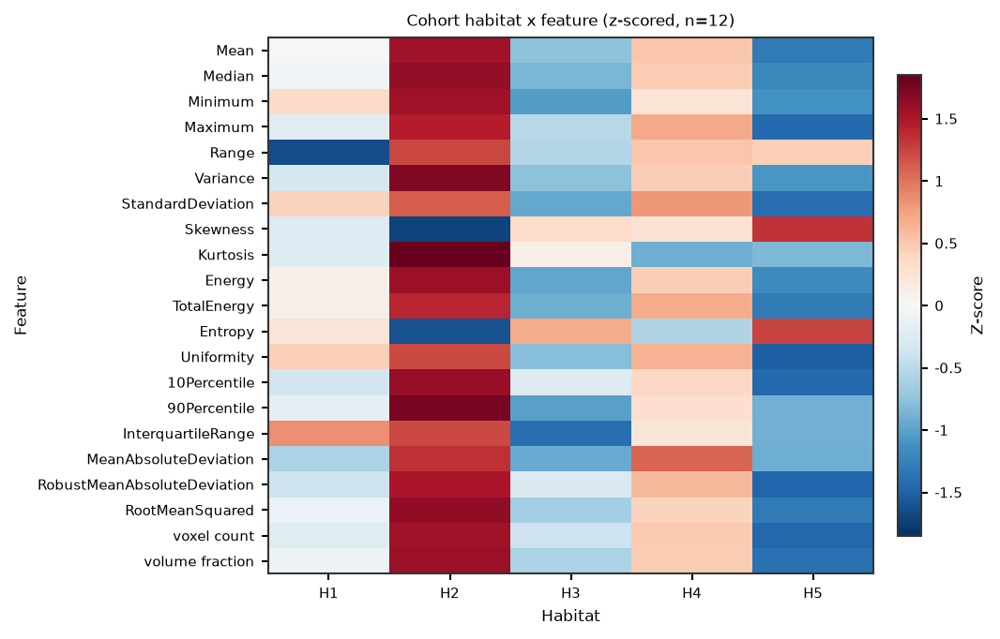
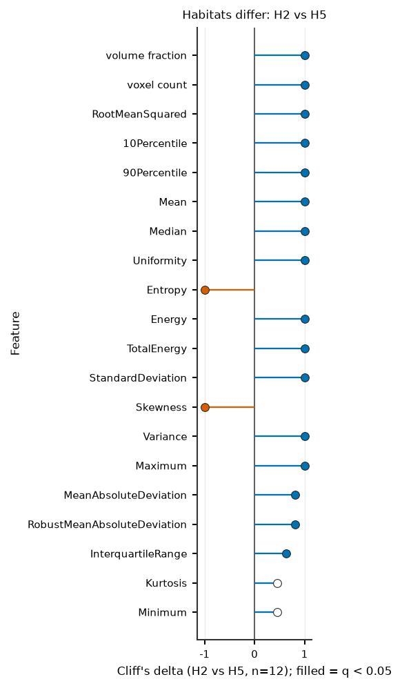
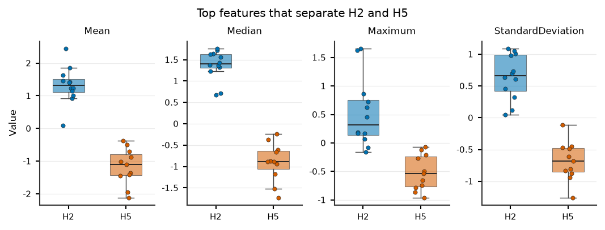
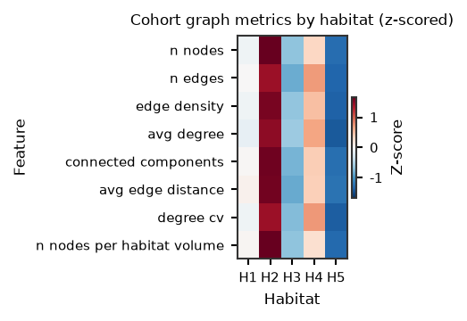
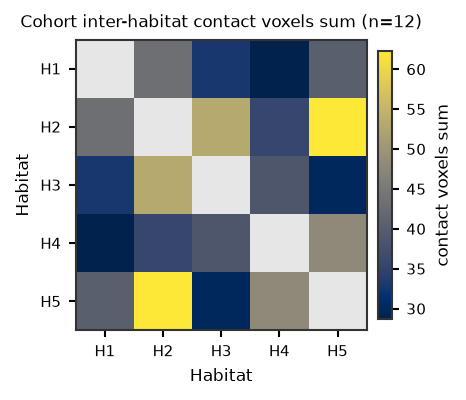
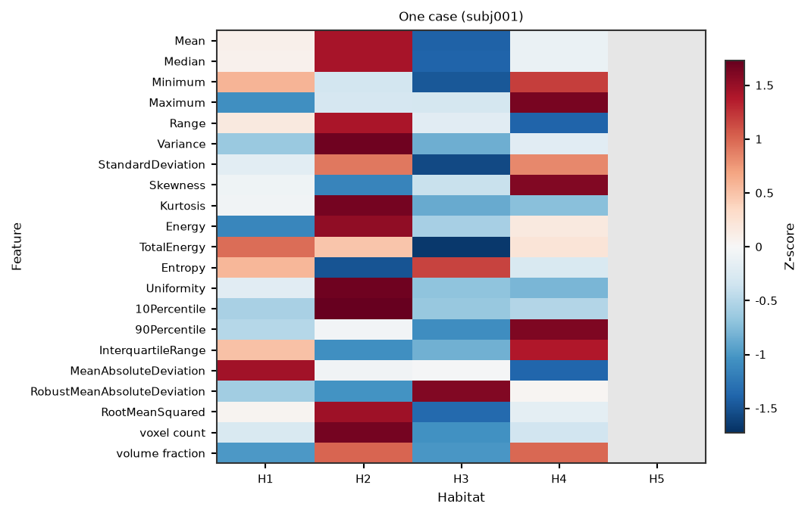

Habitat feature contrast (cohort first)
=======================================

**Level:** recipe / atomic · **Data:** ``demo_data`` · **Extras:**
``[tables,viz]`` + ``pyradiomics`` · **Time:** ~5–8 min (up to 5
subjects; first NRRD load dominates)

After habitat maps exist, ``each_habitat`` (and ``volume``) store one row
per subject with wide columns ``habitat_{id}_{feature}``. Reviewers
need the opposite view: **different habitats are genuinely different
and interpretable**. The cohort is the claim; one subject is a profile.

This page loads **real** ``demo_data/preprocessed`` images and existing
``demo_data/results/habitat_two_step/*_habitats.nrrd`` maps (the
get-habitat demo output). It crops each pair to the habitat foreground
(full-FOV demo volumes are large; the crop is in the taught script, not
a hidden helper), then extracts a **first-order** ``each_habitat`` bank
plus ``volume`` and the default ``graph`` family. Two melts feed the
same contrast API:

* :func:`~habit.to_habitat_feature_panel` — ``habitat_{id}_{feature}``
* :func:`~habit.to_graph_habitat_panel` — ``single_h{id}_{metric}``

Pair columns ``pair_h*_h*`` stay on the joined table and are drawn with
:func:`~habit.viz.plot_habitat_graph_pair_matrix` (a habitat is not a
pair with itself; missing pairs stay NaN, not zero).

This is a software demo, not a clinical claim.

Script
------

Change ``DATA`` / ``MAPS`` / ``MODALITIES`` / ``ROI`` (and ``N_SUBJECTS``)
to your preprocessed tree and get-habitat output. Figures land under
``out/``.

.. literalinclude:: scripts/habitat_feature_compare_demo.py
   :language: python
   :start-after: # BEGIN example
   :end-before: # END example

Draw the figures
----------------

Paste this after the Script block (it uses ``comparison``,
``graph_comparison``, ``table``, ``pair``, and ``subject_id``). Writes
``out/habitat_feature_compare_*.png``. The three required reviewer
figures are the cohort heatmap, the ranked Cliff's delta forest, and
the top-feature distributions. Graph figures use the same claim
(habitats differ) on topology. The last heatmap is one case.

.. literalinclude:: scripts/habitat_feature_compare_demo.py
   :language: python
   :start-after: # BEGIN figures
   :end-before: # END figures

Run from the repository root (one line)::

   python docs/source/examples/scripts/habitat_feature_compare_demo.py

Output
------

Illustrative (demo subjects, first-order ``each_habitat`` + ``volume`` +
default ``graph``). The committed PNGs were written by the taught
``plot_*`` calls in the figures block. Re-run the script when
``demo_data/preprocessed`` and the habitat maps are present::

   Subjects: ['subj001', ...]; habitats 1..5
   Joined table: N rows x hundreds of columns (wide habitat_* + graph)
   Panel: N subjects, habitats=(1, 2, 3, 4, 5), features=21
   Cohort contrast: n=N, paired=True, effect=cliffs_delta, strongest pair=H? vs H?
   Graph panel: N subjects, features=...; pair columns remain on the wide table

Figures
-------

Cohort figures first (the claim). Graph figures are the same claim on
topology. The last panel is one case, not the cohort result. Not a
clinical claim.

   Figure 1. Cohort habitat x feature (z-scored)
   (:func:`~habit.viz.plot_habitat_feature_heatmap`). Features are rows;
   missing cells stay grey (NaN), not zero.

   Figure 2. Ranked paired Cliff's delta for the strongest pair
   (:func:`~habit.viz.plot_habitat_feature_effect`). Filled = BH
   :math:`q < 0.05`; open = not significant or untested.

   Figure 3. Distributions of the top contrasting features for that pair
   (:func:`~habit.viz.plot_habitat_feature_violin`, ``kind='box'``).

   Graph node metrics by habitat
   (:func:`~habit.to_graph_habitat_panel` then
   :func:`~habit.viz.plot_habitat_feature_heatmap`).

   Inter-habitat contact
   (:func:`~habit.viz.plot_habitat_graph_pair_matrix`). Diagonal and
   missing pairs are NaN.

   One case
   (:func:`~habit.viz.plot_habitat_feature_heatmap` with
   ``subject_id``). Secondary to the cohort figures.

What to read next
-----------------

* :doc:`../reference/features/whole_each_habitat` — ``each_habitat`` /
  ``whole_habitat`` column layout
* :doc:`graph_features` — graph topology extract + 2D/3D figures
* :doc:`../how_to/extract_features` — YAML / CLI extract (``graph`` is
  now in the default light ``feature_types``)
* :doc:`../api/domain_habitat` — domain extractors and the contrast API
