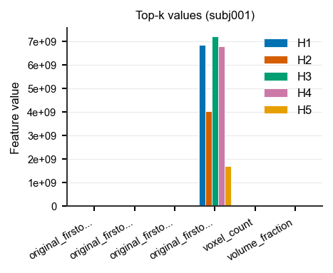

Habitat feature contrast (cohort or one subject)
================================================

**Level:** recipe / atomic · **Data:** ``demo_data`` · **Extras:**
``[tables,viz]`` + ``pyradiomics`` · **Time:** ~5 min (3 subjects;
first NRRD load dominates)

After habitat maps exist, ``each_habitat`` (and ``volume``) store one row
per subject with wide columns ``habitat_{id}_{feature}``. Reviewers
typically need the opposite view: for each feature, do habitats differ,
and by how much?

This page loads **real** ``demo_data/preprocessed`` images and existing
``demo_data/results/habitat_two_step/*_habitats.nrrd`` maps (the
get-habitat demo output). It crops each pair to the habitat foreground
(full-FOV demo volumes are large; the crop is in the taught script, not
a hidden helper), then extracts a **small first-order** ``each_habitat``
bank plus the default ``graph`` family on the first three subjects
(paired tests need :math:`n \ge 3`; the full demo cohort is five). Then
it melts the wide block and draws the publication figures.

``graph`` columns (``single_h*`` / ``pair_h*_h*``) live on the **same**
joined :class:`~habit.contracts.FeatureTable`. They are subject-level
topology metrics (per habitat and per habitat pair) and do **not** match
``habitat_{id}_{feature}``, so :func:`~habit.to_habitat_feature_panel`
ignores them. Contrast the wide radiomics / volume block; inspect graph
values as a separate table. Do not force topology metrics into a fake
wide schema.

This is a software demo, not a clinical claim.

Script
------

Change ``DATA`` / ``MAPS`` / ``MODALITIES`` / ``ROI`` (and ``N_SUBJECTS``)
to your preprocessed tree and get-habitat output. Figures land under
``out/``.

.. literalinclude:: scripts/habitat_feature_compare_demo.py
   :language: python
   :start-after: # BEGIN example
   :end-before: # END example

Draw the figures
----------------

Paste this after the Script block (it uses ``comparison`` and
``subject_id``). Writes ``out/habitat_feature_compare_*.png``.

.. literalinclude:: scripts/habitat_feature_compare_demo.py
   :language: python
   :start-after: # BEGIN figures
   :end-before: # END figures

Run from the repository root (one line)::

   python docs/source/examples/scripts/habitat_feature_compare_demo.py

Output
------

Illustrative (three demo subjects, first-order ``each_habitat`` + default
``graph`` + ``volume``)::

   Subjects: ['subj001', 'subj002', 'subj003']; habitats 1..5
   Joined table: 3 rows x 848 columns (35 wide habitat_*, 805 graph)
   Panel: 3 subjects, habitats=(1, 2, 3, 4, 5), features=7
   Cohort contrast: n=3, paired=True, effect=cliffs_delta
   Top absolute-effect features: original_firstorder_Mean_of_LAP, ...

Figures
-------

Cohort / single-subject figures from the demo slice (not a clinical
claim).

.. figure:: ../_static/images/examples/habitat_feature_compare_heatmap.png
   :alt: Cohort mean habitat-by-feature heatmap
   :width: 520

   Cohort mean habitat x feature
   (:func:`~habit.viz.plot_habitat_feature_heatmap`, z-scored).

.. figure:: ../_static/images/examples/habitat_feature_compare_effect.png
   :alt: Cliff's delta effect-size forest
   :width: 420

   Ranked Cliff's delta
   (:func:`~habit.viz.plot_habitat_feature_effect`).

.. figure:: ../_static/images/examples/habitat_feature_compare_violin.png
   :alt: Top-k habitat feature violins
   :width: 520

   Top-k distributions
   (:func:`~habit.viz.plot_habitat_feature_violin`).

.. figure:: ../_static/images/examples/habitat_feature_compare_subject_heatmap.png
   :alt: One-subject habitat feature heatmap
   :width: 520

   One-subject profile
   (:func:`~habit.viz.plot_habitat_feature_heatmap` with
   ``subject_id``).

   One-subject top-k bars
   (:func:`~habit.viz.plot_habitat_feature_bars`).

What to read next
-----------------

* :doc:`../reference/features/whole_each_habitat` — ``each_habitat`` /
  ``whole_habitat`` column layout
* :doc:`graph_features` — graph topology extract + 2D/3D figures
* :doc:`../how_to/extract_features` — YAML / CLI extract (``graph`` is
  now in the default light ``feature_types``)
* :doc:`../api/domain_habitat` — domain extractors and the contrast API
