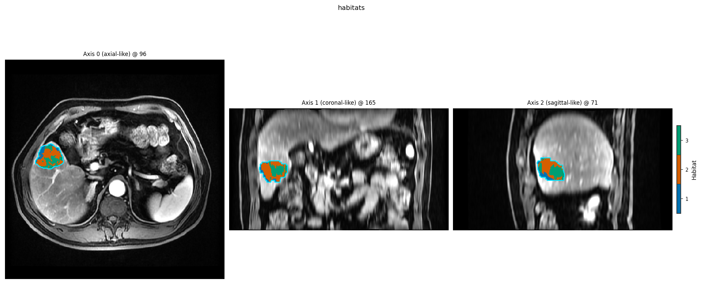

Habitat feature routes (raw, concat, radiomics, SLIC)
=====================================================

Before preprocessing chains run, voxels must be **described**. v1 selects
the route through ``HabitatSpec.voxel_feature_extractor`` (and optionally
``supervoxel_feature_extractor``):

.. list-table::
   :header-rows: 1
   :widths: 25 75

   * - Route
     - Role
   * - ``raw``
     - Concatenate modality intensities inside the ROI (fastest; synthetic demos)
   * - ``concat``
     - Join heterogeneous families (e.g. ``raw("T1")`` + ``voxel_radiomics("T2")``);
       see :doc:`../how_to/habitat_components` section 1B
   * - ``expression``
     - Restricted arithmetic over modalities (ratios, powers, ``square`` / ``log``);
       see :doc:`custom_voxel_features`
   * - ``voxel_radiomics``
     - Per-voxel PyRadiomics texture (needs ``demo_data/`` + PyRadiomics)
   * - ``supervoxel_radiomics``
     - Texture of each supervoxel region (two-step; ``supervoxel_feature_extractor``)
   * - ``slic`` (supervoxelizer)
     - Spatially coherent supervoxels instead of k-means over features

Every route supports **batch** (``recipes.Study(spec=spec).fit_predict(cohort)``;
two-step sugar or stages) and **atomic** inspection via
:func:`~habit.domain.assembly.build_habitat_components` — attribute names
match the Spec (``components.voxel_feature_extractor``,
``components.supervoxel_feature_extractor``, …) and
``components.pipeline(assigner=None).units(subject)``.

Script
------

.. literalinclude:: scripts/habitat_feature_routes_demo.py
   :language: python
   :start-after: # BEGIN example
   :end-before: # END example

Draw the figures
----------------

Paste this after the Script block (it uses ``subject``, ``m0``, and
``raw_result``). Writes ``out/habitat_feature_routes_overlay.png``.

.. literalinclude:: scripts/habitat_feature_routes_demo.py
   :language: python
   :start-after: # BEGIN figures
   :end-before: # END figures

Output (abbreviated)
--------------------

::

   === raw(modalities) ===
     atomic n_features: 3
     batch: 2 maps, 3 habitats

   === concat(raw, raw) per modality ===
     atomic n_features: 2
     batch: 2 maps

   === supervoxelizer: slic ===
     batch: 2 maps, 3 habitats

   === voxel_radiomics (demo_data, may take ~30s) ===
     atomic n_features: 21
     batch (1 subject): 3 habitats

The script ends with a **napari eye-check**. ``HABIT_NO_VIEW=1`` skips it.

Figures
-------

Each route still ends in habitat maps. Overlay from the ``raw`` route in
this demo:

   Habitats after ``Study(...).fit_predict`` with ``raw`` intensities
   (:func:`~habit.viz.plot_habitat_overlay`).

What to read next
-----------------

* :doc:`../how_to/habitat_components` — leaf vs tree; Python / YAML twins
* :doc:`feature_composition` — worked ``concat`` / ``ratio`` / ``as_`` trees
* :doc:`habitat_preprocessing` — winsorize / zscore / binning chains
* :doc:`two_step_habitat` — end-to-end two-step workflow
* ``config/habitat/config_habitat_two_step_voxel_radiomics_*.yaml`` — YAML twins
