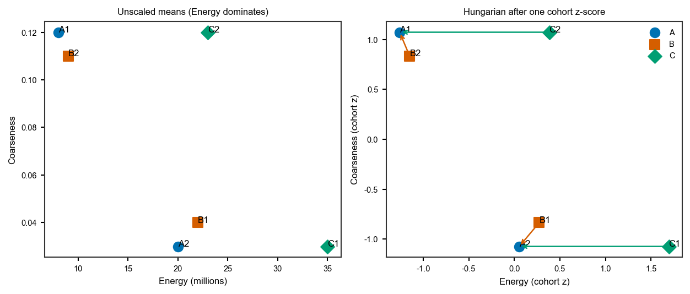

Match habitat ids (observers vs patients)
=========================================

**Level:** atomic ? **Data:** synthetic ? **Extras:** none ? **Time:** <5 s

Independently clustered maps permute integer ids. HABIT has two matchers
that must not be mixed:

* **Same tumour, different observers** ? voxels overlap. Use
  ``method="overlap"``. After matching, per-habitat Dice needs that
  assignment; :func:`~habit.kernels.habitat_label_match.adjusted_rand_index`
  is the matching-free, chance-corrected partition score (Hubert-Arabie
  ARI) on jointly labelled voxels.
* **Different patients** ? no shared grid. Use unscaled habitat texture
  means, one **cohort** z-score, then Hungarian
  (:func:`~habit.kernels.habitat_label_match.match_labels_by_features`).

Do **not** Hungarian on per-tumour MinMax / z-score cluster centres:
those axes change when one tumour's own min/max change.

When both matchers are on (inter-observer study + modelling table),
the order is fixed:

1. Per-tumour clustering (local scale is allowed here only).
2. Observer match onto physician 2 (overlap).
3. Cross-patient match of **physician-2** habitats onto an atlas
   (unscaled means + locked cohort z-score).
4. Other observers **inherit** the physician-2 ? atlas map. Do not
   atlas-match each observer independently.

Script
------

.. literalinclude:: scripts/habitat_label_match_demo.py
   :language: python
   :start-after: # BEGIN example
   :end-before: # END example

Draw the figures
----------------

Paste this after the Script block (it uses ``PATIENTS``, ``mappings``,
``location``, and ``scale``). Writes ``out/habitat_label_match.png``.

.. literalinclude:: scripts/habitat_label_match_demo.py
   :language: python
   :start-after: # BEGIN figures
   :end-before: # END figures

Run::

   python docs/source/examples/scripts/habitat_label_match_demo.py

Output
------

Illustrative (synthetic numbers)::

   Unscaled habitat means (Energy, Coarseness)
     A id1=[8000000.0, 0.12]  id2=[20000000.0, 0.03]
     B id1=[22000000.0, 0.04]  id2=[9000000.0, 0.11]
     C id1=[35000000.0, 0.03]  id2=[23000000.0, 0.12]
   Cohort z-score fit on all 6 rows:
     mean=[19500000.0, 0.075]
     std =[9142392.1..., 0.04193...]
     B -> A  {1: 2, 2: 1}
     C -> A  {1: 2, 2: 1}
   Observer overlap mapping (same tumour): {1: 2, 2: 1}
   Observer ids after inheriting B->A: {1: 1, 2: 2}

Figures
-------

Left: raw Energy dwarfs Coarseness. Right: the same six rows after
**one** cohort z-score; arrows are the Hungarian pairs onto atlas A.

   :func:`~habit.kernels.habitat_label_match.fit_feature_match_scale`
   then :func:`~habit.kernels.habitat_label_match.match_labels_by_features`
   with locked ``location`` / ``scale``. Same PNG as the script above.

What to read next
-----------------

* :doc:`habitat_atomic_ops` ? clustering operators these ids come from
* :doc:`precise_features` ? same-image ``align_habitat_map`` (centroid / overlap)
* :doc:`../api/kernels` ? kernel signatures
