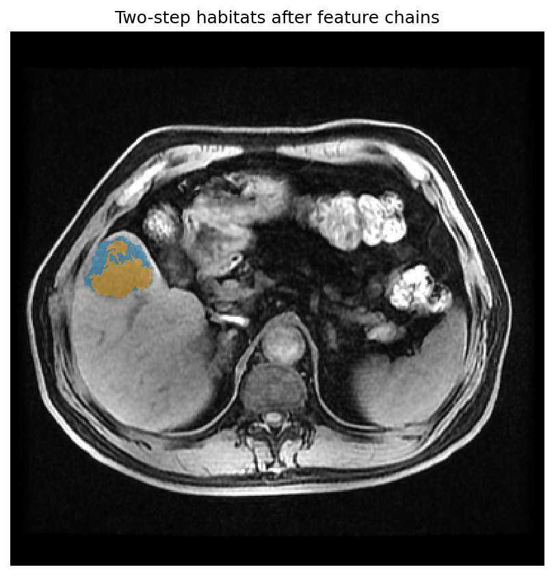

Feature chains
==============

Clustering operates on **preprocessed feature matrices**, not raw
intensities. ``HabitatSpec`` exposes three ordered chains:

.. list-table::
   :header-rows: 1
   :widths: 45 55

   * - HabitatSpec field
     - When it runs
   * - ``voxel_feature_preprocessors``
     - Per subject, on voxel features **before** supervoxels / units form
   * - ``supervoxel_feature_preprocessors``
     - Per subject, on supervoxel features **after** supervoxelization
   * - ``cohort_feature_preprocessors``
     - Fitted once on pooled training rows; replayed at apply

.. literalinclude:: scripts/habitat_preprocessing_demo.py
   :language: python
   :start-after: # BEGIN example
   :end-before: # END example

.. literalinclude:: scripts/habitat_preprocessing_demo.py
   :language: python
   :start-after: # BEGIN figures
   :end-before: # END figures

   Two-step with voxel + supervoxel + cohort chains
   (:func:`~habit.viz.plot_habitat_overlay`).

**Next:** :doc:`habitat_recipes`
