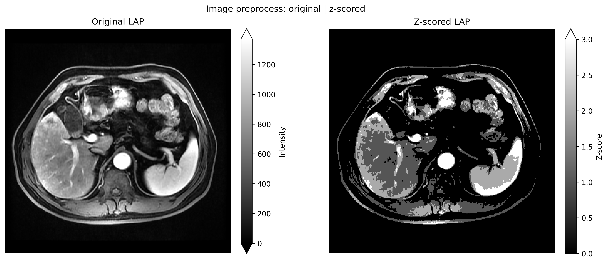

Image preprocessing API (batch + atomic)
========================================

**Level:** atomic / recipe · **Data:** ``demo_data/preprocessed`` ·
**Extras:** none · **Time:** ~1–4 min

Public symbols:

* :func:`~habit.run_preprocess` / recipe :func:`~habit.recipes.preprocess_images`
  — **batch** directory pipeline (``data_dir`` → ``processed_images/``).
* :func:`~habit.preprocess_subject` — **atomic** subject-level operator
  (``Subject`` in → ``Subject`` out; no YAML, no filesystem).
* :func:`~habit.preprocess_image` — **atomic** single-volume operator
  (:class:`~habit.ImageVolume` in → ``ImageVolume`` out).

The atomic surfaces satisfy the embedding red line: a third-party notebook
can call ``preprocess_subject(cohort[0], steps)`` on one failing case without
accepting HABIT's directory conventions.

Steps use the same ordered mapping shape as the YAML ``preprocessing:``
block (``resample``, ``zscore_normalization``, ``n4_correction``, …).

Script
------

Change ``DATA`` / ``MODALITIES`` / ``ROI`` to your preprocessed tree.

.. literalinclude:: scripts/image_preprocessing_api_demo.py
   :language: python
   :start-after: # BEGIN example
   :end-before: # END example

Coverage
--------

Exercised by ``demo_data/results/api/run_api_coverage.py`` step
``01_preprocess`` (batch under ``01_preprocess/batch/`` plus in-memory
atomic checks).

Output
------

::

   === Atomic: preprocess_subject (in-memory) ===
     subj001: shape=(...), spacing=(2.0, 2.0, 2.0)
   === Atomic: preprocess_image (single volume) ===
     single volume spacing=(2.0, 2.0, 2.0)
   === Batch: preprocess_images (directory pipeline) ===
     written files≈...

Figures
-------

   :func:`~habit.viz.plot_intensity_slice` after
   :func:`~habit.preprocess_subject` (z-score; same grid, greyscale,
   whole FOV) on ``subj001`` LAP. Independent colorbars show raw
   intensity versus z-score.

Atomic steps (copy, swap DATA)
------------------------------

Each registered preprocessor is one mapping key. The snippets below are
the runnable blocks from
``docs/source/examples/scripts/image_preprocessing_steps_demo.py``
(same ``DATA`` / ``MODALITIES`` / ``ROI`` load). YAML field reference:
:doc:`../configuration/preprocessing`.

``dcm2nii`` is a **file** converter (CLI), not an in-memory volume operator
— see :doc:`../how_to/preprocess`.

**Load** (one subject from the preprocessed tree)::

   # Change DATA / MODALITIES / ROI to your preprocessed layout
   DATA = "demo_data/preprocessed"
   MODALITIES = ("LAP",)
   ROI = "LAP"

   cohort = cohort_from_directory(DATA, modalities=MODALITIES, roi=ROI)[:1]
   subject = cohort[0]
   modality = MODALITIES[0]

**Resample** (target spacing in mm; masks use nearest neighbour):

.. literalinclude:: scripts/image_preprocessing_steps_demo.py
   :language: python
   :start-after: # BEGIN resample
   :end-before: # END resample

.. figure:: ../_static/images/examples/preprocess_resample.png
   :alt: Whole-volume resampled LAP (greyscale)
   :width: 520

   Resample to 2 mm isotropic (``subj001`` LAP). Whole-image geometry
   step: the figure is the full FOV, not an ROI panel.

**Z-score** (per-volume intensity; optional ROI stats):

.. literalinclude:: scripts/image_preprocessing_steps_demo.py
   :language: python
   :start-after: # BEGIN zscore
   :end-before: # END zscore

.. figure:: ../_static/images/examples/preprocess_zscore.png
   :alt: Original beside whole-volume z-scored LAP
   :width: 720

   Whole-volume z-score. Mean/std may be estimated inside the ROI
   (``only_inmask=True``); the transform is still applied to the full
   image. Independent colorbars show raw intensity versus z-score
   (native units, not a shared :math:`[0, 1]` window). Optional
   ``clip_values`` (for example ``[-3, 3]``) is a separate intensity
   clip after the affine map.

**N4 bias-field correction** (SimpleITK N4):

.. literalinclude:: scripts/image_preprocessing_steps_demo.py
   :language: python
   :start-after: # BEGIN n4
   :end-before: # END n4

.. figure:: ../_static/images/examples/preprocess_n4.png
   :alt: Original beside whole-volume N4-corrected LAP
   :width: 720

   N4 correction on the full volume. Independent colorbars show the
   intensity scale. On MRI with a real bias field this is the
   intensity-homogeneity step of the literature chain (N4 → register →
   resample → z-score).

**Histogram standardization** (Nyúl landmarks → ``[target_min, target_max]``):

.. literalinclude:: scripts/image_preprocessing_steps_demo.py
   :language: python
   :start-after: # BEGIN histogram
   :end-before: # END histogram

.. figure:: ../_static/images/examples/preprocess_histogram.png
   :alt: Original beside whole-volume histogram-standardized LAP
   :width: 720

   Percentile landmarks mapped to 0–100 on the full volume. Independent
   colorbars show original units versus the mapped range.

**Adaptive histogram equalization**:

.. literalinclude:: scripts/image_preprocessing_steps_demo.py
   :language: python
   :start-after: # BEGIN clahe
   :end-before: # END clahe

.. figure:: ../_static/images/examples/preprocess_clahe.png
   :alt: Original beside whole-volume adaptive histogram equalization
   :width: 720

   Local contrast (CLAHE-style) on the full volume. Independent colorbars
   show the intensity scale. Use when the scientific question needs local
   contrast, not when you still need quantitative MRI units.

**Reorientation** (canonical axis code; ``closest`` = flip/permute only):

.. literalinclude:: scripts/image_preprocessing_steps_demo.py
   :language: python
   :start-after: # BEGIN reorient
   :end-before: # END reorient

.. figure:: ../_static/images/examples/preprocess_reorient.png
   :alt: Whole-volume RAS-reoriented LAP (greyscale)
   :width: 520

   Reorient to RAS. ``strict`` additionally resamples; ``closest`` does not
   interpolate intensities. Whole-image geometry: no ROI crop.

**Registration** (SimpleITK affine here; ANTs SyN needs ``habit[registration]``):

.. literalinclude:: scripts/image_preprocessing_steps_demo.py
   :language: python
   :start-after: # BEGIN registration
   :end-before: # END registration

.. figure:: ../_static/images/examples/preprocess_register.png
   :alt: Original beside registered LAP with ROI contour overlay
   :width: 720

   Affine registration onto the fixed modality. Cyan contour: the ROI after
   the **same** transform (overlay on anatomy, not a standalone ROI panel).
   Multi-modal MRI in the bundled demo is often already on one grid; the
   call is still the embedding-API shape. Deformable SyN:
   ``backend='ants'`` after ``pip install habit[registration]``.

These image steps are **not** the clustering-time
``winsorize`` / ``minmax`` chain. Mixing the two silently changes the
habitat definition — see :doc:`habitat_preprocessing`.

What to read next
-----------------

* :doc:`habitat_fit_modes` — habitat modes on a processed cohort
* :doc:`habitat_preprocessing_api` — clustering **feature** chains
  (different domain: voxel/supervoxel matrices, not images)
* :doc:`../configuration/preprocessing` — every preprocessor module
