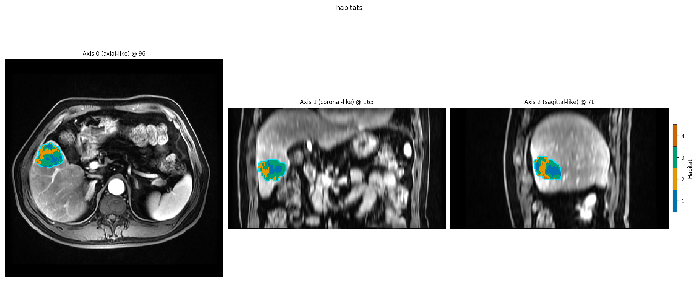
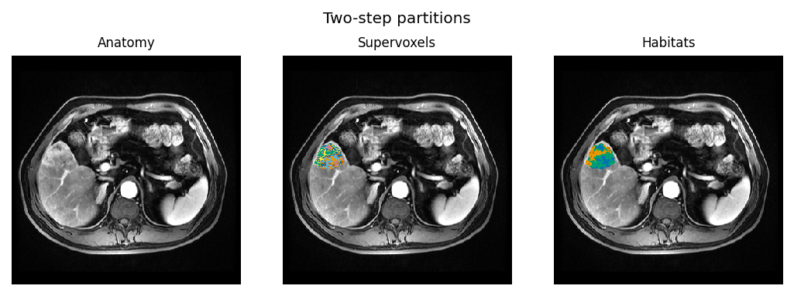

Examples
========

Runnable Python scripts with captured narrative. Prefer the How-to chapter for
**YAML + demo_data** operators; this gallery is the **Python API** surface.

Habitat examples load ``demo_data/preprocessed`` via
:func:`~habit.cohort_from_directory`. Edit ``DATA`` / ``MODALITIES`` / ``ROI``
(and ``out/`` paths) to point at your own preprocessed tree — same layout.
Those three knobs are documented in :doc:`../how_to/prepare_data` Option C;
the folder tree is Option B (``images/<sid>/<mod>/...``,
``masks/<sid>/<roi>/...``). Path-list YAML (Option A) is the CLI twin when
files are scattered — keep modality keys identical to ``MODALITIES``.
``demo_data/preprocessed`` is only the stand-in; swap ``DATA`` and re-run.

Fastest habitat start::

   python docs/source/examples/scripts/two_step_habitat_quickstart.py

Habitat examples that open a viewer end with a **napari eye-check**. Close the
window to continue; ``HABIT_NO_VIEW=1`` skips GUI. For 3D, load image +
``*_habitats`` in ITK-SNAP / 3D Slicer / SimpleITK.

**Habitat analysis is the core** — read :doc:`habitat_analysis_overview` for the
recipe → atomic → custom layering before diving into individual pages.

   Two-step habitats on ``demo_data/preprocessed``. Regenerated by
   ``python docs/source/examples/scripts/two_step_habitat_quickstart.py``.

Page badges: **Level** (recipe / atomic / custom / shell), **Data**
(synthetic / demo_data / none), **Extras**, approximate **Time**.

Scripts live in ``docs/source/examples/scripts/``. Lightweight smoke
(PowerShell)::

   $env:HABIT_NO_VIEW = "1"
   python docs/source/examples/scripts/_smoke_examples.py

.. toctree::
   :maxdepth: 1
   :hidden:

   data_from_arrays
   image_preprocessing
   image_preprocessing_api
   habitat_analysis_overview
   two_step_habitat
   one_step_habitat
   direct_pooling_habitat
   habitat_fit_modes
   apply_saved_model
   habitat_atomic_ops
   habitat_custom_pipeline
   voxel_texture
   feature_composition
   habitat_feature_routes
   habitat_preprocessing
   habitat_preprocessing_api
   precise_features
   custom_voxel_features
   graph_features
   habitat_feature_compare
   feature_extraction
   features_radiomics_api
   tabular_ml
   tabular_ml_api
   ml_advanced
   visualization
   viz_parallel_extras_api
   persistence
   provenance_methods
   parallel_execution
   fault_tolerance
   plugin_entry_points
   run_from_yaml
   cli_yaml_workflows
   cohort_plugins_auxiliary

.. rubric:: Gallery map

Reading order matches Sphinx **Next** / **Previous** and the sidebar (single
flat ``toctree`` above — no nested TOC groups). Featured cards are links only;
rubrics below are visual labels and do not create sidebar levels.

.. rubric:: Featured: habitat-core figures

Recipes write publication figures for overlays, two-step triptychs, volume /
MSI / ITH, auto-K curves, and train–predict compare. Start at
:doc:`two_step_habitat` or the suite in :doc:`visualization`.

   Partition triptych from :doc:`two_step_habitat`.

.. rubric:: Featured: graph features from habitat maps

One subject → one-step habitats → built-in **graph** topology features and
publication figures.

* How-to (YAML / CLI / API): :doc:`../how_to/graph_features`
* Runnable example + gallery: :doc:`graph_features`
* Column reference: :doc:`../reference/features/graph`

.. figure:: ../_static/images/examples/graph_habitat_slice_2d.png
   :alt: One-step habitat overlay used by the graph features example
   :width: 420
   :target: graph_features.html

   Habitat overlay from :doc:`graph_features`.

.. rubric:: Featured: habitat-feature contrast

Melt a wide ``each_habitat`` table and contrast habitats (heatmap,
features x pair Cliff's delta, CVA/PCA component contrast when the
heatmap is too tall, violin, **faceted** bars with
one y-axis per feature).
``graph`` topology columns can stay on the same table and do not enter
the melt.

* How-to (YAML / CLI): :doc:`../how_to/extract_features`
* Runnable example + gallery: :doc:`habitat_feature_compare`
* Column reference: :doc:`../reference/features/whole_each_habitat`

.. figure:: ../_static/images/examples/habitat_feature_heatmap_cohort.png
   :alt: Cohort mean habitat-by-feature heatmap from the contrast example
   :width: 420
   :target: habitat_feature_compare.html

   Cohort heatmap from :doc:`habitat_feature_compare`.

.. rubric:: Featured: voxel texture maps

Voxel-level **texture** (local entropy + a small GLCM set via
``voxel_radiomics``) overlaid on greyscale anatomy: opaque colours inside
the ROI, optional cyan contour.

* How-to: :doc:`../how_to/voxel_texture`
* Runnable example + gallery: :doc:`voxel_texture`

.. figure:: ../_static/images/examples/voxel_texture_overlay.png
   :alt: Opaque local-entropy overlay on greyscale anatomy
   :width: 420
   :target: voxel_texture.html

   Local-entropy overlay from :doc:`voxel_texture`.

.. rubric:: All examples (flat)

* :doc:`data_from_arrays` — data and cohorts
* :doc:`image_preprocessing` — batch image preprocessing
* :doc:`image_preprocessing_api` — image preprocessing API
* :doc:`habitat_analysis_overview` — habitat analysis overview
* :doc:`two_step_habitat` — two-step habitat
* :doc:`one_step_habitat` — one-step habitat
* :doc:`direct_pooling_habitat` — direct-pooling habitat
* :doc:`habitat_fit_modes` — habitat fit modes
* :doc:`apply_saved_model` — apply a saved model
* :doc:`habitat_atomic_ops` — atomic habitat operators
* :doc:`habitat_custom_pipeline` — custom habitat pipeline
* :doc:`voxel_texture` — local entropy + GLCM maps; anatomy + ROI contour plots
* :doc:`feature_composition` — feature composition
* :doc:`habitat_feature_routes` — habitat feature routes
* :doc:`habitat_preprocessing` — habitat preprocessing
* :doc:`habitat_preprocessing_api` — habitat preprocessing API
* :doc:`precise_features` — precise features
* :doc:`custom_voxel_features` — custom voxel features
* :doc:`graph_features` — graph topology; one-step → extract → 2D/3D figures
* :doc:`habitat_feature_compare` — each_habitat contrast figures (heatmap / pair-delta / CVA components / violin / faceted bars)
* :doc:`feature_extraction` — light families + radiomics extract recipes
* :doc:`features_radiomics_api` — radiomics features API
* :doc:`tabular_ml` — tabular ML
* :doc:`tabular_ml_api` — tabular ML API
* :doc:`ml_advanced` — advanced ML
* :doc:`visualization` — visualization
* :doc:`viz_parallel_extras_api` — viz / parallel extras API
* :doc:`persistence` — persistence
* :doc:`provenance_methods` — provenance / methods text
* :doc:`parallel_execution` — parallel execution
* :doc:`fault_tolerance` — fault tolerance
* :doc:`plugin_entry_points` — plugin entry points
* :doc:`run_from_yaml` — run from YAML
* :doc:`cli_yaml_workflows` — CLI / YAML workflows
* :doc:`cohort_plugins_auxiliary` — cohort, plugins, Dice / ICC / DICOM helpers, config check/migrate
