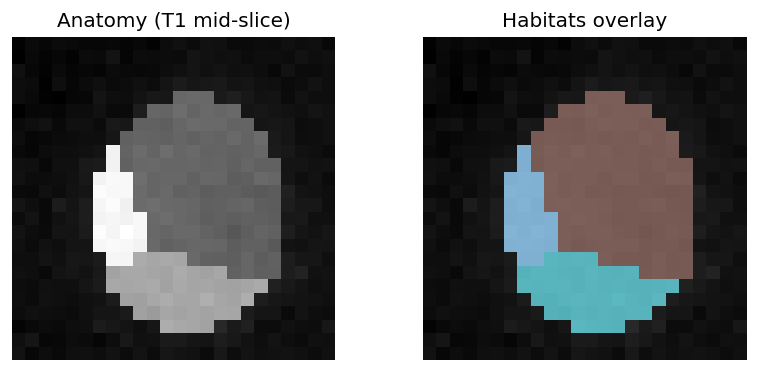

Examples
========

Runnable Python scripts with captured narrative. Prefer the How-to chapter for
**YAML + demo_data** operators; this gallery is the **Python API** surface.

Fastest habitat start::

   python docs/source/examples/scripts/two_step_habitat_quickstart.py

Habitat examples that open a viewer end with a **napari eye-check**. Close the
window to continue; ``HABIT_NO_VIEW=1`` skips GUI. For 3D, load image +
``*_habitats`` in ITK-SNAP / 3D Slicer / SimpleITK.

**Habitat analysis is the core** — read :doc:`habitat_analysis_overview` for the
recipe → atomic → custom layering before diving into individual pages.

   Synthetic two-step habitats (anatomy vs label overlay). Regenerated by
   ``python docs/source/examples/scripts/_make_example_thumbnails.py``.

Page badges: **Level** (recipe / atomic / custom / shell), **Data**
(synthetic / demo_data / none), **Extras**, approximate **Time**.

Scripts live in ``docs/source/examples/scripts/``. Lightweight smoke
(PowerShell)::

   $env:HABIT_NO_VIEW = "1"
   python docs/source/examples/scripts/_smoke_examples.py

.. toctree::
   :maxdepth: 1
   :caption: 1. Data & cohorts

   data_from_arrays

.. toctree::
   :maxdepth: 1
   :caption: 2. Image preprocessing

   image_preprocessing
   image_preprocessing_api

.. toctree::
   :maxdepth: 1
   :caption: 3. Habitat analysis (core)

   habitat_analysis_overview
   two_step_habitat
   one_step_habitat
   direct_pooling_habitat
   habitat_fit_modes
   apply_saved_model
   habitat_atomic_ops
   habitat_custom_pipeline
   habitat_recipes_api

.. toctree::
   :maxdepth: 1
   :caption: 4. Habitat design (Spec & features)

   feature_composition
   habitat_feature_routes
   habitat_preprocessing
   habitat_preprocessing_api
   precise_features
   custom_voxel_features

.. toctree::
   :maxdepth: 1
   :caption: 5. Quantification

   feature_extraction
   features_radiomics_api

.. toctree::
   :maxdepth: 1
   :caption: 6. Machine learning

   tabular_ml
   tabular_ml_api
   ml_advanced

.. toctree::
   :maxdepth: 1
   :caption: 7. Visualization

   visualization
   viz_parallel_extras_api

.. toctree::
   :maxdepth: 1
   :caption: 8. Persistence & provenance

   persistence
   provenance_methods

.. toctree::
   :maxdepth: 1
   :caption: 9. Execution & reliability

   parallel_execution
   fault_tolerance

.. toctree::
   :maxdepth: 1
   :caption: 10. Extending HABIT

   plugin_entry_points

.. toctree::
   :maxdepth: 1
   :caption: 11. YAML & CLI shells

   run_from_yaml
   cli_yaml_workflows

.. toctree::
   :maxdepth: 1
   :caption: 12. QC & auxiliary

   cohort_plugins_auxiliary
