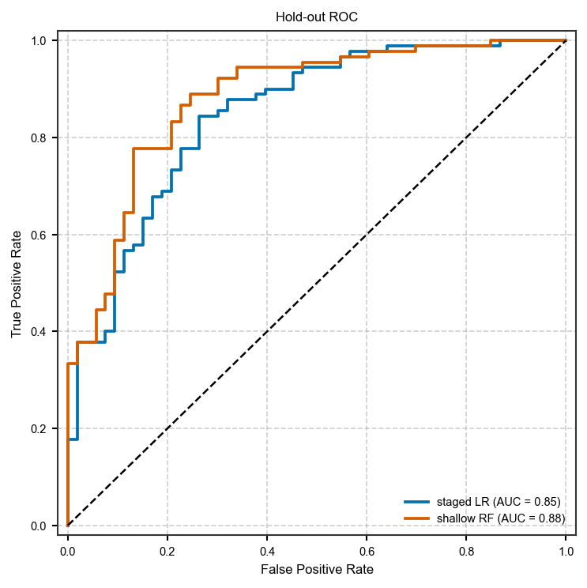
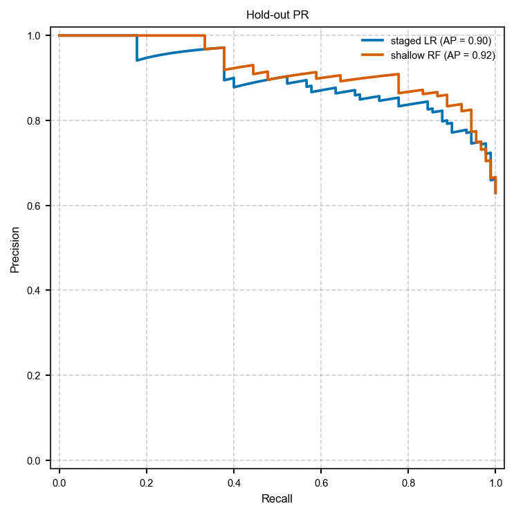
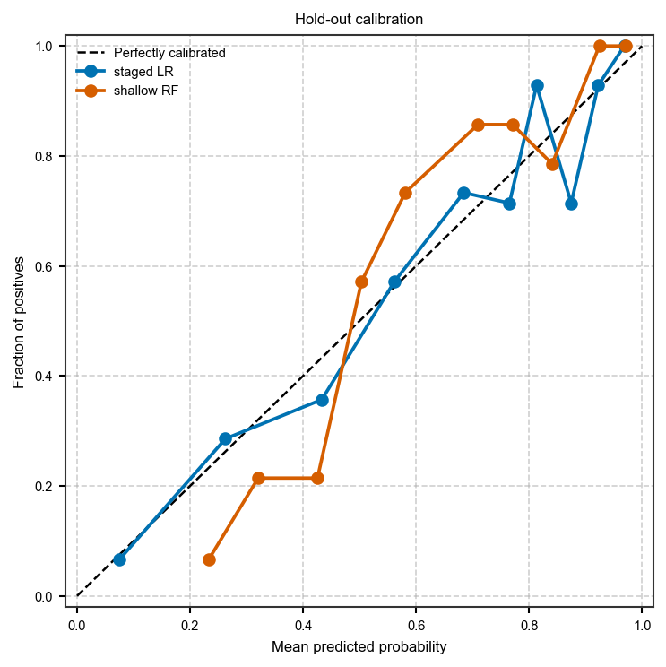
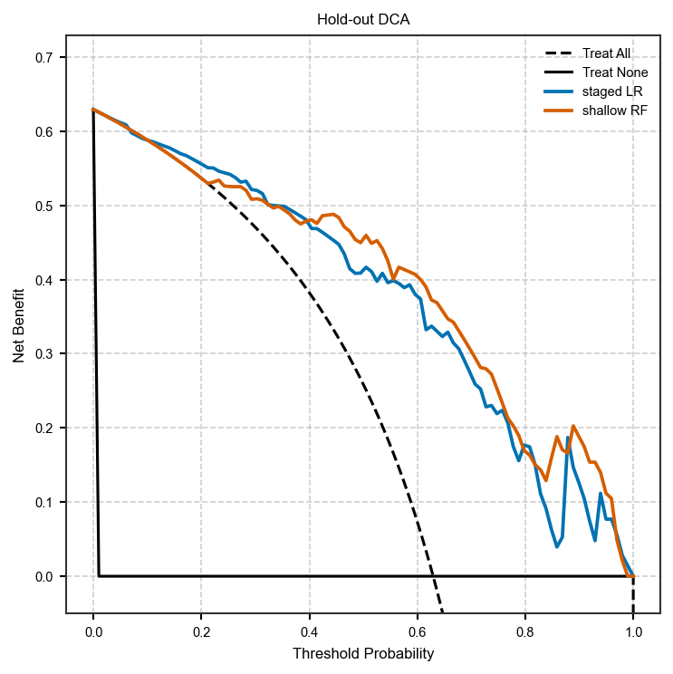
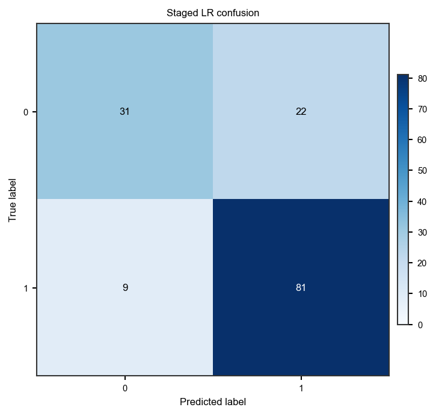

Advanced tabular ML: ordered selection and model comparison
===========================================================

:class:`~habit.spec.MLSpec` declares its table steps as ONE ordered list,
``steps``. The list order is the execution order, so preprocessors and
selectors interleave freely and position is the only thing that expresses
stage:

* a variance filter belongs **first**, on the raw table — after z-scoring
  every feature variance is 1.0, so the same step placed later selects
  nothing meaningful (older YAML spelled this ``before_z_score: true``);
* stateful preprocessing (z-score, min-max, …) sits wherever the design puts
  it, including *between* two selectors;
* supervised selection (ANOVA, LASSO, …) normally follows the scaling.

The three predecessor fields ``pre_preprocessing_feature_selectors``,
``table_preprocessors`` and ``feature_selectors`` are deprecated aliases kept
for all of v1.x; they are folded into ``steps`` in that order.

:func:`~habit.recipes.compare_models` compares saved prediction CSVs and writes
ROC / calibration figures (the programmatic twin of ``habit compare``). The
demo writes those CSVs from two **fitted** hold-out models (staged logistic
regression vs a shallow random forest), not from oracle label-as-score files.

The gallery table is ``demo_data/ml_data/breast_cancer_dataset.csv``. Edit
``DATA`` / column names / ``FEATURES`` to your own CSV. This is a software
demo, not a clinical claim.

Script
------

Change ``DATA`` / column names to your table. Figures land under ``out/``.

.. literalinclude:: scripts/ml_advanced_demo.py
   :language: python
   :start-after: # BEGIN example
   :end-before: # END example

Draw the figures
----------------

Paste this after the Script block (it uses ``y_true``, ``y_prob_lr``,
``y_prob_rf``, and ``pred_lr``). Writes ``out/ml_advanced_*.png``.

.. literalinclude:: scripts/ml_advanced_demo.py
   :language: python
   :start-after: # BEGIN figures
   :end-before: # END figures

Run from the repository root (one line)::

   python docs/source/examples/scripts/ml_advanced_demo.py

Output
------

Real output of the script above (seed 42)::

   Table: 569 rows x 6 features

   --- Staged pipeline (variance -> zscore -> ANOVA k=3 -> LR) ---
   Train metrics: {'accuracy': 0.789, 'auc': 0.856}
   Test metrics:  {'accuracy': 0.783, 'auc': 0.847}

   --- Shallow random forest ---
   Test metrics:  {'accuracy': 0.839, 'auc': 0.881}
   Hold-out AUC staged-LR=0.847 RF=0.881

   --- compare_models output: out/comparison ---
   Multi-model figures (ROC, DCA, calibration, PR) and metrics land under
   output_dir. Train/CV single-model figures from habit model / habit cv use
   output/visualizations/ with train_ / test_ / cv_ prefixes.

Figures
-------

Hold-out overlay from the demo subset (not a clinical claim).

   Hold-out ROC overlay (:func:`~habit.viz.plot_roc`). Staged LR AUC 0.85,
   shallow RF AUC 0.88.

   Hold-out precision-recall (:func:`~habit.viz.plot_precision_recall`).

   Hold-out calibration (:func:`~habit.viz.plot_calibration`).

   Hold-out decision-curve analysis (:func:`~habit.viz.plot_decision_curve`).

   Staged-LR hold-out confusion matrix
   (:func:`~habit.viz.plot_confusion_matrix`).

What to read next
-----------------

* :doc:`tabular_ml` — train / cross-validate / predict basics
* :doc:`../api/domain_table` — :class:`~habit.domain.TablePipeline` internals
* :doc:`visualization` — ``habit.viz`` figures for survival and regression
