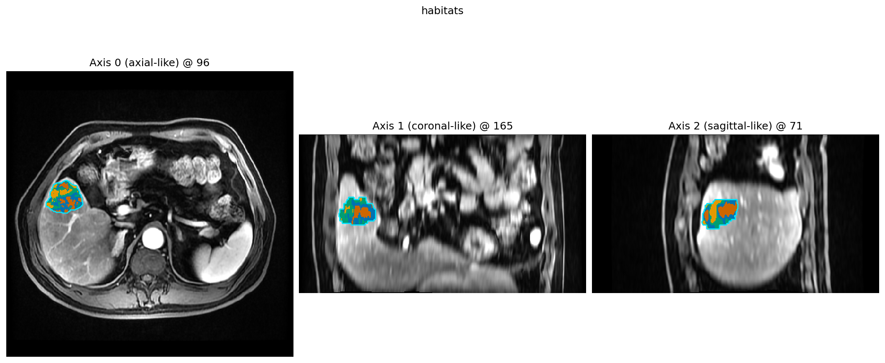
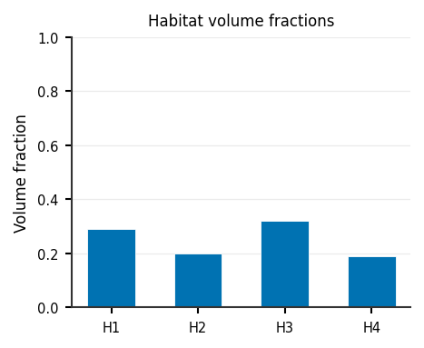
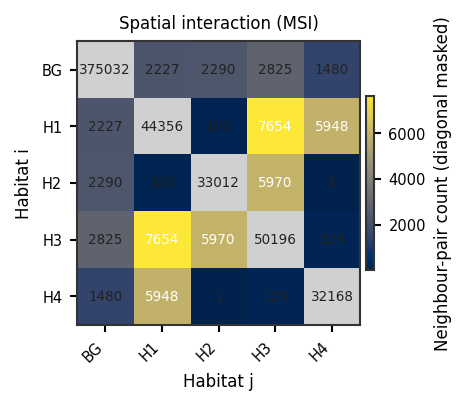
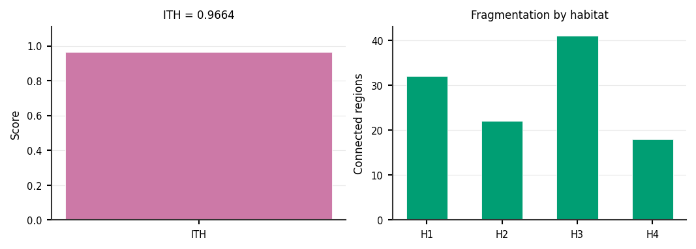
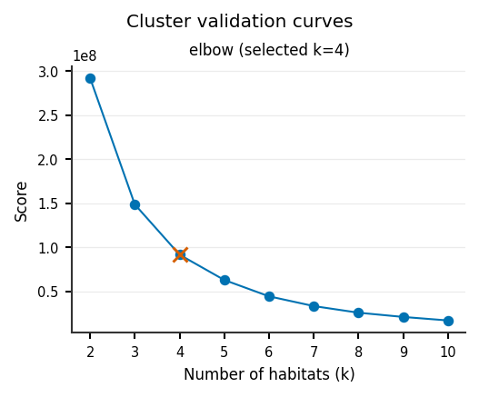

One-step habitat analysis
=========================

**Level:** recipe · **Data:** ``demo_data/preprocessed`` · **Extras:** optional
``[view]`` · **Time:** ~20–60 s

The one-step design clusters **voxels inside each subject independently**.
Declare stages with **neither** ``partition`` **nor** ``pool``, then call
:meth:`~habit.recipes.Study.fit_predict`. There is **no cohort-level preprocessing
chain** at train time — per-subject state is frozen into
``StudyResult.subject_models`` rather than a single
:class:`~habit.contracts.HabitatModel`.

The factory :func:`~habit.recipes.one_step_habitat` remains for convenience.

Script
------

Change ``DATA`` / ``MODALITIES`` / ``ROI`` to your preprocessed tree.

.. literalinclude:: scripts/one_step_habitat_demo.py
   :language: python
   :start-after: # BEGIN example
   :end-before: # END example

Change the Spec (other methods and parameters)
----------------------------------------------

The script above is **one worked recipe**, not the only recipe. Each
``Stage`` is a slot: keep the scaffolding (``cohort_from_directory`` →
``HabitatSpec`` → :meth:`~habit.recipes.Study.fit_predict`) and swap the
``Spec("name", {params})`` in that slot.

**Slots in this one-step example**

* ``extract_voxel_features`` — voxel field (here ``raw``)
* ``fit`` — clustering (here ``kmeans`` with auto-K)
* ``assign`` — label voxels (``nearest_centroid``)
* ``quantify`` / ``quantify2`` / … — summaries that do not change the map

**Concrete swaps** (paste over the matching ``Stage(...)``)::

   # 1) GMM instead of k-means (fixed K)
   Stage("fit", Spec("gmm", {"n_habitats": 4, "covariance_type": "full"}))

   # 2) Local entropy instead of raw intensity
   Stage(
       "extract_voxel_features",
       Spec("local_entropy", {"modalities": list(MODALITIES), "kernel_size": 3, "bins": 32}),
   )

   # 3) Scale voxels before clustering (insert after extract, before fit)
   Stage("preprocess1", Spec("winsorize", {"winsor_limits": (0.05, 0.05), "across_features": False}))
   Stage("preprocess2", Spec("minmax", {"across_features": False}))

Full list of names, every parameter, allowed values, and the YAML twin:
:doc:`../how_to/habitat_components`.

Discover the same facts in a running interpreter::

   from habit import list_plugins, get_param_schema

   print([p.name for p in list_plugins("habitat_model_fitter")])
   print(get_param_schema("kmeans", "habitat_model_fitter").model_fields.keys())

Output
------

Illustrative::

   Cohort: 2 subjects
   Cohort-level habitat_model: None
   Per-subject models: 2
   Habitat maps: 2

The copied block prints these lines and writes the PNGs under ``out/``
(``out/one_step_overlay.png``, ``out/one_step_volume_fractions.png``,
``out/one_step_msi_matrix.png``, ``out/one_step_ith_summary.png``,
``out/one_step_cluster_validation.png``). Edit those paths in the script
if you want a different folder.

``HABIT_NO_VIEW=1`` skips the optional napari window when you run the
full script from the repository root (maintainers then copy ``out/*.png``
into the docs gallery)::

   python docs/source/examples/scripts/one_step_habitat_demo.py

Same ``demo_data/preprocessed`` + ``random_seed=42`` reproduces the habitat
**labels** (numerical contract). PNG **pixels** can differ slightly across
matplotlib / OS / DPI.

Figures
-------

These are the same files the copied block writes under ``out/``. The site
gallery is a copy of those PNGs (same composition; not a cropped re-plot).
Overlay uses the public 3-D default: three orthogonal panels through the
densest habitat slices. Pass ``ImageVolume`` / ``HabitatMap`` (not
``.data``) so orientation follows the volume.

   Per-subject habitats (:func:`~habit.viz.plot_habitat_overlay`, three
   orthogonal panels).

   Volume fractions (:func:`~habit.viz.plot_habitat_volume_fractions`).

   MSI matrix (:func:`~habit.viz.plot_msi_matrix`).

   ITH summary (:func:`~habit.viz.plot_ith_summary`).

   Auto-K curves from this subject's ``selection_report``
   (:func:`~habit.viz.plot_cluster_validation_from_report`).

What to read next
-----------------

* :doc:`../how_to/habitat_components` — which ``Spec`` names exist, and what each parameter means
* :doc:`habitat_analysis_overview` — recipe / atomic / custom map
* :doc:`habitat_atomic_ops` — operator-level walkthrough
* :doc:`habitat_preprocessing` — how preprocessing chains differ by design
* :doc:`two_step_habitat` — the cohort-level alternative
* :doc:`direct_pooling_habitat` — pool all voxels before clustering
