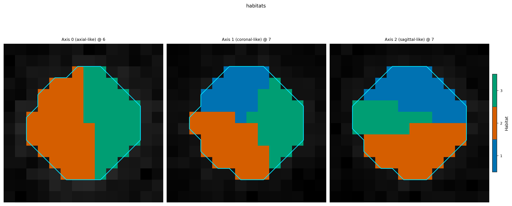

Parallel execution with RunPolicy
=================================

:class:`~habit.spec.HabitatSpec` declares *what* to compute;
:class:`~habit.spec.RunPolicy` declares *how* to schedule it. Pass a
:class:`~habit.execution.process_pool.ProcessPoolBackend` to any habitat recipe
to process subjects in parallel — with a fixed ``random_seed`` the scientific
result matches serial execution.

YAML: two tracks
----------------

* **Native document** — top-level ``policy:`` block with ``RunPolicy`` field
  names (``workers``, ``backend``, ``parallel_mode``,
  ``subject_timeout_sec``, …). Annotated example:
  ``config/habitat/config_habitat_two_step_v1.yaml``.
* **Older YAML** — same knobs at the YAML **top level** as ``processes``,
  ``individual_subject_timeout_sec``, ``individual_subject_parallel_mode``,
  … The CLI / :func:`~habit.recipes.run_from_yaml` translate them into
  ``policy`` via :class:`~habit.spec.legacy.LegacyConfigAdapter`. Field
  rename table: :doc:`../api/spec`. Full habitat reference:
  :doc:`../configuration/habitat`.

Either way, ProcessPoolBackend is selected only when
``backend == "process"`` and ``workers > 1``; otherwise the run uses
SerialBackend and timeout / OOM / ``parallel_mode`` / ``auto_retry_rounds``
do not apply (see :doc:`../api/execution`).

.. include:: ../_includes/windows_multiprocessing.rst

The demo script already wraps work in ``if __name__ == "__main__":``.

Script
------

.. literalinclude:: scripts/parallel_execution_demo.py
   :language: python

The demo uses ``parallel_mode="persistent"`` (the library default). Set
``"isolated"`` when you need a fresh child process per subject (stronger
isolation, higher spawn cost).

Output
------

::

   Serial: 6 maps, 3 habitats
   RunPolicy: workers=2, backend='process', parallel_mode='persistent'
   Parallel: 6 maps, 3 habitats
   Label mismatches serial vs parallel: 0 / 6
   Atomic predict on subj001: 3 labels

Failure policy note
-------------------

``RunPolicy.on_subject_failure="continue"`` isolates errors inside the
backend. Default :meth:`~habit.contracts.Cohort.map` still raises
:class:`~habit.exceptions.ProcessingError`; recipes pass
``raise_on_failure=False`` so a partial cohort can finish. Soft failure and
geometry / plugin / batch switches are covered in :doc:`fault_tolerance`.

The script writes ``out/parallel_execution_overlay.png`` and may open a
**napari eye-check**. ``HABIT_NO_VIEW=1`` skips the viewer.

Figures
-------

Parallel scheduling does not change the habitat product under a fixed seed.

   Habitats after ``Study.fit_predict`` (serial or process-pool)
   (:func:`~habit.viz.plot_habitat_overlay`).

What to read next
-----------------

* :doc:`two_step_habitat` — the serial baseline
* :doc:`fault_tolerance` — continue vs Cohort.map, fail_fast, CompatibilityError
* :doc:`run_from_yaml` — policy blocks in v1 YAML documents
* :doc:`../api/spec` — RunPolicy fields + YAML field mapping
* :doc:`../api/execution` — SerialBackend / ProcessPoolBackend knobs
* :doc:`../configuration/habitat` — Stage-1 parallel / checkpoint YAML reference
