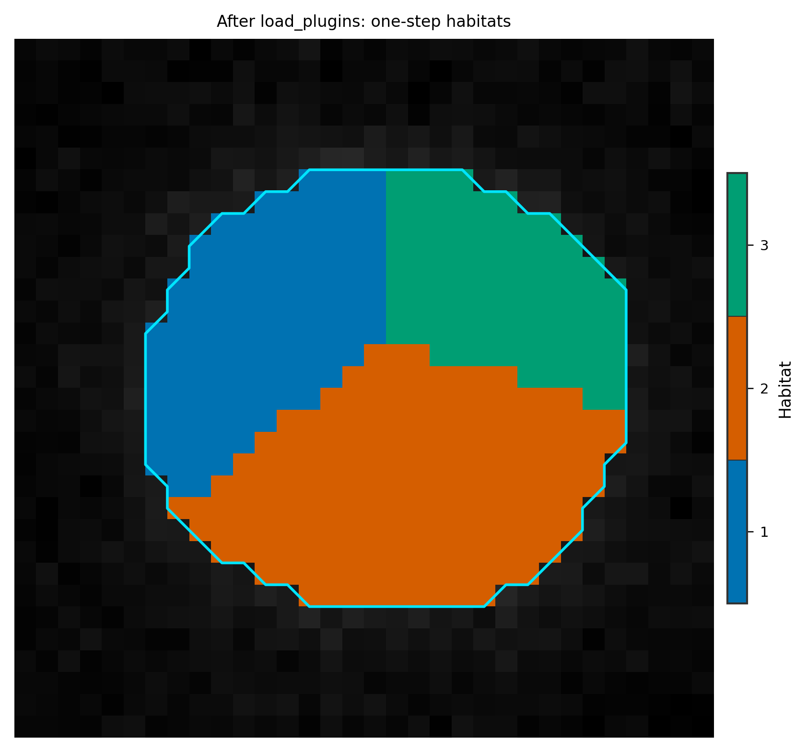

Third-party plugins (entry points)
==================================

**Level:** extending HABIT · **Data:** none · **Extras:** none · **Time:** <5 s

Two registration routes:

1. **In-process** — ``@VoxelFeatureExtractorRegistry.register("name")`` inside
   the running interpreter (see :doc:`custom_voxel_features`).
2. **Entry point** — a separate package declares
   ``habit.<domain>`` in ``pyproject.toml``, users call
   :func:`~habit.api.plugins.load_plugins` once, then reference the name in
   ``Spec("name", {...})``.

Domain string = snake_case singular protocol name
(e.g. ``voxel_feature_extractor``). Group name = ``habit.`` + domain.

Minimal ``pyproject.toml`` fragment::

   [project.entry-points."habit.voxel_feature_extractor"]
   t1_t2_contrast = "my_pkg.features:register"

``register()`` should perform the decorator registration (or
``Registry.register_factory``) when imported.

Script
------

.. literalinclude:: scripts/plugin_entry_points_demo.py
   :language: python
   :start-after: # BEGIN example
   :end-before: # END example

Draw the figures
----------------

Paste this after the Script block. Writes
``out/plugin_entry_points_overlay.png``.

.. literalinclude:: scripts/plugin_entry_points_demo.py
   :language: python
   :start-after: # BEGIN figures
   :end-before: # END figures

Run::

   python docs/source/examples/scripts/plugin_entry_points_demo.py

Output
------

::

   load_plugins: loaded=0, failures=0
   list_plugins('voxel_feature_extractor'): 6 entries
     - concat
     - expression
     ...
   Wrote out/plugin_entry_points_overlay.png

Figures
-------

After ``load_plugins()``, built-in names such as ``raw`` are ready for a
habitat run. Synthetic overlay from that one-step call:

   :func:`~habit.viz.plot_habitat_overlay` on the one-step map.

What to read next
-----------------

* :doc:`custom_voxel_features` — full DIY extractor + habitat run
* :doc:`habitat_custom_pipeline` — plug the name into Spec stages
* :doc:`../customization/index` — all extensible domains
* :doc:`../api/plugins` — ``list_plugins`` / ``Registry.create`` / constructor signatures
