Precise features: atoms, then paper combinations
================================================

**Level:** atomic · **Data:** ``demo_data/preprocessed`` · **Extras:** ``[viz]`` ·
**Time:** ~5–15 min (atoms) + a few more minutes for the optional ROI-edge
follow-up (three cropped subjects, MONAI ``bspline_deform``)

Voxel-wise radiomics is noisy: extracting a feature map twice from the same
anatomy — a simulated re-acquisition, or a slightly different kernel radius
or bin width — does not yield the same numbers twice. Clustering features
that do not survive such perturbation produces habitats nobody can
reproduce. Prior et al. (*Radiol Artif Intell* 2024;6(2):e230118) answered
this with **combinatorial experiments**. HABIT teaches the same design as
two volume-level atoms, then a small composition.

The two atoms
-------------

Neither call needs a :class:`~habit.contracts.subject.Cohort`, YAML, or
:func:`~habit.recipes.identify_precise_voxel_features`.

1. **Perturb** — :func:`~habit.perturb_image`: one
   :class:`~habit.api.image.ImageVolume`, a registered method name, and
   that method's parameters. Optional ``mask`` is used by methods that
   consult or warp an ROI. The result stays on the original voxel grid.

   Built-in methods: ``gaussian_noise``, ``translation``, ``rotation``,
   ``rigid``, ``bspline_deform`` (MONAI; extra ``monai``).

2. **Extract voxel texture** — :func:`~habit.extract_voxel_texture`: the
   same image and mask, with ``kernel_radius`` (the paper's ``R``),
   ``bin_width`` (the paper's ``B``), and optional ``feature_classes``.
   Combinations are repeated calls, not a new API.

Paper combinations
------------------

* **Repeatability** — ``extract(original)`` vs ``extract(perturbed)`` at
  the base setting (paper: R3B12). ICC(3A,1) via
  :func:`~habit.precision_panel` with ``agreement="absolute"``.
* **Reproducibility, kernel** — ``extract(..., kernel_radius=1)`` vs
  ``extract(..., kernel_radius=3)`` at fixed bin width (R1 vs R3).
  ICC(3C,1), ``agreement="consistency"``.
* **Reproducibility, bin width** — ``extract(..., bin_width=12)`` vs
  ``extract(..., bin_width=25)`` at fixed radius (B12 vs B25).
  ICC(3C,1).

A feature is *precise* when its lower confidence limit reaches 0.5
(the paper's "at least good" boundary) in **every** experiment you
actually ran. :func:`~habit.identify_precise_features` is that
intersection. :func:`~habit.aggregate_panels` takes the per-feature
median when you have more than one subject.

The demo below uses one cropped subject (median of one). The optional
recipe at the end loops the same atoms over a cohort.

Runnable demo
-------------

Swap ``DATA`` / ``MODALITIES`` / ``ROI``. The script crops to the ROI
bounding box so R1 vs R3 stays interactive, then runs the three paper
combinations on a small first-order + GLCM set.

.. literalinclude:: scripts/precise_features_demo.py
   :language: python
   :start-after: # BEGIN example
   :end-before: # END example

Draw the figures
----------------

Paste this after the Script block (it uses ``image``, ``mask``,
``perturbed``, ``shifted``, ``rotated``, ``precise``, ``evidence``,
``result_all``, and ``result_precise``). Writes
``out/precise_features_*.png``.

.. literalinclude:: scripts/precise_features_demo.py
   :language: python
   :start-after: # BEGIN figures
   :end-before: # END figures

Run from the repository root (one line)::

   python docs/source/examples/scripts/precise_features_demo.py

Output
------

Illustrative (ICC depends on the subject and extractor; this is one
cropped ``demo_data`` subject with first-order / GLCM voxel texture, not
a clinical claim). Feature names and the precise/unstable split are
printed by the script.

Figures
-------

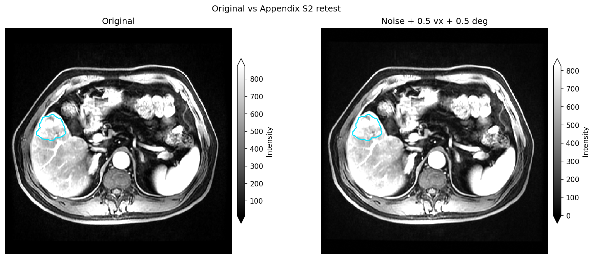

   Original vs one :func:`~habit.perturb_image` call
   (``method="gaussian_noise"``), same slice, optional ROI contour
   (:func:`~habit.viz.plot_intensity_slice`, ``before=``,
   ``roi_contour=True``).

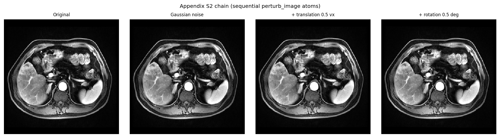

   Small multiples of atom calls: original, Gaussian noise, 0.5-voxel
   translation, 0.5° rotation. Each perturbed panel is a separate
   :func:`~habit.perturb_image` call. Same axial index as the pair
   figure.

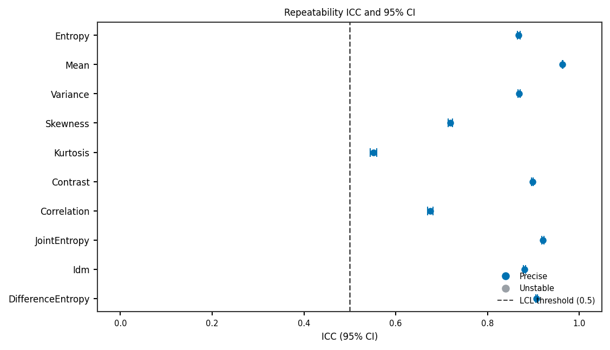

   Repeatability ICC (point) and 95% CI (vertical whisker) from
   ``extract(original)`` vs ``extract(perturbed)`` at R3B12
   (:func:`~habit.viz.plot_precision_icc`).

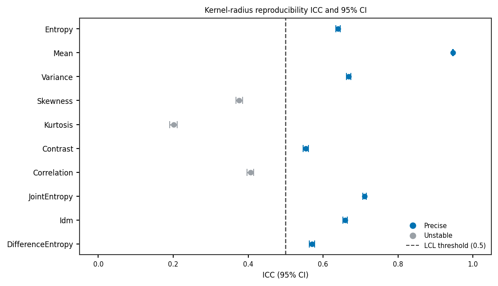

   Kernel-radius reproducibility: R1 vs R3 at B12. Colour is this
   experiment's own LCL, not the intersection flag.

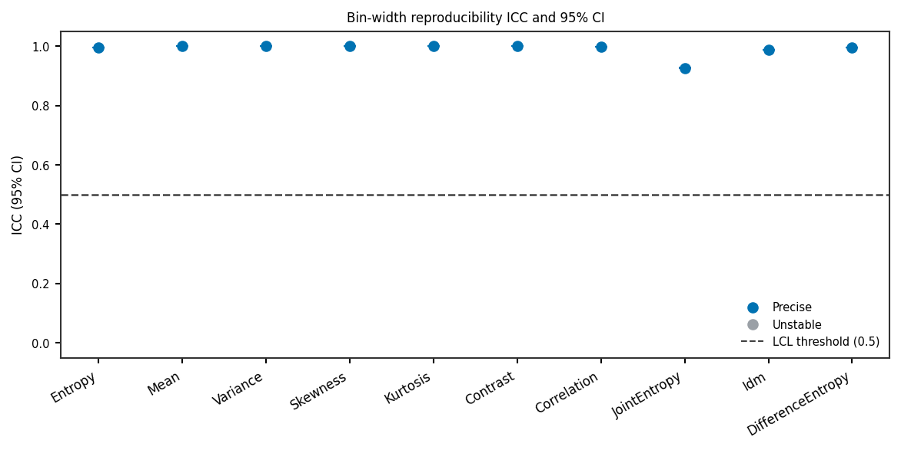

   Bin-width reproducibility: B12 vs B25 at R3.

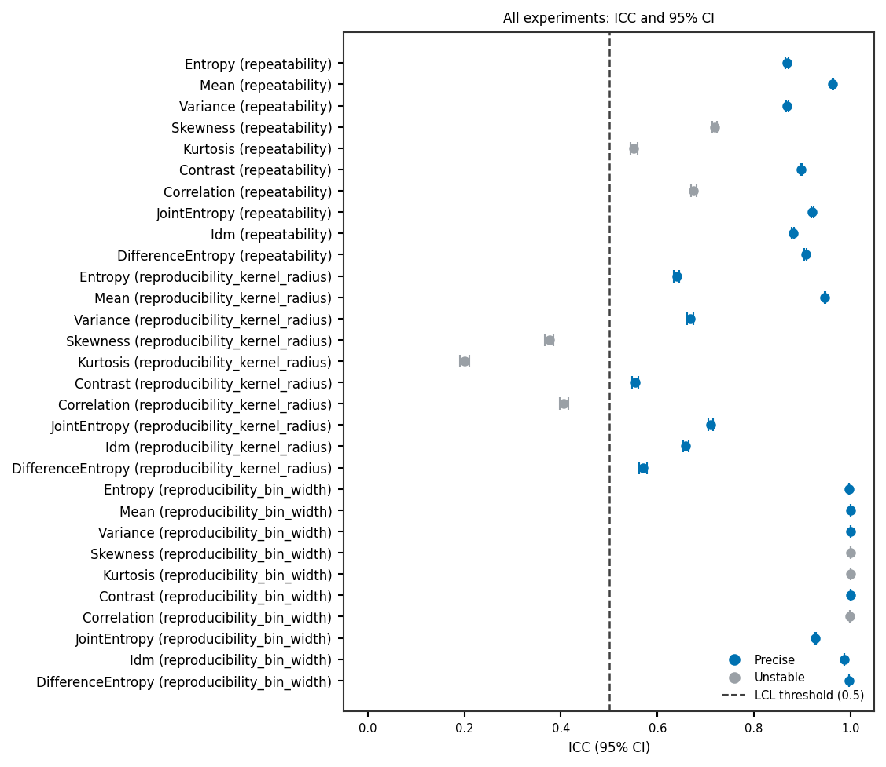

   All three experiments. Colour is the PreciseFeatureSet flag: a
   feature is precise only when **every** experiment clears the LCL.

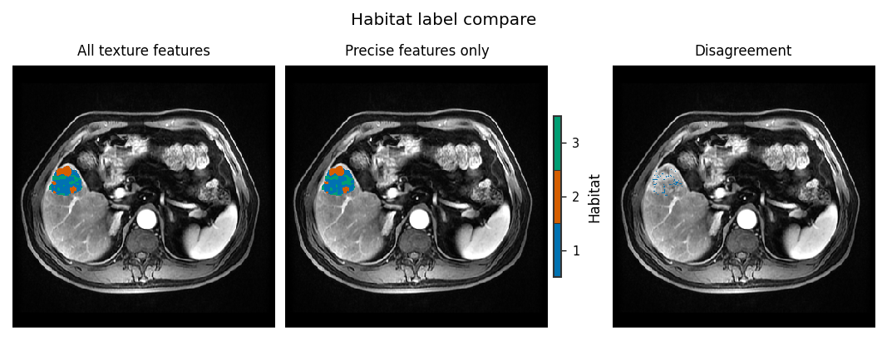

   Same subject, same extractor, same ``k`` search: all texture
   features vs precise features only
   (:func:`~habit.viz.plot_habitat_label_compare`,
   ``align_labels=True``). Independent one-step fits share a
   ``model_id`` digest, so alignment must be forced.

Optional ROI-edge follow-up
---------------------------

The paper's default chain (noise, translation, rotation) does **not**
change ROI *shape*. Subject-level
:class:`~habit.domain.ImagePerturbationRegistry`
``bspline_deform`` (MONAI ``Rand3DElastic``) does: one displacement
field warps every image and mask together so the contour stays paired
with the anatomy. This is **not** Prior Appendix S2 and **not** MIRP
``perturbation_roi_adapt_size`` (mask grow/shrink).

The same block then extracts **habitat-table** features (volume
fraction and ITH) from the original map and from the overlap-aligned
warped map, and reports ICC(3A,1) **with a 95% CI** via
:func:`~habit.icc3a_1`. That is a different question from the
voxel-texture PreciseFeatureSet above: here the targets are
subjects, not voxels, and the colour in the ICC panel is only
``LCL >= 0.5``, not the paper's intersection flag. Three demo
subjects make the intervals wide; that is expected.

Paste after the Script block (it reuses ``_crop_to_roi``, ``DATA``,
``MODALITIES``, and ``ROI``). Writes four more ``out/precise_*.png``.

.. literalinclude:: scripts/precise_features_demo.py
   :language: python
   :start-after: # BEGIN roi_followup
   :end-before: # END roi_followup

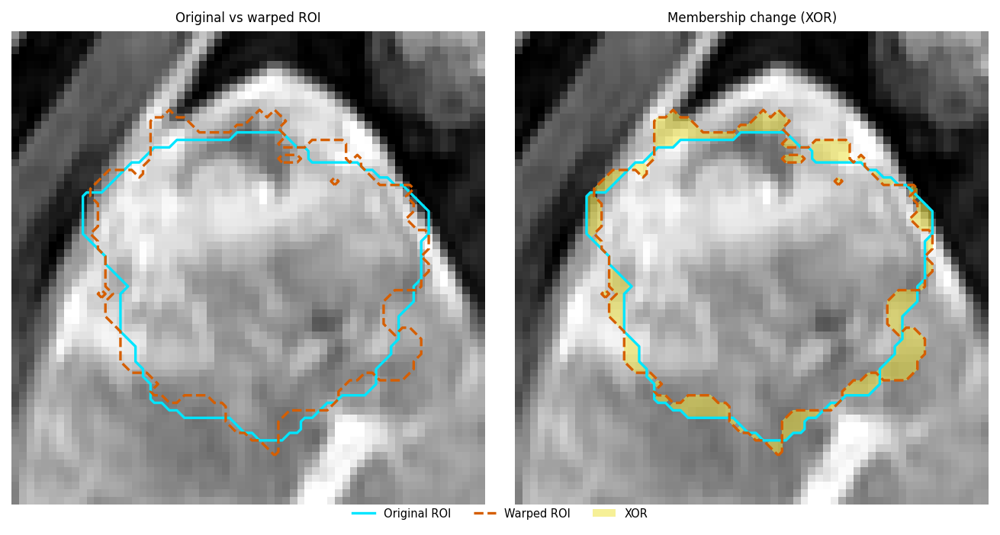

   Same crop and axial index. Cyan solid = original ROI; vermillion
   dashed = warped ROI; yellow = membership change (XOR, right panel
   only). ``ImagePerturbationRegistry.create("bspline_deform", ...)``
   on a :class:`~habit.contracts.subject.Subject`.

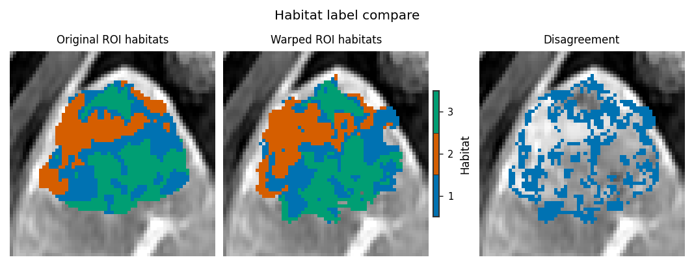

   One-step habitats (``n_habitats=3``) on the original vs warped
   subject. The warped map is remapped onto the original ids by
   maximal overlap
   (:func:`~habit.align_habitat_map`, ``method="overlap"``,
   ``force=True``) before
   :func:`~habit.viz.plot_habitat_label_compare`
   (``align_labels=False``, ``display_convention="native"`` so the
   slice matches the contour figure).

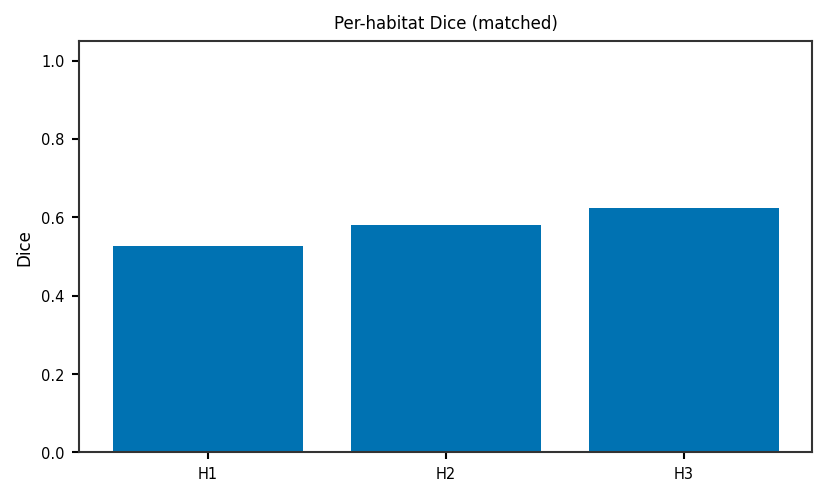

   Per-habitat Dice from :func:`~habit.habitat_stability` (Hungarian
   overlap match on the **unaligned** pair).

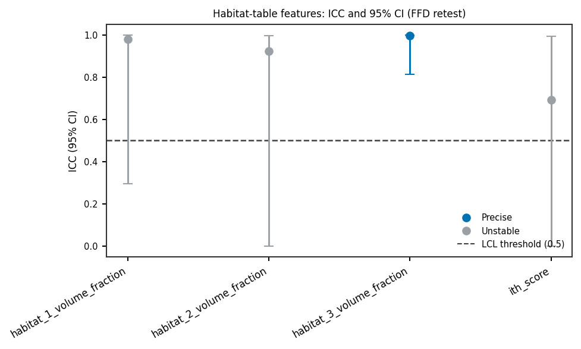

   Habitat-table repeatability: ICC(3A,1) point and 95% CI whisker
   per feature, three cropped ``demo_data`` subjects, original vs
   overlap-aligned FFD map (:func:`~habit.icc3a_1`,
   :func:`~habit.viz.plot_precision_icc`). Colour is ``LCL >= 0.5``
   only — **not** a PreciseFeatureSet. Wide intervals at ``n=3`` are
   honest, not a plotting error.

Optional one-call recipe
------------------------

When you want the same three experiments looped over a cohort (paper
aggregation = per-feature median),
:func:`~habit.recipes.identify_precise_voxel_features` is the
composition. It is **not** required to generate a perturbation or a
texture table.

.. code-block:: python

   from habit.recipes import identify_precise_voxel_features, voxel_radiomics_factory

   precise = identify_precise_voxel_features(
       cohort,
       extractor_factory=voxel_radiomics_factory,
       kernel_radii=(1, 3),
       bin_widths=(12, 25),
       seed=7,
   )

Pass your own ``extractor_factory`` to keep the small first-order +
GLCM set, or a custom :func:`~habit.perturb_image` chain via
``perturbation=`` (Subject-level
:class:`~habit.domain.precision.PerturbationChain`).
:func:`~habit.domain.precision.prior2024_retest_perturbation` is the
Appendix S2 default (Chang noise + 0.5-voxel translation + 0.5°
rotation). MIRP ``perturbation_roi_adapt_size`` (mask grow/shrink) is
not implemented.

What to read next
-----------------

* Tutorial (principle + claims): :doc:`../tutorial/precise_screening`
* Domain API: :doc:`../api/domain` — the two atoms and ``ImagePerturbation``
* :doc:`../api/kernels` — the perturbation and voxel-ICC numeric kernels
* :doc:`habitat_preprocessing` / :doc:`habitat_preprocessing_api` — chains the whitelist
  joins
