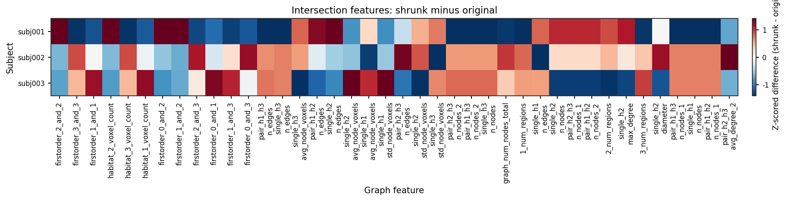
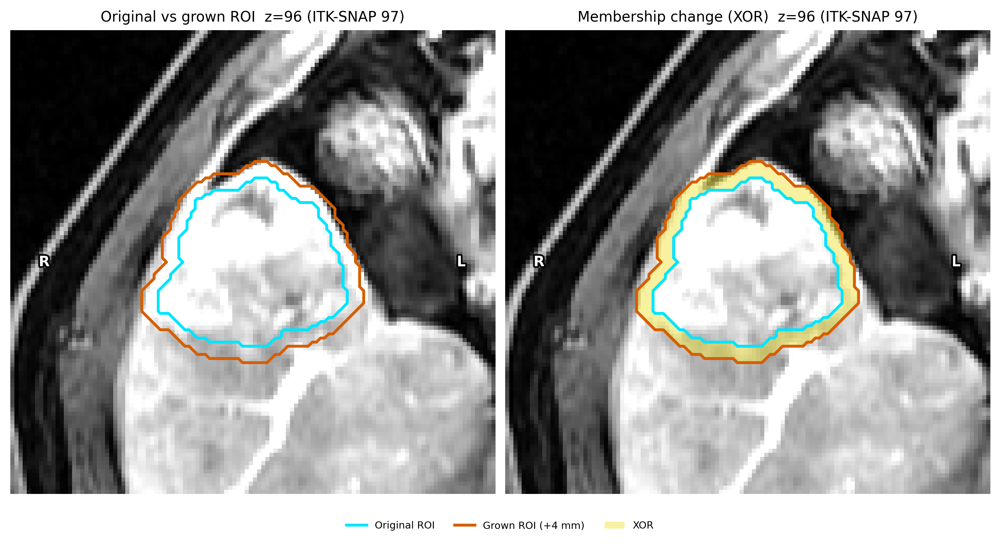
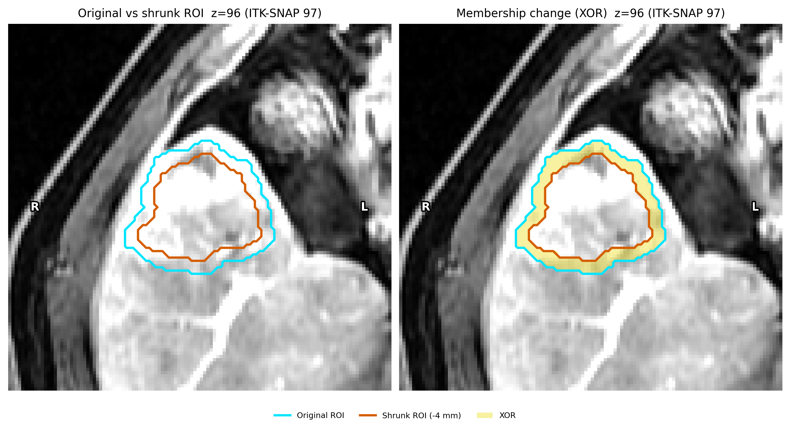
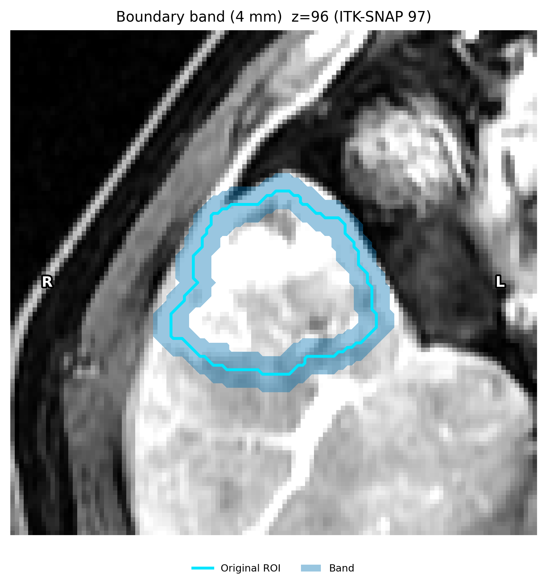
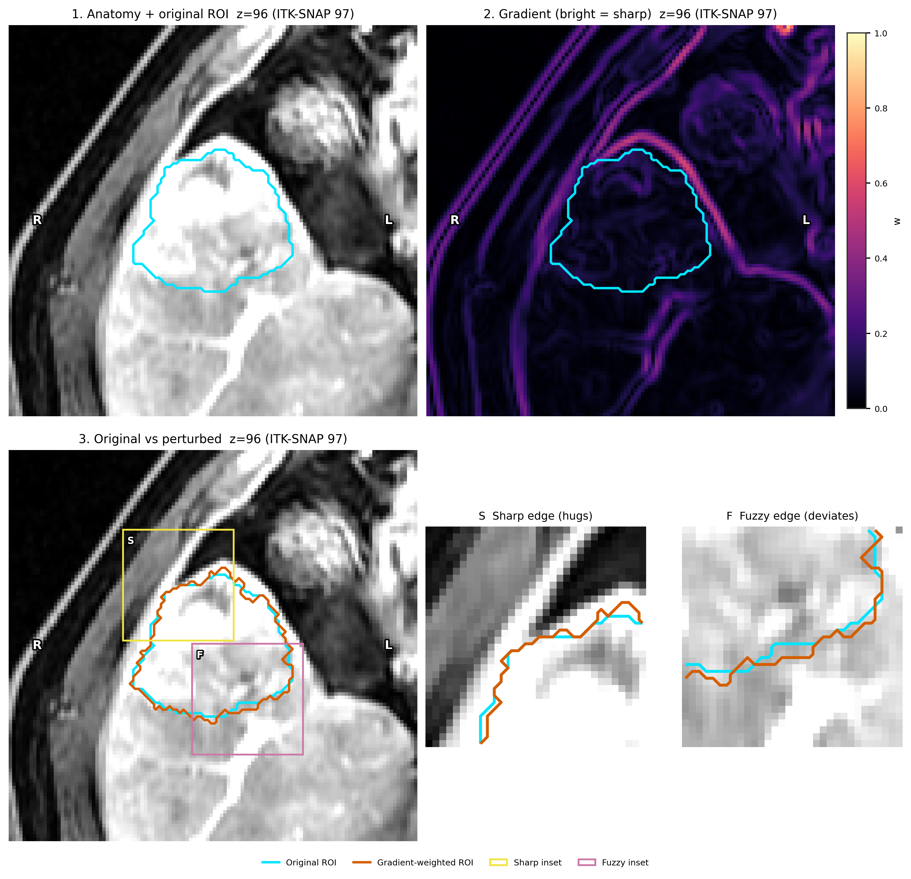
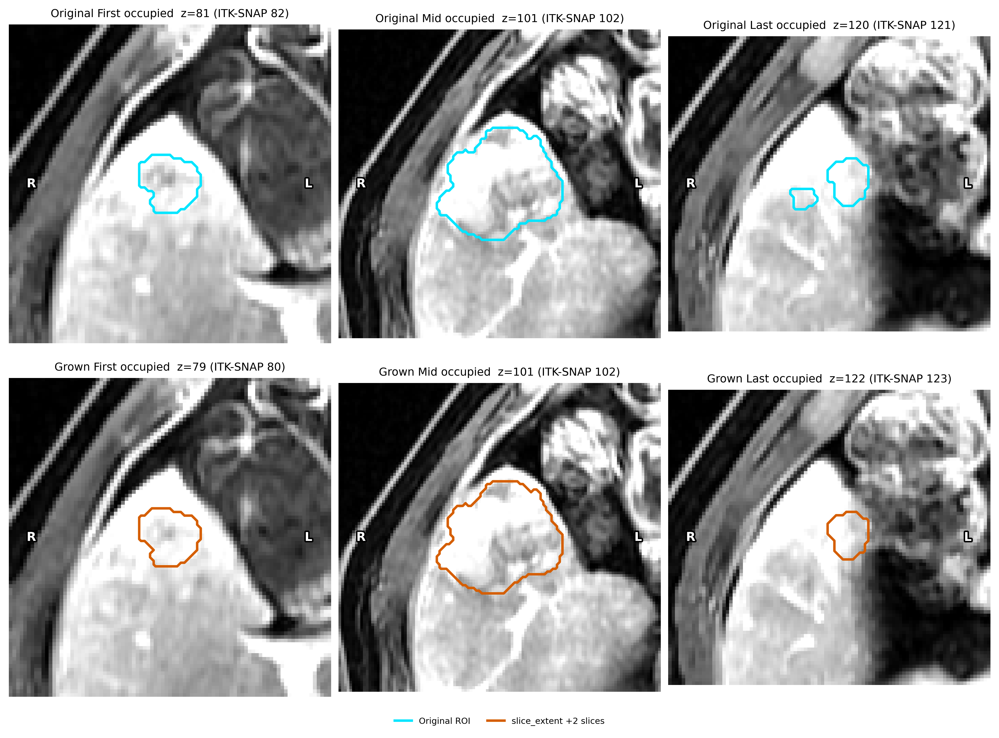

Precise features: atoms, then paper combinations
================================================

**Level:** atomic · **Data:** ``demo_data/preprocessed`` · **Extras:** ``[viz]`` ·
**Time:** ~5–15 min (atoms) + a few more minutes for the optional ROI-edge
follow-up (three cropped subjects, morphological shrink + intersection)

Voxel-wise radiomics is noisy: extracting a feature map twice from the same
anatomy — a simulated re-acquisition, or a slightly different kernel radius
or bin width — does not yield the same numbers twice. Clustering features
that do not survive such perturbation produces habitats nobody can
reproduce. Prior et al. (*Radiol Artif Intell* 2024;6(2):e230118) answered
this with **combinatorial experiments**. HABIT teaches the same design as
two volume-level atoms, then a small composition.

The two atoms
-------------

Neither call needs a :class:`~habit.contracts.subject.Cohort`, YAML, or
:func:`~habit.recipes.identify_precise_voxel_features`.

1. **Perturb** — :func:`~habit.perturb_image`: one
   :class:`~habit.api.image.ImageVolume`, a registered method name, and
   that method's parameters. Optional ``mask`` is used by methods that
   consult or warp an ROI. The result stays on the original voxel grid.

   Built-in intensity methods: ``gaussian_noise``, ``translation``,
   ``rotation``, ``rigid``, ``bspline_deform`` (MONAI; extra ``monai``).
   Mask-only contour methods (``morphological``, ``gradient_weighted``,
   ``slice_extent``) need the Subject-level registry; see the follow-up
   below.

2. **Extract voxel texture** — :func:`~habit.extract_voxel_texture`: the
   same image and mask, with ``kernel_radius`` (the paper's ``R``),
   ``bin_width`` (the paper's ``B``), and optional ``feature_classes``.
   Combinations are repeated calls, not a new API.

Paper combinations
------------------

* **Repeatability** — three sequential :func:`~habit.perturb_image`
  atoms in Appendix S2 / MIRP 1.2.0 order (Chang noise → 0.5-voxel
  translation → 0.5° rotation), then ``extract(original)`` vs
  ``extract(perturbed)`` at the base setting (paper: R3B12). ICC(3A,1)
  via :func:`~habit.precision_panel` with ``agreement="absolute"``.
* **Reproducibility, kernel** — ``extract(..., kernel_radius=1)`` vs
  ``extract(..., kernel_radius=3)`` at fixed bin width (R1 vs R3).
  ICC(3C,1), ``agreement="consistency"``.
* **Reproducibility, bin width** — ``extract(..., bin_width=12)`` vs
  ``extract(..., bin_width=25)`` at fixed radius (B12 vs B25).
  ICC(3C,1).

A feature is *precise* when its lower confidence limit reaches 0.5
(the paper's "at least good" boundary) in **every** experiment you
actually ran. :func:`~habit.identify_precise_features` is that
intersection. :func:`~habit.aggregate_panels` takes the per-feature
median when you have more than one subject.

The voxel-texture screen below is **one cropped subject** (median of
one). That is a teaching crop, not the paper's 2436-lesion CT cohort.
The optional recipe at the end loops the same atoms over a cohort. The
optional ROI-edge follow-up uses **three** cropped subjects only for
intersection habitat-feature ICC.

Runnable demo
-------------

Swap ``DATA`` / ``MODALITIES`` / ``ROI``. The script crops to the ROI
bounding box so R1 vs R3 stays interactive, then runs the three paper
combinations on a small first-order + GLCM set.

.. literalinclude:: scripts/precise_features_demo.py
   :language: python
   :start-after: # BEGIN example
   :end-before: # END example

Draw the figures
----------------

Paste this after the Script block (it uses ``image``, ``mask``,
``noisy``, ``shifted``, ``perturbed``, ``precise``, ``evidence``,
``result_all``, and ``result_precise``). Writes
``out/precise_features_*.png``.

.. literalinclude:: scripts/precise_features_demo.py
   :language: python
   :start-after: # BEGIN figures
   :end-before: # END figures

Run from the repository root (one line)::

   python docs/source/examples/scripts/precise_features_demo.py

Output
------

Illustrative (ICC depends on the subject and extractor; this is **one**
cropped ``demo_data`` subject with first-order / GLCM voxel texture, not
a clinical claim and not a multi-patient median). Feature names and the
precise/unstable split are printed by the script.

Figures
-------

.. figure:: ../_static/images/examples/precise_features_original_vs_perturbed.png
   :alt: Original anatomy beside a Gaussian-noise perturbed copy
   :width: 720

   Original vs the Appendix S2 simulated-retest chain (Chang noise, then
   0.5-voxel translation, then 0.5° rotation), same slice, optional ROI
   contour (:func:`~habit.viz.plot_intensity_slice`, ``before=``,
   ``roi_contour=True``).

.. figure:: ../_static/images/examples/precise_features_perturb_methods.png
   :alt: Original plus three perturb_image methods on one slice
   :width: 720

   Sequential atoms of the Appendix S2 chain on one slice: original,
   after Chang noise, after +0.5-voxel translation, after +0.5°
   rotation. Each panel is one :func:`~habit.perturb_image` call; the
   last panel is the volume used for repeatability ICC.

.. figure:: ../_static/images/examples/precise_features_icc_lcl.png
   :alt: Repeatability ICC point estimates with 95 percent confidence intervals
   :width: 640

   Repeatability forest plot: ICC (point) and 95% CI (horizontal
   whisker) from ``extract(original)`` vs the chained retest at R3B12
   (:func:`~habit.viz.plot_precision_icc`, ``orientation="row"``).

.. figure:: ../_static/images/examples/precise_features_icc_kernel.png
   :alt: Kernel-radius reproducibility ICC with 95 percent confidence intervals
   :width: 640

   Kernel-radius reproducibility forest plot: R1 vs R3 at B12. Colour is
   this experiment's own LCL, not the intersection flag.

.. figure:: ../_static/images/examples/precise_features_icc_bin.png
   :alt: Bin-width reproducibility ICC with 95 percent confidence intervals
   :width: 640

   Bin-width reproducibility forest plot: B12 vs B25 at R3. Paper
   result was already excellent here; points near 1.0 are expected.

.. figure:: ../_static/images/examples/precise_features_icc_all.png
   :alt: ICC and 95 percent CI for every experiment on one panel
   :width: 720

   All three experiments on one forest plot. Colour is the
   PreciseFeatureSet flag: a feature is precise only when **every**
   experiment clears the LCL.

.. figure:: ../_static/images/examples/precise_features_all_vs_precise.png
   :alt: Habitat maps from all texture features versus the precise subset
   :width: 720

   Same subject, same extractor, same ``k`` search: all texture
   features vs precise features only
   (:func:`~habit.viz.plot_habitat_label_compare`,
   ``align_labels=True``). Independent one-step fits share a
   ``model_id`` digest, so alignment must be forced.

Optional ROI-edge follow-up
---------------------------

The paper's default chain (noise, translation, rotation) does **not**
change ROI *shape*. Mask-only
:class:`~habit.domain.ImagePerturbationRegistry` ``morphological``
does: a uniform shrink (``grow_mm=-4``) simulates a systematic
"always smaller" contour. The **intersection** of the original and
shrunk masks is the core both contours still include. Habitats are
computed on each ROI, then **restricted to that intersection** before
pairing or features. This is inter-rater contouring of the mask, not
a deformable re-acquisition (``bspline_deform`` warps image and mask
together). It is **not** Prior Appendix S2.

The same block then extracts **every light habitat-map family** on
those restricted maps — volume, ``non_radiomics``, ITH, MSI, and
graph (:func:`~habit.extract_graph_features`; extended efficiency /
small-world omitted for runtime) — and reports ICC(3A,1) **with a
95% CI** via :func:`~habit.icc3a_1` plus a paired difference heatmap
(:func:`~habit.viz.plot_graph_feature_heatmap`, ``reference=``).
Habitats are paired by Hungarian assignment on per-habitat **mean**
intensity (the same quantity k-means uses as a cluster centre), then
ordinary Dice :math:`2|A\cap B|/(|A|+|B|)` is scored on the
intersection. That is a different question from the voxel-texture
PreciseFeatureSet above: here the targets are subjects, not voxels,
and the colour in the ICC panel is only ``LCL >= 0.5``, not the
paper's intersection flag. Three demo subjects make the intervals
wide; that is expected. IBSI radiomics families are omitted (they
need a params file and dominate runtime).

Paste after the Script block (it reuses ``_crop_to_roi``, ``DATA``,
``MODALITIES``, and ``ROI``). Writes five more ``out/precise_*.png``.

.. literalinclude:: scripts/precise_features_demo.py
   :language: python
   :start-after: # BEGIN roi_followup
   :end-before: # END roi_followup

.. figure:: ../_static/images/examples/precise_perturb_mask_edge.png
   :alt: Original and shrunk ROI contours with intersection and XOR
   :width: 720

   Same crop and axial index. Cyan solid = original ROI; vermillion
   dashed = shrunk ROI; sky-blue fill = intersection; yellow =
   membership change (XOR, right panel).
   ``ImagePerturbationRegistry.create("morphological", grow_mm=-4)``
   on a :class:`~habit.contracts.subject.Subject`.

.. figure:: ../_static/images/examples/precise_habitat_stability_compare.png
   :alt: One-step habitats restricted to the ROI intersection
   :width: 720

   One-step habitats (``n_habitats=3``) on the original vs shrunk
   subject, both restricted to the intersection. The shrunk map is
   remapped onto the original ids by mean-intensity Hungarian pairing
   (:func:`~habit.align_habitat_map`, ``method="centroid"``,
   ``force=True``) before
   :func:`~habit.viz.plot_habitat_label_compare`
   (``align_labels=False``, ``display_convention="native"`` so the
   slice matches the contour figure).

.. figure:: ../_static/images/examples/precise_habitat_dice.png
   :alt: Per-habitat Dice on the ROI intersection
   :width: 480

   Per-habitat Dice from :func:`~habit.habitat_stability`
   (``method="centroid"`` on the **unaligned** intersection pair):
   ordinary :math:`2|A\cap B|/(|A|+|B|)` after the same
   mean-intensity pairing as the compare figure.

.. figure:: ../_static/images/examples/precise_habitat_feature_icc.png
   :alt: Intersection habitat-feature ICC point estimates with 95 percent confidence intervals
   :width: 720

   Light habitat-map families on the intersection: ICC(3A,1) point
   and 95% CI whisker for volume / ITH / MSI / region-count columns
   plus a random graph subset (``random_state=0``), three cropped
   ``demo_data`` subjects, original-core vs mean-aligned shrunk-core
   (:func:`~habit.icc3a_1`, :func:`~habit.viz.plot_precision_icc`,
   ``orientation="row"``). Colour is ``LCL >= 0.5`` only — **not** a
   PreciseFeatureSet. Wide intervals at ``n=3`` are honest. The
   script still scores every shared column; only the figure is
   subsampled.

   Subject x feature heatmap of the intersection tables
   (``shrunk - original``), column z-score, top-40 variance columns,
   FDR ``*`` on feature names
   (:func:`~habit.viz.plot_graph_feature_heatmap`, ``reference=``,
   ``star_significant=True``). Same three subjects as the ICC panel.

Optional one-call recipe
------------------------

When you want the same three experiments looped over a cohort (paper
aggregation = per-feature median),
:func:`~habit.recipes.identify_precise_voxel_features` is the
composition. It is **not** required to generate a perturbation or a
texture table.

.. code-block:: python

   from habit.recipes import identify_precise_voxel_features, voxel_radiomics_factory

   precise = identify_precise_voxel_features(
       cohort,
       extractor_factory=voxel_radiomics_factory,
       kernel_radii=(1, 3),
       bin_widths=(12, 25),
       seed=7,
   )

Pass your own ``extractor_factory`` to keep the small first-order +
GLCM set, or a custom :func:`~habit.perturb_image` chain via
``perturbation=`` (Subject-level
:class:`~habit.domain.precision.PerturbationChain`).
:func:`~habit.domain.precision.prior2024_retest_perturbation` is the
Appendix S2 default (Chang noise + 0.5-voxel translation + 0.5°
rotation). Contour operators (``morphological``, ``gradient_weighted``,
``slice_extent``) are a separate follow-up below; they are **not** in
that default chain.

Contour perturbation (P1 / P3 / P4)
-----------------------------------

The paper chain and ``bspline_deform`` do not cover three common
inter-rater patterns: a systematic "always larger / always smaller"
bias, disagreement that concentrates on fuzzy edges, and first/last
slice disagreement. Those are mask-only operators on a
:class:`~habit.contracts.subject.Subject` — the image is unchanged.
``perturb_image`` returns only the intensity volume, so use
:class:`~habit.domain.ImagePerturbationRegistry` here.

Swap ``DATA`` / ``MODALITIES`` / ``ROI``. Operators run on an ROI
crop (speed); figures use the uncropped ``ImageVolume`` / mask so
orientation and ``z`` match ITK-SNAP. Writes ``out/contour_*.png``.

.. literalinclude:: scripts/contour_perturbation_demo.py
   :language: python
   :start-after: # BEGIN example
   :end-before: # END example

Run from the repository root (one line)::

   python docs/source/examples/scripts/contour_perturbation_demo.py

**P1 grow** — uniform dilation (MIRP ``perturbation_roi_adapt_size``):

.. literalinclude:: scripts/contour_perturbation_demo.py
   :language: python
   :start-after: # BEGIN morphological_grow
   :end-before: # END morphological_grow

   Uniform grow of +4 mm. Cyan solid = original; vermillion solid =
   grown; yellow = membership change (XOR). Radiological axial slice;
   ``z`` is the file / ITK index (ITK-SNAP 1-based = ``z+1``).

**P1 shrink** — uniform erosion:

.. literalinclude:: scripts/contour_perturbation_demo.py
   :language: python
   :start-after: # BEGIN morphological_shrink
   :end-before: # END morphological_shrink

   Uniform shrink of -4 mm. Same colours and slice as the grow figure.

**Boundary band** — L0 helper used to reason about the mouse-travel
strip (:func:`~habit.kernels.boundary_band_mask`):

.. literalinclude:: scripts/contour_perturbation_demo.py
   :language: python
   :start-after: # BEGIN boundary_band
   :end-before: # END boundary_band

   Voxels within 4 mm of the foreground boundary (outer dilation shell
   XOR inner erosion shell).

**P3 gradient-weighted** — flip probability
``probability * (1 - normalised_gradient)`` so fuzzy edges move more:

.. literalinclude:: scripts/contour_perturbation_demo.py
   :language: python
   :start-after: # BEGIN gradient_weighted
   :end-before: # END gradient_weighted

   Same ITK-SNAP-matching axial slice: anatomy, normalised Gaussian
   gradient (sigma 1; bright = sharp), original (cyan solid) vs
   perturbed (vermillion solid) contours, plus sharp / fuzzy insets.
   Flip probability is ``0.35 * (1 - w)`` inside a 2-voxel band. The
   orange contour hugs the cyan contour on sharp edges and leaves it
   on fuzzy edges. A filled XOR ring is not shown: the flip band has
   a fixed radius, so XOR width is not the scientific effect.

**P4 slice-extent** — add or drop whole axial slices at the z ends:

.. literalinclude:: scripts/contour_perturbation_demo.py
   :language: python
   :start-after: # BEGIN slice_extent
   :end-before: # END slice_extent

   First / mid / last occupied axial slices (full-volume / ITK-SNAP
   ``z``). Top row = original; bottom row = after ``grow_slices=2``
   (nearest occupied slice copied outward). Mid-slice contour is
   unchanged; the z range is not.

Draw the figures (paste after the operator blocks):

.. literalinclude:: scripts/contour_perturbation_demo.py
   :language: python
   :start-after: # BEGIN figures
   :end-before: # END figures

What to read next
-----------------

* Tutorial (principle + claims): :doc:`../tutorial/precise_screening`
* Domain API: :doc:`../api/domain` — the two atoms and ``ImagePerturbation``
* :doc:`../api/kernels` — the perturbation and voxel-ICC numeric kernels
* :doc:`habitat_preprocessing` / :doc:`habitat_preprocessing_api` — chains the whitelist
  joins
