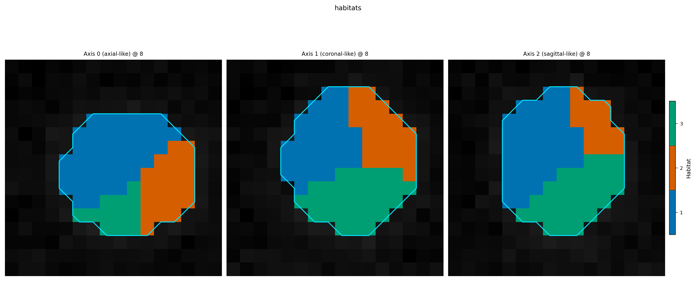

Provenance and methods paragraphs
=================================

**Level:** persistence / reporting · **Data:** synthetic · **Extras:** none · **Time:** ~10–30 s

Provenance is part of the data model:

* :meth:`~habit.spec.HabitatSpec.fingerprint` changes when stage params change
* :class:`~habit.contracts.RunManifest` records what **actually ran**
* :meth:`~habit.contracts.RunManifest.describe_methods` drafts a manuscript
  methods paragraph from that record

Script
------

.. literalinclude:: scripts/provenance_methods_demo.py
   :language: python
   :start-after: # BEGIN example
   :end-before: # END example

Draw the figures
----------------

Paste this after the Script block (it uses ``cohort`` and ``result``).
Writes ``out/provenance_methods_overlay.png``.

.. literalinclude:: scripts/provenance_methods_demo.py
   :language: python
   :start-after: # BEGIN figures
   :end-before: # END figures

Run::

   python docs/source/examples/scripts/provenance_methods_demo.py

Output
------

Illustrative (fingerprints change with stage params)::

   spec_a fingerprint: ...
   spec_b fingerprint: ...
   fingerprints equal: False
   Wrote out/provenance_methods_overlay.png

Figures
-------

The study behind ``describe_methods()`` still produces habitat maps:

   :func:`~habit.viz.plot_habitat_overlay` on the fingerprinted run.

What to read next
-----------------

* :doc:`persistence` — ``StudyResult.save`` writes ``run_manifest.json``
* :doc:`apply_saved_model` — reusable ``.habitatmodel`` archives
* :doc:`../api/data_model` — ``Provenance`` / ``RunManifest`` reference
