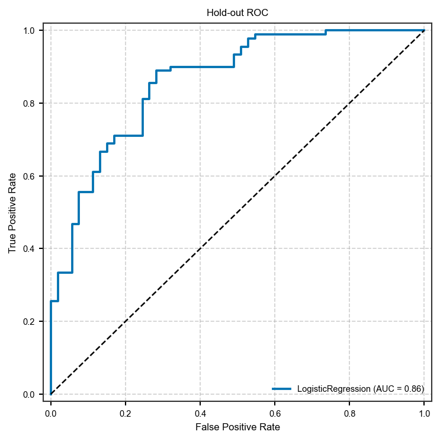
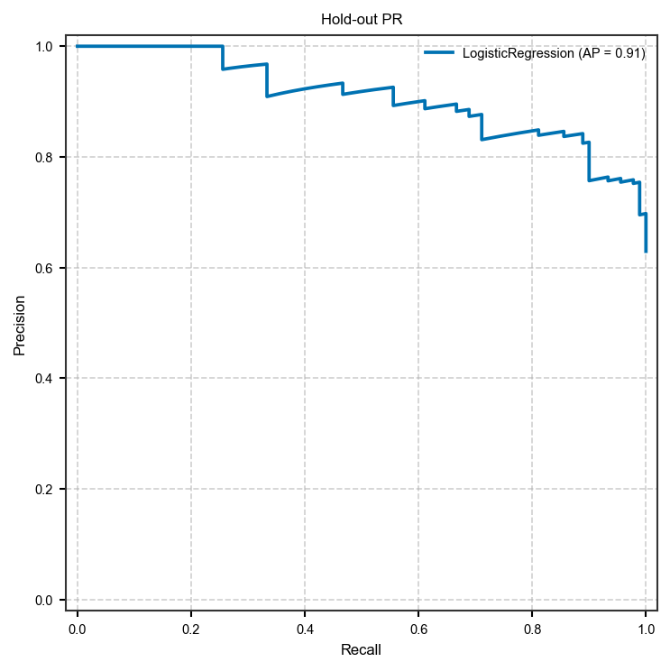
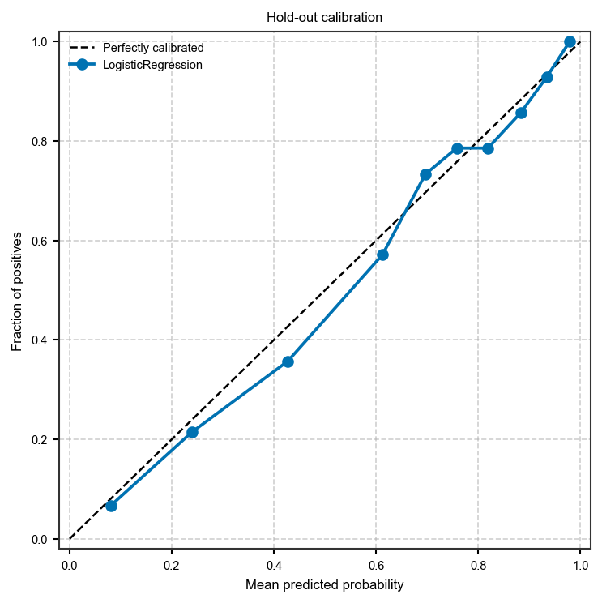
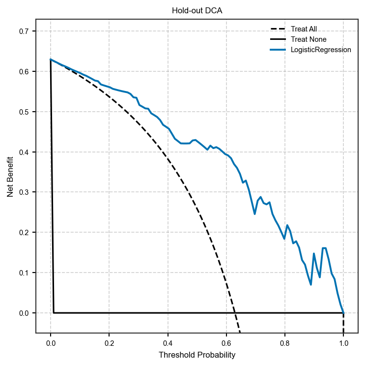
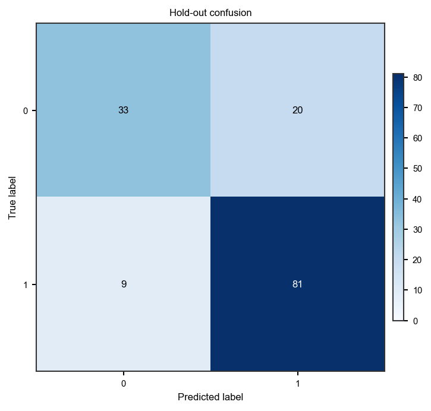
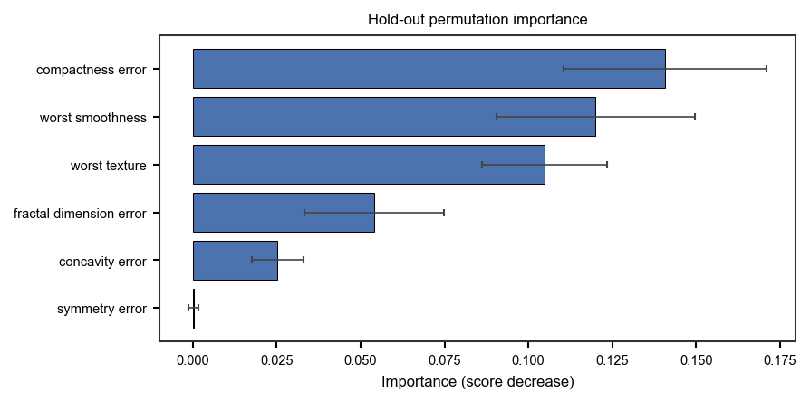
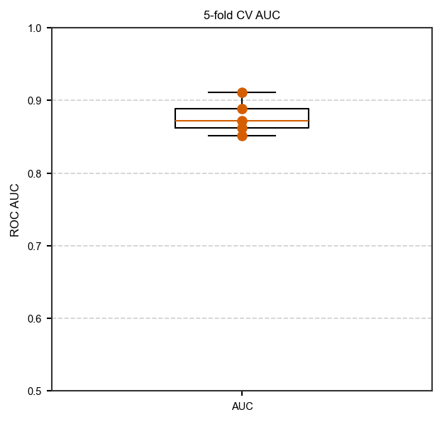

Tabular machine learning: train, cross-validate, predict
=========================================================

Habitat (and radiomics) analyses bottom out in a per-subject feature table;
the v1 ML recipes model that table directly. This example covers:

1. declare the modelling definition as an :class:`~habit.spec.MLSpec` (one
   ordered ``steps`` list of preprocessors and feature selectors — list
   order is execution order — plus the classifier and metrics),
2. hold-out evaluation with :func:`~habit.recipes.train_model`,
3. K-fold cross-validation with :func:`~habit.recipes.cross_validate`,
4. inference with :func:`~habit.recipes.predict_model`,
5. **TablePipeline** save/load (``.habitpipeline`` archive) — the tabular
   equivalent of ``HabitatModel.save/load``.

Two guarantees make these recipes leak-free by construction: under a split
or a fold the pipeline sees the training rows **only**, and at prediction
time the fitted preprocessing/selection state is replayed rather than
refitted.

The gallery table is ``demo_data/ml_data/breast_cancer_dataset.csv``. Edit
``DATA`` / ``ID_COL`` / ``LABEL_COL`` / ``FEATURES`` to your own CSV. The
demo keeps moderately informative columns (error / texture / smoothness),
not the near-perfect tumour-size features, so hold-out ROC looks like a
typical imaging-ML paper rather than a right-angle. Figures are scored on
**held-out** rows only. This is a software demo, not a clinical claim.

Script
------

Change ``DATA`` / column names to your table. Figures land under ``out/``.

.. literalinclude:: scripts/tabular_ml_quickstart.py
   :language: python
   :start-after: # BEGIN example
   :end-before: # END example

Draw the figures
----------------

Paste this after the Script block (it uses ``y_true``, ``y_prob``,
``y_pred``, ``FEATURES``, ``imp_mean``, ``imp_std``, and ``cv``). Writes
``out/tabular_ml_*.png``.

.. literalinclude:: scripts/tabular_ml_quickstart.py
   :language: python
   :start-after: # BEGIN figures
   :end-before: # END figures

Run from the repository root (one line)::

   python docs/source/examples/scripts/tabular_ml_quickstart.py

Output
------

Real output of the script above (seed 42)::

   Table: 569 rows x 6 features, outcome=binary

   --- Hold-out split (75% train / 25% test) ---
   Train metrics: {'accuracy': 0.833, 'auc': 0.893}
   Test metrics:  {'accuracy': 0.797, 'auc': 0.861}

   --- 5-fold cross-validation ---
   Mean metrics: {'accuracy': 0.819, 'auc': 0.877}
   Std metrics:  {'accuracy': 0.027, 'auc': 0.021}
   Fold AUCs:    [0.851, 0.889, 0.911, 0.862, 0.872]

   --- TablePipeline round-trip ---
   Saved demo.habitpipeline (...)
   Reloaded classifier: LogisticRegressionClassifier
   Hold-out predictions: 143 rows, AUC=0.861

Figures
-------

Hold-out / CV figures from the demo subset (not a clinical claim).

   Hold-out ROC (:func:`~habit.viz.plot_roc`). Test AUC 0.86.

   Hold-out precision-recall (:func:`~habit.viz.plot_precision_recall`).

   Hold-out calibration (:func:`~habit.viz.plot_calibration`).

   Hold-out decision-curve analysis (:func:`~habit.viz.plot_decision_curve`).

   Hold-out confusion matrix (:func:`~habit.viz.plot_confusion_matrix`).

   Hold-out permutation importance
   (:func:`~habit.viz.plot_permutation_importance`).

   Five-fold CV AUC (mean 0.88). Demo subset, not a clinical claim.

What to read next
-----------------

* :doc:`ml_advanced` — staged selectors + ``compare_models``
* :doc:`../api/domain_table` — tabular building blocks
* :doc:`../configuration/machine_learning` — YAML equivalent (``habit model`` / ``habit cv``)
