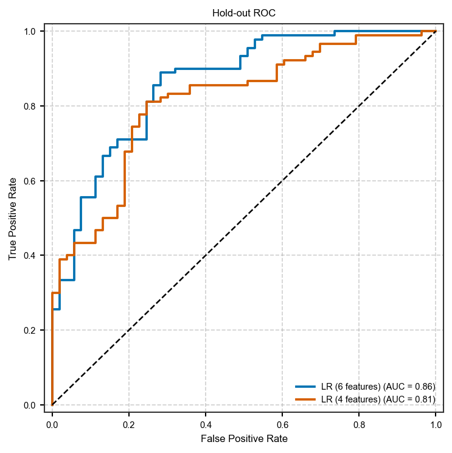
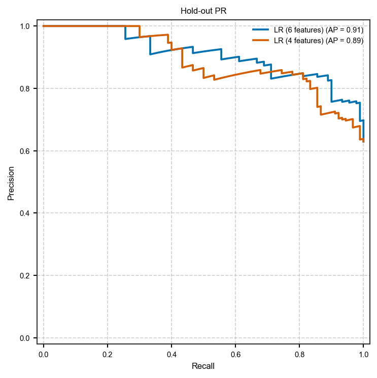
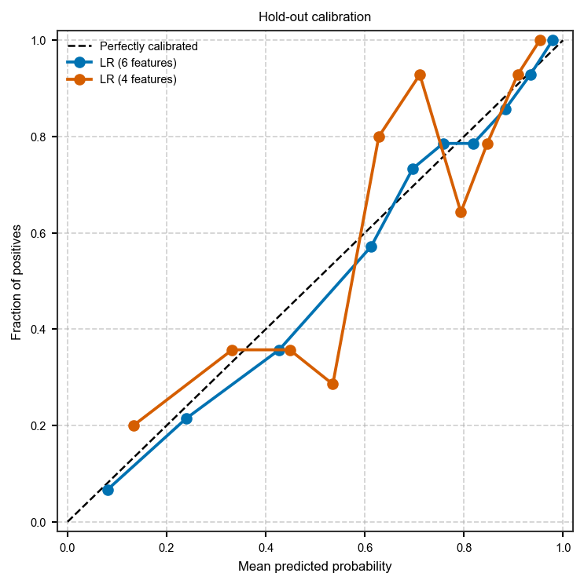
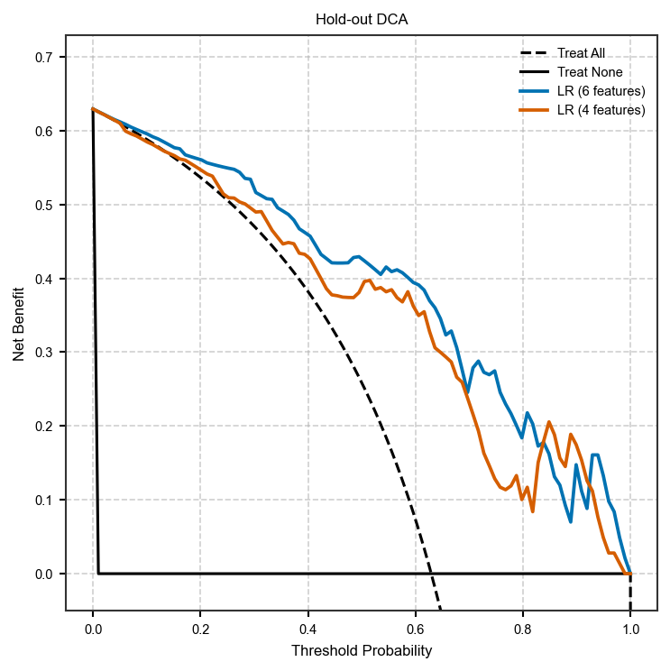

Tabular ML API (train / CV / predict / compare)
===============================================

Recipes:

* :func:`~habit.recipes.train_model`
* :func:`~habit.recipes.cross_validate`
* :func:`~habit.recipes.predict_model`
* :func:`~habit.recipes.compare_models`

Persistence: :meth:`~habit.domain.pipeline.TablePipeline.save` /
:meth:`~habit.domain.pipeline.TablePipeline.load` (``.habitpipeline``).

``compare_models`` validates :class:`~habit.schemas.workflows.ml.ComparisonFileConfig`:
each file **must** declare ``prob_col`` (positive-class probability). Write
probabilities from ``PredictionResult.probabilities`` when exporting CSVs.

**Atomic** — call ``predict_model`` on a one-row
:class:`~habit.contracts.FeatureTable` (or any held-out id slice).

The gallery table is ``demo_data/ml_data/breast_cancer_dataset.csv``. Edit
``DATA`` / column names / ``FEATURES`` (and the weaker ``FEATURES_B`` subset)
to your own CSV. Two logistic models on overlapping but unequal feature sets
give distinct hold-out curves (AUC about 0.86 vs 0.81 here) — not an oracle
CSV. This is a software demo, not a clinical claim.

Script
------

Change ``DATA`` / column names to your table. Figures land under ``out/``.

.. literalinclude:: scripts/tabular_ml_api_demo.py
   :language: python
   :start-after: # BEGIN example
   :end-before: # END example

Run from the repository root (one line)::

   python docs/source/examples/scripts/tabular_ml_api_demo.py

Coverage
--------

``demo_data/results/api/07_ml`` (train / CV / predict / compare on real
``demo_data/ml_data`` tables).

Output
------

Real output of the script above (seed 42)::

   === train_model (hold-out) ===
     model_a test metrics: {'accuracy': 0.797, 'auc': 0.861}
     model_b test metrics: {'accuracy': 0.748, 'auc': 0.814}
   === cross_validate ===
     mean metrics: {'accuracy': 0.819, 'auc': 0.877}
     fold AUCs:    [0.851, 0.889, 0.911, 0.862, 0.872]
     hold-out AUC model_a=0.861 model_b=0.814
   === Atomic: single-row predict ===
     row id=subj001, pred=1

Figures
-------

Two-model hold-out overlay from the demo subset (not a clinical claim).

   Hold-out ROC overlay (:func:`~habit.viz.plot_roc`). AUC 0.86 vs 0.81.

   Hold-out precision-recall (:func:`~habit.viz.plot_precision_recall`).

   Hold-out calibration (:func:`~habit.viz.plot_calibration`).

   Hold-out decision-curve analysis (:func:`~habit.viz.plot_decision_curve`).

What to read next
-----------------

* :doc:`features_radiomics_api` — upstream feature tables
* :doc:`viz_parallel_extras_api` — ML coefficient forest and extras
