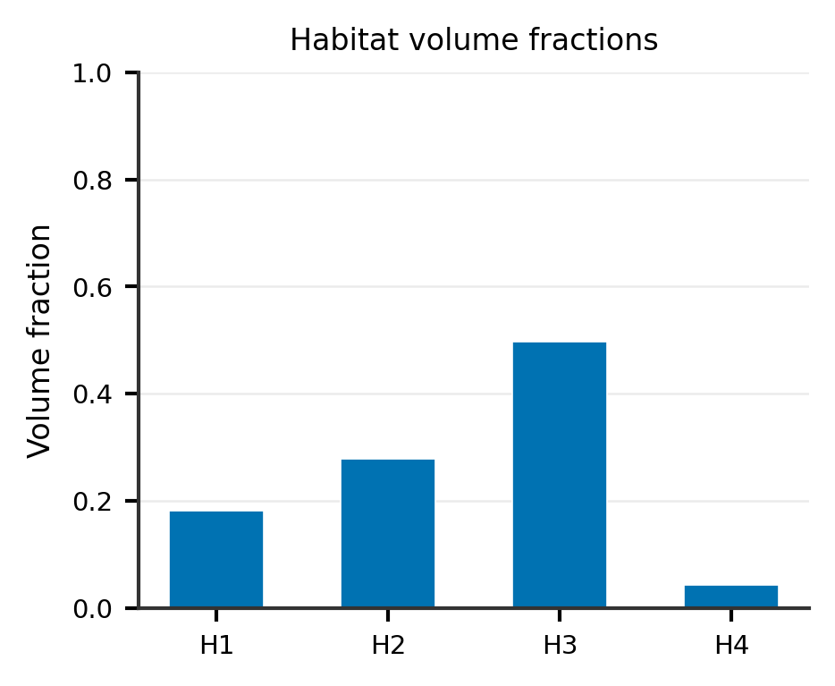
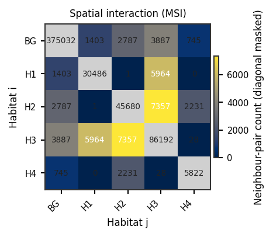
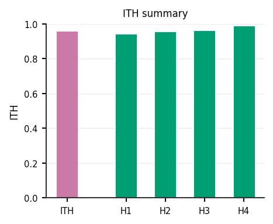
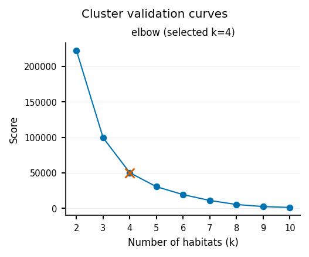

Two-step habitat analysis, end to end
=====================================

**Level:** recipe · **Data:** ``demo_data/preprocessed`` · **Extras:** optional
``[view]`` · **Time:** ~30–90 s

The classical habitat design: each subject's ROI is partitioned into
supervoxels, every supervoxel is described by its features, and the habitat
definition is learned from all subjects' supervoxels pooled together.

1. load a cohort (:func:`~habit.cohort_from_directory`),
2. declare ordered :class:`~habit.spec.Stage` entries on
   :class:`~habit.spec.HabitatSpec` (partition + pool ⇒ two_step),
3. fit with :meth:`~habit.recipes.Study.fit_predict`,
4. save maps / features under ``out/``.

The factory :func:`~habit.recipes.two_step_habitat` remains for convenience.

Script
------

Change ``DATA`` / ``MODALITIES`` / ``ROI`` to your preprocessed tree (same
layout as :func:`~habit.cohort_from_directory`).

.. literalinclude:: scripts/two_step_habitat_quickstart.py
   :language: python
   :start-after: # BEGIN example
   :end-before: # END example

Draw the figures
----------------

Paste this after the Script block (it uses ``cohort``, ``result``, and
``ROI``). Writes ``out/two_step_*.png``.

.. literalinclude:: scripts/two_step_habitat_quickstart.py
   :language: python
   :start-after: # BEGIN figures
   :end-before: # END figures

Change the Spec (other methods and parameters)
----------------------------------------------

The script above is **one worked recipe**, not the only recipe. Each
``Stage`` is a slot: keep the scaffolding (``cohort_from_directory`` →
``HabitatSpec`` → :meth:`~habit.recipes.Study.fit_predict`) and swap the
``Spec("name", {params})`` in that slot.

**Slots in this two-step example**

* ``extract_voxel_features`` — voxel field (here ``raw``)
* ``partition`` — supervoxels (here ``kmeans`` with ``n_supervoxels``)
* ``pool`` — subject → cohort watershed
* ``fit`` — cohort habitats (here ``kmeans`` with auto-K)
* ``assign`` — label units (``nearest_centroid``)
* ``quantify`` / ``quantify2`` / … — summaries that do not change the map

**Concrete swaps** (paste over the matching ``Stage(...)``)::

   # 1) SLIC supervoxels instead of k-means partition
   Stage("partition", Spec("slic", {"n_supervoxels": 50}))

   # 2) GMM instead of k-means habitats (fixed K)
   Stage("fit", Spec("gmm", {"n_habitats": 4, "covariance_type": "full"}))

   # 3) Scale voxels before partition (insert after extract, before partition)
   Stage("preprocess1", Spec("winsorize", {"winsor_limits": (0.05, 0.05), "across_features": False}))
   Stage("preprocess2", Spec("minmax", {"across_features": False}))

   # 4) Mixed voxel families — needs two series
   from habit import parse_feature_expression
   Stage(
       "extract_voxel_features",
       parse_feature_expression(
           'concat(raw("T1"), local_entropy("T2", kernel_size=3, bins=32))'
       ),
   )

   # 5) Supervoxel stats tree (insert after partition)
   Stage(
       "extract_supervoxel_features",
       parse_feature_expression(
           'concat(mean("T1"), std("T1", as_="t1_spread"), percentile("T2", q=90))'
       ),
   )

Full list of names, every parameter, allowed values, and the YAML twin:
:doc:`../how_to/habitat_components` (sections 1 and 4; each splits
single-modality leaves from combiners). Partition names
live under ``list_plugins("supervoxelizer")``.

Discover the same facts in a running interpreter::

   from habit import list_plugins, get_param_schema

   print([p.name for p in list_plugins("habitat_model_fitter")])
   print(get_param_schema("kmeans", "habitat_model_fitter").model_fields.keys())

Output
------

Illustrative (counts / fingerprint depend on your ``demo_data``)::

   Cohort: 2 subjects -> ['subj001', 'subj002']
   Habitat maps: 2
   Saved study to out/two_step_demo

The Script block prints these lines and calls ``result.save(...)``. The
**Draw the figures** block writes ``out/two_step_*.png``. Edit those
paths if you want a different folder.

``HABIT_NO_VIEW=1`` skips the optional napari window when you run the
full script from the repository root (maintainers then copy ``out/*.png``
into the docs gallery)::

   python docs/source/examples/scripts/two_step_habitat_quickstart.py

Same ``demo_data/preprocessed`` + ``random_seed=42`` reproduces the habitat
**labels** (numerical contract). PNG **pixels** can differ slightly across
matplotlib / OS / DPI.

Figures
-------

These are the same files the **Draw the figures** block writes under ``out/``. The site
gallery is a copy of those PNGs (same composition; not a cropped re-plot).
Overlay uses the public 3-D default: three orthogonal panels. The
triptych uses ``axis=0`` (one axial slice), which is the public default
and is written in the copied block.

.. figure:: ../_static/images/examples/two_step_overlay.png
   :alt: Two-step habitat overlay on anatomy
   :width: 720

   Habitat overlay (:func:`~habit.viz.plot_habitat_overlay`, three
   orthogonal panels).

.. figure:: ../_static/images/examples/two_step_triptych.png
   :alt: Anatomy, supervoxels, and habitats
   :width: 720

   Anatomy | supervoxels | habitats (:func:`~habit.viz.plot_partition_triptych`,
   ``axis=0``).

   Volume fractions (:func:`~habit.viz.plot_habitat_volume_fractions`).

   MSI matrix (:func:`~habit.viz.plot_msi_matrix`).

   ITH summary (:func:`~habit.viz.plot_ith_summary`).

   Auto-K curves (:func:`~habit.viz.plot_cluster_validation_from_report`).

Export YAML for CLI / YAML-API replay
-------------------------------------

After constructing the same :class:`~habit.spec.HabitatSpec` in Python, call
:func:`~habit.spec.save_habitat_config` to write a complete effective v1
document (defaults expanded). Then
:func:`~habit.recipes.run_from_yaml` or ``habit get-habitat --config`` on
that file reproduces the habitat maps voxel-wise. See
:doc:`../tutorial/quickstart_python` and :doc:`run_from_yaml`.

What to read next
-----------------

* :doc:`../how_to/habitat_components` — which ``Spec`` names exist, and what each parameter means
* :doc:`habitat_analysis_overview` — recipe / atomic / custom map
* :doc:`habitat_atomic_ops` — same science as single-argument callables
* :doc:`habitat_custom_pipeline` — swap components safely
* :doc:`../tutorial/quickstart_python` — demo_data path + napari screenshots
* :doc:`apply_saved_model` — persist the model and project it onto new subjects
* :class:`~habit.recipes.StudyResult` — what a recipe returns
