Publication figures with habit.viz
==================================

Interactive napari
(:func:`~habit.viz.view_habitat_napari` / default ``habit view``)
is a convenient way to inspect habitat maps after ``get-habitat`` — see
region vs contour screenshots in :doc:`../tutorial/quickstart`. It needs the
optional ``[view]`` extra (recommended at :doc:`../tutorial/installation`);
without it the CLI falls back to a matplotlib PNG. Force the static path with
``habit view --backend matplotlib`` (:func:`~habit.viz.plot_habitat_overlay`,
needs ``[viz]``). Orthogonal panels follow the radiological display
convention (anterior / superior up; patient's right on the viewer's left)
via ``display_convention`` (``\"radiological\"`` default,
``\"neurological\"``, or ``\"native\"`` to skip flips). Pass an
:class:`~habit.ImageVolume` rather than ``.data`` so direction and
spacing travel with the array — otherwise coronal / sagittal superior-inferior
can look flipped relative to ITK-SNAP. See :mod:`habit.viz.orientation`.

For fuller **3D** review, load the source image and ``*_habitats.nrrd``
together in **ITK-SNAP**, **3D Slicer**, or a **SimpleITK**-based viewer
(label overlay / segmentation).

Every function in :mod:`habit.viz` is **pure**: arrays or contract objects in,
a matplotlib ``Figure`` out — no ``savefig`` inside the library. Callers choose
where figures go. All text is English/ASCII via
:func:`~habit.viz.labels.sanitize_label`.

This example covers:

* population-level habitat-clustering PCA from a two-step ``StudyResult``,
* Kaplan-Meier curves stratified by a **risk split** (not by the event itself),
* Cox forest, risk triptych, time-dependent AUC, Brier, survival calibration,
* regression diagnostics (predicted vs observed, residuals, Q-Q, Bland-Altman).

Binary ML ROC / PR / calibration / DCA plots live on :doc:`tabular_ml` and
:doc:`ml_advanced`.

Script
------

Figures land under ``out/``. Survival rows are constructed in the script with
a moderate effect and independent censoring so the KM strata overlap; swap
that block for your own ``time`` / ``event`` table.

.. literalinclude:: scripts/visualization_demo.py
   :language: python
   :start-after: # BEGIN example
   :end-before: # END example

Run from the repository root (one line)::

   python docs/source/examples/scripts/visualization_demo.py

Output
------

::

   Wrote out/habitat_pca_2d.png
   Wrote out/kaplan_meier.png
   Wrote out/cox_forest.png
   Wrote out/risk_triptych.png
   Wrote out/survival_calibration.png
   Wrote out/time_dependent_auc.png
   Wrote out/brier_curve.png
   Wrote out/predicted_vs_observed.png
   Wrote out/residuals.png
   Wrote out/residual_qq.png
   Wrote out/bland_altman.png

Figures (PCA / survival / regression)
-------------------------------------

Regenerated by ``python docs/source/examples/scripts/visualization_demo.py``.
Survival / regression panels are synthetic demos, not a clinical claim.

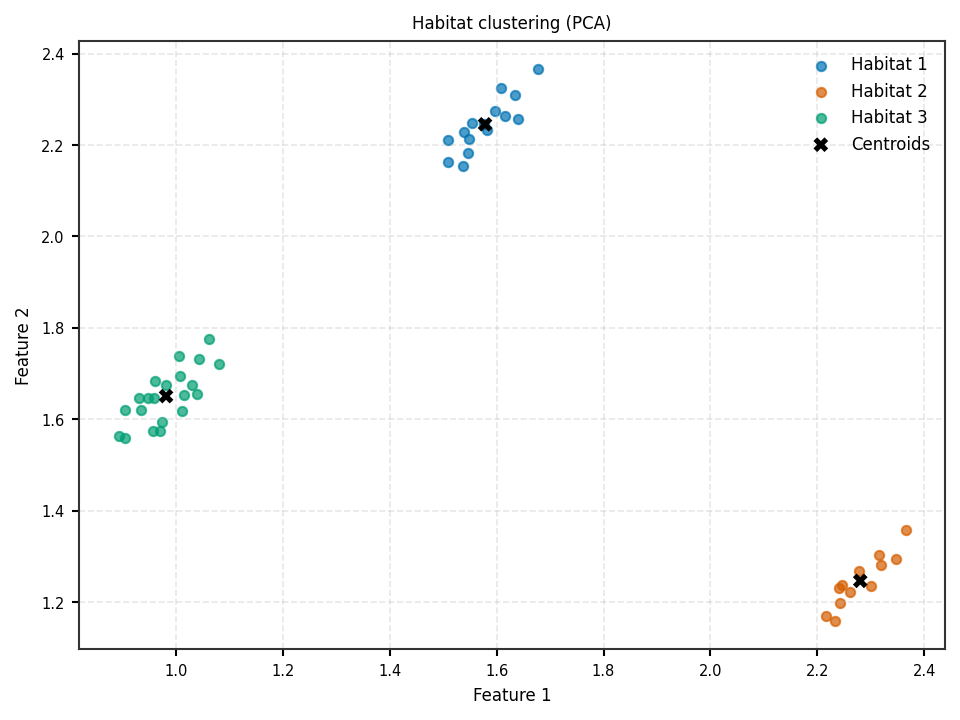

   Population clustering PCA (:func:`~habit.viz.plot_habitat_clustering_pca_2d`).

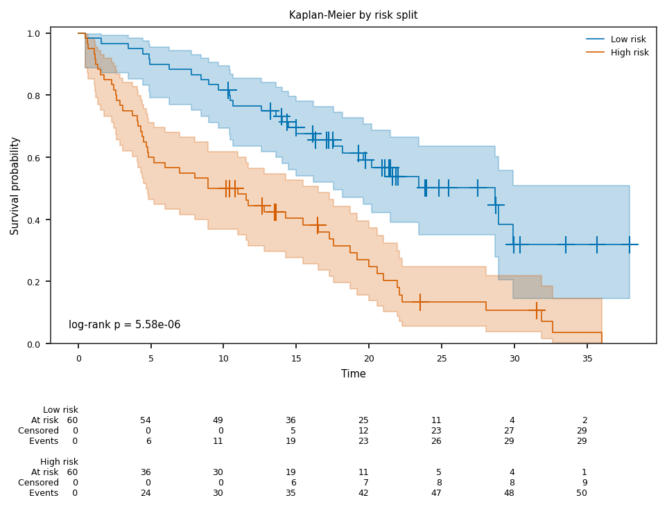

   Kaplan-Meier by high/low risk (:func:`~habit.viz.plot_kaplan_meier`).

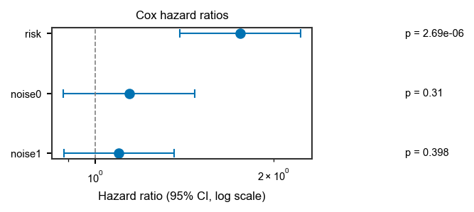

   Cox hazard ratios (:func:`~habit.viz.plot_cox_forest`).

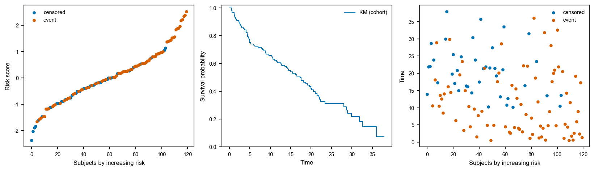

   Risk triptych (:func:`~habit.viz.plot_risk_triptych`).

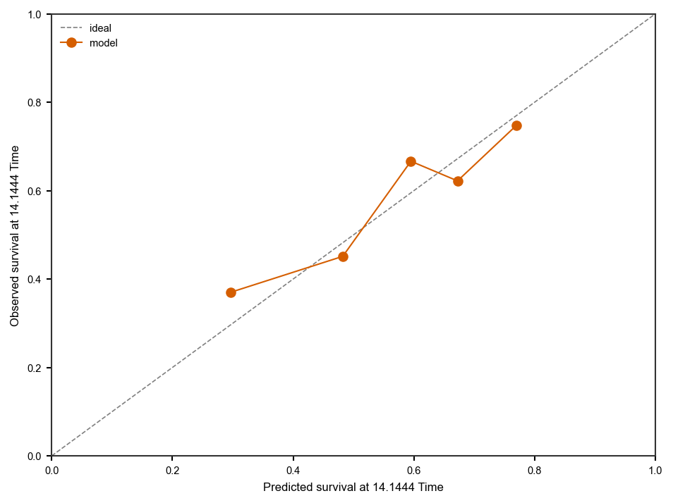

   Survival calibration (:func:`~habit.viz.plot_survival_calibration`).

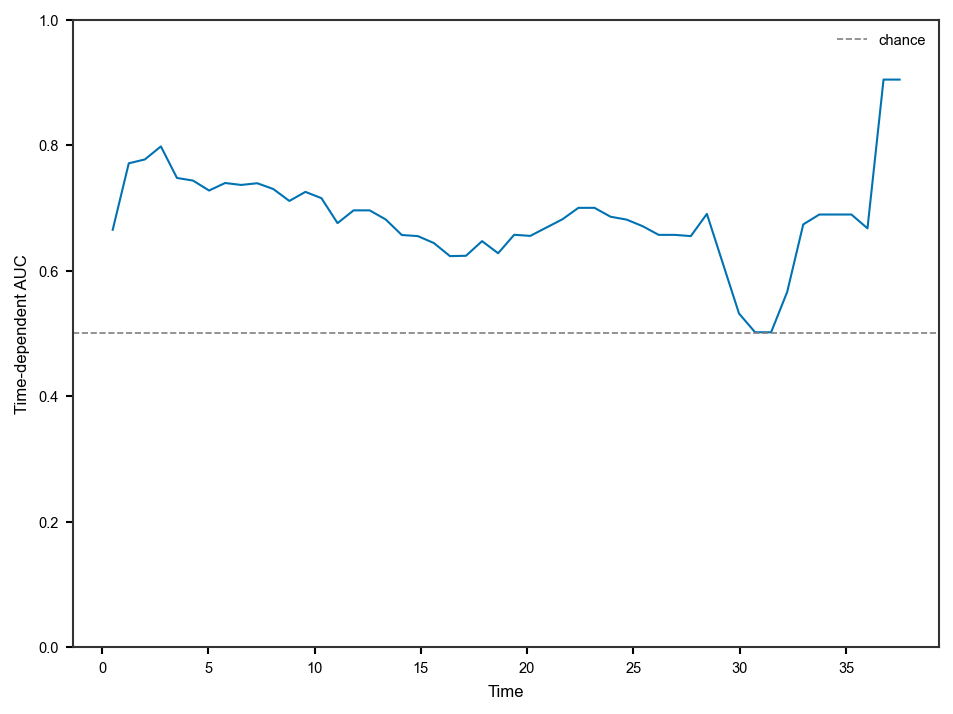

   Time-dependent AUC (:func:`~habit.viz.plot_time_dependent_auc`).

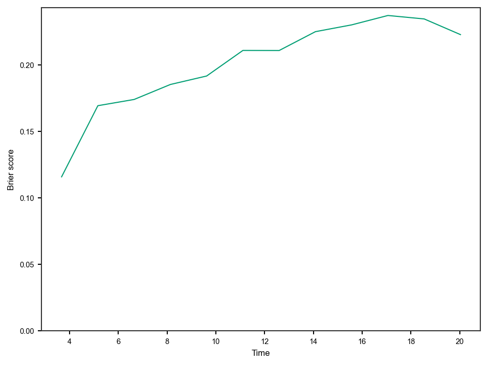

   Brier score curve (:func:`~habit.viz.plot_brier_curve`).

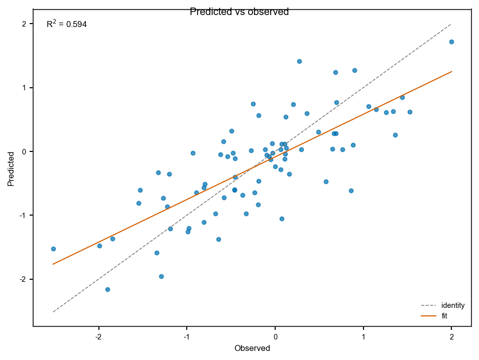

   Regression diagnostic (:func:`~habit.viz.plot_predicted_vs_observed`).

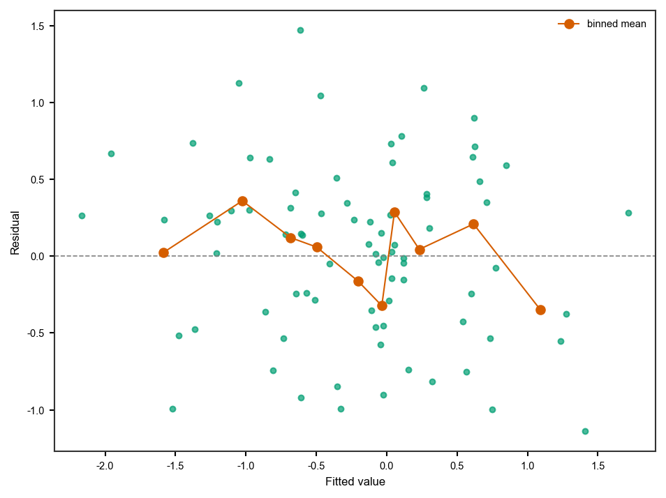

   Residuals (:func:`~habit.viz.plot_residuals`).

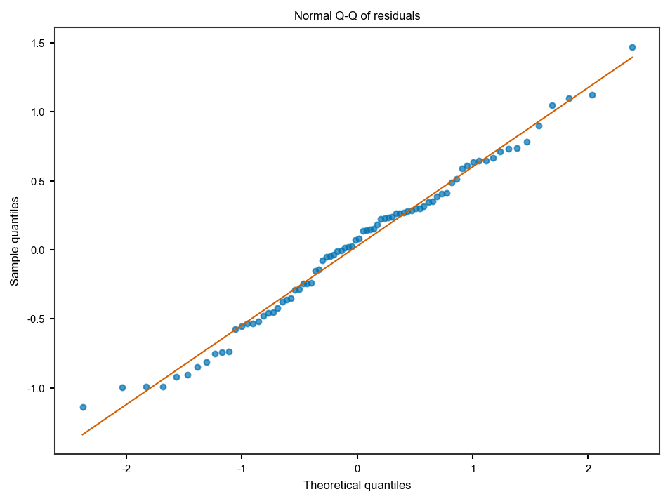

   Residual Q-Q (:func:`~habit.viz.plot_residual_qq`).

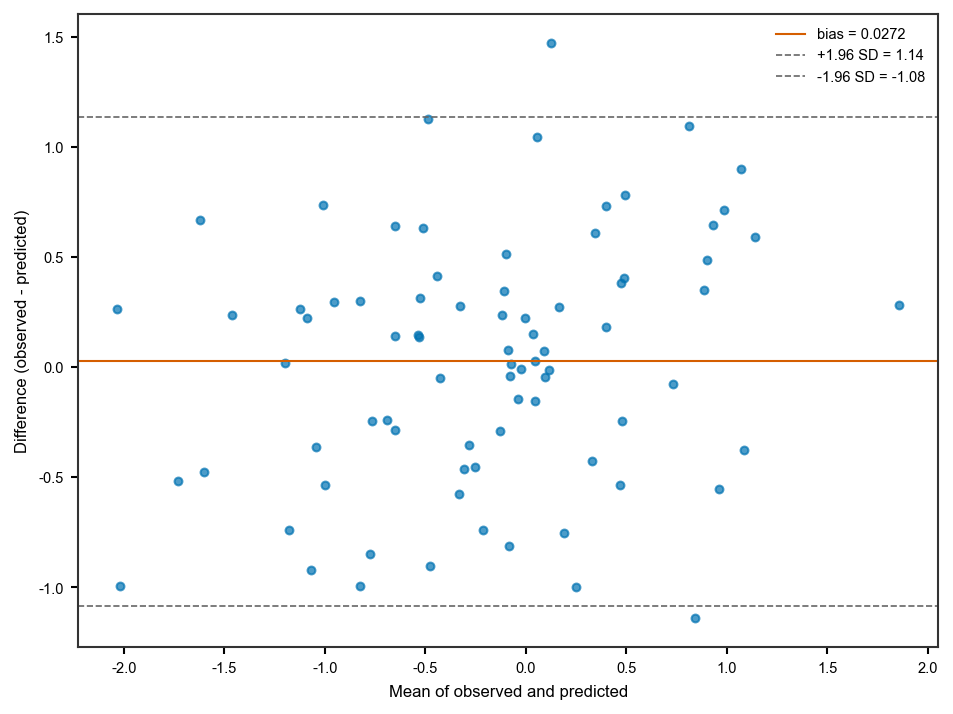

   Bland-Altman (:func:`~habit.viz.plot_bland_altman`).

Habitat graph topology figures
------------------------------

When extracting the built-in ``graph`` family with ``graph.visualize: true``,
the recipe writes optional figures under ``visualizations/graph/``. The same
construction is available as pure plotters (``[viz]``; 3D also needs
``[view]``)::

   from habit.viz import (
       plot_habitat_graph_network_2d,
       plot_habitat_graph_slice,
       render_habitat_graph_network_3d,
       render_habitat_graph_surface_3d,
   )

See :doc:`graph_features` and :doc:`../reference/features/graph`.

Voxel texture / feature-map slices
----------------------------------

Local entropy (and densified ``VoxelFeatureField`` columns such as
``voxel_radiomics``) use the same pure-figure contract::

   from habit.viz import dense_voxel_feature_map, plot_voxel_texture_slice

See :doc:`voxel_texture` and :doc:`../how_to/voxel_texture`.

Habitat-core figures (maps, validation, compare)
------------------------------------------------

Beyond PCA / graph / texture, the habitat product spine also has pure plotters::

   from habit.viz import (
       plot_cluster_validation_from_report,  # auto-K curves on HabitatModel
       plot_habitat_volume_fractions,
       plot_msi_matrix,
       plot_ith_summary,
       plot_partition_triptych,              # anatomy | supervoxels | habitats
       plot_habitat_label_compare,           # train vs predict (+ disagreement)
   )

End-to-end on ``demo_data/preprocessed`` (swap ``DATA`` / modalities / ROI);
figures go to ``out/``.

.. literalinclude:: scripts/habitat_core_viz_demo.py
   :language: python
   :start-after: # BEGIN example
   :end-before: # END example

Run::

   python docs/source/examples/scripts/habitat_core_viz_demo.py

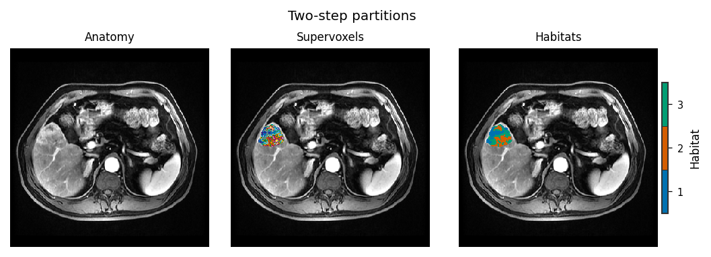

   Two-step partitions (:func:`~habit.viz.plot_partition_triptych`).

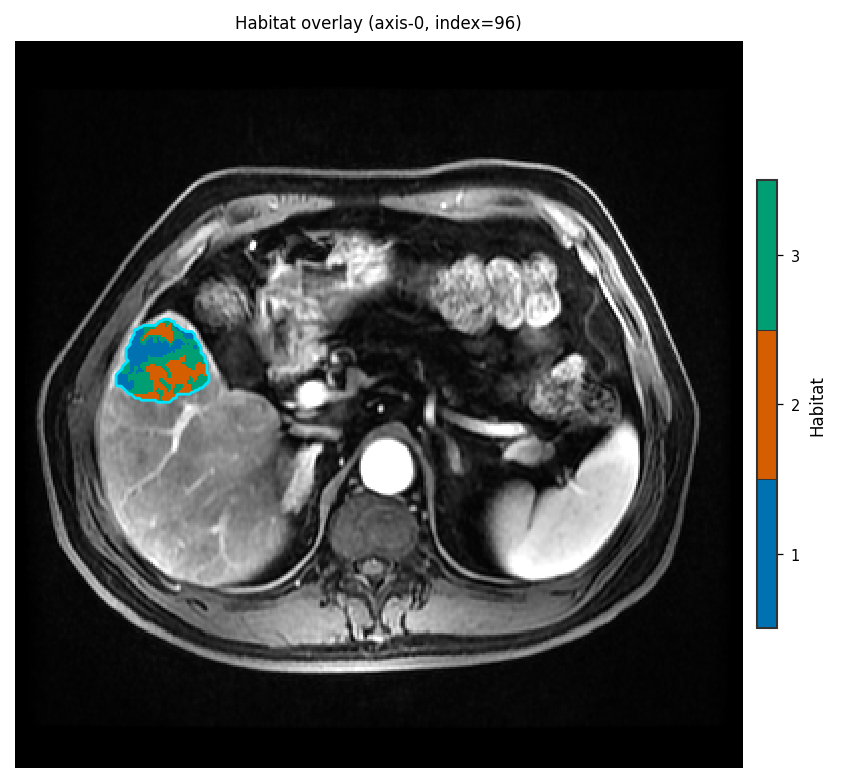

   Overlay (:func:`~habit.viz.plot_habitat_overlay`).

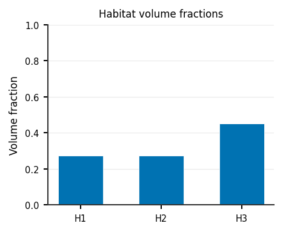

   Volume fractions.

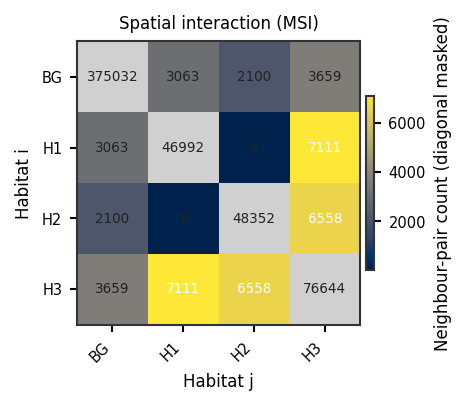

   MSI matrix (:func:`~habit.viz.plot_msi_matrix`).

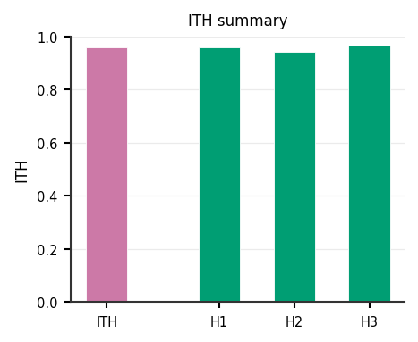

   ITH summary.

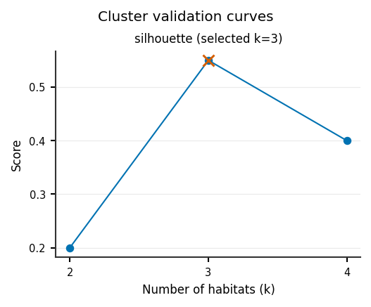

   Auto-K curves.

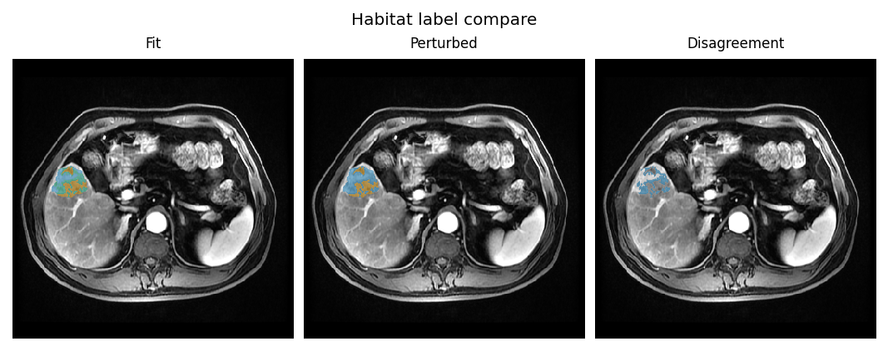

   Label compare (:func:`~habit.viz.plot_habitat_label_compare`).

Habitat feature contrast (heatmap / Cliff's delta / PCA / violin / bars)
-------------------------------------------------------------------------

After an ``each_habitat`` (or any wide ``habitat_{id}_{feature}``) table,
:func:`~habit.compare_habitat_features` plus the
``plot_habitat_feature_*`` helpers are the reviewer figures. The default
effect figure is the features x pair Cliff's :math:`\delta` heatmap;
``pair=(a, b)`` keeps the lollipop. With dozens of features the heatmap
keeps the top-k by max :math:`|\delta|` and
:func:`~habit.viz.plot_habitat_feature_components` summarises separation.
Bars are **faceted by feature** so Energy and ``volume_fraction`` do not
share one linear y-axis. Regenerated by
``python docs/source/examples/scripts/habitat_feature_compare_demo.py``.

.. literalinclude:: scripts/habitat_feature_compare_demo.py
   :language: python
   :start-after: # BEGIN figures
   :end-before: # END figures

.. figure:: ../_static/images/examples/habitat_feature_heatmap_cohort.png
   :alt: Cohort habitat-by-feature z-score heatmap
   :width: 520

   Cohort mean heatmap (:func:`~habit.viz.plot_habitat_feature_heatmap`).

.. figure:: ../_static/images/examples/habitat_feature_effect.png
   :alt: Features-by-pair Cliff's delta heatmap
   :width: 520

   Default features x pair Cliff's delta
   (:func:`~habit.viz.plot_habitat_feature_effect`).

.. figure:: ../_static/images/examples/habitat_feature_components.png
   :alt: PCA of subject-by-habitat feature rows
   :width: 620

   PCA of (subject, habitat) rows
   (:func:`~habit.viz.plot_habitat_feature_components`).

.. figure:: ../_static/images/examples/habitat_feature_violin.png
   :alt: Per-feature habitat distributions
   :width: 520

   Distributions (:func:`~habit.viz.plot_habitat_feature_violin`).

.. figure:: ../_static/images/examples/habitat_feature_bars.png
   :alt: Per-feature habitat means with independent y-axes
   :width: 620

   Faceted bars (:func:`~habit.viz.plot_habitat_feature_bars`).

What to read next
-----------------

* :doc:`persistence` — ``StudyResult.save(write_cluster_plots=True)``
* :doc:`../api/python_api` — when to use ``habit.viz`` vs CLI plot outputs
