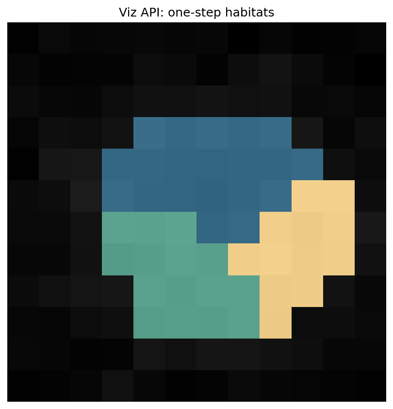
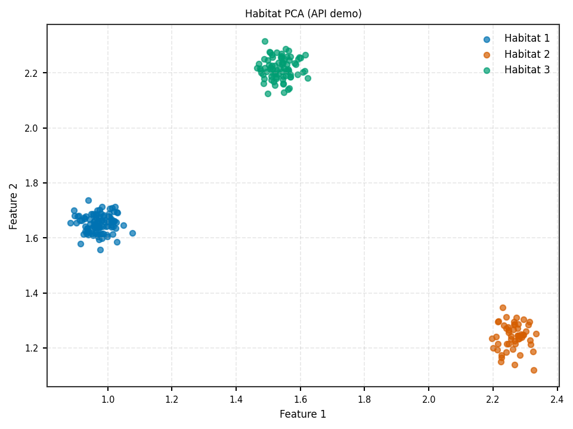
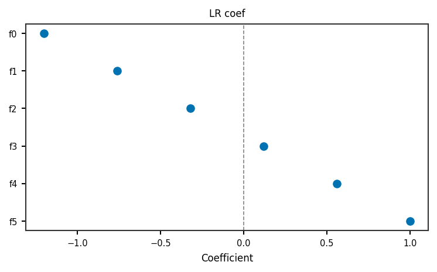

Visualization, RunPolicy parallelism, and extras API
====================================================

* :mod:`habit.viz` — publication figures (habitat PCA, coefficient forest, …)
* :class:`~habit.spec.RunPolicy` +
  :class:`~habit.execution.process_pool.ProcessPoolBackend` — parallel
  subject scheduling without changing scientific results under a fixed seed
* :func:`~habit.recipes.run_from_yaml`, :func:`~habit.recipes.icc_analysis`,
  :func:`~habit.recipes.test_retest_analysis` — covered end-to-end in
  ``demo_data/results/api/09_extras``

**Atomic** predict after a parallel fit remains
``result.pipeline(subject)``.

.. include:: ../_includes/windows_multiprocessing.rst

This demo constructs a :class:`~habit.spec.RunPolicy` with
``backend="process"`` for illustration; the short path below runs
``one_step`` serially. Keep any real ``ProcessPoolBackend.map`` /
``recipes.*(…, backend=…)`` call under ``__main__``.

Script
------

.. literalinclude:: scripts/viz_parallel_extras_api_demo.py
   :language: python

Coverage
--------

* Parallel: ``03_habitat_one_step`` (``RunPolicy`` workers=2)
* Viz: ``08_viz``
* Extras: ``09_extras``

The script ends with a **napari eye-check**. ``HABIT_NO_VIEW=1`` skips it.

Output
------

::

   workers=2, backend='process'
   Wrote out/viz_parallel_overlay.png and out/viz_parallel_pca_2d.png

Figures
-------

Figures from this demo (PCA + overlay + coefficient forest):

   One-step habitats (:func:`~habit.viz.plot_habitat_overlay`).

   Population clustering PCA
   (:func:`~habit.viz.plot_habitat_clustering_pca_2d`).

   :func:`~habit.viz.plot_coefficient_forest`.

What to read next
-----------------

* :doc:`habitat_fit_modes` — serial habitat baselines
* :doc:`tabular_ml_api` — ML recipes behind the coefficient forest
