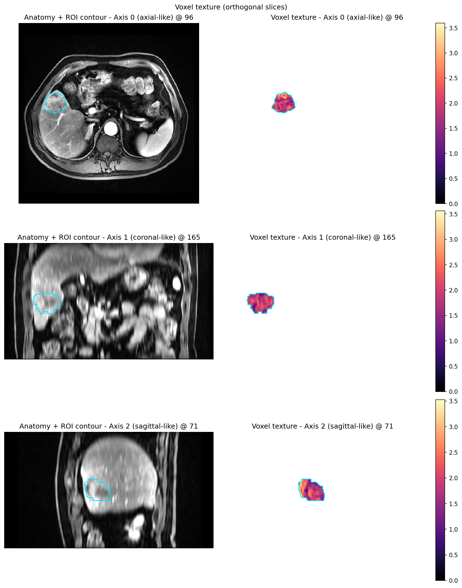
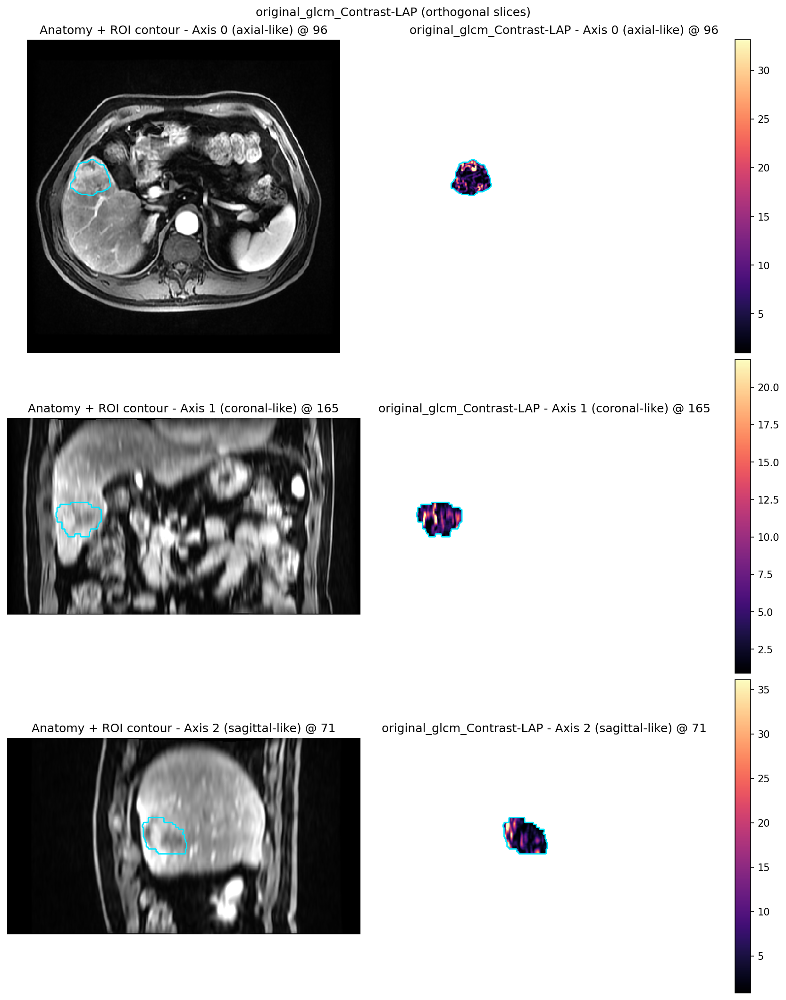
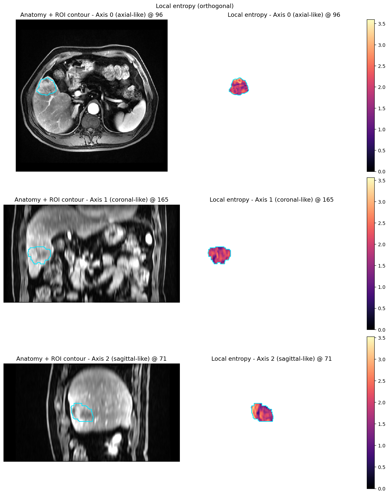

Voxel texture maps
==================

**Level:** atomic · **Data:** ``demo_data`` or synthetic · **Extras:** ``[viz]``;
PyRadiomics for GLCM · **Time:** ~10–90 s

End-to-end: one subject → :func:`~habit.local_entropy_map` plus a small
``voxel_radiomics`` GLCM set → :func:`~habit.viz.plot_voxel_texture_slice`.

Default ``mode="side_by_side"``: anatomy + ROI contour | texture map
(no alpha blend on anatomy). The script shows ``VoxelFeatureExtractorRegistry.create``
for a small GLCM set — edit ``featureClass`` for more columns.

Script
------

Change ``DATA`` / ``MODALITY`` / ``ROI`` to your preprocessed tree. Figures
land under ``out/``.

.. literalinclude:: scripts/voxel_texture_demo.py
   :language: python
   :start-after: # BEGIN example
   :end-before: # END example

Run from the repository root (one line)::

   python docs/source/examples/scripts/voxel_texture_demo.py

Output
------

::

   Wrote out/voxel_texture_entropy.png
   Wrote out/voxel_texture_glcm_contrast.png

Local entropy (anatomy | texture)
---------------------------------

   Left: greyscale anatomy with ROI outline. Right: local entropy inside the ROI.

GLCM Contrast (anatomy | texture)
---------------------------------

   Same layout for a densified ``voxel_radiomics`` GLCM Contrast column.

Orthogonal local entropy
------------------------

   Three orthogonal planes (anatomy + contour | entropy) when ``axis`` is omitted.

What to read next
-----------------

* :doc:`../how_to/voxel_texture` — layouts and registry path
* :doc:`graph_features` — graph topology **on habitat maps** (different product)
* :doc:`habitat_feature_routes` — using voxel textures inside habitat recipes
