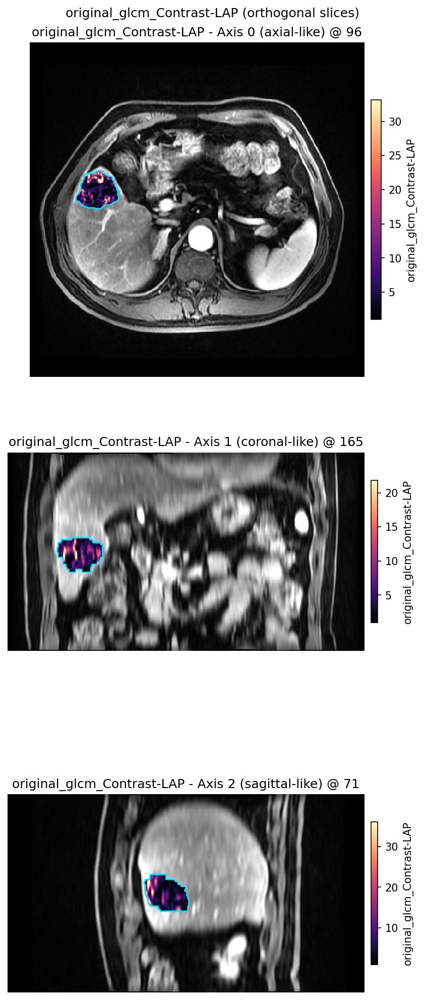

Voxel texture maps
==================

**Level:** atomic · **Data:** ``demo_data`` or synthetic · **Extras:** ``[viz]``;
PyRadiomics for GLCM · **Time:** ~10–90 s

End-to-end: one subject → :func:`~habit.local_entropy_map` plus a small
``voxel_radiomics`` GLCM set → :func:`~habit.viz.plot_voxel_texture_slice`.

Default ``mode="overlay"``: greyscale anatomy, **opaque** feature colours
inside the ROI, optional cyan contour. Pass ``mode="side_by_side"`` when you
also want a sibling raw-anatomy panel. The script shows
``VoxelFeatureExtractorRegistry.create`` for a small GLCM set — edit
``featureClass`` for more columns.

Script
------

Change ``DATA`` / ``MODALITY`` / ``ROI`` to your preprocessed tree. Figures
land under ``out/``.

.. literalinclude:: scripts/voxel_texture_demo.py
   :language: python
   :start-after: # BEGIN example
   :end-before: # END example

Run from the repository root (one line)::

   python docs/source/examples/scripts/voxel_texture_demo.py

Output
------

::

   Wrote out/voxel_texture_entropy.png
   Wrote out/voxel_texture_entropy_side_by_side.png
   Wrote out/voxel_texture_glcm_contrast.png

Local entropy on anatomy
------------------------

.. figure:: ../_static/images/examples/voxel_texture_overlay.png
   :alt: Opaque local-entropy overlay on greyscale anatomy
   :width: 720

   Default overlay: grey anatomy outside the ROI, opaque entropy colours
   inside, cyan ROI contour.

Sibling anatomy panel
---------------------

.. figure:: ../_static/images/examples/voxel_texture_side_by_side.png
   :alt: Anatomy with ROI contour beside local-entropy map
   :width: 720

   ``mode="side_by_side"`` when you also want the raw image as its own panel.

GLCM Contrast on anatomy
------------------------

   Same default overlay for a densified ``voxel_radiomics`` GLCM Contrast column.

Orthogonal local entropy
------------------------

.. figure:: ../_static/images/examples/voxel_texture_orthogonal.png
   :alt: Orthogonal local-entropy overlays on anatomy
   :width: 520

   Three orthogonal planes (opaque overlay + contour) when ``axis`` is omitted.

What to read next
-----------------

* :doc:`../how_to/voxel_texture` — layouts and registry path
* :doc:`graph_features` — graph topology **on habitat maps** (different product)
* :doc:`habitat_feature_routes` — using voxel textures inside habitat recipes
