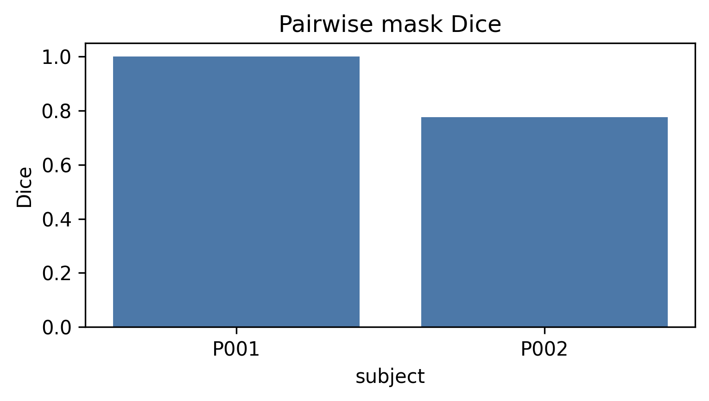

Auxiliary tools
===============

Copy-paste demos. Flags: ``habit <cmd> --help``.

::

   habit icc --config config/auxiliary/config_icc_demo.yaml

For in-memory habitat label alignment after independent clustering, use
:func:`~habit.precision.align_habitat_map` (see
:doc:`../examples/habitat_label_match`).

::

   habit dicom-info -i demo_data/dicom -o demo_data/results/htg_dicom_info.csv --one-file-per-folder
   habit merge-csv demo_data/ml_data/breast_cancer_dataset.csv demo_data/ml_data/clinical_feature.csv -o demo_data/results/htg_merged.csv --index-col subject_id
   habit dice --input1 demo_data/preprocessed --input2 demo_data/preprocessed --output demo_data/results/htg_dice_results.csv

Dice is a table; the examples gallery also draws the compared ROI:

   Pairwise Dice from :func:`~habit.recipes.dice` (:doc:`../examples/cohort_plugins_auxiliary`).
