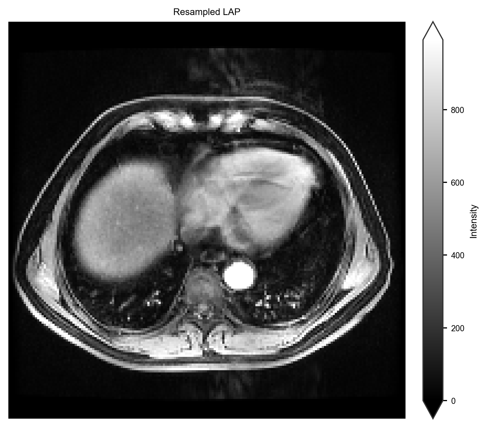
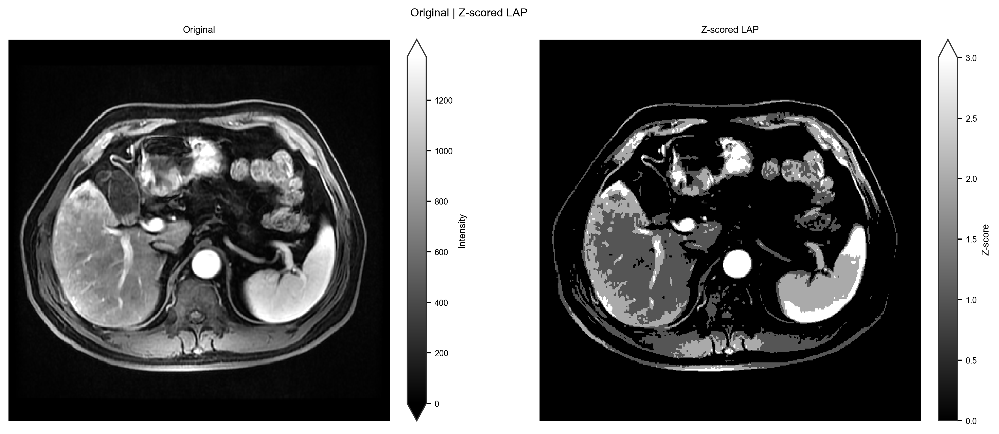
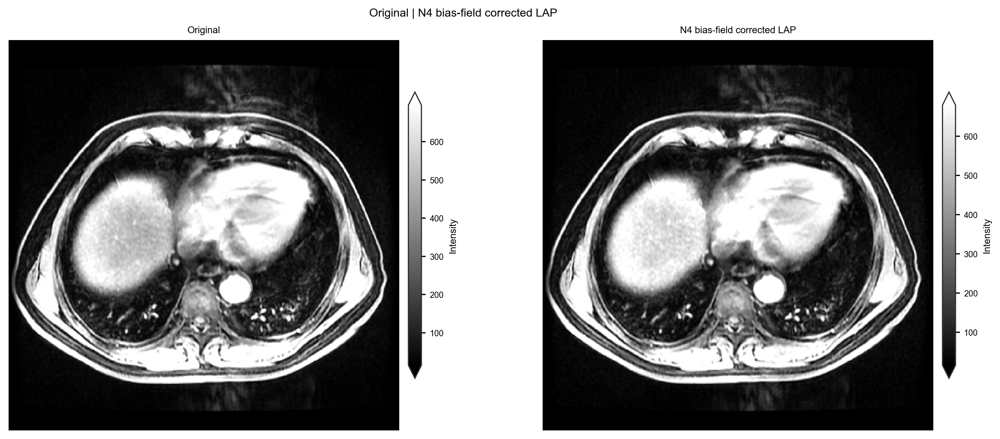
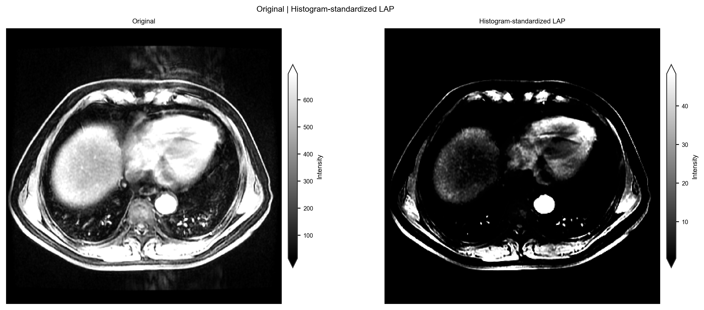
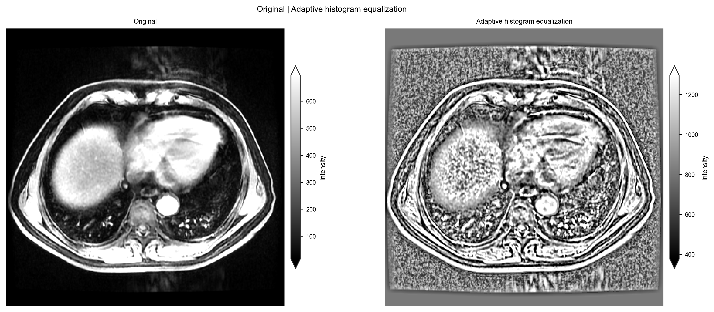
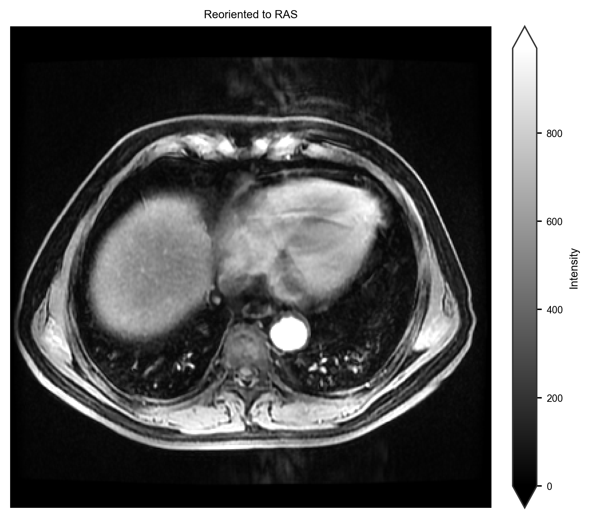
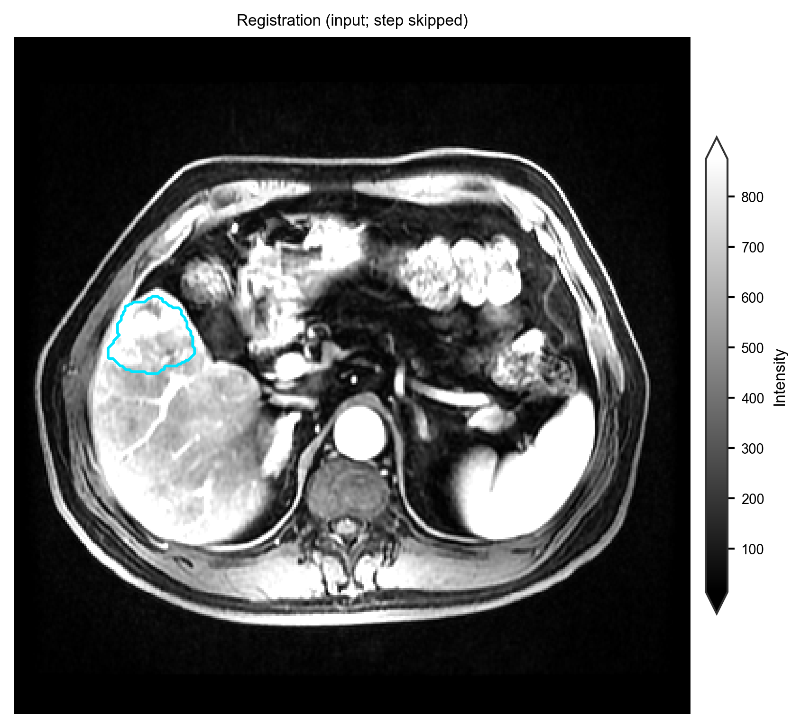

:orphan:

Preprocessing
=============

.. note::

   Supporting integration, not the habitat core. Guide walk-through:
   :doc:`../examples/image_preprocessing`. Demo pack is already
   preprocessed — habitat maps: :doc:`../examples/two_step_habitat`.

Goal: turn images (or DICOM) into a preprocessed ``images/`` + ``masks/`` tree.

**First demo run:** skip this page — the demo pack already has
``demo_data/preprocessed/``. Go to :doc:`../examples/two_step_habitat`.

Run
---

::

   habit check-config --config config/preprocessing/config_preprocessing_demo.yaml
   habit preprocess --config config/preprocessing/config_preprocessing_demo.yaml

Faster smoke::

   habit preprocess --config config/preprocessing/config_preprocessing_minimal.yaml

DICOM helpers::

   habit dicom-info -i demo_data/dicom -o demo_data/results/htg_dicom_info.csv --one-file-per-folder
   habit sort-dicom --config config/dicom_sort/config_sort_dicom.yaml

Your data
---------

Edit ★ in a copied YAML: ``data_dir`` (folder or path-list YAML), ``out_dir``,
and modality names. Then ``habit check-config`` + ``habit preprocess``.

Success: ``out_dir/processed_images/images/<subject>/<modality>/`` has NIfTI.

Anatomy | processed intensity. The figure is written by the image
preprocessing gallery (:doc:`../examples/image_preprocessing`).
Reproduce it::

   python docs/source/examples/scripts/image_preprocessing_demo.py

The plot call in that script::

   from habit.viz import plot_intensity_slice

   fig = plot_intensity_slice(
       processed.image(modality),
       before=subject.image(modality),
       axis=0,
       cmap="gray",
       image_label="Z-scored LAP",
       before_label="Original LAP",
       title="Image preprocess: original | z-scored",
       colorbar_label="Z-score",
       before_colorbar_label="Intensity",
   )

.. figure:: ../_static/images/examples/image_preprocess_slice.png
   :alt: Original LAP beside whole-volume z-scored LAP
   :width: 520

   Whole-FOV greyscale z-score panel from ``subj001`` LAP
   (``demo_data/preprocessed``). Independent colorbars show raw intensity
   versus z-score (native units; not a shared :math:`[0, 1]` window).

Image z-score here is **per-volume intensity** (DICOM/NIfTI tree). It is
not the clustering-time ``winsorize`` / ``minmax`` chain; skipping that
chain on two-step runs under-expresses habitats — see
:doc:`../examples/habitat_preprocessing`.

Atomic Python (same steps, no YAML)
-----------------------------------

:func:`~habit.api.preprocessing.preprocess_subject` / :func:`~habit.api.preprocessing.preprocess_image` take a
``Subject`` or one volume. Copy from :doc:`../examples/image_preprocessing`
and swap ``DATA``. Per-step figures:

   Resample (full FOV, ``subj001`` LAP).

   Z-score (whole volume; optional ROI stats). Independent colorbars show
   raw intensity versus z-score.

   N4 bias-field correction. Independent colorbars keep the intensity
   scale visible.

   Nyúl histogram standardization. Independent colorbars show the mapped
   intensity range.

   Adaptive histogram equalization. Independent colorbars show the
   intensity scale.

   Reorient to RAS.

   SimpleITK affine registration (ROI contour follows the transform).

``dcm2nii`` is CLI-only (needs a DICOM tree)::

   habit preprocess --config config/preprocessing/config_preprocessing_dcm2nii_demo.yaml

Next: :doc:`segment_habitat`.
