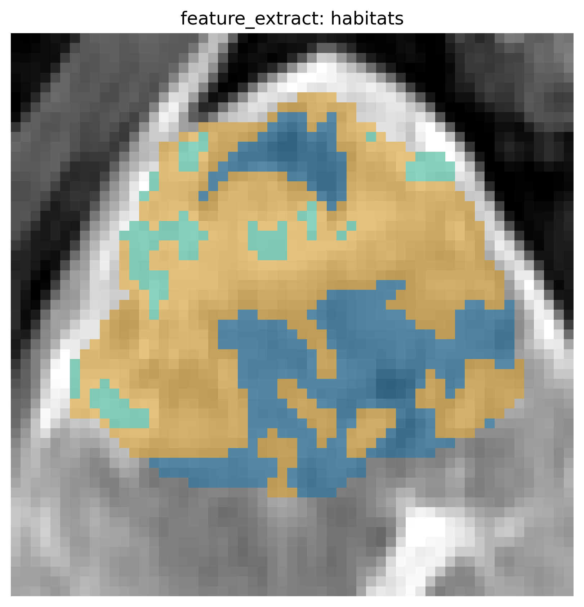

Traditional radiomics
=====================

Goal: whole-ROI PyRadiomics **without** habitat maps. For habitat features use
:doc:`extract_features`.

Run the demo
------------

::

   habit check-config --config config/radiomics/config_traditional_radiomics.yaml
   habit radiomics --config config/radiomics/config_traditional_radiomics.yaml

Your data
---------

★ Edit ``paths.images_folder`` (folder with ``images/`` + ``masks/``),
``paths.out_dir``, and ``processing.process_image_types`` (modality names).

Success: feature tables under ``paths.out_dir``.

Habitat-wise tables (when you do have maps) overlay the same anatomy.
The figure is **not** from ``habit radiomics`` above (whole-ROI has no
labels). It is written by the feature-extraction gallery
(:doc:`../examples/feature_extraction`). Reproduce it::

   python docs/source/examples/scripts/feature_extraction_demo.py

The plot call in that script (``ROI = "LAP"``)::

   from habit.viz import plot_habitat_overlay

   fig = plot_habitat_overlay(subject.image(ROI), habitat_map, title="habitats")

   Same file the gallery script writes to ``out/feature_extract_overlay.png``.
