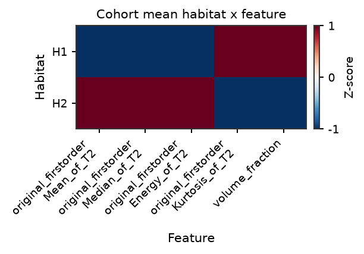
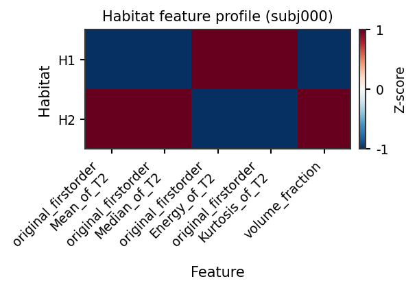
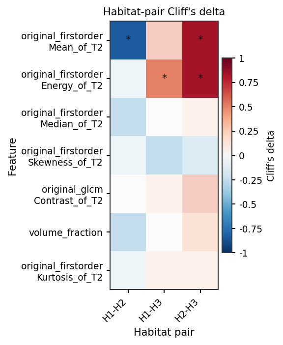
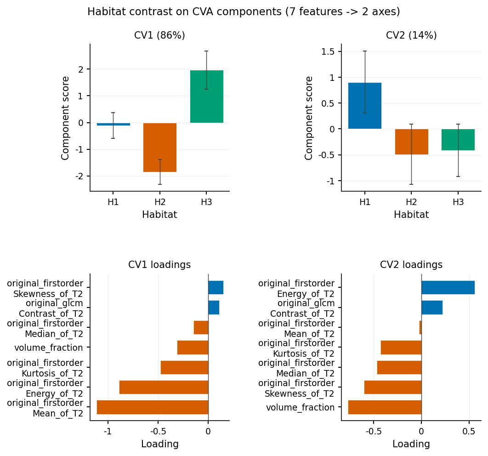
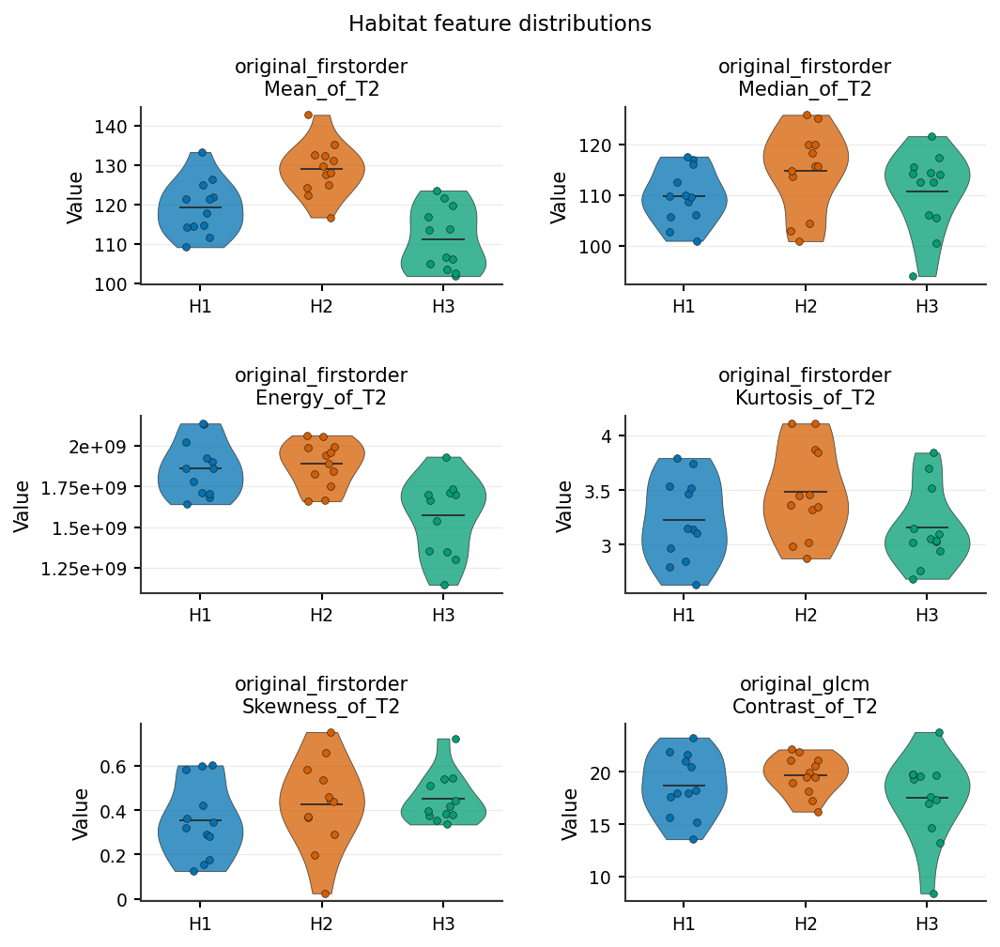
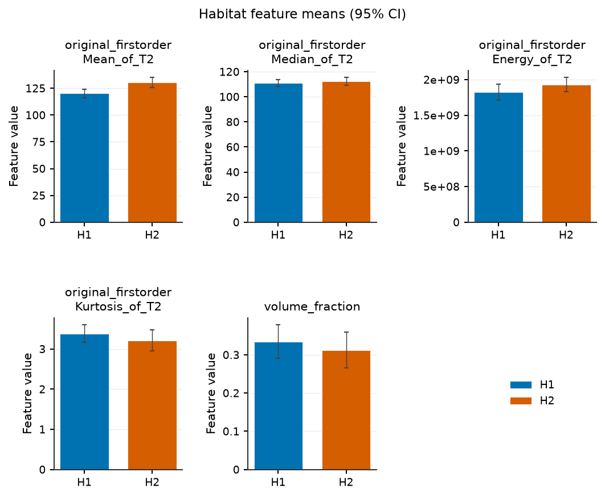

Whole / Each Habitat Radiomics
==============================

whole_habitat
-------------

Output
~~~~~~

``whole_habitat_radiomics.csv``

Definition
~~~~~~~~~~

PyRadiomics run on the **multi-label habitat map** itself: the habitat label
image is passed as both ``image`` and ``mask`` to PyRadiomics, so voxel
**intensities are habitat label IDs** (not original MR/PET values). Parameters:
``params_file_of_habitat`` (optional; bundled ``habitat`` preset →
``habit/resources/radiomics/parameter_habitat.yaml`` when omitted).

Feature definitions follow `PyRadiomics Feature Reference <https://pyradiomics.readthedocs.io/en/latest/features.html>`_.

Output columns
~~~~~~~~~~~~~~

.. list-table::
   :header-rows: 1
   :widths: 32 68

   * - Column pattern
     - Description
   * - ``{pyradiomics_feature}``
     - PyRadiomics feature names (no modality suffix)
   * - (excluded)
     - Columns whose names contain ``diagnostic`` are dropped before export

Implementation
~~~~~~~~~~~~~~

``habit/compat/engines/habitat_extraction/habitat_features/builtin_plugins.py``
(``WholeHabitatPlugin``) → ``habitat_radiomics.py``

each_habitat
------------

Output
~~~~~~

- ``habitat_{k}_radiomics.csv`` — one file per habitat index *k* = 1 … *K*
  (*K* = ``n_habitats`` from config or ``habitats.csv``)
- ``habitat_count.csv`` — binary flags ``has_habitat_1`` … ``has_habitat_K``

Definition
~~~~~~~~~~

For each habitat index *k*, PyRadiomics is run on the **original preprocessed
image** with the **multi-label habitat map** as mask and ``label=k`` (voxels
outside label *k* are excluded). Uses ``params_file_of_non_habitat`` (roi
preset), **not** ``params_file_of_habitat``. Files are written for every
*k* in 1 … *K* even when a subject's map lacks that label (empty ROI → NaN /
error handling per subject).

Feature definitions follow `PyRadiomics Feature Reference <https://pyradiomics.readthedocs.io/en/latest/features.html>`_.

Output columns
~~~~~~~~~~~~~~

``habitat_{k}_radiomics.csv``:

.. list-table::
   :header-rows: 1
   :widths: 32 68

   * - Column pattern
     - Description
   * - ``{pyradiomics_feature}_of_{modality}``
     - One column per PyRadiomics feature × image modality
   * - (excluded)
     - Columns whose names contain ``diagnostic`` are dropped before export

``habitat_count.csv``:

.. list-table::
   :header-rows: 1
   :widths: 32 68

   * - Column
     - Description
   * - ``has_habitat_{k}``
     - ``1`` if subject map contains label *k*, else ``0``

Implementation
~~~~~~~~~~~~~~

``habit/compat/engines/habitat_extraction/habitat_features/builtin_plugins.py``
(``EachHabitatPlugin``) → ``habitat_radiomics.py``

Compare habitats (cohort or one subject)
----------------------------------------

The wide ``each_habitat`` table is one row per subject. To argue that
habitats are distinct -- the figure a reviewer expects -- melt it and
contrast habitats **across the cohort** (paired Cliff's delta + BH-FDR).
The same objects also describe one subject (differences without p-values).

Tens-to-hundreds of texture features: draw a habitat x feature heatmap
and the default **features x pair** Cliff's :math:`\delta` heatmap
(top-k by max :math:`|\delta|` when the bank is large). Pass
``pair=(a, b)`` for the single-pair lollipop. If that heatmap would be
too tall, :func:`~habit.viz.plot_habitat_feature_components` shows the
same contrast on a few CVA/PCA component scores (not a 2-D embedding).
Violins / bars are for a shortlist, not the full bank. Bars are **one
panel per feature** (independent y-axis) so Energy and
``volume_fraction`` are not forced onto one linear scale.

Runnable gallery (synthetic stand-in table; swap ``table`` for your
``each_habitat`` extract)::

   python docs/source/examples/scripts/habitat_feature_compare_demo.py

::

   from habit import (
       compare_habitat_features,
       plot_habitat_feature_bars,
       plot_habitat_feature_components,
       plot_habitat_feature_effect,
       plot_habitat_feature_heatmap,
       plot_habitat_feature_violin,
       to_habitat_feature_panel,
   )

   panel = to_habitat_feature_panel(table)          # wide each_habitat FeatureTable
   cmp = compare_habitat_features(panel)            # cohort if table has >= 2 subjects

   fig = plot_habitat_feature_heatmap(cmp)          # overview (z-scored)
   fig = plot_habitat_feature_effect(cmp)           # features x pair Cliff's delta
   fig = plot_habitat_feature_effect(cmp, pair=(1, 2), top_k=20)  # one pair
   fig = plot_habitat_feature_components(cmp)       # CVA contrast when the heatmap is too tall
   fig = plot_habitat_feature_violin(cmp, max_features=6)
   fig = plot_habitat_feature_heatmap(cmp, subject_id="subj001")  # one subject
   fig = plot_habitat_feature_bars(cmp, subject_id="subj001", max_features=6)

``compare_habitat_features(..., subject_id=...)`` restricts the panel
first. Pairwise ``p_value`` / ``q_value`` are NaN when only one subject
remains.

Runnable gallery (synthetic stand-in table; swap ``table`` for your
extract): :doc:`../../examples/habitat_feature_compare`. Graph topology
columns (``single_h*`` / ``pair_h*_h*``) can share the joined table but
do not melt through this API.

   Cohort mean heatmap, z-scored per feature
   (:func:`~habit.viz.plot_habitat_feature_heatmap`).

   One-subject profile
   (:func:`~habit.viz.plot_habitat_feature_heatmap`).

   Default features x pair Cliff's delta (star = BH q < 0.05)
   (:func:`~habit.viz.plot_habitat_feature_effect`). With dozens of
   features the heatmap keeps the top-k by max :math:`|\delta|`. If
   that heatmap would be too tall, compare habitats on a few CVA/PCA
   components instead.

   Same contrast, shown on 2 CVA components (use this when there are
   dozens of features)
   (:func:`~habit.viz.plot_habitat_feature_components`).

   Per-feature distributions; box + strip when n < 5
   (:func:`~habit.viz.plot_habitat_feature_violin`).

   One panel per feature, independent y-axis
   (:func:`~habit.viz.plot_habitat_feature_bars`).

