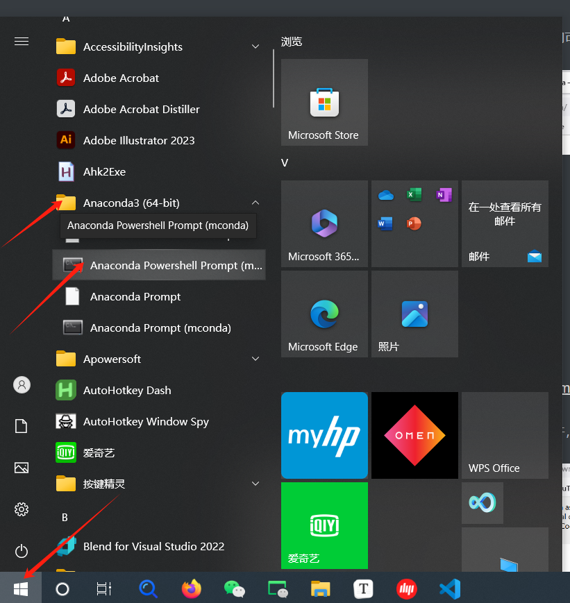

Installation
============

This page is for absolute beginners on Windows (macOS / Linux notes where
they differ). HABIT must run in a **conda-activated** terminal. Plain CMD /
PowerShell / system Python (without ``conda activate``) often fails with
``habit: command not found`` or uses the wrong interpreter.

1. Install Miniconda
--------------------

If you already have Anaconda or Miniconda, skip to step 2.

1. Open the official downloads page:
   `Miniconda <https://docs.anaconda.com/miniconda>`_.
2. Download the **Windows 64-bit** installer (``.exe``).
3. Run the installer and accept the defaults (Next → Next → Install).
   When it finishes, Miniconda is ready.

You do **not** need Visual Studio Code for the CLI demo.

2. Open the conda terminal
--------------------------

**Windows** (Anaconda / Miniconda installed):

1. Click the **Start** button (Windows logo), or press the Windows key.
   On **Windows 10** the Start icon is usually at the **bottom-left**;
   on **Windows 11** it is often at the **bottom-center** of the taskbar.
2. Open the **Anaconda3** (or Miniconda) folder in the Start menu, then
   click **Anaconda Prompt** or **Anaconda PowerShell Prompt**
   (Miniconda: **Miniconda Prompt**).
3. Or: with Start open, type ``Anaconda Prompt`` / ``Miniconda Prompt``
   and open that app.
4. Do **not** use plain "Command Prompt", "Windows PowerShell", or
   "Terminal" unless conda is already initialized there.
5. Optional: **Anaconda Navigator** → Environments → Open Terminal on
   the ``habit`` env.

   Start → Anaconda3 → **Anaconda Prompt** / **Anaconda PowerShell
   Prompt** (example on Windows 10; on Windows 11 the Start icon may sit
   at the bottom-center). Your folder name may differ (e.g. Miniconda).

After you open the Prompt you often see ``(base)``. That is normal — next
you create and activate the HABIT env.

**macOS / Linux** — open Terminal.app / your shell. If ``conda`` is not
found, open the Anaconda/Miniconda shell from the installer menu, or run
``conda init`` once for your shell and reopen the terminal.

::

   Start (bottom-left on Win10; often bottom-center on Win11)
        |
        |  Anaconda3 → Anaconda Prompt
        |  (or search: Anaconda Prompt)
        v
   Anaconda Prompt  (or Miniconda Prompt)
        |
        |  (base) C:\...>
        v
   ready for step 3

   Wrong: plain CMD / PowerShell without conda
          -> "conda" / "habit" not found

3. Create and activate the ``habit`` env
----------------------------------------

In the conda terminal::

   conda create -n habit python=3.10 -y
   conda activate habit

Python **3.10–3.14** are supported; these docs use **3.10**. The env name
in these docs is **``habit``** (any name is fine if you activate it).

::

   conda create -n habit python=3.10 -y
        |
        v
   conda activate habit
        |
        v
   (habit) C:\...>     <-- prompt must show (habit)

Every new terminal session: run ``conda activate habit`` again and check
that the prompt shows ``(habit)`` before any ``habit ...`` command.

**macOS / Linux**::

   $ conda activate habit
   (habit) $

4. Install HABIT from official PyPI
-----------------------------------

With ``(habit)`` showing in the prompt::

   pip install -U pip
   # Demo / quickstart path needs tables (parquet) + viz (clustering curves)
   pip install "habitat-analysis[tables,viz]" -i https://pypi.org/simple
   habit --version

* Package on PyPI: **``habitat-analysis``** (code: ``import habit``)
* Always use official PyPI for **this** package:
  ``-i https://pypi.org/simple``

**Why not a China mirror for HABIT?** Regional mirrors often lag or omit
``habitat-analysis``. If ``pip`` cannot find the package, keep
``-i https://pypi.org/simple`` — do not switch the install of HABIT itself
to a mirror.

5. Optional: China mirrors for *other* packages
-----------------------------------------------

If you only need to speed up **unrelated** dependencies (not HABIT), you
may use a one-off mirror index for that single command, for example::

   pip install some-other-package -i https://pypi.tuna.tsinghua.edu.cn/simple

Do **not** set a permanent global default away from PyPI for HABIT work
(e.g. ``pip config set global.index-url ...``). A global mirror can make
``habitat-analysis`` disappear from search results and break future installs
or upgrades. Prefer one-off ``-i`` only when needed.

6. Next: quickstart
-------------------

You do **not** need a git clone for the demo YAML templates. Create any
work folder, then::

   mkdir D:\my_habit_work
   cd D:\my_habit_work
   habit copy-demo-config --dest .

That writes ``config/`` into your folder. Download ``demo_data/`` next to
it, then run the CLI commands in :doc:`quickstart`. Imaging packs are
**not** inside the wheel.

Optional: napari (``habit view``)
---------------------------------

::

   pip install "napari[pyqt5]" "npe2>=0.8.2" "pydantic!=2.11.*,>=2.8,<3" -i https://pypi.org/simple

From a git clone you can use ``pip install -e ".[view]"`` instead.

From source (developers)
------------------------

::

   git clone https://github.com/lichao312214129/HABIT.git
   cd HABIT
   conda create -n habit python=3.10 -y
   conda activate habit
   pip install -U pip
   pip install -e .
   habit --version

Need more later?
----------------

Missing optional packages raise ``OptionalDependencyError`` with the exact
``pip install`` command. Install only what you use::

   pip install "habitat-analysis[ml,analysis]"

.. list-table::
   :header-rows: 1
   :widths: 18 82

   * - Extra
     - Needed for
   * - ``viz``
     - Figures (``habit.viz``, ML / clustering plots)
   * - ``tables``
     - ``.parquet`` / ``.xlsx`` (default habitats table is parquet)
   * - ``dicom``
     - ``habit dicom-info`` / ``habit sort-dicom``
   * - ``slic``
     - SLIC supervoxels (default ``kmeans`` / ``gmm`` need nothing)
   * - ``ml``
     - XGBoost, SMOTE, mRMR / VIF / stepwise (includes ``viz``, ``tables``)
   * - ``analysis``
     - SHAP, Plotly, ICC, survival (includes ``viz``, ``tables``)
   * - ``registration``
     - ANTs registration
   * - ``automl``
     - AutoGluon Tabular
   * - ``torch``
     - TorchRadiomics / GPU texture
   * - ``monai``
     - MONAI ``Rand3DElastic`` image / ROI warp (``BSplineDeformPerturbation``; pulls ``torch``)
   * - ``igraph``
     - Optional C backend for habitat-graph hop / clustering / Louvain (``graph_metric_backend``). GPL-2.0+; **not** in ``[all]``
   * - ``all``
     - All of the above except ``torch``, ``monai``, ``igraph``, and PyRadiomics
   * - ``view``
     - napari for ``habit view`` (clone: ``pip install -e ".[view]"``)

PyRadiomics (only if you need radiomics)
----------------------------------------

Not installed by default. Needed for ``voxel_radiomics`` /
``supervoxel_radiomics``, ``habit radiomics``, and texture habitat features.

**Windows** — use a prebuilt wheel from
`Release v1.0.2 <https://github.com/lichao312214129/HABIT/releases/tag/v1.0.2>`_
(do **not** use bare ``pip install pyradiomics``)::

   # Python 3.10 example — change cp310 for 3.11–3.14
   pip install https://github.com/lichao312214129/HABIT/releases/download/v1.0.2/pyradiomics-3.1.0-cp310-cp310-win_amd64.whl

**macOS / Linux**::

   pip install "pyradiomics>=3.0.1,<3.2"

Problems?
---------

See :doc:`../troubleshooting/faq`. Then :doc:`quickstart` or
:doc:`quickstart_python`.
