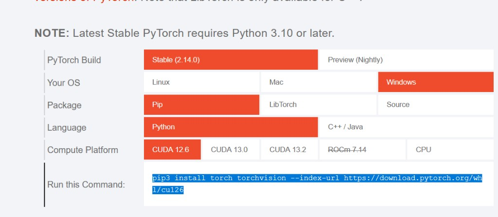

Installation
============

This page is for absolute beginners on Windows (macOS / Linux notes where
they differ). HABIT must run in a **conda-activated** terminal. On Windows
use **Anaconda Prompt** or **Anaconda PowerShell Prompt** (Miniconda:
**Miniconda Prompt**). System Python without ``conda activate`` often
fails with ``habit: command not found`` or uses the wrong interpreter.

Python **3.10–3.14** are supported; these docs use **3.10**.

1. Install Miniconda
--------------------

If you already have Anaconda or Miniconda, skip to step 2.

1. Open the official downloads page:
   `Miniconda <https://docs.anaconda.com/miniconda>`_.
2. Check **Settings → System → About → System type**. Most PCs are
   **64-bit**; download the Windows installer (``.exe``) that matches
   that type.
3. Run the installer and accept the defaults (Next → Next → Install).

You do **not** need Visual Studio Code for HABIT.

2. Open the conda terminal
--------------------------

**Windows** (Anaconda / Miniconda installed):

1. Click the **Start** button (Windows logo), or press the Windows key.
   On **Windows 10** the Start icon is usually at the **bottom-left**;
   on **Windows 11** it is often at the **bottom-center** of the taskbar.
2. Open the **Anaconda3** (or Miniconda) folder in the Start menu, then
   click **Anaconda Prompt** or **Anaconda PowerShell Prompt**
   (Miniconda: **Miniconda Prompt**).
3. Or: with Start open, type ``Anaconda Prompt`` / ``Miniconda Prompt``
   and open that app.
4. Optional: **Anaconda Navigator** → Environments → Open Terminal on
   the ``habit`` env after you create it.

.. figure:: ../_static/images/open_anaconda_prompt_windows.png
   :alt: Windows Start menu: open Anaconda Prompt
   :width: 85%

   Start → Anaconda3 → **Anaconda Prompt** / **Anaconda PowerShell
   Prompt** (example on Windows 10; on Windows 11 the Start icon may sit
   at the bottom-center). Your folder name may differ (e.g. Miniconda).

After you open the Prompt you often see ``(base)``. That is normal.

**macOS / Linux** — open Terminal.app / your shell. If ``conda`` is not
found, run ``conda init`` once for your shell and reopen the terminal.

3. Create and activate the ``habit`` env
----------------------------------------

In the conda terminal::

   conda create -n habit python=3.10 -y
   conda activate habit

The env name in these docs is **``habit``** (any name is fine if you
activate it). The prompt must show ``(habit)`` before any ``pip`` or
``habit`` command. Every new terminal session: run ``conda activate habit``
again.

4. Install HABIT from official PyPI
-----------------------------------

With ``(habit)`` showing in the prompt::

   pip install -U pip
   pip install habitat-analysis -i https://pypi.org/simple
   habit --version

5. Optional: PyTorch GPU
------------------------

Needed only for GPU texture / TorchRadiomics. **CPU habitat analysis
does not require it.**

Open `https://pytorch.org/ <https://pytorch.org/>`_ → **Get Started**
(or `Start Locally <https://pytorch.org/get-started/locally/>`_).
Select **Your OS**, **Pip**, **Python**, and the **Compute Platform**
that matches your machine, then run the command the page prints.

   Example on pytorch.org: Windows + Pip + Python + CUDA 12.6. Change
   the red cells to match your GPU or choose CPU. Copy **Run this
   Command** into the ``(habit)`` prompt.

6. Optional: PyRadiomics
------------------------

Not installed by default. Needed for ``voxel_radiomics`` /
``supervoxel_radiomics``, ``habit radiomics``, and texture habitat
features. Habitat maps that do not use those extractors do not need it.

**Windows** — use a prebuilt wheel from
`Release v1.0.2 <https://github.com/lichao312214129/HABIT/releases/tag/v1.0.2>`_
(do **not** use bare ``pip install pyradiomics``)::

   pip install https://github.com/lichao312214129/HABIT/releases/download/v1.0.2/pyradiomics-3.1.0-cp310-cp310-win_amd64.whl

Change ``cp310`` in the filename for Python 3.11–3.14.

**macOS / Linux**::

   pip install "pyradiomics>=3.0.1,<3.2"

Optional packages
-----------------

These do **not** change habitat computation. Install only what you use.

**pyarrow** — write a **direct pooling** voxel table with on the order of
millions of rows as parquet. Typical two-step / one-step tables are
small; CSV needs nothing extra. Saving the table is optional::

   pip install pyarrow

**napari** — interactive ``habit view``::

   pip install "napari[pyqt5]" "npe2>=0.8.2" "pydantic!=2.11.*,>=2.8,<3" -i https://pypi.org/simple

GPU texture speedup numbers: :doc:`../examples/voxel_texture`.

From source (developers)
------------------------

::

   git clone https://github.com/lichao312214129/HABIT.git
   cd HABIT
   conda create -n habit python=3.10 -y
   conda activate habit
   pip install -U pip
   pip install -e .
   habit --version

Problems?
---------

See :doc:`../troubleshooting/faq`. After install:
:doc:`quickstart` or :doc:`quickstart_python`.
