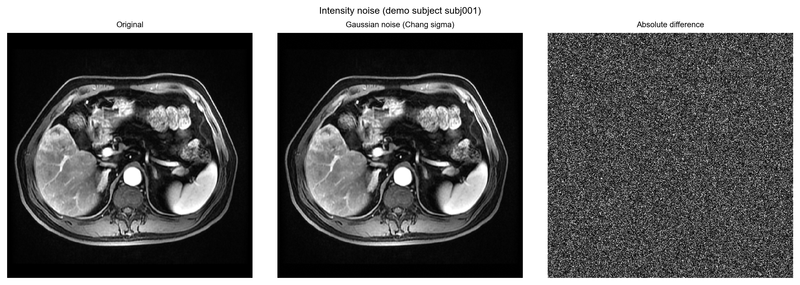
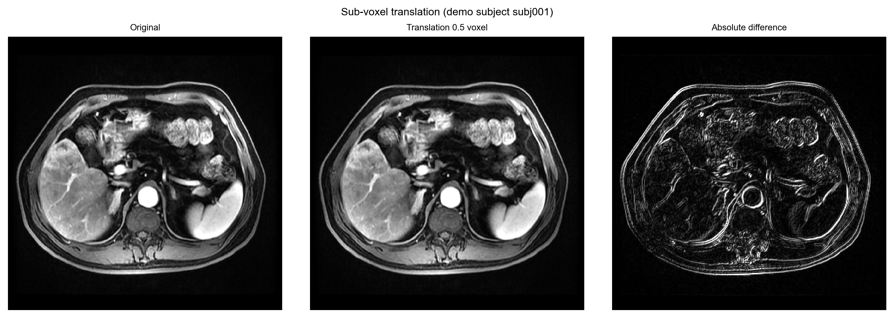
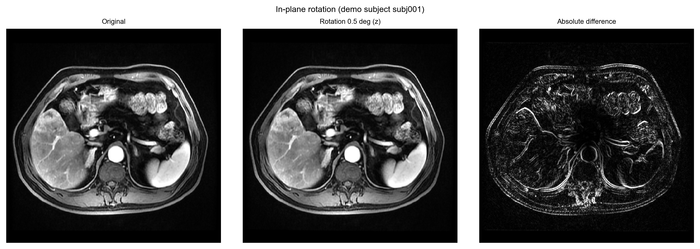
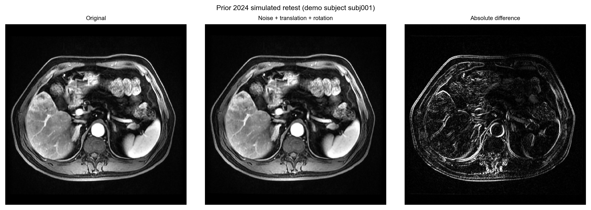
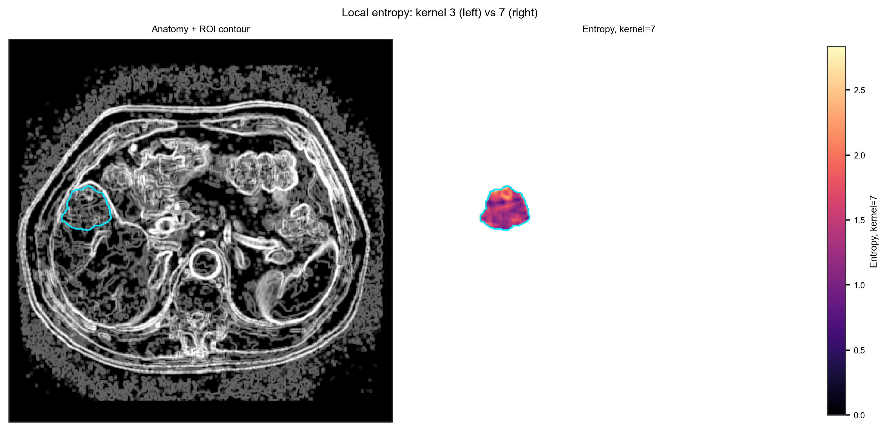
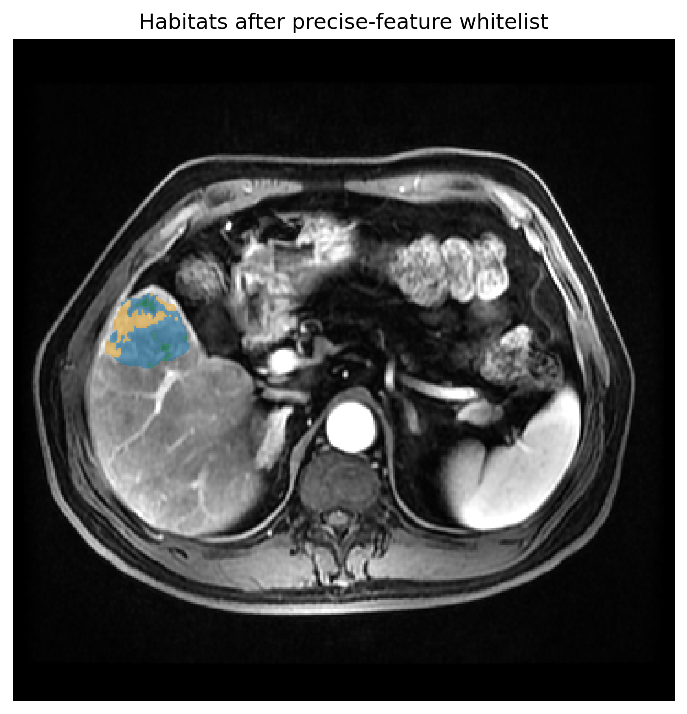

Morphology-aware precise screening
==================================

Goal: decide **which voxel features are allowed to define habitats**, then
cluster only those features. This is not a new clustering algorithm. It is
the precision screen of Prior et al. (*Radiol Artif Intell*
2024;6(2):e230118) as implemented in HABIT, with an explicit morphological
reading of what the screen does and what it does **not** claim.

Runnable gallery (ICC table, overlay, and per-perturbation anatomy):
:doc:`../examples/precise_features`. Public recipe:
:func:`~habit.recipes.identify_precise_voxel_features`.

What is screened
----------------

A voxel radiomic map :math:`F(\mathbf{x})` is a **local morphological
descriptor**: each voxel's value is computed in a neighbourhood whose size
is the kernel radius (and, for many features, a grey-level bin width). If
that map does not survive a simulated re-acquisition, or a change of
neighbourhood scale, clustering it produces partitions nobody can
reproduce.

Per subject, HABIT runs up to three experiments (recipe
:func:`~habit.recipes.identify_precise_voxel_features`; domain
:func:`~habit.domain.identify_precise_features`):

* **repeatability** — ICC(3A,1) between the base-setting maps of the
  original image and of one perturbed copy;
* **reproducibility_kernel_radius** — ICC(3C,1) between maps at the given
  kernel radii (the paper contrasts R1 with R3) at fixed bin width;
* **reproducibility_bin_width** — ICC(3C,1) between maps at the given bin
  widths (the paper contrasts B12 with B25 HU) at fixed radius.

A feature is *precise* when the cohort **median lower confidence limit**
of its ICC reaches ``lcl_threshold`` (default ``0.5``, the paper's "at
least good" boundary) in **every** experiment that was actually run —
subject to ``include`` / ``exclude`` expert overrides (the paper kept
NGTDM Coarseness via ``include``).

The default perturbation chain is
:func:`~habit.domain.precision.prior2024_retest_perturbation`: Gaussian
noise (Chang wavelet :math:`\sigma`), a 0.5-voxel translation fraction,
and a 0.5° in-plane rotation (Prior et al. 2024, Appendix S2 / MIRP
1.2.0). Images use B-spline interpolation; masks use nearest neighbour.
Perturbed volumes stay on the **original grid** so maps remain
voxel-wise comparable. The figures below apply each component to one
subject from ``demo_data/preprocessed`` (swap ``DATA`` / ``MODALITIES`` /
``ROI`` in the gallery script). They are a teaching demo, not a clinical
claim.

Why "morphology-aware"
----------------------

Three morphological facts are built into the HABIT screen. They are
easy to miss if one treats ICC as a generic correlation.

1. **The features themselves are morphological.** Kernel radius is a
   neighbourhood scale. The kernel-radius reproducibility experiment asks
   whether the *spatial pattern* of a feature survives a change in that
   scale. A feature that is precise only at one radius is not a stable
   habitat coordinate.
2. **Acquisition perturbation moves anatomy.** Translation and rotation
   are rigid morphological changes of the patient in the scanner. Noise
   is not morphology, but it is part of the paper's simulated retest.
   HABIT transforms **masks with the image** (nearest neighbour), because
   a shifted acquisition images a shifted patient.
3. **Agreement is computed on the common ROI.** HABIT aligns condition
   fields on shared ROI coordinates and drops any voxel that is NaN in
   any condition (documented refinement over padding with zeros). The
   pairing is therefore the **intersection of the morphologies**, not a
   rectangular crop filled with dummy intensities.

HABIT also exposes :func:`~habit.domain.habitat_stability`:
after clustering, habitat *maps* from a perturbed re-run are matched
(Hungarian algorithm) and compared by Dice. That is a map-level
morphological check. It is **not** the Prior 2024 feature screen.

   Intensity perturbation: original (left), Gaussian noise with Chang
   wavelet :math:`\sigma` (middle), absolute difference (right). Noise is
   added to the **whole** image. Demo subject from
   ``demo_data/preprocessed``; not a clinical claim.

   Geometric perturbation: sub-voxel translation of 0.5 voxel along x and
   y (B-spline on the image). The difference panel shows the interpolation
   residual. Same voxel grid as the original.

   Geometric perturbation: 0.5° in-plane rotation about z (axial),
   B-spline, resampled back onto the original grid.

   Full Prior 2024 / MIRP 1.2.0 chain: Gaussian noise, then 0.5-voxel
   translation, then 0.5° z rotation (two geometric resamples). Demo
   subject; not a clinical claim.

.. figure:: ../_static/images/examples/precise_perturb_mask_edge.png
   :alt: ROI contours before and after nearest-neighbour geometric resampling
   :width: 720

   **ROI contour (MONAI B-spline / elastic FFD).** Optional follow-up
   :class:`~habit.domain.precision.BSplineDeformPerturbation` (MONAI
   ``Rand3DElastic``): one displacement field warps the image (bilinear)
   and the ROI (nearest neighbour). Cyan =
   original contour, dashed vermillion = warped contour, yellow = voxels
   whose membership changed. Not the Prior 2024 default chain; not MIRP
   morphological grow/shrink. The demo crops to the ROI bounding box plus
   pad (this LAP volume is 200×360×360); the public API warps a full
   Subject. Requires ``pip install "habitat-analysis[monai]"``.

   Morphological scale: local entropy at kernel size 3 vs 7 (same slice,
   same demo subject). Features whose pattern disagrees across scales
   fail the kernel-radius experiment.

How to apply
------------

Work from a directory that has images in HABIT's preprocessed layout
(``demo_data/preprocessed`` in the gallery). One physical line per
shell command.

**1. Screen.** Copy-ready shape (swap ``DATA`` / extractor)::

   from habit import cohort_from_directory
   from habit.recipes import identify_precise_voxel_features

   DATA = "demo_data/preprocessed"
   cohort = cohort_from_directory(DATA, modalities=("LAP",), roi="LAP")
   precise = identify_precise_voxel_features(cohort, seed=7)

With the default voxel-radiomics factory this is the paper design
(needs PyRadiomics). The gallery demo uses raw intensities so it runs
without that extra; the **call shape is the same**. Restrict the grid
with ``kernel_radii=(3,)`` / ``bin_widths=(12,)`` to skip an experiment
you cannot resource.

**2. Publish the artefact.** ``precise.save("precise_features.json")``
writes the feature names plus the evidence panels. Another lab should
cluster the **same** names, not re-screen after seeing the endpoint.

**3. Whitelist into a habitat spec.** Place the whitelist **first** in
``voxel_feature_preprocessors`` so only precise columns reach scaling
and clustering::

   from habit import HabitatSpec, Spec
   from habit.recipes import Study

   whitelist = precise.preprocessor()
   spec = HabitatSpec(
       name="precise_habitats",
       voxel_feature_extractor=Spec("raw", {"modalities": ["LAP"]}),
       voxel_feature_preprocessors=(
           whitelist.spec,
           Spec("minmax", {"across_features": False}),
       ),
       habitat_model_fitter=Spec(
           "kmeans",
           {"min_habitats": 2, "max_habitats": 10, "validation": "elbow"},
       ),
       habitat_assigner=Spec("nearest_centroid"),
       random_seed=11,
   )
   result = Study(spec).fit_predict(cohort)

.. figure:: ../_static/images/examples/precise_features_icc_lcl.png
   :alt: ICC and LCL bars for the precision screen
   :width: 520

   Repeatability ICC and lower confidence limit per feature, with the
   0.5 LCL threshold.

   Habitats after the whitelist
   (:func:`~habit.viz.plot_habitat_overlay`).

What is not claimed
-------------------

* **Not a biomarker.** Passing the screen means the map is *repeatable /
  reproducible under the stated perturbations*, not that it encodes a
  cell type, a driver mutation, or a clinical outcome.
* **Not ROI grow/shrink.** MIRP ``perturbation_roi_adapt_size``
  (morphological dilation/erosion of the mask) is **not** in Prior 2024
  Appendix S2 and is **not** implemented. The mask-edge figure above is
  the optional MONAI ``Rand3DElastic`` warp
  (:class:`~habit.domain.precision.BSplineDeformPerturbation`), which is
  also **not** in ``prior2024_retest_perturbation()``. Do not report the
  default Precise chain as having done either grow/shrink or MONAI FFD.
* **Not leakage-proof.** Screening on the same cohort that will be
  clustered, then testing a classifier on that cohort, is still a
  discovery analysis. An external test set is a different protocol.
* **Not a substitute for a pre-specified** :math:`k`. Auto-selection (HABIT
  default: inertia **elbow**, :math:`k\in[2,10]`) remains a modelling
  choice. Precise features plus an unblinded :math:`k` search can still
  overfit.
* **Zeros vs missing.** Absent experiments (single radius, single bin
  width) are skipped, not failed. Read ``precise.to_frame()`` before
  claiming "all three experiments".

References
----------

Prior O, Macarro C, Navarro V, et al. Identification of Precise 3D CT
Radiomics for Habitat Computation by Machine Learning in Cancer.
*Radiol Artif Intell* 2024;6(2):e230118.
(`DOI <https://doi.org/10.1148/ryai.230118>`__).

See also
--------

* Gallery: :doc:`../examples/precise_features`
* Domain API: :doc:`../api/domain` (``ImagePerturbation``,
  ``identify_precise_features``)
* Kernels: :doc:`../api/kernels` (perturbation and voxel ICC)
* Clustering defaults: :doc:`../configuration/habitat`
