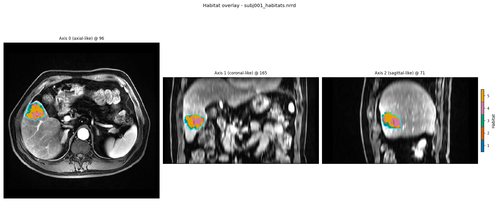

Quickstart: run the demo (YAML + CLI)
======================================

**Background.** A habitat map paints every voxel inside the tumour with a
habitat id, so the tumour is split into sub-regions that behave alike across
the input images.

**Purpose.** Run the two-step demo from a YAML file with the ``habit``
command and get habitat maps plus a habitat feature table under
``demo_data/results/``. It is the same analysis as the Python and YAML
quickstart pages, with the same result.

**Key terms.**

* **habitat** -- a sub-region inside the tumour (the ROI) whose voxels
  behave alike across the input images; HABIT paints each ROI voxel with a
  habitat id (1, 2, 3, ...).
* **YAML config** -- a text file that lists the analysis stages and says
  where to read the data and write the results;
  ``habit get-habitat --config <file>`` runs it.
* **two-step** -- each tumour is first cut into supervoxels, then the
  supervoxels of all subjects are clustered together once, so habitat ids
  mean the same thing in every patient.

No Python required. Install first (:doc:`installation`).
You do **not** need a git clone: ``pip install habitat-analysis`` is enough.

1. Work directory and demo configs
----------------------------------

Pick a folder you own (``<work_dir>``). In a conda terminal::

   # Windows — Anaconda Prompt (not plain CMD)
   conda activate habit          # prompt must show (habit)
   mkdir D:\my_habit_work
   cd D:\my_habit_work
   habit copy-demo-config --dest .

   # macOS / Linux
   conda activate habit
   mkdir -p ~/my_habit_work && cd ~/my_habit_work
   habit copy-demo-config --dest .

This writes ``<work_dir>/config/``. Imaging data is **not** in the wheel;
fetch it next (once).

2. Get demo data
----------------

From ``<work_dir>``::

   habit fetch-demo --work-dir .

The first call downloads the official 5-subject preprocessed pack (about
473 MB) into ``%USERPROFILE%\.habit_data\demo-data-v1\preprocessed``
(or ``$HOME/.habit_data/...``). Later calls reuse that cache. The command
prints the absolute path and the folder tree — that tree is what **your**
data must look like (same ``images/<id>/<series>/`` +
``masks/<id>/<roi>/`` layout; change IDs and series names).

``--work-dir .`` also creates ``<work_dir>/demo_data/preprocessed`` pointing
at the cache so the shipped YAML ``../../demo_data/preprocessed`` paths keep
working.

Preprocessed images are already included — skip preprocess on the first run.

If GitHub is unreachable, the imaging zip is also on the backup share
(|download_demo_data|, code |demo_data_code|). Extract so you have
``demo_data/preprocessed/images/`` and ``masks/``.

3. Activate and check
---------------------

Stay in the conda env from :doc:`installation`. From ``<work_dir>``::

   # Windows — Anaconda Prompt
   conda activate habit
   cd D:\my_habit_work

   # macOS / Linux
   conda activate habit
   cd ~/my_habit_work

   habit --version

4. Run
------

``config/habitat/config_habitat_quickstart_v1.yaml`` is the analysis of the
Python and YAML quickstart pages
(:doc:`/auto_quickstart/plot_quickstart_python`,
:doc:`/auto_quickstart/plot_quickstart_yaml`): raw intensities of the four
DCE phases inside the LAP ROI, 30 supervoxels per tumour, one k-means fit
over the pooled supervoxels (2 to 10 habitats, elbow), seed 0, fitted on
``subj001`` to ``subj004``. The subjects are listed in the manifest
``config/habitat/file_habitat_quickstart.yaml``. All three pages give the
same habitat maps (5 habitats, identical labels voxel by voxel) and the
same feature values. From ``<work_dir>``::

   habit check-config --config config/habitat/config_habitat_quickstart_v1.yaml
   habit get-habitat --config config/habitat/config_habitat_quickstart_v1.yaml

The habitat maps, ``habitat_features.csv`` (volume fractions, MSI, ITH,
graph) and ``habitat_model.habitatmodel`` land in
``demo_data/results/habitat_quickstart/``. Look at one map::

   habit view demo_data/preprocessed/images/subj001/LAP/WATER__WATER__Ax_Dyn_LAVA_Flex+C_Series0009.nrrd demo_data/results/habitat_quickstart/subj001_habitats.nrrd

``habit view`` opens napari if installed (select the habitats Labels layer;
Contour ``0`` = filled regions); otherwise it writes a PNG. The figure
below is that PNG, written without opening a window::

   habit view --backend matplotlib demo_data/preprocessed/images/subj001/LAP/WATER__WATER__Ax_Dyn_LAVA_Flex+C_Series0009.nrrd demo_data/results/habitat_quickstart/subj001_habitats.nrrd -o quickstart_cli_view.png --no-open

   ``subj001`` habitats from ``config_habitat_quickstart_v1.yaml``.

``config/habitat/config_habitat_two_step.yaml`` is a fuller two-step
configuration: per-subject winsorize and min-max scaling, cohort binning
(10 bins), 50 supervoxels, connected-component clean-up, seed 42, all
five subjects, ROI from the ``pre_contrast`` mask. It defines different
habitats by design; run it the same way::

   habit get-habitat --config config/habitat/config_habitat_two_step.yaml
   habit extract --config config/feature_extraction/config_extract_features_demo.yaml

``habit extract`` reads the habitat maps that ``config_habitat_two_step.yaml``
writes (``demo_data/results/habitat_two_step/``) and extracts volume, MSI,
ITH, and graph features. For parquet outputs, ``pip install pyarrow`` (see
:doc:`installation`).

Next
----

* Habitat Guide (Python): :doc:`../auto_examples/index`
* Habitat analysis (what / which strategy): :doc:`habitat_analysis`
* Your own data: :doc:`../examples/data_from_arrays`
* Python API (beginner ``Study``): :doc:`quickstart_python`
* Embed one operator: :doc:`../examples/habitat_atomic_ops`
* Parallel / fault tolerance: :doc:`execution`
* All commands: :doc:`../reference/cli`
