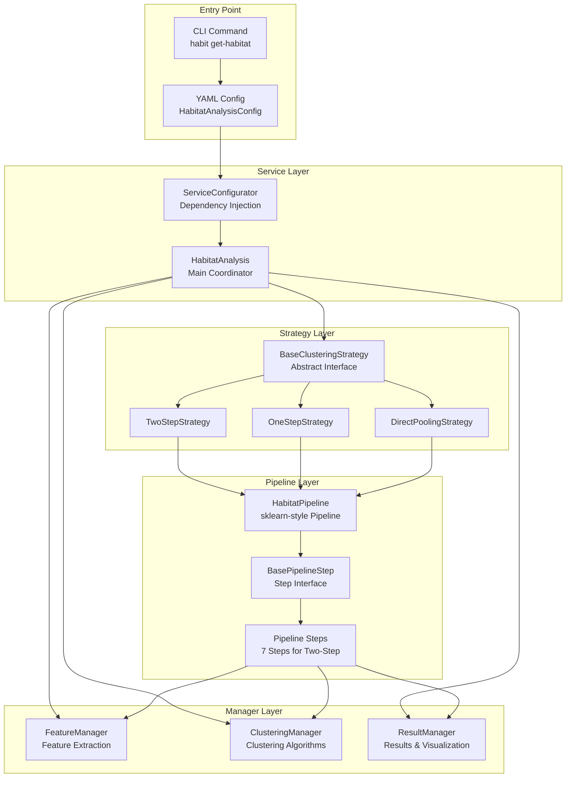
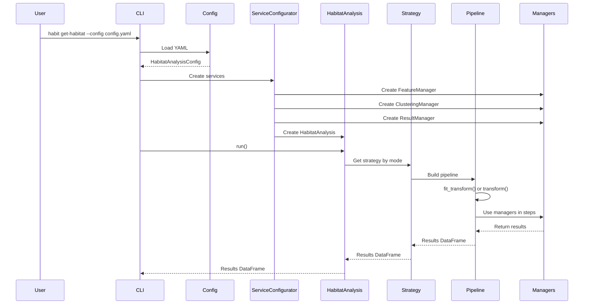
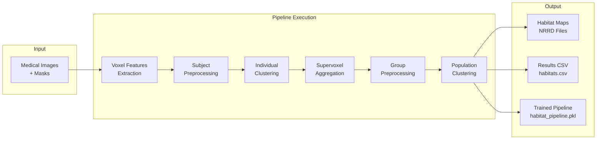
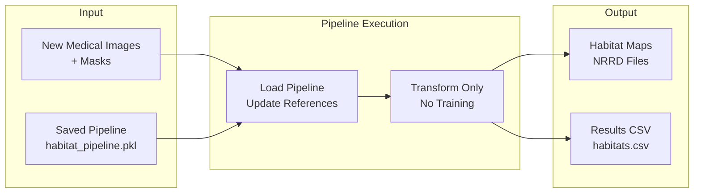
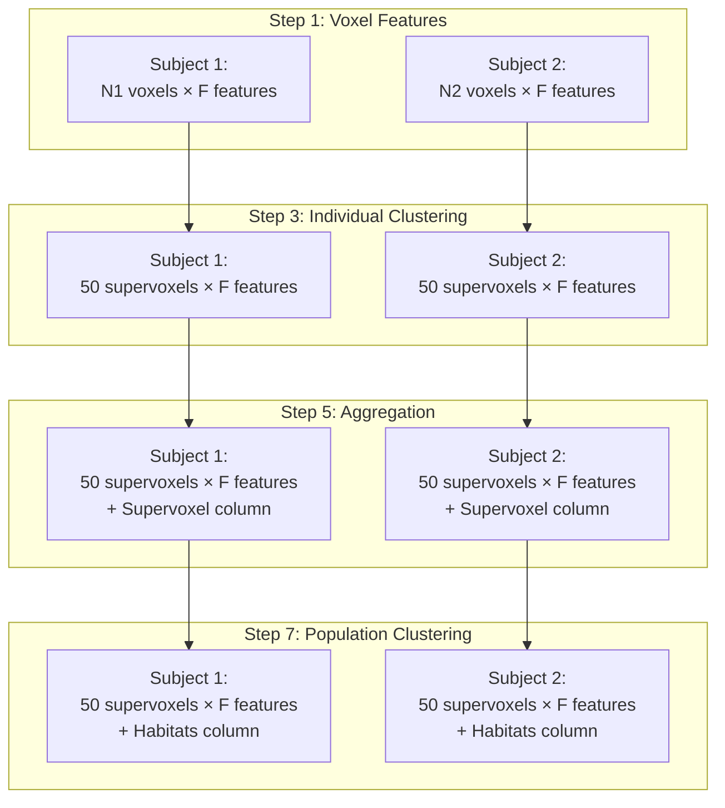
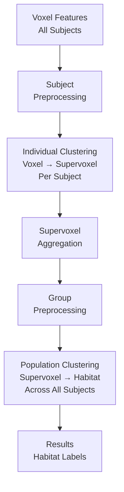
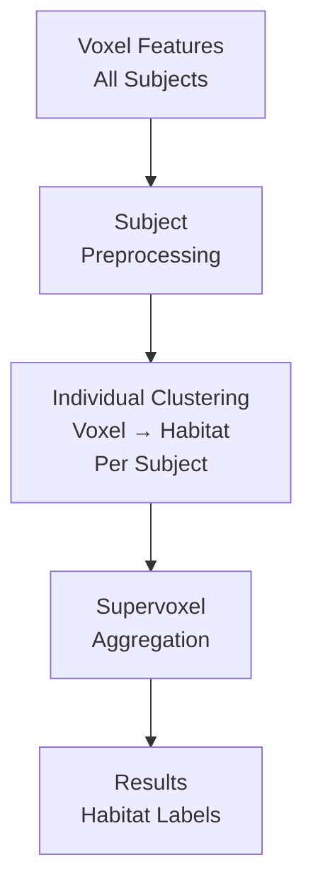
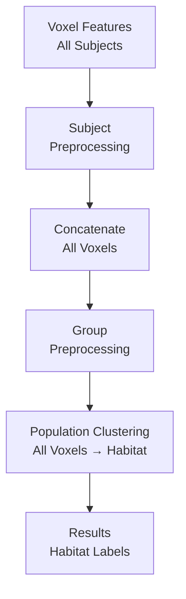
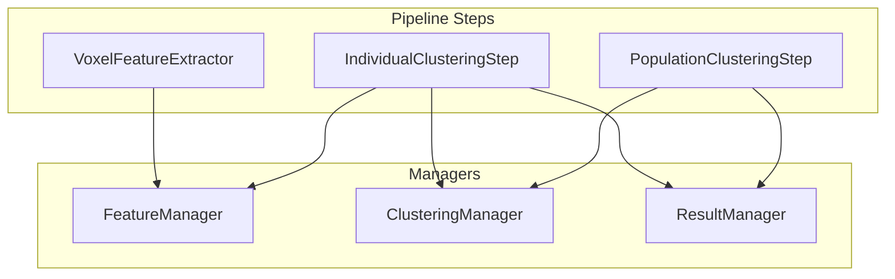

# Habitat Analysis Architecture

This document describes the architecture of the habitat analysis module, including component relationships, data flow, and execution patterns.

## Table of Contents

1. [Overview](#overview)
2. [System Architecture](#system-architecture)
3. [Component Hierarchy](#component-hierarchy)
4. [Data Flow](#data-flow)
5. [Clustering Strategies](#clustering-strategies)
6. [Pipeline Execution](#pipeline-execution)
7. [Manager Pattern](#manager-pattern)

## Overview

The habitat analysis module implements a flexible, sklearn-style pipeline for tumor habitat clustering. It supports three clustering strategies (two-step, one-step, and direct pooling) and provides both training and prediction modes.

### Key Design Principles

- **Strategy Pattern**: Different clustering approaches implemented as separate strategy classes
- **Pipeline Pattern**: sklearn-like pipeline with `fit()` and `transform()` methods
- **Manager Pattern**: Dedicated managers for features, clustering, and results
- **Dependency Injection**: Services created via `ServiceConfigurator` for testability

## System Architecture

### High-Level Architecture Diagram



### Component Interaction Flow



## Component Hierarchy

### 1. Entry Layer

#### `CLI Command` (`habit/cli_commands/commands/cmd_habitat.py`)
- Entry point: `habit get-habitat --config config.yaml`
- Parses command-line arguments
- Loads configuration from YAML
- Creates services via `ServiceConfigurator`
- Executes `HabitatAnalysis.run()`

#### `Configuration` (`config_schemas.py`)
- `HabitatAnalysisConfig`: Root configuration class (Pydantic)
- `FeatureConstructionConfig`: Feature extraction settings
- `HabitatsSegmentionConfig`: Clustering strategy settings
- Validates and resolves paths automatically

### 2. Service Layer

#### `ServiceConfigurator` (`habit/core/common/service_configurator.py`)
- **Purpose**: Dependency injection container
- **Responsibilities**:
  - Creates `FeatureManager`, `ClusteringManager`, `ResultManager`
  - Creates `HabitatAnalysis` with all dependencies
  - Manages logger creation and configuration

#### `HabitatAnalysis` (`habitat_analysis.py`)
- **Purpose**: Main coordinator class
- **Responsibilities**:
  - Coordinates managers (Feature, Clustering, Result)
  - Delegates execution to strategy classes
  - Provides facade methods for accessing manager properties
- **Key Methods**:
  - `run(subjects, save_results_csv)`: Main entry point

### 3. Manager Layer

#### `FeatureManager` (`managers/feature_manager.py`)
- **Purpose**: Manages feature extraction and preprocessing
- **Responsibilities**:
  - Voxel-level feature extraction
  - Supervoxel-level feature aggregation
  - Subject-level and group-level preprocessing
  - Image and mask path management

#### `ClusteringManager` (`managers/clustering_manager.py`)
- **Purpose**: Manages clustering algorithms and models
- **Responsibilities**:
  - Individual-level clustering (voxel → supervoxel)
  - Population-level clustering (supervoxel → habitat)
  - Model persistence (save/load)
  - Cluster validation and selection

#### `ResultManager` (`managers/result_manager.py`)
- **Purpose**: Manages results and visualization
- **Responsibilities**:
  - Results DataFrame management
  - Habitat map saving (NRRD format)
  - Visualization generation
  - CSV export

### 4. Strategy Layer

#### `BaseClusteringStrategy` (`strategies/base_strategy.py`)
- **Purpose**: Abstract base class for all strategies
- **Key Methods**:
  - `run(subjects, save_results_csv, load_from)`: Execute strategy
  - `_update_pipeline_references()`: Update loaded pipeline references
- **Design Pattern**: Template Method Pattern

#### `TwoStepStrategy` (`strategies/two_step_strategy.py`)
- **Flow**:
  1. Voxel → Supervoxel (individual-level)
  2. Supervoxel → Habitat (population-level)
- **Use Case**: Standard approach for finding common habitat patterns

#### `OneStepStrategy` (`strategies/one_step_strategy.py`)
- **Flow**:
  1. Voxel → Habitat (per subject, no population step)
- **Use Case**: Subject-specific habitat patterns

#### `DirectPoolingStrategy` (`strategies/direct_pooling_strategy.py`)
- **Flow**:
  1. Pool all voxels → Habitat (single clustering step)
- **Use Case**: Simple, fast clustering without supervoxel intermediate

### 5. Pipeline Layer

#### `HabitatPipeline` (`pipelines/base_pipeline.py`)
- **Purpose**: sklearn-style pipeline container
- **Interface**:
  - `fit(X)`: Train pipeline on data
  - `transform(X)`: Apply trained pipeline to new data
  - `fit_transform(X)`: Train and transform in one call
  - `save(path)`: Save trained pipeline
  - `load(path)`: Load saved pipeline
- **Design**: Follows sklearn Pipeline pattern

#### `BasePipelineStep` (`pipelines/base_pipeline.py`)
- **Purpose**: Abstract base class for all pipeline steps
- **Interface**:
  - `fit(X, y=None)`: Learn parameters from data
  - `transform(X)`: Apply transformation
  - `fit_transform(X, y=None)`: Fit and transform

#### Pipeline Steps (for Two-Step Strategy)

1. **VoxelFeatureExtractor**: Extract voxel-level features from images
2. **SubjectPreprocessingStep**: Preprocess features per subject
3. **IndividualClusteringStep**: Cluster voxels → supervoxels (per subject)
4. **SupervoxelFeatureExtractionStep** (conditional): Extract advanced supervoxel features
5. **SupervoxelAggregationStep**: Aggregate supervoxel features
6. **GroupPreprocessingStep**: Preprocess features across all subjects
7. **PopulationClusteringStep**: Cluster supervoxels → habitats (population-level)

## Data Flow

### Training Mode Flow



### Prediction Mode Flow



### Data Structure Evolution



## Clustering Strategies

### Two-Step Strategy (Default)

**Pipeline Steps:**
1. Voxel Feature Extraction
2. Subject Preprocessing
3. Individual Clustering (voxel → supervoxel, per subject)
4. Supervoxel Feature Extraction (conditional)
5. Supervoxel Aggregation
6. Group Preprocessing
7. Population Clustering (supervoxel → habitat, across all subjects)

**Advantages:**
- Reduces dimensionality (voxels → supervoxels)
- Finds common habitat patterns across population
- Standard approach in literature

**Pipeline Diagram:**



### One-Step Strategy

**Pipeline Steps:**
1. Voxel Feature Extraction
2. Subject Preprocessing
3. Individual Clustering (voxel → habitat, per subject)
4. Supervoxel Aggregation (for consistency)

**Advantages:**
- Subject-specific habitat patterns
- No population-level step
- Faster execution

**Pipeline Diagram:**



### Direct Pooling Strategy

**Pipeline Steps:**
1. Voxel Feature Extraction
2. Subject Preprocessing
3. Concatenate All Voxels
4. Group Preprocessing
5. Population Clustering (all voxels → habitat)

**Advantages:**
- Simplest approach
- Fast execution
- No intermediate supervoxel step

**Pipeline Diagram:**



## Pipeline Execution

### Training Mode (`run_mode: train`)

```python
# 1. Build new pipeline
pipeline = build_habitat_pipeline(
    config=config,
    feature_manager=feature_manager,
    clustering_manager=clustering_manager,
    result_manager=result_manager
)

# 2. Fit and transform (trains all stateful steps)
results_df = pipeline.fit_transform(X)

# 3. Save trained pipeline
pipeline.save(pipeline_path)
```

**What Happens:**
- All steps execute `fit()` to learn parameters
- Stateful steps (clustering) train models
- Pipeline state is saved to disk

### Prediction Mode (`run_mode: predict`)

```python
# 1. Load saved pipeline
pipeline = HabitatPipeline.load(pipeline_path)

# 2. Update references to current managers/config
strategy._update_pipeline_references(pipeline)

# 3. Transform only (no training)
results_df = pipeline.transform(X)
```

**What Happens:**
- Pipeline loads from disk
- References (config, managers) are updated
- Only `transform()` is called (no `fit()`)
- Uses pre-trained models from saved pipeline

### Reference Update Mechanism

When loading a pipeline for prediction, the system automatically updates:

1. **Config**: `pipeline.config = current_config`
2. **Managers**: All `*_manager` attributes in pipeline steps
   - `feature_manager` → current `analysis.feature_manager`
   - `clustering_manager` → current `analysis.clustering_manager`
   - `result_manager` → current `analysis.result_manager`

This ensures that:
- Output paths (`out_dir`) use current config
- Visualization settings (`plot_curves`, `save_images`) use current config
- Managers use current instances (important for file paths)

## Manager Pattern

### Why Managers?

The manager pattern provides:
- **Separation of Concerns**: Each manager handles one domain
- **Testability**: Managers can be mocked/stubbed
- **Reusability**: Managers used across different strategies
- **Dependency Injection**: Easy to swap implementations

### Manager Responsibilities

| Manager | Responsibilities |
|---------|-----------------|
| **FeatureManager** | Feature extraction, preprocessing, image/mask paths |
| **ClusteringManager** | Clustering algorithms, model training, validation |
| **ResultManager** | Results storage, visualization, file I/O |

### Manager Interaction



## File Structure

```
habit/core/habitat_analysis/
├── __init__.py                 # Public API exports
├── habitat_analysis.py         # Main HabitatAnalysis class
├── config_schemas.py           # Pydantic configuration models
├── ARCHITECTURE.md             # This document
├── README.md                   # User-facing documentation
├── PIPELINE_DESIGN.md          # Pipeline design details
│
├── strategies/                 # Clustering strategies
│   ├── __init__.py
│   ├── base_strategy.py       # Abstract base class
│   ├── two_step_strategy.py   # Two-step strategy
│   ├── one_step_strategy.py   # One-step strategy
│   └── direct_pooling_strategy.py
│
├── managers/                   # Manager classes
│   ├── __init__.py
│   ├── feature_manager.py     # Feature extraction & preprocessing
│   ├── clustering_manager.py  # Clustering algorithms
│   └── result_manager.py      # Results & visualization
│
├── pipelines/                  # Pipeline infrastructure
│   ├── __init__.py
│   ├── base_pipeline.py       # HabitatPipeline, BasePipelineStep
│   ├── pipeline_builder.py    # Pipeline factory functions
│   └── steps/                  # Concrete pipeline steps
│       ├── voxel_feature_extractor.py
│       ├── subject_preprocessing.py
│       ├── individual_clustering.py
│       ├── supervoxel_feature_extraction.py
│       ├── supervoxel_aggregation.py
│       ├── concatenate_voxels.py
│       ├── group_preprocessing.py
│       └── population_clustering.py
│
├── extractors/                 # Feature extractors
│   ├── base_extractor.py
│   ├── feature_extractor_factory.py
│   ├── feature_expression_parser.py
│   └── [various extractors]
│
├── algorithms/                 # Clustering algorithms
│   ├── base_clustering.py
│   ├── kmeans_clustering.py
│   ├── gmm_clustering.py
│   └── [other algorithms]
│
└── utils/                      # Utility functions
    └── preprocessing_state.py
```

## Key Design Decisions

### 1. Strategy Pattern for Clustering Modes

**Decision**: Use separate strategy classes instead of if/else in main class.

**Rationale**:
- Each strategy has different pipeline steps
- Easy to add new strategies
- Clear separation of concerns

### 2. sklearn-style Pipeline

**Decision**: Implement `fit()` and `transform()` methods.

**Rationale**:
- Familiar interface for ML practitioners
- Clear separation of training and prediction
- Standard pattern in Python ML ecosystem

### 3. Manager Pattern

**Decision**: Separate managers for features, clustering, and results.

**Rationale**:
- Single Responsibility Principle
- Easy to test and mock
- Reusable across strategies

### 4. Dependency Injection via ServiceConfigurator

**Decision**: Create services via `ServiceConfigurator` instead of direct instantiation.

**Rationale**:
- Testability (can inject mocks)
- Centralized service creation
- Consistent with other modules

### 5. Reference Update for Loaded Pipelines

**Decision**: Automatically update config and manager references when loading pipelines.

**Rationale**:
- Allows changing output paths without retraining
- Enables different visualization settings for prediction
- Maintains flexibility while using pre-trained models

## Extension Points

### Adding a New Strategy

1. Create new strategy class inheriting from `BaseClusteringStrategy`
2. Implement `run()` method
3. Build pipeline using `build_habitat_pipeline()` or custom builder
4. Register in `strategies/__init__.py` via `get_strategy()`

### Adding a New Pipeline Step

1. Create step class inheriting from `BasePipelineStep`
2. Implement `fit()` and `transform()` methods
3. Add to pipeline builder function
4. Update pipeline builder to include new step

### Adding a New Manager

1. Create manager class following existing pattern
2. Add to `ServiceConfigurator.create_habitat_analysis()`
3. Inject into `HabitatAnalysis.__init__()`
4. Update `_update_pipeline_references()` automatically discovers `*_manager` attributes

## References

- sklearn Pipeline: https://scikit-learn.org/stable/modules/generated/sklearn.pipeline.Pipeline.html
- Strategy Pattern: Design Patterns by Gang of Four
- Manager Pattern: Domain-Driven Design by Eric Evans
