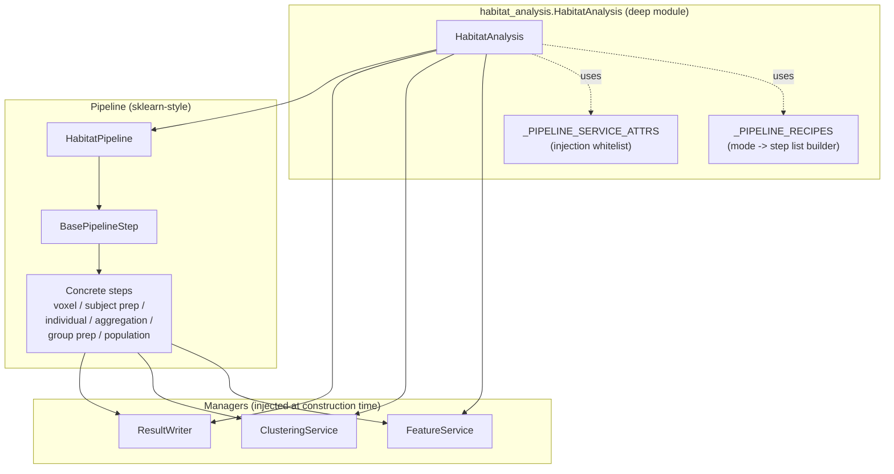
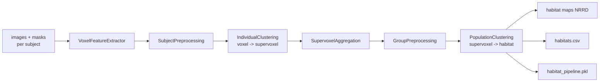
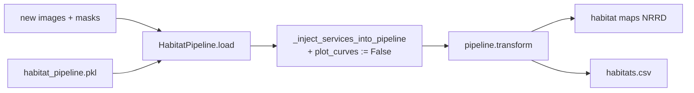
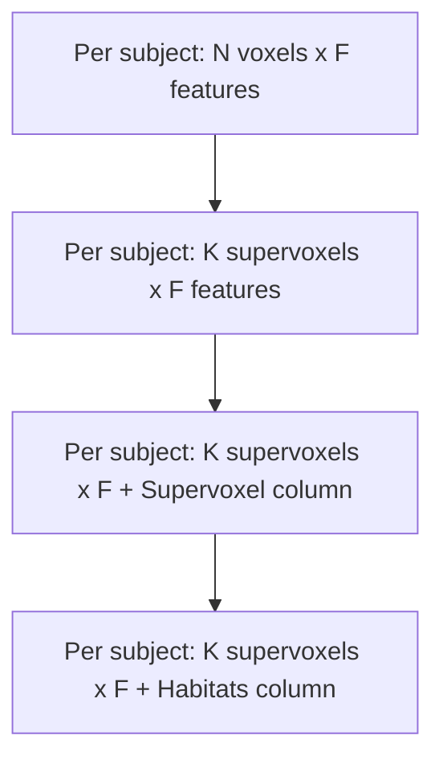

# Habitat Analysis Architecture (V1)

This document describes the internal architecture of the `habitat_analysis`
subpackage after the V1 refactor. For the project-level architecture (how this
subpackage fits into the rest of `habit/`), see
`docs/source/development/architecture.rst`.

> **V1 note.** The pre-V1 layout had three layers — a `HabitatAnalysis`
> controller, a `strategies/` subpackage (`TwoStepStrategy` / `OneStepStrategy`
> / `DirectPoolingStrategy`), and a `pipelines/pipeline_builder.py` factory.
> V1 collapses all three into a single deep module
> (`habitat_analysis.HabitatAnalysis`) with explicit recipe dispatch. This
> document only describes the V1 layout; it does **not** keep the legacy
> three-layer description.

## Table of Contents

1. [Overview](#overview)
2. [Module Layout](#module-layout)
3. [Public API](#public-api)
4. [Pipeline Recipes](#pipeline-recipes)
5. [Manager Injection](#manager-injection)
6. [Data Flow](#data-flow)
7. [Pipeline Steps](#pipeline-steps)
8. [Persistence Format](#persistence-format)
9. [Extension Points](#extension-points)
10. [Design Decisions](#design-decisions)

---

## Overview

The subpackage produces tumour habitat clusters from voxel-level imaging
features. It supports three clustering modes — `two_step`, `one_step`,
`direct_pooling` — and exposes both training (`fit`) and prediction (`predict`)
paths through one class.

### Key design principles

- **Single deep module.** `HabitatAnalysis` owns build, fit, predict, persist,
  and result post-processing. There is no separate strategy class tree and no
  separate `PipelineBuilder` module any more.
- **Recipe dispatch.** `clustering_mode` selects a step list via the
  `_PIPELINE_RECIPES` dictionary; the rest of the module branches on mode only
  for tiny save-side variations.
- **Explicit manager whitelist.** Manager injection into a loaded pipeline uses
  `_PIPELINE_SERVICE_ATTRS`. Reflection over `dir(self)` was deliberately
  removed: adding a manager type must be a deliberate edit.
- **One pipeline class for fit and predict.** Prediction is "load → inject →
  transform"; it does not get its own execution stack.
- **sklearn-style pipeline.** `HabitatPipeline` keeps `fit` / `transform` /
  `fit_transform` / `save` / `load`, so each step is a familiar
  `BasePipelineStep` with `fit(X, y=None)` / `transform(X)`.

---

## Module Layout

```
habit/core/habitat_analysis/
├── __init__.py                 # Public API exports
├── habitat_analysis.py         # HabitatAnalysis (deep module) + recipes
├── config_schemas.py           # Pydantic configuration models
├── ARCHITECTURE.md             # This document
├── README.md                   # User-facing documentation
├── PIPELINE_DESIGN.md          # Pipeline step contracts
│
├── services/                   # Service layer (orchestrators called by steps)
│   ├── feature_service.py      # FeatureService
│   ├── clustering_service.py   # ClusteringService
│   └── result_writer.py        # ResultWriter
│
├── pipelines/                  # Pipeline infrastructure
│   ├── base_pipeline.py        # HabitatPipeline + BasePipelineStep
│   └── steps/                  # Concrete pipeline steps
│       ├── voxel_feature_extractor.py
│       ├── subject_preprocessing.py
│       ├── individual_clustering.py
│       ├── supervoxel_feature_extraction.py
│       ├── supervoxel_aggregation.py
│       ├── concatenate_voxels.py
│       ├── group_preprocessing.py
│       └── population_clustering.py
│
├── clustering_features/        # Pre-clustering feature extractors (voxel/supervoxel)
├── clustering/                 # Clustering algorithms (KMeans, GMM, SLIC, ...)
├── habitat_features/           # Post-clustering feature extractors (HabitatMapAnalyzer, etc.)
└── utils/                      # Subpackage-local utilities (legacy)
```

> **Removed in V1.** `strategies/` (the old `*Strategy` class tree) and
> `pipelines/pipeline_builder.py` are no longer present in the V1 layout. All
> their behaviour now lives in `habitat_analysis.py`.

---

## Public API

`HabitatAnalysis` exposes three entry points; all return a `pd.DataFrame`:

| Method | Use | Side effects |
|--------|-----|--------------|
| `fit(subjects=None, save_results_csv=None)` | Train + persist. Builds a pipeline by recipe, calls `pipeline.fit_transform`, saves `habitat_pipeline.pkl`, runs result post-processing and CSV/NRRD output. | Writes `.pkl`, `habitats.csv`, `habitat_*.nrrd`. |
| `predict(pipeline_path, subjects=None, save_results_csv=None)` | Load + transform. Loads a saved pipeline, reconciles config, injects current services via the whitelist, forces `plot_curves = False`, calls `pipeline.transform`. | Writes `habitats.csv`, `habitat_*.nrrd` (no `.pkl`). |
| `run(subjects=None, save_results_csv=None, load_from=None)` | Dispatcher. Routes to `fit` or `predict` based on `load_from` or `config.run_mode`. Kept as a stable entry point for CLI / scripts. | Same as the dispatched method. |

The CLI (`habit get-habitat`) is the only entry point in V1; it is a thin
wrapper around `fit` / `predict`. The legacy `scripts/run_habitat_analysis.py`
dual-track runner has been removed.

### Class diagram


```mermaid
graph TB
    subgraph "habitat_analysis.HabitatAnalysis (deep module)"
        HA[HabitatAnalysis]
        Rec["_PIPELINE_RECIPES<br/>(mode -> step list builder)"]
        Wl["_PIPELINE_SERVICE_ATTRS<br/>(injection whitelist)"]
        HA -.uses.-> Rec
        HA -.uses.-> Wl
    end

    subgraph "Managers (injected at construction time)"
        FM[FeatureService]
        CM[ClusteringService]
        RM[ResultWriter]
    end

    subgraph "Pipeline (sklearn-style)"
        HP[HabitatPipeline]
        BPS[BasePipelineStep]
        Steps[Concrete steps<br/>voxel / subject prep /<br/>individual / aggregation /<br/>group prep / population]
    end

    HA --> FM
    HA --> CM
    HA --> RM
    HA --> HP
    HP --> BPS
    BPS --> Steps
    Steps --> FM
    Steps --> CM
    Steps --> RM
```

---

## Pipeline Recipes

`_PIPELINE_RECIPES` is the single source of truth for mode dispatch:

```python
_PIPELINE_RECIPES = {
    'two_step':       _build_two_step_steps,
    'one_step':       _build_one_step_steps,
    'direct_pooling': _build_pooling_steps,
}
```

`HabitatAnalysis._build_pipeline()` simply looks up the recipe by
`config.HabitatsSegmention.clustering_mode`, calls the builder with the three
services, and wraps the resulting list in a `HabitatPipeline`.

### Two-step recipe (`_build_two_step_steps`)

1. `VoxelFeatureExtractor` — voxel-level features per subject.
2. `SubjectPreprocessing` — per-subject feature cleaning.
3. `IndividualClustering` — voxel → supervoxel (per subject).
4. `SupervoxelFeatureExtraction` *(conditional)* — advanced supervoxel features.
5. `SupervoxelAggregation` — aggregate supervoxel features.
6. `GroupPreprocessing` — feature cleaning across subjects.
7. `PopulationClustering` — supervoxel → habitat (population level).

### One-step recipe (`_build_one_step_steps`)

1. `VoxelFeatureExtractor`
2. `SubjectPreprocessing`
3. `IndividualClustering` — voxel → habitat directly (per subject).
4. `SupervoxelAggregation` — kept for downstream column consistency.

### Direct-pooling recipe (`_build_pooling_steps`)

1. `VoxelFeatureExtractor`
2. `SubjectPreprocessing`
3. `ConcatenateVoxels` — pool voxels across subjects.
4. `GroupPreprocessing`
5. `PopulationClustering` — all voxels → habitat in one shot.

Adding a new mode means adding one builder function and one entry in
`_PIPELINE_RECIPES`. No new file, no new class.

---

## Manager Injection

When a pipeline is *trained*, manager references are set up at construction
time. When a pipeline is *loaded* from `.pkl` for prediction, the deserialised
steps still hold whatever manager references were live at training time —
those references must be replaced with the current run's services.

V1 does this with an explicit whitelist:

```python
_PIPELINE_SERVICE_ATTRS: Tuple[str, ...] = (
    'feature_service',
    'clustering_service',
    'result_writer',
)
```

`_inject_services_into_pipeline(pipeline)` iterates over each step and, for
every name in the whitelist that the step has, overwrites it with the current
manager instance. It also overwrites `pipeline.config` with the current config.

This deliberately replaces the pre-V1 `dir(self)` reflection that injected any
attribute whose name ended in `_manager`. Reflection-based injection was
fragile: any future field accidentally named `*_manager` would have been
silently injected, and removing a manager would have silently stopped being
injected. With the whitelist, **introducing a new manager forces an explicit
edit to this constant**, which is the desired behaviour.

---

## Data Flow

### Training (`fit`)


```mermaid
graph LR
    Imgs[images + masks<br/>per subject] --> VF[VoxelFeatureExtractor]
    VF --> SP[SubjectPreprocessing]
    SP --> IC[IndividualClustering<br/>voxel -> supervoxel]
    IC --> SA[SupervoxelAggregation]
    SA --> GP[GroupPreprocessing]
    GP --> PC[PopulationClustering<br/>supervoxel -> habitat]
    PC --> HM[habitat maps NRRD]
    PC --> CSV[habitats.csv]
    PC --> Pkl[habitat_pipeline.pkl]
```

### Prediction (`predict`)


```mermaid
graph LR
    NewImgs[new images + masks] --> Load
    Pkl[habitat_pipeline.pkl] --> Load[HabitatPipeline.load]
    Load --> Inject[_inject_services_into_pipeline<br/>+ plot_curves := False]
    Inject --> Trans[pipeline.transform]
    Trans --> HM[habitat maps NRRD]
    Trans --> CSV[habitats.csv]
```

The `plot_curves = False` override on the predict path closes a pre-V1 bug
where the cluster-selection curves consumed `None` values when no selection
methods were configured for the prediction run.

### Data shape evolution (two-step)


```mermaid
graph TB
    V[Per subject: N voxels x F features] --> S[Per subject: K supervoxels x F features]
    S --> A[Per subject: K supervoxels x F + Supervoxel column]
    A --> H[Per subject: K supervoxels x F + Habitats column]
```

---

## Pipeline Steps

Each step inherits from `BasePipelineStep` and implements:

- `fit(X, y=None)` — learn parameters from training data.
- `transform(X)` — apply the learnt transformation.
- `fit_transform(X, y=None)` — convenience composition.

The `HabitatPipeline` itself only orchestrates these three methods across the
step list and handles `save` / `load` (joblib).

| Step | Purpose | Manager(s) used |
|------|---------|------------------|
| `VoxelFeatureExtractor` | Extract voxel-level features inside the ROI. | `FeatureService` |
| `SubjectPreprocessing` | Per-subject cleaning (NaN, scaling, drop). | `FeatureService` |
| `IndividualClustering` | Cluster voxels into supervoxels (or habitats in `one_step`). | `ClusteringService`, `ResultWriter` |
| `SupervoxelFeatureExtraction` *(conditional)* | Compute richer supervoxel features. | `FeatureService` |
| `SupervoxelAggregation` | Aggregate features at supervoxel level. | `FeatureService` |
| `ConcatenateVoxels` *(direct pooling only)* | Pool voxels across subjects. | `FeatureService` |
| `GroupPreprocessing` | Group-level cleaning. | `FeatureService` |
| `PopulationClustering` | Cluster supervoxels (or pooled voxels) into habitats. | `ClusteringService`, `ResultWriter` |

`PIPELINE_DESIGN.md` documents the per-step input/output column contracts in
detail.

---

## Persistence Format

`HabitatPipeline.save(path)` writes a single joblib file at `path`. The file
contains:

- The full step list (each step keeps the parameters it learnt during `fit`).
- A reference to the config used for training (the predict path replaces this
  with the current config before transforming).

The default location is `<config.out_dir>/habitat_pipeline.pkl`. This file is
the only persistent artefact required for prediction.

`HabitatPipeline.load(path)` is the inverse and returns a `HabitatPipeline`
instance with all step state restored.

---

## Extension Points

### Add a new clustering mode

1. Implement a `_build_<mode>_steps(feature_service, clustering_service,
   result_writer, config)` function in `habitat_analysis.py`.
2. Add the mode to the `_PIPELINE_RECIPES` dictionary.
3. (Optional) Add mode-specific result tweaks. Output-column adjustments
   (e.g. mirroring `Supervoxel` into `Habitats` for `one_step` mode) belong
   inside the relevant pipeline step (see `MergeSupervoxelFeaturesStep`);
   only side effects that *follow* the pipeline (extra files, logging,
   conditional saves) belong inside `HabitatAnalysis._save_results`.

You do **not** need to add a class, file, or registry entry. The recipe
dictionary is the registry.

### Add a new pipeline step

1. Inherit from `BasePipelineStep` and implement `fit` / `transform`.
2. Inject the step into one or more recipes in `habitat_analysis.py`.
3. Document the step's input / output column contract in `PIPELINE_DESIGN.md`.

### Add a new service

1. Create the service class under `services/`.
2. Inject it into `HabitatAnalysis.__init__` and store it on `self`.
3. **Add its attribute name to `_PIPELINE_SERVICE_ATTRS`.** This step is
   mandatory: without it, the service will not be re-injected on the predict
   path.
4. Update `HabitatConfigurator.create_habitat_analysis` (in
   `habit/core/common/configurators/habitat.py`) to construct and pass the new
   service.

### Add a new clustering algorithm

1. Inherit from `BaseClusteringStrategy` *(this name lives in
   `clustering/base_clustering.py`; it refers to the **algorithm** interface,
   not the removed top-level strategy tree)*.
2. Register the algorithm so `ClusteringService` can resolve it by name from
   config.

---

## Design Decisions

### 1. Collapse three layers into one deep module

**Decision.** Drop `strategies/` and `pipelines/pipeline_builder.py`; put
recipe dispatch and orchestration inside `HabitatAnalysis`.

**Rationale.** The pre-V1 layout had three layers that each added almost no
behaviour: the controller forwarded to a strategy, the strategy forwarded to
the builder, the builder returned a step list. The split inflated the
abstraction surface (3 classes + 1 module + 1 registry) without hiding any
real complexity. One deep module — small public surface, all the moving
parts inside — fits the actual cognitive shape of the problem better.

### 2. Recipe dictionary instead of class hierarchy

**Decision.** `_PIPELINE_RECIPES: Dict[str, Callable]`.

**Rationale.** Each "strategy" in the old design only differed in its step
list. A function returning the list captures exactly that, and putting the
mapping in a dictionary makes the dispatch one line and the extension point
one line.

### 3. Explicit injection whitelist

**Decision.** `_PIPELINE_SERVICE_ATTRS` instead of `dir(self)` reflection.

**Rationale.** Reflection over attribute names is correct *only* by accident.
A whitelist makes the contract — "these are the attributes a step is allowed
to have us re-bind on load" — explicit, readable, and testable.

### 4. Force `plot_curves = False` on the predict path

**Decision.** `_inject_services_into_pipeline` overrides
`pipeline.config.plot_curves = False`.

**Rationale.** The cluster-selection plotting code consumed `None` when no
`selection_methods` were configured at predict time; the predict path had no
business plotting selection curves anyway, since selection happens only at
training. Forcing the flag closes the bug at its source instead of patching
each plotting call site.

### 5. Single pipeline class for fit and predict

**Decision.** `HabitatPipeline` is the only execution class; predict reuses
its `transform`.

**Rationale.** Two parallel execution stacks were a known maintenance hazard
in the old layout (any new step had to be plumbed twice). With a single class
the predict path is trivially correct as long as `transform` is correct.

### 6. sklearn-style step interface

**Decision.** Keep `fit(X, y=None)` / `transform(X)` / `fit_transform`.

**Rationale.** Familiar to ML practitioners, plays well with the rest of the
ecosystem, and gives an obvious contract for new step authors.

---

## See Also

- Project-level architecture: `docs/source/development/architecture.rst`.
- Pipeline step contracts: `PIPELINE_DESIGN.md`.
- V1 refactor record:
  `docs/code_review/habitat_analysis_review.md` and
  `docs/code_review/habitat_analysis_refactor_step1.md`.
