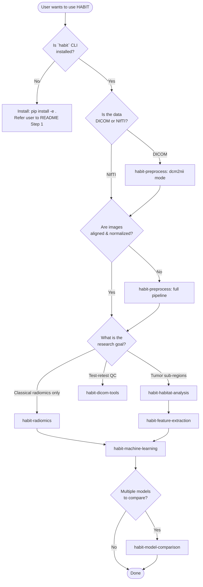
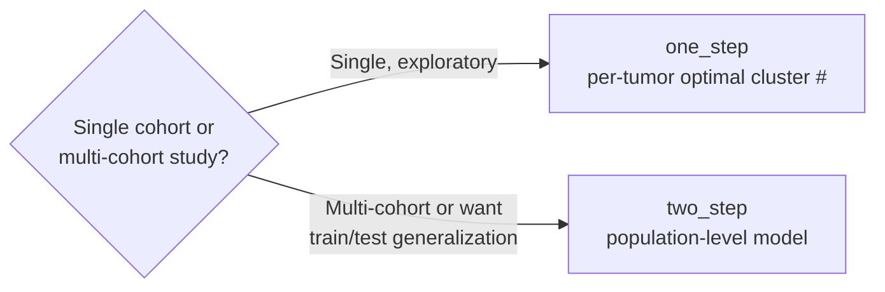

# HABIT Workflow Decision Tree

A flow chart the agent walks the user through to pick the right downstream skill.

## Skill picker — by user phrase

| If the user says... | Hand off to skill |
|---|---|
| "I have raw DICOM" / "DICOM 转 NIfTI" | `habit-preprocess` (dcm2nii mode) |
| "Images not aligned" / "需要配准" / "N4" | `habit-preprocess` |
| "Find tumor sub-regions" / "亚区" / "habitat" | `habit-habitat-analysis` |
| "Habitat maps + want features" / "MSI" / "ITH" | `habit-feature-extraction` |
| "Just radiomics, no habitat" / "传统影像组学" | `habit-radiomics` |
| "Train a classifier" / "建模" / "K-fold" | `habit-machine-learning` |
| "Compare models" / "ROC 对比" / "DeLong" | `habit-model-comparison` |
| "ICC" / "test-retest" / "Dice" / "merge CSV" | `habit-dicom-tools` |
| "Run the whole pipeline" / "全流程" | `habit-recipes` |
| "I got an error" / "报错" / "It failed" | `habit-troubleshoot` |

## When to use one_step vs two_step

- **one_step** → simpler, faster, no `pipeline.pkl`, habitat labels are local per-tumor
- **two_step** → produces a population-level habitat model that can be applied to new patients via `--mode predict`

If the user is unsure, default to **one_step**.
